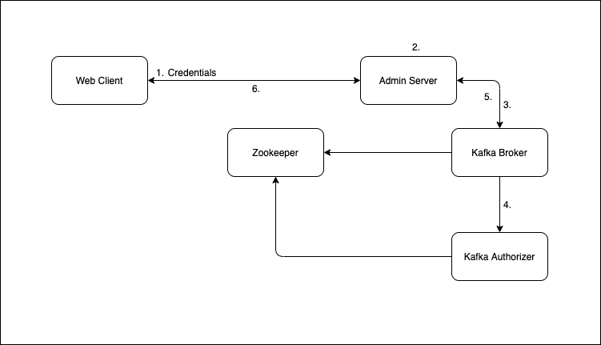
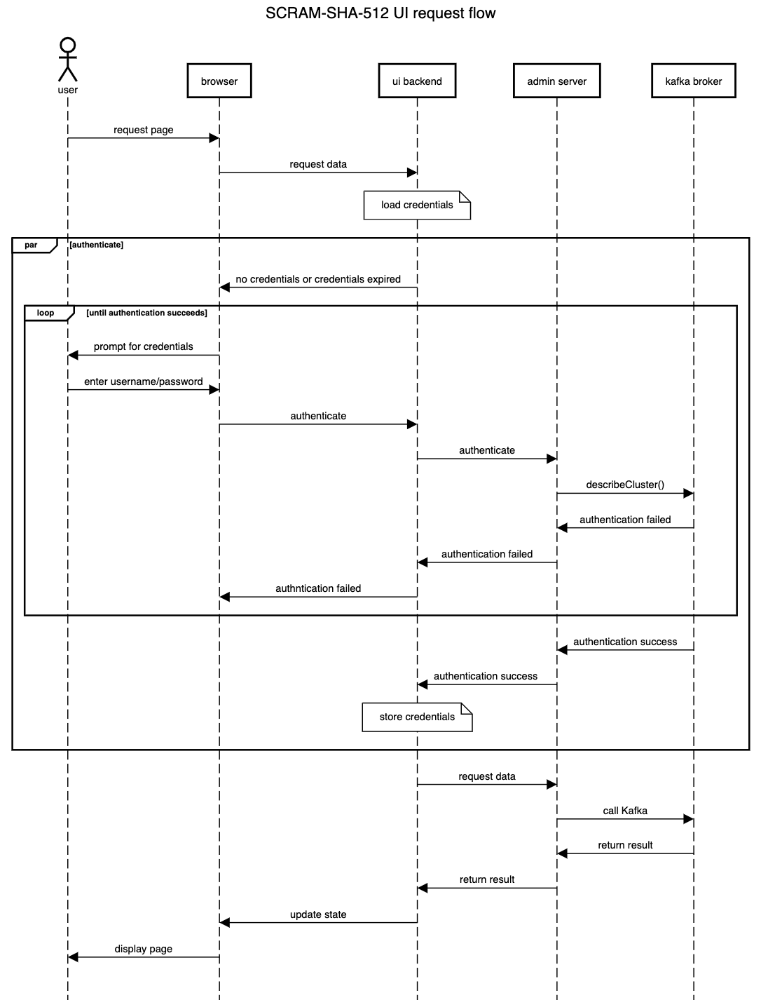
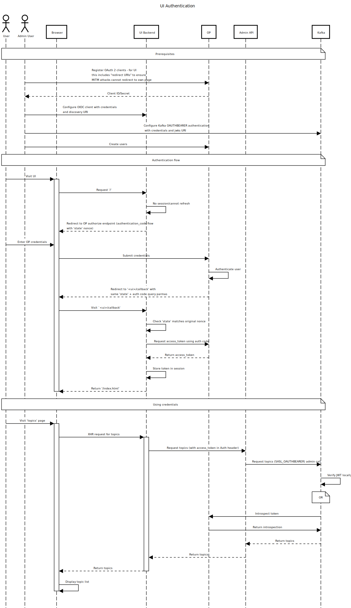

# Security Extension

This proposal is supplementary to the security documentation in the [Using Strimzi](https://strimzi.io/docs/operators/latest/using.html#security-str) guide.

## Problem description
This proposal discusses amendments to support authentication and authorization with the new [Strimzi UI](https://github.com/strimzi/proposals/pull/6) and [Strimzi Admin Server](https://github.com/strimzi/proposals/pull/9).

### Authentication
Strimzi currently supports SCRAM-SHA-512, OAuth2 and Mutual TLS for authentication of clients connecting to the Kafka brokers.
The Strimzi cluster operator can be configured to support all 3 mechanisms for authentication for clients inside or outside the Kubernetes cluster.
The SCRAM-SHA-512 and Mutual TLS support uses the native support in Kafka for authentication and for OAuth2, Strimzi provides an [OAuth2 library](https://github.com/strimzi/strimzi-kafka-oauth) which has a generic OAuth2 interface allowing you to connect to multiple different OAuth2 servers. 
Browser based UIs do not traditionally use mutual TLS so the proposed mechanisms for authentication on the UI only covers OAuth2 and SCRAM-SHA-512.
The admin server proposal similarly only covers SCRAM-SHA-512 and OAuth2 support.
The OAuth2 and SCRAM-SHA-512 mechanisms for the admin server propagates the SCRAM credentials or the OAuth token to Kafka where the Kafka broker performs the authentication.
Implementing mutual TLS support in the admin server would require a mechanism that could propagate the identity of the client to Kafka as the admin server will be the TLS termination point and authentication would be between the external client and the admin server. Implementing this in a secure way is not trivial and is not included in this proposal.

Both the UI and the admin server will also support a scenario with no security.

### Authorization
Both security mechanisms allow authorization to be done using the standard Kafka authorizers along with ACL support.
Alternatives are available with Kafka authorizers being supplied for [KeyCloak](https://www.keycloak.org/) and [Open Policy Agent](https://www.openpolicyagent.org/docs/latest/) as documented in the Strimzi documentation. The proposed authentication mechanisms for the UI and the admin server will allow these documented authorization methods to be used without requiring any additional changes to the documented methods.

### Securing traffic from clients to the Admin Server
Connections from web clients to the Admin Server will always be encrypted using TLS except in the scenario where security is turned off. The security off scenario is where authentication and authorization is not configured in Kafka, such as the (Kafka Quickstart)[https://kafka.apache.org/quickstart] example.

## Proposed Authentication Implementations
### Admin server using SCRAM-SHA-512
The following describes the flow for authentication and authorization using SCRAM SHA512 as the authentication type when a web client calls a Kafka client API through the admin server.
In the diagram:
1. The credentials are base64 encoded and added as a Basic authentication schema on an `Authorization` header which is sent to the admin server.
2. The admin server decodes the credentials and populates the Kafka client properties JAAS login string with the userid and password.
3. The Kafka client api is called from the admin server which authenticates the credentials on the Kafka Broker.
4. If authentication is successful, the principal is passed to a Kafka authorizer for authorization.
5. If authorization is successful, the command completes and returns the result to the admin server.
6. The admin server encodes the response in an HTTP response and returns to the web client.



The credentials that are used need to be setup through the Strimzi User Operator.
The admin server is stateless, so the credentials will need to be provided on every request.

### UI using SCRAM-SHA-512
The UI calls the admin server to satisfy requests against Kafka so will use the same mechanism as described in the previous section where credentials are encoded in an Authorization header and passed on to the admin server which will propagate the credentials through to the Kafka broker for authentication.
As the admin server is stateless, the user credentials will need to be passed on every request.
The UI will store the credentials in a session cookie for use on each request to the admin server.
The credentials will be initially obtained from the user by forcing the user through a login mechanism.
The login mechanism will consist of a UI dialogue prompting for a username and password.
The dialogue will be presented when the user first logs in or when the login session expires after a set period of inactivity between the user and the UI.
The Kafka clients do not have an api that is designed to specifically authenticate a user, so the UI will need to simulate the login by calling the Kafka admin client with a query that will allow the UI to determine whether the user is known to Kafka and can be authenticated against Kafka client calls.
The proposed query that will be used is the `describeCluster()` api on the Kafka admin client.

The following diagram shows the flow of requests to the UI:



## OAuth 2
### Admin server using OAuth2
In the OAuth2 model, an admin user will register a client with the OpenID Provider.
The OAuth2 support for the admin server will then be very similar to the SCRAM-SHA-512 model and will take advantage of the [Strimzi Kafka OAuth library](https://github.com/strimzi/strimzi-kafka-oauth).
Instead of a Basic auth header being used, each request to the admin server will contain a bearer token in an Authorization header.
The token must be an access token associated with the registered client which is obtained by the user using the [Strimzi cli](https://github.com/strimzi/strimzi-kafka-oauth/blob/master/examples/docker/kafka-oauth-strimzi/kafka/oauth.sh) tool.
The admin server will extract the token from the header and configure the client properties before calling the broker using the standard Kafka OAUTHBEARER SASL mechanism.

### UI using OAuth2 (OIDC)
The OAuth2 flow for the UI is more complicated. The UI is responsible for obtaining the access token to put onto the Authorization header on calls to the admin server. 
 
An admin user will register a client with the OpenID Provider (OP) - to create an OIDC client that provides the `authorization_code` OAuth 2.0 flow. The UI server can then be configured to use the OpenID Provider (OP) for authentication, and generating access tokens.

The UI server will use Passport.js to provide/handle an `authorization_code` interaction to authenticate user and retrieve an access token from the OP. Passport will also handle updating the session for the user to contain the access token, and refreshing/reauthentication when the token expires. 

The access token can then be passed to admin API as a Bearer token Authorization header. Admin API can then use this to issue requests to Kafka via OAUTHBEARER (Kafka will validate the token against the OP or authenticate itself if needed).

A OIDC compliant server is required over OAuth 2.0 for following reasons:
1. It provides metadata at `<hostname>/.well-known/openid-configuration` - which can be used for service discovery by Passport, instead of requiring configuration of a series of endpoints.
2. It can provide user profile information (if we eventually want to display that in the UI)



#### Example CR

Much like the authentication section of `Kafka` oauth listeners, similar would be applied to the UI configuration. The difference being that a single 'dicoveryURI' is needed for discovering the OIDC endpoints.

```
backends:
  - name: "cluster2"
    authentication :
      discoveryURI: "https://cluster2/auth/realms/{realm-name}"
      clientSecret: 
          name: "mysecret"
          idKey: "clientId"
          passwordKey: "clientSecret"
      certificate:
        name: "mycert"
        certKey: "ca.p12"
    adminApi:
      uri: "https://admin-api"
      certificate:
        name: "mycert"
        certKey: "ca.p12"

``` 

#### Proposed libraries
- https://www.npmjs.com/package/passport - authentication middleware
- https://www.npmjs.com/package/openid-client - Passport compatible OIDC client for communicating with an OP

#### Outstanding questions
1. Who is responsible for "authorization" checks that the UI will make to hide features from user. E.g - can user create a topic, can user access the UI, can user produce a message etc.
2. If the user authentication is based on a Kafka user - how do we federate/reconcile that user against other applications. E.g, k8s permission to create a KafkaUser or read a Secret, or prometheus access tokens