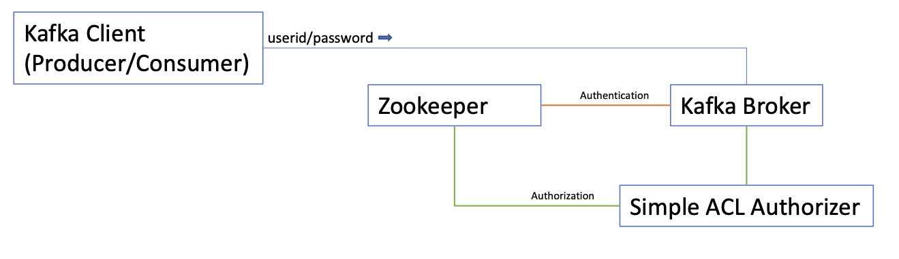

# Security Extension

This proposal is supplementary to the security documentation in the [Using Strimzi](https://strimzi.io/docs/operators/latest/using.html#security-str) guide.

## Problem description
Strimzi currently supports SCRAM-SHA-512, Oauth2 and Mutual TLS for authentication of clients connecting to the Kafka brokers.
The Strimzi cluster operator can be configured to support all 3 mechanisms for authentication for clients inside or outside the Kubernetes cluster.
The SCRAM-SHA and Mutual TLS support uses the native support in Kafka for authentication and for Oauth2, authentication is delegated to [keyCloak](https://www.keycloak.org/). 

Authorization is available through native Kafka ACL support with the use of the Kafka `simpleACLAuthorizer`.
Alternatives are available with Kafka authorizers being supplied for [keyCloak](https://www.keycloak.org/) and [Open Policy](https://www.openpolicyagent.org/docs/latest/).

The configuration of Oauth2 is described in the [Strimzi documentation](https://strimzi.io/docs/operators/latest/using.html#assembly-oauth-authentication_str) as well as in the [strimzi-kafka-oauth](https://github.com/strimzi/strimzi-kafka-oauth) repository on github. SCRAM and Mutual TLS configuration is documented in the relevant places throughout the [Strimzi documentation](https://strimzi.io/documentation/).

This proposal discusses amendments to support security with the new [Strimzi UI](https://github.com/strimzi/proposals/pull/6) and [Strimzi Admin Server](https://github.com/strimzi/proposals/pull/9) and outlines how this can be done for SCRAM and OAuth2. Browser based UIs do not traditionally use mutual TLS for authentication and authorization but the Admin server API needs to be considered and this proposal suggests a mechanism that can be used to do that. 

The outlined proposal relies on Kafka to perform authentication or authorization and the Admin Server itself does not.
In a Kafka environment, this may be acceptable but it is plausible that a UI and Admin Server may wish to communicate with non-Kafka environments in the future like the Kube API.
In these environments authentication and authorization can again be delegated to the backend system.
A discussion and agreement is needed whether we wish to implement authentication and authorization on the Admin Server itself.

Proceeding with the delegated model, I have 3 sets of diagrams showing a SCRAM-SHA-512 solution, an OAuth2 solution and a Mutual TLS solution with the last one only being relevant to the Admin Server.

## SCRAM-SHA-512


Strimzi supports SCRAM-SHA512 using native Kafka facilities, so the Kafka client is setup with credentials for the user and these credentials are passed to the broker where the broker authenticates against user credentials stored in Zookeeper.
When the request is authenticated, the Principal is passed to a Kafka Simple ACL Authorizer which determines whether the user is authorized to access the resource.
Access is defined through ACLs and are stored on Zookeeper.


This Kafka client model translates to a UI and Admin Server in a similar way.
When the user loads up the UI in a browser, they are presented with a dialogue box requiring them to enter a userId and password.
The userId and password they enter are pre-defined to Kafka by the creation of a Kafka user through the `User Operator` or the Kafka `bin/kafka-configs.sh ` command line tool.
Once the userId and password have been entered, the UI validates the credentials on Zookeeper using `passport.js`.
The result that is returned will be marked as valid or invalid.
If the credentials are valid, they are stored in the session data associated with that browser session.
When the UI requires data from the Admin Server, the credentials are recovered from the session data and placed as an auth header on the request.
The Admin Server receives the request and configures the Kafka client in preparation for calling the Kafka broker.
The SCRAM credentials are retrieved from the auth header and are added to the Kafka client configuration properties before executing the call to the Kafka broker.
From thereon, the Kafka authentication and authorization mechanism works in an identical way to the description above for the Kafka Clients.

This mechanism should be straightforward to setup using a `passport.js` strategy.
The Strimzi UI is served from an Express server and that Express server will be inside the Strimzi cluster allowing the Express Server to talk to the Zookeeper on the secure port 2181.
The login would not go through the Admin Server which hides the process from the external network but it may be desirable to add a `login` endpoint to the Admin Server which would allow session based applications to use the Admin Server in a natural way.

The Strimzi Admin Server API could be called directly by the user creating an auth header on the request.
Like the UI flow, the credentials would be retrieved from the auth header and placed into the Kafka client properties as SCRAM credentials.

## OAuth 2


In the OAuth 2 scenario, Strimzi currently requires the user to configure the Kafka client with a clientId and secret.
The client will then obtain an access token from the identity provider which is KeyCloak and that token flows to the broker.
In the broker, calls to KeyCloak will be made based on the type of token that was requested by the client and passed to the broker.

In order to call the Admin Server, the user would need to obtain a token from KeyCloak manually and then store that token in an Authorization header on the call to the Admin Server. That can then be passed directly to Kafka using the `oauth.access.token` property in the Kafka OAuth libraries.

The behaviour when the AdminServer receives a request from the UI will be identical as above due to the same use of the Authorization header.

### UI Authentication (OIDC)


An admin user will register a client with the OpenID Provider (OP) - to create an OIDC client that provides the `authorization_code` OAuth 2.0 flow. The UI server can then be configured to use the OpenID Provider (OP) for authentication, and generating access tokens.

The UI server will use Passport.js to provide/handle an `authorization_code` interaction to authenticate user and retrieve an access token from the OP. Passport will also handle updating the session for the user to contain the access token, and refreshing/reauthentication when the token expires. 

The access token can then be passed to admin API as a Bearer token Authorization header. Admin API can then use this to issue requests to Kafka via OAUTHBEARER (Kafka will authenticate against the OP).

A OIDC compliant server is required over OAuth 2.0 for following reasons:
1. It provides metadata at `<hostname>/.well-known/openid-configuration` - which can be used for service discovery by Passport, instead of requiring configuration of a series of endpoints.
2. It can provide user profile information (if we eventually want to display that in the UI)


#### Example CR

Much like the authentication section of `Kafka` oauth listeners, similar would be applied to the UI configuration. The difference being that a single 'dicoveryURI' is needed for discovering the OIDC endpoints.

```
backends:
  - name: "cluster2"
    authentication :
      discoveryURI: "https://cluster2/auth/realms/{realm-name}"
      clientSecret: 
          name: "mysecret"
          idKey: "clientId"
          passwordKey: "clientSecret"
      certificate:
        name: "mycert"
        certKey: "ca.p12"
    adminApi:
      uri: "https://admin-api"
      certificate:
        name: "mycert"
        certKey: "ca.p12"

``` 

#### Proposed libraries
- https://www.npmjs.com/package/passport - authentication middleware
- https://www.npmjs.com/package/openid-client - Passport compatible OIDC client for communicating with an OP

#### Outstanding questions
1. Who is responsible for "authorization" checks that the UI will make to hide features from user. E.g - can user create a topic, can user access the UI, can user produce a message etc.
2. If the user authentication is based on a Kafka user - how do we federate/reconcile that user against other applications. E.g, k8s permission to create a KafkaUser or read a Secret, or prometheus access tokens
3. Can an access_token be set on an admin client basis; currently docs suggest setting a system property of `oauth.access.token`.

## Mutual TLS


With Mutual TLS, authentication takes place in the TLS handshake between the external web client and the Admin Server.
The server side can only detect a userId for the client so credentials cannot be propagated to the Kafka Broker that woud allow the broker to authenticate and authorize the request.
This proposal recommends that the Kafka clients running under the Admin Server can use a valid Kafka User for the connection between the Kafka client and the broker and pass the external web client's userId to the broker login module.
The Kafka broker then uses a SASL plugin to create a custom authentication module which sets up the Kafka principal which flows through to authorizer.
This allows the authorizer to take advantage of the ACL authorizer mechanism that is native to Kafka.
