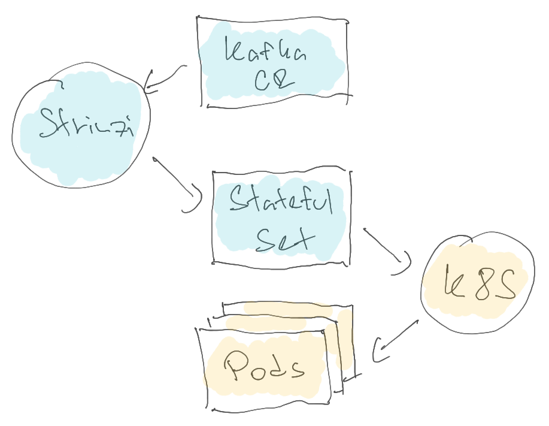
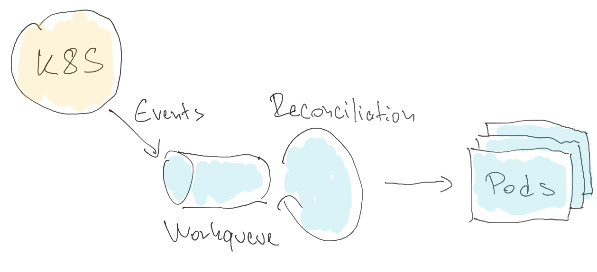
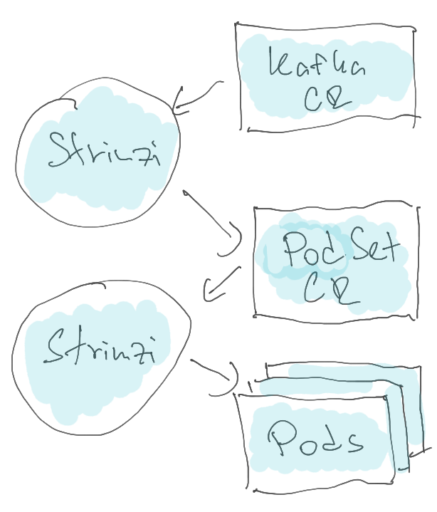

# StatefulSet Removal

## Current situation

Currently, Strimzi relies on StatefulSets to create and manage Pods for the ZooKeeper and Kafka clusters.
Strimzi creates the StatefulSet in the `KafkaAssemblyOperator` class.
Kubernetes creates the Pods according to the StatefulSet.
When a Pod is deleted, Kubernetes is responsible for recreating it.

The StatefulSets are created with `OnDelete` update strategy.
That means that rolling updates are not executed by Kubernetes and its StatefulSet controller.
Instead, Strimzi handles this in the `KafkaAssemblyOperator` and in the accompanied classes such as `KafkaRoller` and `ZooKeeperRoller`.
It identifies if the pod needs to be rolled; and if it does, it will delete it and wait for Kubernetes to recreate it.
This works to our advantage since it allows us to do reliable rolling-updates without breaking availability.

### Advantages of StatefulSets

The main advantage of using StatefulSets is that Kubernetes handles the creation of Pods.
For any disruptions that result in Pods being deleted or lost, such as a worker node crashing, Kubernetes takes care of it and recreates the Pods.
The Pods will be started even when the Strimzi operator is not running.
Since StatefulSets are used by many Kubernetes users, they are well tested and we can rely on them.

### Disadvantages of StatefulSets

But it has also some disadvantages.
The pods controlled by the StatefulSet are created from a template which is part of the StatefulSet definition.
Their names are generated from the StatefulSet name by adding an index number from a sequence which always starts with 0.
When using a StatefulSet with 3 replicas, they will have the index numbers 0, 1 and 2.
When you scale-up and want to add more pods, they will always continue in this sequence with pods 3, 4 etc.
When scaling down, the pods with the highest index numbers will be always removed first.

That means that pods cannot be removed from the start or from the middle of the sequence.
Since the pod index numbers are used to determine the broker IDs, this means that we cannot remove any broker we want from the Kafka cluster, only those with highest IDs.
Since the partition replicas are assigned to a particular broker based on the ID, it means that some additional reassignments need to be done and the scale-down is more complicated than it needs to be.

Generating the Pods from the template also means they are all configured the same way.
When mounting the Secrets or ConfigMaps, you always have to mount the same Secret or Config Map into all pods.
For example, you cannot configure asymmetric resource requests and limits to give one broker more resources and another one less resources.
It is much harder to use different configuration for each broker.
In some situations, we also need to roll all Pods although maybe only some of them really need it.

Another complicated area is storage configuration.
Strimzi uses some hacks to workaround some of the StatefulSet limitations and allow things such as asymmetric storage configuration.
But these are dependent on the current design of the StatefulSet controller.
Kubernetes changes have caused issues to this feature in the past.
For example, to add volumes to JBOD storage, we currently need to use a special rolling update which does not roll the controller Kafka broker last.

## Motivation

Some of the limitations described above are blocking us in further development of features that would be hard to implement with StatefulSets.
Therefore it was decided to investigate what options we have to replace StatefulSets to gain more flexibility and be able to continue the Strimzi development.
Below are some of the features and use cases which might be significantly easier to implement without the StatefulSet limitations.

*Note: This proposal does not cover these features and use cases.
They are just used to explain the things which might be easier when this proposal is implemented.*

### Individual broker configuration

Being able to individually configure the brokers would allow us to improve Strimzi in several areas:
* Less rolling updates
* Asymmetric configurations of storage or CPU / memory resources

### ZooKeeper-less Kafka

The removal of ZooKeeper from Kafka will bring a lot of advantages but also some challenges.
There won't be a clear separation between the ZooKeeper cluster and the Kafka cluster.
Any Kafka broker can be in theory configured as controller.
With a single StatefulSet managing all Kafka pods, it would be hard to handle all the possible configurations:
* Dedicated set of controller nodes
* All nodes being both controllers and brokers
* Some nodes being both brokers and controller and some only brokers

We could use multiple StatefulSets to separate the different types of nodes.
But even then it would be hard to change the cluster topologies and the node types.
Without the StatefulSet limitations, we should have a lot more flexibility to mix the node types and their roles.

### Stretch clusters

Pods managed by a single StatefulSet always exist only on single Kubernetes cluster.
If you want to have a Kafka cluster which would stretch multiple Kubernetes clusters, you would need to create a StatefulSet on each of them and have it create the Pods on each given cluster.
But you would not be able easily move the brokers between the Kubernetes clusters since they would depend on the StatefulSet index numbers to generate their broker IDs.
By introducing _StrimziPodSets_ (for more details and explanation, check the _Proposal_ section below), you can have different StrimziPodSets in each Kubernetes cluster and just delete a pod on one Kubernetes cluster and move it to another cluster by modifying the corresponding StrimziPodSets.

## Proposal

The StatefulSets should be replaced with a new Strimzi custom resource called `StrimziPodSet`.
StrimziPodSet will be used only internally.
Users will not be expected to interact with.

The StrimziPodSet custom resource and its structure might be subject to change during the _alpha_ phase.
But once it reaches the _beta_ phase, it will be treated as any other Strimzi custom resource and provide backwards compatibility and versioning in case any backwards incompatible changes would be required.
See the _Feature Gate_ section below for more details about the feature gate phases and the expected timelines.

The StrimziPodSets will have a following structure:
* The usual metadata, kind and API identifications
* A `.spec` section with:
    * Pod selector to be able to find the pods managed by this StrimziPodSet
    * List of Pods (full Pod YAML definition including metadata section, but without status section)
* A status section with:
    * Number of managed, current and ready Pods
    * List of error conditions in case of problems
    * Observed generation

The StrimziPodSet will be used very similarly to the StatefulSets:
* The Pods will be always created in the same namespace as the pod set
* Garbage collection will be used to delete the Pods

Instead of using a Pod templates, and generating Pods with fixed names, StrimziPodSet will use full Pod structures including custom names.
The configuration retains the usefulness of a StatefulSet, but removes the limitations we have identified.

The StrimziPodSet will be created by the `KafkaAssemblyOperator` class in the same place in the reconciliation as the StatefulSet.
This is also where the StrimziPodSet will be patched when configuration changes.

A new controller will be developed to reconcile the StrimziPodSet resources.
It will run as part of the Strimzi cluster operator container.
It will follow a more lightweight controller approach rather than the long-running _heavy_ approach of our current assembly operators:
* It will be designed to iterate quickly rather than wait
* It will not wait for Pod readiness but instead get a new event when the Pod becomes ready
* It will consume events about the StrimziPodSets and their Pods and react to them
* It will run in its own thread and use a work queue to queue the events and the reconciliations to avoid working on too many reconciliations in parallel

It will be responsible for:
* Creating pods which do not exist
* Deleting old pods removed from the StrimziPodSet
* Update the StrimziPodSet status subresource

When a new StrimziPodSet is created, it will create its pods.
When a StrimziPodSet is modified, it will check if any pods need to be added or deleted.
When a Pod is deleted or modified, it will identify the StrimziPodSet it belongs to and reconcile the whole StrimziPodSet.

The StrimziPodSet controller will not be responsible for handling the rolling updates.
They will continue to be handled in the same way by the `KafkaAssemblyOperator` and in the accompanied classes such as `KafkaRoller` and `ZooKeeperRoller`.
They will identify which pods need to be rolled and delete them.
The only difference will be that instead of the Kubernetes StatefulSet controller, it will be the StrimziPodSet controller which will create a new pod.
For each Pod managed by a StrimziPodSet, Strimzi Cluster Operator will calculate a revision (really a _hash_ of the Pod configuration).
The revision is calculated when the StrimziPodSet is generated in the `AbstractModel` class in the `cluster-operator` module.
This revision is later used by the `KafkaAssemblyOperator` to compare the desired and current pod revision and trigger rolling of the pod by deleting it.

This is similar to the process used by the StatefulSets when it rolls the pods automatically.
But it is slightly different from the process currently used by Strimzi which:
* Compares the current and desired StatefulSets and decides whether the _generation_ annotation in the Pod template needs to be incremented or not
* If the generation annotations differ, it decides that the pod needs to be rolled.

Similarly to the StatefulSets, the StrimziPodSets will be a stable resource as well.
All the annotations currently used on StatefulSets will be applied to them.
This applies to the annotations used to store the configurations and state, but also to the command annotations such as manual rolling update triggers.

### Feature Gate

The switch from StatefulSets to StrimziPodSets should be controlled by a new feature gate called `UseStrimziPodSets`.
With this feature gate disabled, StatefulSets will be used.
With it enabled, StrimziPodSets will be used.
The following table shows the expected graduation of the feature gate:

| Phase | Strimzi versions       | Default state                                          |
|:------|:-----------------------|:-------------------------------------------------------|
| Alpha | 0.27, 0.28             | Disabled by default                                    |
| Beta  | 0.29, 0.30             | Enabled by default                                     |
| GA    | 0.31 and newer         | Enabled by default (without possibility to disable it) |

As always, the feature gate timeline is subject to change based on the actual progress.
If needed, it can be also removed.
The timeline is relatively aggressive, but feature gating all the development will not be trivial.
So we should try to move quickly.

### StrimziPodSets-only switch

In some situations, users might need to shutdown / scale down the operator to perform some manual maintenance.
If they do this while using StrimziPodSets, it would mean that all their Pods will be left without the controller and will not be restarted in case of disruptions.
To help avoid this, the Cluster Operator will have a switch which would allow it to be configured to do only StrimziPodSet reconciliation.
When the switch is enabled, it will do only reconciliations of StrimziPodSets but it will not reconcile any other resources.
This will be also useful in the future with stretch clusters, where it would allow to deploy local copy of the Cluster Operator on each cluster to handle only the StrimziPodSets while the management of the other resources will be done remotely.

### Implementation

In the first phase, we should implement the 1-to-1 replacement for StatefulSets.
While that will not bring any immediate advantages, it will allow us to easily move from StatefulSets to StrimziPodSets.
It would also avoid big PRs and instead allow us to gradually improve in smaller steps.

### Risks

In the current solution, Kubernetes is responsible for (re)starting the Pods in case of disruptions.
After implementing this proposal, Strimzi will be responsible for it.
Any bugs and issues in Strimzi might result in the Pods not being started and might affect the availability of the Kafka clusters.
By accepting this proposal, we need to be able to accept this risk and responsibility.
This would need to be also properly documented.
Users will need to understand the consequences of the operator not running and managing the Pods.

Unlike StatefulSets, StrimziPodSet also doesn't use a template to generate Pods.
This brings many advantages, such as asymmetric configuration.
But it also means that the custom resource will be bigger than StatefulSets because it contains a full YAML for each Pod.
It will have a limited capacity how many Pods it will be able to handle.
But since the StrimziPodSets do not enforce any specific Pod names, we should be able to workaround this by having more StrimziPodSets if needed.
There is no easy way to determine a Pod size, because it depends on the user configuration (how many custom labels or annotations are requested, how many affinity rules are used etc.).
But in most cases, I would expect the Pod size to be between 5000 and 10000 bytes.
So a single StrimziPodSet should fit around 100 pods.

Performance testing would need to be done once a full implementation exists to ensure that the StrimziPodSet controller is able to handle big Kubernetes clusters, with many pods belonging to different Kafka clusters as well as unrelated pods.

The use of StrimziPodSets will be controlled by the `UseStrimziPodSets` feature gate.
That should help to minimize the risks related to this, since at the beginning the users will be able to switch this feature off in case it would be needed.

## Affected components

This proposal currently discuss only the removal of StatefulSets used for Kafka and ZooKeeper.
While in theory it could also be used to replace Deployments used for other components, this is not covered by this proposal.

## Rejected alternatives

### _Single node_ StatefulSets

One of the things considered was to have a StatefulSet per Pod.
The StatefulSet would still have the same limitations as before.
But with many different StatefulSets and each having only one Pod, we would not need to care.
However, this approach makes the implementation more complex.
For example:
* Every Pod would be named something like `my-cluster-kafka-1001-0` where `1001` would be an example of a broker ID and `0` is the suffix given to the Pod by the StatefulSet
* We would need to manage multiple resources

The main advantage of this approach is that Kubernetes would be still responsible for creating the Pods and we would not need to worry about it.

### StatefulSets with mapping

Another considered alternative was to keep using StatefulSets as today but use a special mapping to determine which StatefulSet index matches which broker ID.
That might provide more flexibility since when the StatefulSet is being scaled down, the operator could just change the mapping to remove a broker with a specific ID regardless of which pod is being removed from the StatefulSet.
However, while such mapping can be developed for the broker IDs, the StatefulSet does not control only the pod names but also the storage mounted into the pods.
And while the mapping of the broker IDs can be easy changed, you cannot easily change the storage.
So after the mapping change, we would end up with new broker IDs used by the pods, but with persistent volumes from the broker which used given pod previously.

### Managing the Pods directly

It would be also possible to manage the Pods from the `KafkaAssemblyOperator`.
In the same way as it is currently creating the StatefulSets or deleting the Pods, it can also create and update the Pods directly.
This would make things easier because we would not need any additional controller or custom resource.
However, the Kafka CR reconciliation is currently a very _heavy_ process that does lot of things in a serial fashion.
It manages both ZooKeeper and Kafka and it uses long-running reconciliation.
The reconciliation often takes minutes while it waits for the Pods to be ready or for load balancers to be created.
It runs multiple reconciliations in parallel, but for each Kafka custom resource only one reconciliation can be in progress.
This means that it might often take a long time before the reconciliation gets to the point when it can recreate the Pods.
Imagine a situation in which several Kafka brokers are unavailable because of a failure in one of the data centers, and the reconciliation is stuck waiting for a load balancer creation to finish while the pods are missing.
A situation such as this can easily arise and would not be acceptable.

Unlike the Pods, the StatefulSet is treated by Strimzi as a stable resource and used to carry different information such as:
* Current storage configuration
* Kafka versions
* CA generations

If we manage the Pods directly, we would also need to find a way how to replace them.

## Compatibility

The removal of StatefulSets is obviously a significant change.
It will be possible to migrate from StatefulSets to StrimziPodSets and back without any significant disruptions (a regular rolling update of the pods will be required).
It will be also possible to upgrade from versions without StrimziPodSets support to versions using StrimziPodSets as well as downgrade back if needed.