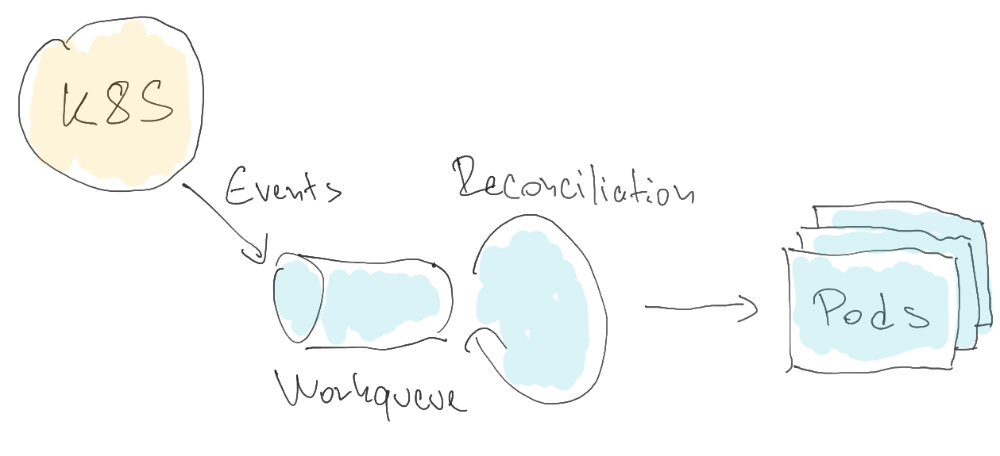
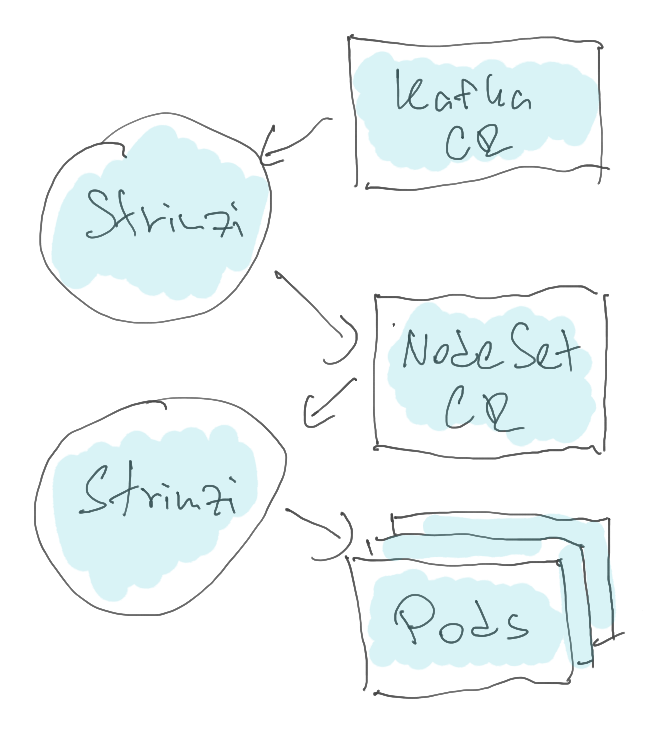

# StatefulSet Removal

## Current situation

Currently, Strimzi relies on StatefulSets to create and manage Pods for the ZooKeeper and Kafka clusters.
Strimzi creates the StatefulSet in the `KafkaAssemblyOperator` class.
Kubernetes creates the Pods according to the StatefulSet.
When a Pod is deleted, Kubernetes is responsible for recreating it.

The StatefulSets are created with `OnDelete` update strategy.
That means that rolling updates are not executed by Kubernetes and its StatefulSet controller.
Instead, Strimzi handles this in the `KafkaAssemblyOperator` and in the accompanied classes such as `KafkaRoller` and `ZooKeeperRoller`.
It identifies if the pod needs to be rolled and if it does, it will just deletes it and waits for Kubernetes to recreate it.
This works to our advantage since it allows us to for example do reliable rolling-updates without breaking availability.

### Advantages of StatefulSets

The main advantage of using StatefulSets is that we have Kubernetes to handle the creation of Pods.
So in case of any disruptions which results in the Pod(s) being deleted or lost (such as for example a worker node crash), we have Kubernetes to take care of it and recreate the Pod(s).
The Pods will be started even when Strimzi operator is not running.
Since StatefulSets are used by many Kubernetes users, they are well tested and we can rely on it.

### Disadvantages of StatefulSets

But it has also some disadvantages.
The pods controlled by the StatefulSet are created from a template which is part of the StatefulSet definition.
Their names are generated from the StatefulSet name by adding an index number from a sequence which always starts with 0.
When using a StatefulSet with 3 replicas, they will have the index numbers 0, 1 and 2.
When you scale-up and want to add more pods, they will always continue in this sequence with pods 3, 4 etc.
When scaling down, the pods with the highest index numbers will be always removed first.

That means that pods cannot be removed from the start or from the middle of the sequence.
Since the pod index numbers are used to determine the broker IDs, this means that we cannot remove any broker we want from the Kafka cluster but only those with highest IDs.
Since the partition replicas are assigned to a particular broker based on the ID, it means that some additional reassignments need to be done and the scale-down is more complicated than it needs to be.

Generating the Pods from the template also means they are all configured the same way.
When mounting the Secrets or ConfigMaps, you always have to mount the same Secret or Config Map into all pods.
You cannot configure asymmetric resource requests and limits to for example give some broker more resources and another one less resources.
Thanks to that it is also much harder to use different configuration for each broker.
In some situations, we also need to roll all pods although maybe only some of them really need it.

Another complicated area is storage configuration.
Strimzi uses some hacks to workaround some of the StatefulSet limitations and allow things such as asymmetric storage configuration.
But these are dependent on the current design of the StatefulSet controller and already in the past we had problem that Kubernetes changes caused issues to this feature.
For example to add volumes to JBOD storage, we currently need to have a special rolling update which does not roll the controller Kafka broker as last etc.

## Motivation

Some of the limitations described above are blocking us in further development and there are features which might be hard to implement with StatefulSets.
Therefore it was decided to investigate what options we have to replace StatefulSets to gain more flexibility and be able to continue the Strimzi development.
Below are some of the features and use cases which might be significantly easier to implement without the StatefulSet limitations.

*Note: This proposal does not cover these features and use-case.
They are just used to explain the things which might be easier when this proposal is implemented.*

### Individual broker configuration

Being able to individually configure the brokers would allow us to improve Strimzi in several areas:
* Less rolling updates
* Asymmetric configurations of storage or CPU / memory resources

### ZooKeeper-less Kafka

The removal of ZooKeeper from Kafka will bring a lot of advantages but also some challenges.
There will no more be a clear separation between the ZooKeeper cluster and the Kafka cluster.
Any Kafka broker can be in theory configured as controller.
With a single StatefulSet managing all Kafka pods, it would be hard to handle all the possible configurations:
* Dedicated set of controller nodes
* All nodes being both controllers and brokers
* Some nodes being both brokers and controller and some only brokers

We could use multiple StatefulSets to separate the different types of nodes.
But even then it would be hard to change the cluster topologies and the node types.
Without the StatefulSet limitations, we should have a lot more flexibility to mix the node types and their roles.

### Stretch clusters

Pods managed by a single StatefulSet always exist only on single Kubernetes cluster.
If you want to have a Kafka cluster which would stretch multiple Kubernetes clusters, you would need to create a StatefulSet on each of them and have it create the Pods on given cluster.
But you would not be able easily move the brokers between the clusters since they would depend on the StatefulSet index numbers to generate their broker IDs.

## Proposal

The StatefulSets should be replaced with a new Strimzi custom resource called `KafkaNodeSet`.
KafkaNodeSet will be used only internally.
Users will not be expected to interact with.

*Note: The name KafkaNodeSet was chosen to be in sync with our other resources.
But the same KafkaNodeSet custom resource definition will be used for ZooKeeper as well as for Kafka.
There will be no ZooKeeperNodeSet.*

The KafkaNodeSets will have a following structure:
* The usual metadata, kind and API identifications
* A `.spec` section with
    * Pod selector to be able to find the pods managed by this KafkaNodeSet
    * List of Pods (full Pod YAML definition including metadata section, but without status section)
* A status section with
    * Number of managed, current and ready pods
    * List of error conditions in case of problems
    * Observed generation

The node sets will be used very similarly to the StatefulSets.
But instead of using a Pod templates and generating Pods with fixed names, it will use full Pod structures including the custom names.
It tries to merge the good from StatefulSet and eliminated the limitations we identified.

The KafkaNodeSet will be created by the `KafkaAssemblyOperator` class in the same place in the reconciliation as the StatefulSet.
This is also where the node sets will be patched when configuration changes.

A new controller will be developed to reconcile the KafkaNodeSet resources.
It will run as part of the Strimzi cluster operator container.
It will follow more lightweight controller approach rather than the long-running _heavy_ approach of our current assembly operators.
It will instead be designed to iterate quickly rather than wait.
So it will for example not wait for Pod readiness.
It will consume events about the KafkaNodeSets and their Pods and react to them.
It will run in its own thread and use a work queue to queue the events and the reconciliations.

It will be responsible for:
* Creating pods which do not exist
* Deleting old pods removed from the KafkaNodeSet
* Update the KafkaNodeSet status subresource

When a new KafkaNodeSet is created, it will create its pods.
When a KafkaNodeSet is modified, it will check if any pods need to be added or deleted.
When a Pod is deleted or modified, it will identify the KafkaNodeSet it belongs to and reconcile the whole KafkaNodeSet.

The KafkaNodeSet controller will not be responsible for handling the rolling updates.
They will continue to be handled in the same way as today by the `KafkaAssemblyOperator` and in the accompanied classes such as `KafkaRoller` and `ZooKeeperRoller`.
They will identify which pods need to be rolled and delete them.
The only difference will be that instead of the Kubernetes StatefulSet controller, it will be the KafkaNodeSet controller which will create a new pod.
For each Pod managed by a KafkaNodeSet, Strimzi will calculate a revision (really a _hash_ of the Pod configuration).
This revision will be used to identify changes to the desired Pod configuration and trigger rolling of the pod.
This is a similar process as used by the StatefulSet itself.

Similarly to the StatefulSets, the KafkaNodeSets will be stable resources as well.
All the annotations currently used on StatefulSets will be applied to them.
This applies to the annotations used to store the configurations and state but also to the command annotations such as manual rolling update triggers.

### Feature Gate

The switch from StatefulSets to KafkaNodeSets should be controller by a new feature gate called `StatefulSetRemoval`.
With this feature gate disabled, StatefulSets will be used.
With it enabled, KafkaNodeSets will be used.
The following table shows the expected graduation of the feature gate:

| Phase | Strimzi versions       | Default state                                          |
|:------|:-----------------------|:-------------------------------------------------------|
| Alpha | 0.27, 0.28             | Disabled by default                                    |
| Beta  | 0.29, 0.30             | Enabled by default                                     |
| GA    | 0.31 and newer         | Enabled by default (without possibility to disable it) |

As always, the feature gate timeline is subject to change based on the actual progress.
If needed, it can be also removed.
The timeline is relatively aggressive, but feature gating all the development will not be trivial.
So we should try to move quickly.

### Implementation

In the first phase, we should implement the 1-to-1 replacement for StatefulSets.
While that will not bring any immediate advantages, it will allow us to easily move from StatefulSets to KafkaNodeSets.
It would also avoid big PRs and instead allow us to gradually improve in smaller steps.

### Risks

In the current solution, Kubernetes is responsible for (re)starting the Pods in case of disruptions.
After implementing this proposal, Strimzi will be responsible for it.
Any bugs and issues in Strimzi might result in the Pods not being started and might affect the availability of the Kafka clusters.
By accepting this proposal, we need to be able to accept this risk and responsibility.

Unlike StatefulSets, KafkaNodeSet also doesn't use template to generate Pods.
That brings us many advantages such as asymmetric configuration etc.
But it also means that the custom resource will be bigger than StatefulSets because it contains a full YAML for each Pod.
It will have a limited capacity how many Pods it will be able to handle.
But since the KafkaNodeSets do not enforce any specific pod names etc., we should be able to workaround this by having more KafkaNodeSets if needed.

Performance testing would need to be done once a full implementation exists to ensure that the KafkaNodeSet controller is able to handle big Kubernetes clusters with many pods belonging to different Kafka clusters as well as unrelated pods.

## Affected components

This proposal currently discuss only the removal of StatefulSets used for Kafka and ZooKeeper.
While in theory it could also be used to replace Deployments used for other components, this is not covered by this proposal.

## Rejected alternatives

### _Single node_ StatefulSets

One of the things considered was to have a StatefulSet per pod.
The StatefulSet would still have the same limitations as before.
But with many different StatefulSets and each having only one Pod, we would not need to care.
However, this approach makes the implementation more complex.
For example:
* Every pod would be named something like `my-cluster-kafka-1001-0` where `1001` would be an example of a broker ID and `0` is the suffix given to the Pod by the StatefulSet
* We would need to manage multiple resources

The main advantage of this approach is that Kubernetes would be still responsible for creating the Pods and we would not need to worry about it.

### Managing the pods directly

It would be also possible to manage the Pods from the `KafkaAssemblyOperator`.
In the same way as it is currently creating the StatefulSets or deleting the pods, it can also create and update the Pods directly.
This would make things easier because we would not need any additional controller or custom resource.
However, the Kafka CR reconciliation is currently very _heavy_ process which does lot of things in a serial fashion.
It manages both ZooKeeper and Kafka and it uses long-running reconciliation.
The reconciliation often takes minutes while it waits for the Pods getting ready or for load balancers being created.
It runs multiple reconciliations in parallel, but for each Kafka custom resource only one reconciliation can be in progress.
That means that it might often take a lot of time before the reconciliation gets to the point when it can recreate the Pods.
Imagine situation when several Kafka brokers are gone because of failure in one of the data centers but the reconciliation is stuck waiting on some load balancer creation to finish while the pods are missing.
Such situation might easily happen and would not be acceptable.

Unlike the Pods, the StatefulSet is treated by Strimzi as a stable resource and used to carry different information such as:
* Current storage configuration
* Kafka versions
* CA generations

If we manage the Pods directly, we would also need to find a way how to replace them.

## Compatibility

The removal of StatefulSets is obviously a significant change.
But the migration between StatefulSets and KafkaNodeSets should be possible without any service interruption or availability issues.