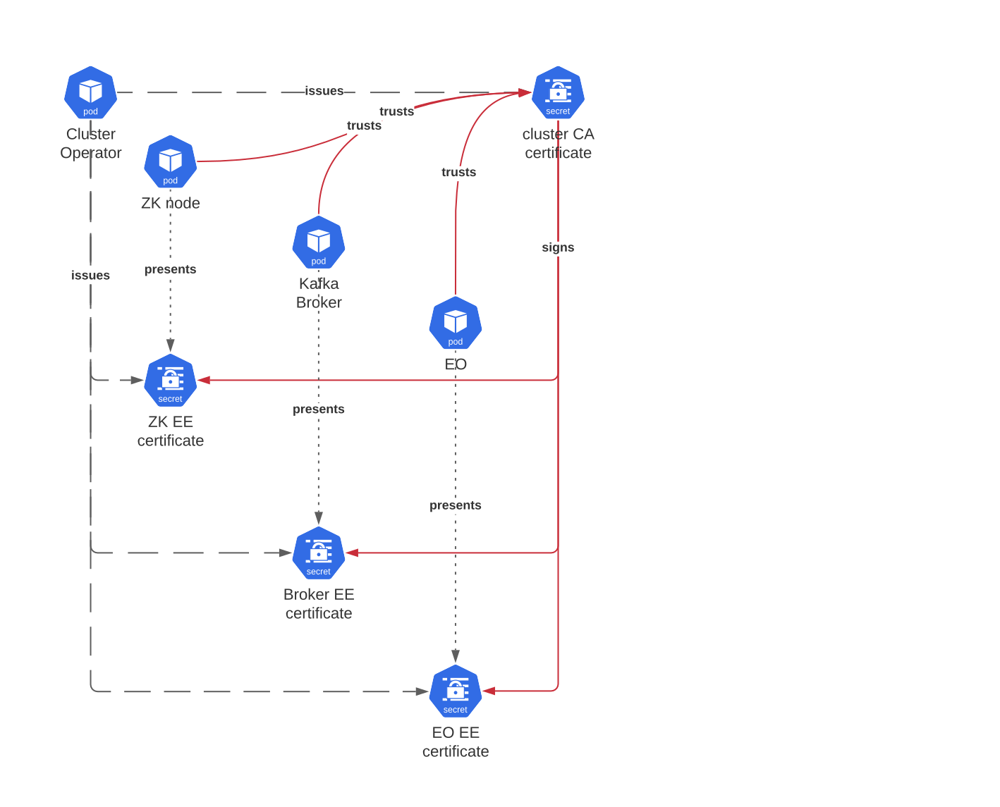
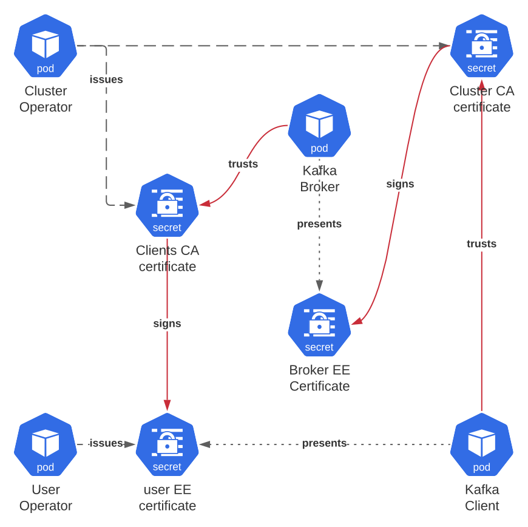

# CA Abstraction

This proposal is to provide a more abstracted mechanism for Strimzi to make use of X509 certificates,
and remove the assumption that Strimzi directly issues end entity certificates ("EE certificates") itself.

## Non-goals
* Support storing keys (or certificates) in stores other than Kubernetes `Secret`.
* Add support for certificate revocation.
* Add support in Strimzi for Kafka's dynamic reconfiguring of security stores.

## Current situation

In order to provide a secure-by-default, TLS out-of-the-box experience Strimzi ended up implementing its own CA operations internally, within the cluster operator.
It does this by using `openssl` to generate a self-signed root CA certificate and key which is then used to sign EE certificates.
In fact Strimzi has two such CAs.
The "cluster CA" is used for issuing certificates for Strimzi components, such as ZooKeeper and Kafka brokers.
The "clients CA" is used for issuing certificates for Kafka clients, for example via the User Operator.

The cluster CA root certificate is added to Strimzi component trust stores (so that, for example, ZooKeeper nodes trust each other's and brokers' certificates, and brokers trust certs issued to other brokers, etc). 




> In the diagram, the red lines show trust.
> For example, because the Kafka Broker trusts the Cluster CA certificate, 
> and the Cluster CA certificate signed the ZK EE certificate
> the broker will trust the ZK EE certificate presented by the ZK node
> during TLS handshake.

The cluster CA root certificate also needs to be trusted by Kafka clients connecting to the cluster (so that clients trust the broker's EE certificates). 
The client CA root certificate is added to the broker trust stores too, so that the brokers will trust certificates issued to Kafka client applications. 



This provides the secure-by-default experience, but in addition to a buggy implementation (**TODO bug ref**) it has very signifiant limitations:

1. It assumes that Strimzi is issuing certificates. 
2. It doesn't really understand more complex certificate paths, i.e. intermediate certificates.
3. It doesn't really understand that certificate validity is a property of the whole certificate path.
4. It doesn't manage the removal of trust in old/unused certificates in a timely manner.

## Motivation

Removing the assumption that Strimzi always issues EE certificates, using a CA certificate it has access to, would enable much more flexibility in CA handling.
This will be compatible with commonly deployed certificate management solutions such as [Cert Manager][cmio], or [Vault][vault].
This would be highly valuable for organizations with compliance requirements with regard to certificates.

## Proposal

It is assumed that we want Strimzi to:

* continue to be secure by default. 
* not have some mandatory dependency on some other project/product for certificate issuance. 

It follows that Strimzi needs to be able to _obtain_ EE certificates, but should not (necessarily) _issue_ them directly itself.

We therefore need an abstraction for how certificates can be issued. 
In the default (backward compatible) mode this abstraction would continue to use `openssl`, but the new abstraction would also be compatible with issuance by external systems (or even, in theory, a human operator using tooling of their choice and interacting with well defined `Secrets`). 

### Interface for certificate issuance

```java
public interface CertificateIssuer {

    byte[] requestCertificate(Subject subject, int requestedValidity) throws CertificateIssuanceException;

    Optional<IssuedCertificate> pollForRequestedCertificate(byte[] token) throws CertificateIssuanceException;
}
```

The `requestCertificate()` method requests a certificate for the given `subject` and the `requestedValidity`. 
It returns an opaque token that is particular to the implementation.
(In the `openssl` implementation this might encode the CSR, for example).

That token can subsequently be passed to `pollForRequestedCertificate()` to see whether the requested certificate has been issued yet. 
The `IssuedCertificate` consists of the EE certificate and key, and a chain of CA certificates ending in the root CA certificate.

```java
class IssuedCertificate {
  private final private byte[] key;
  private final X509Certificate issuedCertificate;
  private final List<X509Certificate> intermediateCaCertificates;
  private final X509Certificate rootCaCertificate;
  // ... constructor, accessors, etc.
}
```

### Abstract process

#### Process for certificate issuance

Adopting the `CertificateIssuer` interface fundamentally changes _how_ the CO issues certificates. 
Because of the current assumptions, the CO generates cluster CA certificates (if they're missing or expired) within a reconciliation, before it knows whether any EE certificate issuance is needed in that reconciliation. Then if it needs to issue EE certificates it just uses the CA certificates that must exist by that point.

The steps required by the `CertificateIssuer` contract are more complicated, and will be described over the following sections. 
The term "issuing operator" will be used to refer to the operator that's using the `CertificateIssuer` implementation to obtain an EE certificate. This could be the User or Cluster Operator.

Before describing the process let's introduce two state machines. First the "EE certificate state machine"

```
  REQUIRED // a certificate is needed for the end entity, but doesn't exist
   |
   v
  REQUESTED // a certificate has been requested; requestCertificate() has been called
   |
   v
  TRUST_PENDING // a certificate has been issued; pollForRequestedCertificate() has returned non-empty,
   |      // but the root CA is not trusted yet
   v
  IN_USE // the certificate is in use
   |
   v
  NOT_NEEDED // a certificate for the end entity is not needed any more
```

Then the "CA certificate trust state machine":

```
  UNTRUSTED // not yet trusted everywhere it needs to be 
   |
   v
  TRUSTED_UNUSED // trusted everywhere it needs to be, but no EE certificates yet issued
   |
   v
  TRUSTED_USED // trusted everywhere, EE certificates issued **TODO do we really need this state?**
   |
   v
  PHASE_OUT // trusted everywhere, but being phased out
   |
   v
  ZOMBIE // still trusted by some component, but not relied on by any party.
```

Now let's describe the processes.

1. The issuing operator needs to figure out which EE certificates are missing (or in their renewal period, or otherwise need replacing, e.g. via annotation). This need for a certificate might exist independently of the end entity. For example, if we're going to scale up the Kafka cluster then we need a certificate for the new broker before the new broker exists. **The issuing operator puts the end entity in the `REQUIRED` state.**

2. The issuing operator requests a new certificate. **The issuing operator puts the end entity in the `REQUESTED` state.**

3. The issuing operator cannot assume that issuance will happen quickly (i.e. that `pollForRequestedCertificate()` returns a non-empty `Optional` immediately). In fact we explicitly decouple the operators reconciliation loop from the waiting for certificate issuance. If, after some number of retries within the current reconciliation, the certificate has not been issued, the token obtained from `requestCertificate()` is persisted in a `Secret` and the polling is completed in a subsequent reconciliation.
(An example of how this could happen is where a `CertificateIssuer` implementation uses cert-manager; `requestCertificate()` creates a cert-manager `CertificateRequest` CR but while the cert manager operator is not running no certificate will be issued).

4. Once a certificate is issued, the issuing operator needs check whether the CA certificate is trusted. 
   I.e. it needs to know what trust states all the existing CA certificates are in. 
   If it is not trusted **the issuing operator puts the end entity in the `TRUST_PENDING` state.** and **puts the CA certificate in the `UNTRUSTED` state**. (**See step 3 in the diagram.**)

> From the above it is clear that there is a `Secret` which stores tokens and issued certificates and their current state, and that only the issuing operator needs access to it.
> It's also clear that there is a `Secret` which stores CA certificates, and their current state, and which needs to be accessed by the issuing operator and the cluster operator.

#### Process for ensuring CA trust

When an EE certificate is issued via a `CertificateIssuer` it might have been signed by a CA that is not yet trusted.
The cluster operator (for the cluster CA), or the user operator (for the clients CA) needs to detect this lack of established trust and ask the cluster operator to trust the new CA. 
The cluster operator and the user operator run in separate processes, so this will be done via a shared `Secret`, for example:

2. The issuing operator has placed a root CA certificate in the shared `Secret` in the `UNTRUSTED` state.
3. The cluster operator sees the root CA certificate orchestrates changes to the brokers (reconfig or restart) (and, for the Cluster CA the other components) so that the certificate is trusted by all components that will observe the EE certificates.
4. The cluster operator updates the shared `Secret` to indicate that the certificate is now in the `TRUSTED_UNUSED` state.

#### Process for deploying the issued certificate

1. The issuing operator sees that the root CA certificate is now in the `TRUSTED_UNUSED` state, so can infer that the CA certificate is trusted.
2. The issuing operator copies the EE certificate and key, and the rest of the certificate chain from its `Secret` _B_  to the deployment secret (e.g. the "user secret" for the Clients CA, or the relevant component secret for the Cluster CA).
3. The issuing operator updates the state of the root CA certificate in the shared `Secret` to `TRUSTED_USED`. 

#### Need for cert path validation

The issuing operator needs to know when to request a new certificate for the same subject because the existing certificate is (or is soon going to be) invalid.
Validity is a property of the whole certificate chain, not just the EE certificate.
For example it is possible that a root or intermediate certificate expires before an EE certificate that depends on it. 
So for the operator to reason correctly about validity it needs to perform PKIX cert path validation.
Fortunately Java comes with APIs for doing this in `java.security.cert`.

It is *not* proposed to integrate support for CRL or OSCP under this proposal, though it could be done in the future. 
This is no different from the current situation in Strimzi. 

####  EE cert expiry

EE certificate expiry is driven by the cert path validation described above.
The issuing operator will perform cert path validation and if the end entity certificate is currently expired, or will be expired on `now + renewal period` then a new EE certificate will be issued as described in the previous section.

#### Intermediate or root CA cert expiry

The same cert path validation by the issuing operator will be able to detect expiry of intermediate or root CA certificates, and also result in issuance of a new EE certificate 
(on the assumption that the CA will use a different CA certificate chain).


### API

Having described at length the internal certificate related operations, let's turn to how this functionality could be exposed to users via the `Kafka` CR. 

Currently the `spec.clusterCa` and `spec.clientsCa` provide some configurability:

```yaml
spec:
  clusterCa:
    validityDays: <integer> # notBefore=now, notAfter=now + validityDays
    generateCertificateAuthority: <boolean>
    generateSecretOwnerReference: <boolean> # should Secrets have ownerReference set?
    renewalDays: <integer> # days before notAfter when we should start renewal
    certificateExpirationPolicy: <renew-certificate|replace-key>
```

We can use the usual `type` discriminator mechanism to support different kinds of issuer (i.e. the type would select the implementations of `CertificateIssuer`).

#### `type: internal`

If `type` was omitted the `internal` type would be used. The `internal` type supports all the properties given above. 
The corresponding `InternalCertificateIssuer` would maintain backwards compatibility, using a root CA directly signing EE certificates.

#### `type: cert-manager.io`

A `cert-manager.io` type could be supported which would use `cert-manager.io/v1` [`CertificateRequest`][cmioCertificateRequest] to issue certificates.

```yaml
spec:
  clusterCa:
    type: cert-manager.io
    validityDays: <integer> # used for CertificateRequest.spec.duration
    issuer:
      name: <string> 
      kind: <string>
      group: <string>
    generateSecretOwnerReference: <boolean> # should Secrets have ownerReference set?
    renewalDays: <integer> # days before notAfter when we should start renewal
```

This would result in the creation of a resource like the following:

```yaml
apiVersion: cert-manager.io/v1
kind: CertificateRequest
metadata:
  name: <string> # provided by Strimzi operator
spec:
  request: <string> # PEM encoded CSR
  isCA: false
  usages: # provided by Strimzi operator
  - signing
  - digital signature
  - server auth
  duration: <integer> # from the Strimzi CR validityDays
  issuerRef: # from the Strimzi CR issuer
    name: ...
    kind: ...
    group: ...
```

Notes: 
* The `spec.request`, being a CSR, could include the subject alternative names etc. for the required certificate.
* The `spec.usages` would be implied by the kind of certificate being generated, e.g. broker certs would need `server auth`, but client certs issued by the UO would not.

Once issued, the `IssuedCertificate` would be handled in the same way as for other issuers,
with checks for the trustedness of root CA certificates and, eventually, exposure to consuming applications
(brokers, ZK nodes, KafkaUser Secrets etc).

#### `type: vault`

Vault has [support for issuing certificates](https://www.vaultproject.io/docs/secrets/pki) 
and it can be used via [a REST API](https://www.vaultproject.io/api/secret/pki#generate-certificate). 

A `VaultCertificateIssuer` would be work similarly to the cert-manager type, but rather making the request using a Custom Resource, it would be implemented by using the REST API directly. 
In Strimzi the CR might look like this:

```yaml
spec:
  clusterCa:
    type: vaultproject.io/pki
    validityDays: <integer> 
    vaultUrl: <a URL to the vault REST API>
    vaultToken:
      secretName: <a Secret containing a vault token>
    generateSecretOwnerReference: <boolean> # should Secrets have ownerReference set?
    renewalDays: <integer> # days before notAfter when we should start renewal
```

When a certificate was issued the `VaultCertificateIssuer` would make 
a POST request to `/pki/issue/:name` and extract the issued certificate from the response.

Once issued, the `IssuedCertificate` would be handled in the same way as for other issuers,
with checks for the trustedness of root CA certificates and, eventually, exposure to consuming applications
(brokers, ZK nodes, KafkaUser Secrets etc).

### Secrets

Let's now describe the various Secrets mentioned in the abstract process.

#### Issuer-specific Secrets

For backwards compatibility, the **cluster CA** in a Kafka cluster called **foo**, using the **internal** issuer the CA key could be stored in `foo-cluster-ca`.

The other issuers in this proposal don't need to store any secret state (all the necessary configuration is provided by the `Kafka` CR, or user-provided `Secrets` referenced from it).

#### End-entity Secrets

There are multiple pieces of information that need to be stored about each end entity:

* Whether a (new) certificate has been requested
* Whether a (new) certificate is waiting (for trust in the issuing CA's certificate)
* The issued certificate chain
* The issued key

It is proposed that these be stored in a separate `Secrets` than the one from which the (eventually) usable certificate is consumed, using the pattern `${cluster}-issuing-${type}`.
For example, 
for certificates being issued to brokers we'd use the name `${cluster}-issuing-broker-certs`
while the certificates consumed by brokers is named using the pattern `${cluster}-broker-certs`.
This prevents consumers (e.g. via Secret volume mounts) from being able to observe certificates that are not yet trusted,
and also the formats of these Secrets to evolve separately.
A similar separation would be applied for other certificates (ZK, Kafka exporter, `KafkaUsers` and so one); each would have its own value for the `type` placeholder in the `metadata.name`.
Note that these extra certificates need not exist outside times that certificates need to be renewed.

The structure of these `issuing` certificates could be:

```yaml
metadata:
  name: ${cluster}-issuing-${type}
type: strimzi.io/issuing
data:
  ${id}.${state}: <data>
```

The `${id}` would allow, for example, a single Secret to be used for all broker certificates, mirroring the situation with the `${cluster}-broker-certs` Secret. 

The `state` would be one of `requested`, `pending`, or `issued`.
The `data` would depend on the state
* For `requested` it would be token.
* For `pending` it would be a serialisation of the `IssuedCertificate`.
* For `issued` it would be the `IssuedCertificate`.

Encoding the state in the item name, rather than the value makes it clearer when viewing the Secret what state each end entity is in.

**TODO:** inferring the EE state machine state from this and the consumption Secret

#### Trust Secrets

A separate Secret will be used for tracking the state of root CA certificates, for each of the cluster and clients CAs. 
As described in the description of the process, this Secret can be updated by multiple processes. 
For example, when the User Operator renews an end-entity certificate and the root CA is not trusted it updates this secret with the root CA certificate, and the CO reacts by ensuring that brokers trust that root CA certificate.
As such **securing access to this `Secret` is of paramount importance** to ensure the security of the cluster.

```yaml
kind: Secret
metdata:
  name: ${cluster}-${ca-type}-trust # e.g. foo-cluster-ca-trust
type: strimzi.io/trust
data:
  ${fingerprint}.${state}: <PEM encoded Secret>
```

The `fingerprint` is the fingerprint/thumbprint of the certificate. I.e. the SHA-1 hash of the ASN.1 DER-encoded form of the X509 certificate. The `state` can be any of the states of the CA certificate trust state machine described above.
Again, including the state in the item name facilitates inspection of the Secret.

The existing Secrets, named using `${cluster}-${ca}-certs` and passed via Secret volume mounts to containers would not change under this proposal.

Problems from multiple processes concurrently updating the secret as avoided by using `metadata.resourceVersion` to make conditional requests when updating that Secret. Note also that only one operator makes each state transition. 

## Affected/not affected projects

This affects the strimzi-kafka-operator project only but in a significant way. 
Full implementation over everything described in this proposal would require multiple phases. 

1. Refactoring the CO internals.
2. Adding support for different `types` in the API.

## Compatibility

The `internal` issuer should be backwards compatible.

## Rejected alternatives

_Call out options that were considered while creating this proposal, but then later rejected, along with reasons why._

One alternative would be to not have Strimzi involved in certificate issuance _at all_. Instead Strimzi would provide a Secret(s) with a well-known name, which the user would have to populate with appropriate certificates and keys, and update prior to certificate expiry. This is rejected because it would not result in a good out-of-the-box experience (and/or require use of a 3rd party operator certificate management product). It also would not be satisfactory for the user operator, where the need for new certificates can occur at any time. It is worth noting however, that this proposal can accomodate this use case using an `external` Certificate Authority `type` in the `Kafka` CR:

```yaml
spec:
  clusterCa:
    type: external
    validityDays: <integer>
    generateSecretOwnerReference: <boolean>
    renewalDays: <integer>
    trust:
      secretName: <string>
    brokerCerts:
      secretName: <string>
    zookeeperCerts:
      secretName: <string>
    # and so on for EO, KafkaExporter etc.
```

This external issuer would implement `requestCertificate()` by writing a CSR to the given Secret and then expecting some external actor to issue to the certificate and populate the given Secret with it, whereupon 
`pollForRequestedCertificate` would return a non-empty result. 

[cmio]: https://cert-manager.io/
[cmioCertificateRequest]: https://cert-manager.io/docs/concepts/certificaterequest/
[vault]: https://www.vaultproject.io
