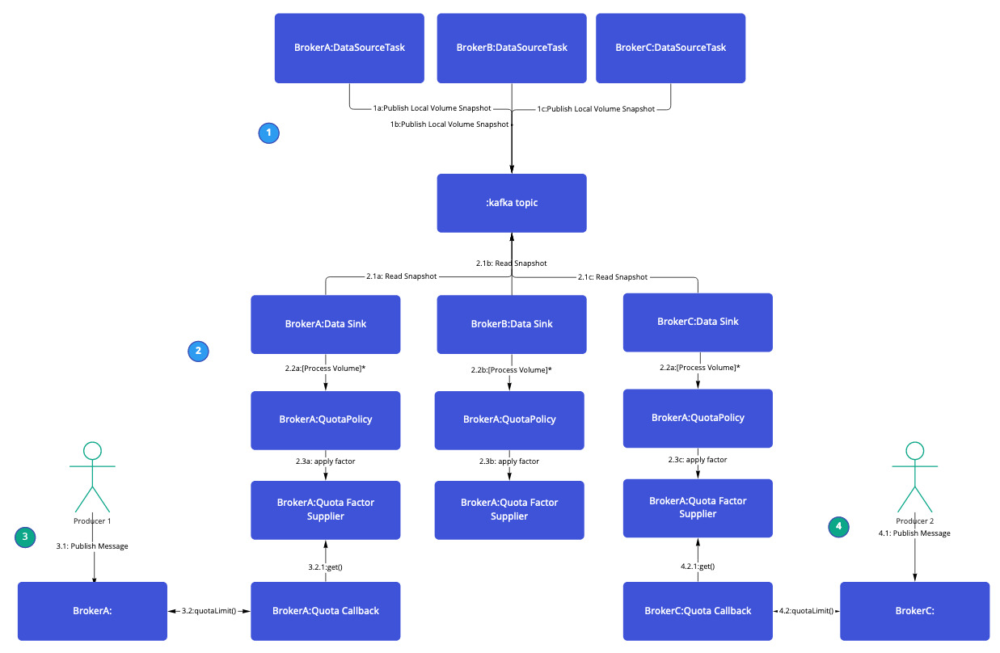

# Re-thinking the quota plug-in

## Current situation
The [kafka-static-quota-plugin](https://github.com/strimzi/kafka-quotas-plugin) applies byte-rate limits on connections to
individual brokers (thresholds derived from storage limits), slowing producers down when consumed storage is over the soft limit (but below the hard limit) and
effectively pausing publication when reaching or exceeding the hard limit. This largely prevents out of disk scenarios when topics
are replicated to all brokers thus there is largely similar disk usage between all brokers. Assuming all the brokers
have similar disk usage levels, they will all apply rate limits at similar times and levels, effectively giving cluster-wide out-of-storage protection.

This however provides limited protection to clusters with un-even distribution of topics and thus storage usage.
Additionally, it ties the plug-in directly to storage usage, there are other factors which users may wish to respond to.

### Cluster wide disk monitoring
As clusters scale up the likelihood of even topic distribution drops. When topics are not evenly distributed it
is possible for replication from broker `1` to broker `2` will cause broker `2` to consume all available storage
without triggering throttling of clients, as broker `1` disk usage remains acceptable.

Addressing the effects of uneven topic distribution sounds like it should come under
[KIP-73](https://cwiki.apache.org/confluence/display/KAFKA/KIP-73+Replication+Quotas). Unfortunately replication quotas
are designed to manage the additional network load of migrating replicas between brokers, which does not address client publication
leading to out of disk conditions through replication.

Currently, the kafka-quotas-plugin considers the total quantity of storage and how much of that is consumed (
see [issue#2](https://github.com/strimzi/kafka-quotas-plugin/issues/2)) when considering whether to apply throttling to
clients. This is problematic with respect to handling disk failure for Just a Bunch Of Disks (JBOD) deployments [(KIP-112)](https://cwiki.apache.org/confluence/display/KAFKA/KIP-112%3A+Handle+disk+failure+for+JBOD) as the
broker will take partitions offline when the volume they are stored on runs out of space. Which in the case of unbalanced usage
between volumes can lead to a volume running out of storage without throttling being applied. The broker will go offline
if all volumes are unavailable.

The current quota plug-in separates quotas into two parts:
1. A fixed upper limit for the number of bytes per second
2. A factor to reduce that quota by as the storage moves between the soft and hard limits. 

## Proposal
### High level changes
To better support external sources for managing quotas this proposal introduces three new roles within the plugin.

1. A `QuotaSupplier` to provide an injection point for stable quota values.
2. A `QuotaFactorSupplier` to provide a more dynamic and responsive factor used to support progressive throttling as clients approach the limits.
3. A `Task` interface which will be used to periodically execute work. Such as capturing total and free space of each volume attached to a broker.

Explicitly separating quota generation into two parts allows for greater flexibility in how to derive the available
quota for a request. The task interface is deliberately loose and should be considered optional in deployments.   

While this document sets out in detail a potential implementation using Kafka as the underlying message transport. It's
simple to imagine a version which implements a `QuotaFactorSupplier` which queries prometheus metrics to determine
volume usage rather than a kafka topic. It's clear that a `Supplier` querying prometheus for disk usage should not
concern itself in determining quota's for a given principal. 

### Cluster wide out of storage protection

[KIP-257](https://cwiki.apache.org/confluence/display/KAFKA/KIP-257+-+Configurable+Quota+Management) describes
configurable quota management, where quotas are defined in terms of how much of a delay to apply to a given produce
request. This leads to defining the possible states of the plugin as:
`OPEN`, `THROTTLE` and `PAUSE` to accurately reflect the effects of transitioning between states.

As there is no direct mechanism to dynamically throttle replication between brokers we need each broker to have a
view on storage usage across the entire cluster. So that it can apply the appropriate state to the requests it handles.

Fitting that into the roles outlined above we get:

 - Implement the `Task` interface to periodically capture the usage of each storage volume attached to the broker and make it available to the cluster.
 - Implement the `QuotaFactorSupplier` interface read the storage usage snapshot and from that calculate the amount of the quota still available to the client.
 - Wrap the existing Quota Config map in an implementation of the `QuotaSupplier` interface.

### Leverage Kafka to distribute volume usage metrics throughout the cluster.

By publishing per volume usage metrics to a compacted topic keyed by the broker ID, each instance of the plugin will be
able to start and quickly determine the state of the cluster and consistently apply throttling regardless of where the
client is connected.

The following [communication diagram](https://www.uml-diagrams.org/communication-diagrams.html) illustrates the parallel
nature of the proposal. 

## Rejected Alternatives

### Using JMX metrics

Using JMX metrics directly would require a web of connections between brokers and the exposing of the JMX port to the
rest of the cluster. Using JMX is also problematic for tracking state across restarts of brokers as each broker would
lose state across restarts and thus lose track of any broker which is temporarily offline.

### External metrics store

Would require the following:

- The quota plugin understands the API of the external metrics system
- A metrics system endpoint exposed to the broker for consuming metrics
- A predictable and consistent naming convention

It would also make the deployment of an external metrics store a requirement for the kafka-static-quota-plugin to function.

### KIP-73

KIP-73 is designed to protect client performance while cluster re-balancing exercises are taking place by limiting the
bandwidth available to the replication traffic. This is not suitable for use in preventing out of storage issues as the
bandwidth limit is configured as part of the partition re-assignment operation. As it applies a bandwidth limit it is
configured in  `units per second` which is problematic for the quota plugin to determine a sensible value for as it
should really be related to the expected rate at which data is purged from the tail of the partitions on the volume in
question. KIP-73 bandwidth limits are only applied to a specific set of `partition` & `replica` pairs which would
require the ability for the plugin to resolve the required pairs.

[//]: # (TODO should this be a new proposal)
#### Implementation details

##### Limit Types
1. Consumed space limit: Triggers if the consumed space of a volume breaches the value. Candidate for deprecation.
2. Minimum Free Bytes: Triggers if the amount of free space on a volume drops below the configured level. Particularly
   useful for hard limits as an absolute minimum of free space.
3. Minimum Free Percentage. Triggers if the amount of free space on the volume drops below the configured proportion of
   the volumes total capacity.

#### The data source should:
- Collect local volume usage
- Publish usage to an internal compacted topic keyed by broker ID.
- Collect and publish volume usage metrics (using the [volume metrics snapshot](#volume-metrics-snapshot-definition)) on start up and periodically after that.
- Connect as an internal service using TLS and client certificates to connect to the Replication listener.

#### The data sink should:
- Connect as an internal service using TLS and client certificates to connect to the Replication listener.
- On startup and periodically thereafter read the volume usage stats from the topic
- Use the Kafka Admin client to discover the list of currently active brokers

#### The quota policy should:
- Should apply the largest delay caused by each disk which breaches the soft limit.
    - The amount of throttling should be proportional to how much of the difference between the soft and hard limit
      remains for a given volume. Applying more throttle the closer to the hard limit things are.
- Should apply a `PAUSE` level throttle to client produce requests if **any** volume in the cluster breaches the hard
  limit.
- Ensure that the quota plugin, and other Strimzi services, updates are not throttled.
- Should take a configured action when it can not determine the state of all known brokers.
    - The action should be one of `PAUSE` or `OPEN`.
    - Defaulting to `PAUSE` as the fail-safe option.
- Apply a freshness check to the volume usage it reads and ignore stale state [3]. The threshold for staleness should be a configuration parameter.

##### Internal API within the quota plugin

To make all this work the quota plugin will need to introduce some new interfaces:

1. A Quota Policy - To encapsulate the logic for evaluating if a volume `complies` or `breaches` a policy
2. A Quota Factor Source - To calculate the factor in the range `0..100`% to apply to the entries in the quota map
3. A Data Source - To publish the current volume usage for the broker in question.

One can envisage a model where the Quota policy was externalised to a separate service which calculated the quota factor
and thus the Quota Factor Source would just provide a wrapper around that external service. For the purposes of this
proposal all three interfaces would be implemented with the current quota plugin.

In this proposal the Factor Source implementation would add the kafka consumer and delegate to the quota policy to
determine what factor to apply.

The Data Source would periodically calculate and publish the usage metrics for the local broker.

##### Proposed interface details
1. QuotaPolicy
```java
/*
 * Copyright Strimzi authors.
 * License: Apache License 2.0 (see the file LICENSE or http://apache.org/licenses/LICENSE-2.0.html).
 */
package io.strimzi.kafka.quotas.policy;

import io.strimzi.kafka.quotas.VolumeDetails;

/**
 * Abstracts the decision-making around hard and soft limits and how to calculate the affect the impact breaching the limits has on the client request.
 */
public interface QuotaPolicy {

    /**
     * Does the particular volume breach this policy's defined hard limit.
     *
     * @param volumeDetails details of the disk in question.
     * @return <code>true</code> if this policy considers the volume to breach the limit otherwise <code>false</code>
     */
    boolean breachesHardLimit(VolumeDetails volumeDetails);

    /**
     * Does the particular volume breach this policy's defined soft limit.
     *
     * @param volumeDetails details of the disk in question.
     * @return <code>true</code> if this policy considers the volume to breach the limit otherwise <code>false</code>
     */
    boolean breachesSoftLimit(VolumeDetails volumeDetails);

    /**
     * Returns the fraction of the original quota this policy thinks is appropriate. Represented as percentage value between <code>0</code> and <code>1</code>
     * <p>
     * Where a fraction of <code>1.0</code> is un affected <br>
     * Breaching the hard limit implies a quota factor of <code>0.0</code>
     * @param volumeDetails details of the disk in question.
     * @return A value between <code>0</code> and <code>1</code>.
     */
    double quotaFactor(VolumeDetails volumeDetails);

    /**
     * At what level does this policy start applying a non-zero quota factor.
     * Primarily for metrics purposes.
     * Note: Returns <code>Number</code> to represent both fixed or relative usage levels. e.g. 5% free
     *
     * @return the level at which the quotaFactor becomes non-zero.
     */
    Number getSoftLimit();

    /**
     * At what level does this policy apply its maximum level of throttling.
     * Primarily for metrics purposes.
     * Note: Returns <code>Number</code> to represent both fixed or relative usage levels. e.g. 5% free
     *
     * @return the level at which the quotaFactor becomes non-zero.
     */
    Number getHardLimit();
}
```
2. QuotaFactorSupplier
```java
/*
 * Copyright Strimzi authors.
 * License: Apache License 2.0 (see the file LICENSE or http://apache.org/licenses/LICENSE-2.0.html).
 */

package io.strimzi.kafka.quotas;

import java.util.function.Supplier;

/**
 * Determines the current restriction factor to be applied to the client quota.
 * Values returned are required to be in the range <code>0.0..1.0</code> inclusive.
 * Where a value of `1.0` implies no additional restriction over and above the defined quota.
 * A value of `0.0` implies that there is no quota available regardless of the defined quota.
 */
public interface QuotaFactorSource extends Supplier<Double> {
}
```
3. DataSourceTask
```java
/*
 * Copyright Strimzi authors.
 * License: Apache License 2.0 (see the file LICENSE or http://apache.org/licenses/LICENSE-2.0.html).
 */

package io.strimzi.kafka.quotas;

import java.util.concurrent.TimeUnit;

public interface DataSourceTask extends Runnable {
    @Override
    void run();

    long getPeriod();

    TimeUnit getPeriodUnit();
}
```

##### Volume Metrics snapshot definition
Each metrics snapshot will be published with the brokerId as the records key and using the following schema as the record value.

For simplicity and debug ability the record should be encoded as JSON, but could be converted to a more space efficient
format later on if justified.

###### Metrics Snapshot

| Field      | Type                                    | Description                                                                   |
|------------|-----------------------------------------|-------------------------------------------------------------------------------|
| brokerId   | `ISO 8601 Date Time`                    | Timestamp when the snapshot of volume usage was generated [1]                 |
| SnapshotAt | `ISO 8601 Date Time`                    | Timestamp when the snapshot of volume usage was generated [1]                 |
| Hard limit | [Limit Definition](#limit-definition)   | Defines when the source broker believes the producers should be paused [2]    |
| Soft limit | `Limit Definition`                      | Defines when the source broker believes the producers should be throttled [2] |
| Volumes    | Set of [VolumeDetails](#volume-details) | Details of the storage volumes attached to the broker                         |

###### Limit Definition

| Field | Type   | Description                                                   |
|-------|--------|---------------------------------------------------------------|
| type  | Enum   | One of `ConsumedSpace`, `MinFreeBytes` or `MinFreePercentage` |
| level | Number | Defines the level at which the limit applies                  |

###### Volume Details

| Field      | Type   | Description                                                      |
|------------|--------|------------------------------------------------------------------|
| VolumeName | String | An identifier to uniquely distinguish the disk. e.g. `/dev/sda1` |
| Capacity   | long   | The capacity of the volume in bytes                              |
| Consumed   | long   | The number of bytes currently in use on the volume               |

Notes:

1. Explicitly mark when the volume usage was captured rather than depending on message publication timestamps.
2. One could view the limits defined at the message level as being broker wide defaults, they could then optionally be
   overridden at the VolumeDetails level with a volume specific limit.
3. Separating freshness from topic eviction as freshness is a "business" concern of the plugin.

##### Message JSON schema

If there are any disagreements between the textual schema above and
the [JSON schema](./schemas/035-cluster-wide-volume-usage-quota-message-schema.json) the JSON schema should be
considered authoritative.

<details><summary>Json Schema</summary>
<p>

```json
{
  "$schema": "http://json-schema.org/draft-07/schema",
  "$id": "http://example.com/example.json",
  "type": "object",
  "title": "The root schema",
  "description": "The root schema comprises the entire JSON document.",
  "default": {},
  "$defs": {
    "limit": {
      "type": "object",
      "limit_type": {
        "$id": "#/$defs/limit/limit_type",
        "default": "",
        "description": "An explanation about the purpose of this instance.",
        "examples": [
          "MinFreeBytes"
        ],
        "title": "The type schema",
        "enum": [
          "ConsumedBytes",
          "MinFreeBytes",
          "MinFreePercentage"
        ],
        "type": "string"
      },
      "level": {
        "$id": "#/$defs/limit/level",
        "type": "integer",
        "title": "The level schema",
        "description": "An explanation about the purpose of this instance.",
        "default": 0,
        "examples": [
          1000000
        ]
      }
    },
    "bytes": {
      "type": "integer",
      "minimum": 0
    }
  },
  "examples": [
    {
      "brokerId": "0",
      "snapshotAt": "2022-04-07T13:00:00Z",
      "hardLimit": {
        "type": "MinFreeBytes",
        "level": 1000000
      },
      "softLimit": {
        "type": "MinFreePercentage",
        "level": 5
      },
      "volumes": [
        {
          "volumeName": "/dev/sdd",
          "capacity": 107374182400,
          "consumed": 10737418240
        }
      ]
    }
  ],
  "required": [
    "brokerId",
    "snapshotAt",
    "hardLimit",
    "softLimit",
    "volumes"
  ],
  "properties": {
    "brokerId": {
      "$id": "#/properties/brokerId",
      "type": "string",
      "title": "The brokerId schema",
      "description": "The Identifier of the broker. Expected to be the same as https://kafka.apache.org/30/javadoc/org/apache/kafka/common/Node.html#idString() for the publishing broker",
      "default": "",
      "examples": [
        "0"
      ]
    },
    "snapshotAt": {
      "$id": "#/properties/snapshotAt",
      "type": "string",
      "title": "snapshotAt",
      "description": "The time at which the metrics were generated",
      "default": "",
      "format": "date-time",
      "examples": [
        "2022-04-07T13:00:00Z"
      ]
    },
    "hardLimit": {
      "$id": "#/properties/hardLimit",
      "default": {},
      "description": "Defines when the source broker believes the producers should be paused",
      "examples": [
        {
          "type": "MinFreeBytes",
          "level": 1000000
        }
      ],
      "$ref": "#/$defs/limit",
      "additionalProperties": true
    },
    "softLimit": {
      "$id": "#/properties/softLimit",
      "type": "object",
      "title": "The softLimit schema",
      "description": "Defines when the source broker believes the producers should be throttled",
      "default": {},
      "examples": [
        {
          "type": "MinFreePercentage",
          "level": 5
        }
      ],
      "$ref": "#/$defs/limit",
      "additionalProperties": true
    },
    "volumes": {
      "$id": "#/properties/volumes",
      "type": "array",
      "title": "AttachedVolumes schema",
      "description": "Metrics for each volume attached to this broker",
      "default": [],
      "examples": [
        [
          {
            "volumeName": "/dev/sdd",
            "capacity": 107374182400,
            "consumed": 10737418240
          }
        ]
      ],
      "additionalItems": true,
      "items": {
        "$id": "#/properties/volumes/items",
        "anyOf": [
          {
            "$id": "#/properties/volumes/items/anyOf/0",
            "type": "object",
            "title": "Volume Schema",
            "description": "Metrics for a given volume",
            "default": {},
            "examples": [
              {
                "volumeName": "/dev/sdd",
                "capacity": 107374182400,
                "consumed": 10737418240
              }
            ],
            "required": [
              "volumeName",
              "capacity",
              "consumed"
            ],
            "properties": {
              "volumeName": {
                "$id": "#/properties/volumes/items/anyOf/0/properties/volumeName",
                "type": "string",
                "title": "The volumeName schema",
                "description": "A unique identifier (within the scope of a broker)",
                "default": "",
                "examples": [
                  "/dev/sdd"
                ]
              },
              "capacity": {
                "$id": "#/properties/volumes/items/anyOf/0/properties/capacity",
                "type": "integer",
                "title": "VolumeCapacity",
                "description": "The capacity of the volume expressed in bytes",
                "default": 0,
                "$ref": "#/$defs/bytes",
                "examples": [
                  107374182400
                ]
              },
              "consumed": {
                "$id": "#/properties/volumes/items/anyOf/0/properties/consumed",
                "type": "integer",
                "$ref": "#/$defs/bytes",
                "title": "ConsumedBytes",
                "description": "The number of bytes currently consumed on the volume",
                "default": 0,
                "examples": [
                  10737418240
                ]
              }
            },
            "additionalProperties": true
          }
        ]
      }
    }
  },
  "additionalProperties": true
}
```
</p>
</details>

##### Metrics
- Throttling applied due lack of data. - Gauge with the value `0` not applied or `1` applied
- Connection status - Gauge with the value `0` disconnected or `1` Connected
- publication errors - Counter to allow the detection of connectivity issues.
- Metrics showing usage per local volume.

##### Configuring the plugin
###### Existing properties
Preserved for backwards compatability.
- `client.quota.callback.static.storage.hard`
- `client.quota.callback.static.storage.soft`

Controlling the number of consumed bytes **above** which throttling is applied. 

###### New properties
- `client.quota.callback.static.storage.hard.min-free-bytes`
- `client.quota.callback.static.storage.hard.min-free-percent` Expressed as `0.0..1.0`
- `client.quota.callback.static.storage.soft.min-free-bytes`
- `client.quota.callback.static.storage.soft.min-free-percent` Expressed as `0.0..1.0`    

Expressed as the number of available bytes, derived from the proportion of the total volume size, **below** which throttling is applied.
