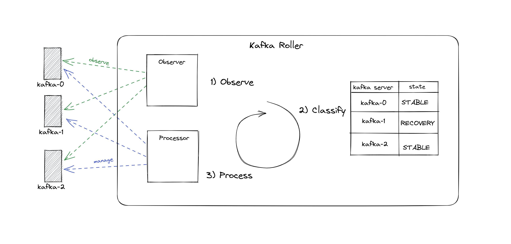
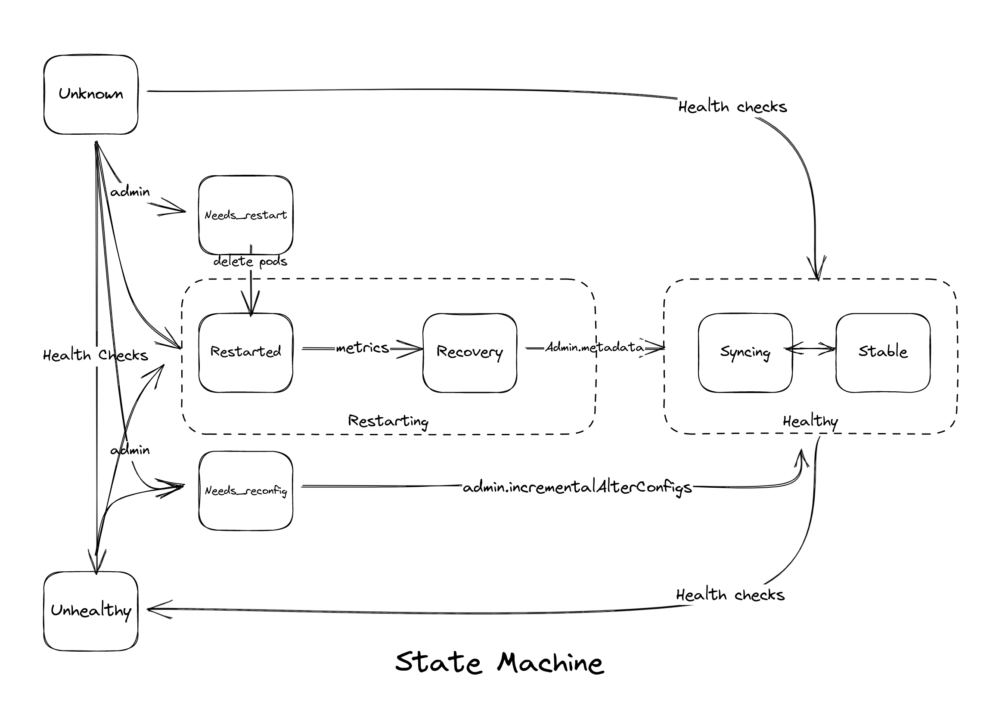

# FSM Kafka Roller

## Current situation

The Kafka Roller is a Cluster Operator component that's responsible for rolling (i.e. controlled restarts) Kafka pods when needed (e.g. when a certificate is renewed).

### Current Kafka Roller Logic

- Take a list of Kafka pods and reorder them based on the readiness. 
- Roll unready pods first without considering why it could be unready.
- Before restarting a Kafka pod, consider if it is a controller or it has an impact on the availability.
- If a Kafka pod does not become ready after restarting within the timeout, then force restart it without considering why it's taking a long time.

### Know Issues

This logic ends up with the following known issues in the Kafka Roller:

- It doesn’t understand log recovery
  - Misinterprets it as a problem and restarts again. 
- It doesn’t worry about partition leadership
  - Should let broker resume preferred leadership after rolling.
- Its availability check [KafkaAvailability](https://github.com/strimzi/strimzi-Kafka-operator/blob/bf4fa3f68cd83685bf56229c6bb98eccefabea72/cluster-operator/src/main/java/io/strimzi/operator/cluster/operator/resource/KafkaAvailability.java) is too resource-intensive
  - All topic descriptions in memory at once.
- It’s difficult to reason about. 
- For KRaft we may need logic for `process.role=controller` and `process.roles=broker,controller`.
- Large clusters: duration of rolling restarts becomes a problem.
- Tension with Cruise Control e.g. over leadership.

## Motivation

Refactoring the Kafka Roller is a change that needs to be well planned and executed since the KafkaRoller is a crucial and complex component of the Cluster Operator.

That is why this proposal aims for:
- Proposing the desired state of the Kafka Roller.
- Proposing a safe implementation path that focuses on incremental small changes which lead to achieving such desired state.

## Proposal

### Enhancement Areas

The proposal focuses on the following areas of enhancements

[//]: # (TODO: Change name)  

#### Observations

* Kafka Roller decisions can become more accurate and better informed by having rich observations coming from different sources (e.g. Kafka admin API, Kubernetes API, metrics, etc.).
* Creating an abstraction for the observations' collection that encapsulates different observation sources, including custom sources (e.g. a Kafka Agent). Such custom sources would help with better understanding of the Kafka server state (e.g. broker is in log recovery).

#### State Classification

* Kafka servers can be classified into a set of states that are determined by the collected observations (e.g. needs restart, unhealthy, stable, etc.)
* The Kafka server states can be modeled as a state machine which reflects the Kafka Roller's understanding of the Kafka server state and determines the possible actions needed to transition the Kafka server to a healthy state.
* The Kafka Roller can continuously collect observations, classify the Kafka server state, and reconciling Kafka servers in unhealthy states via the defined state machine transitions.

#### Decoupling Observations' Collection, Classification and Pod Management

A new set of abstractions can be introduced around observations' collection, classification and pod management that would decouple those three aspects for the following reasons:   
* Breaking down the complexity of the Kafka Roller and making it easier to reason about.
* Better testability of each aspect of the roller in isolation.
* Easier extensibility of the Kafka Roller to support future scenarios (e.g. different sources of observations, different classification logic, etc.)

### Proposed Abstractions

#### The Observer

* An abstraction around observations' collections.
* It encapsulates the logic of collecting observations per Kafka server from different sources (e.g. Kafka admin API, Kubernetes API, metrics, etc.).

#### The Classification

* Responsible for mapping observations to states.
* Does not understand state transitions.

#### The Processor

* An abstraction around Kafka server management. 
* Responsible for pod deletion and reconfiguration
* Does not understand state transitions.

### State Machine

The following diagram illustrates the proposed Kafka server states and possible transitions

### Implementation Milestones

TBD

## Affected/not affected projects

This proposal affects only the [`strimzi-Kafka-operator` GitHub repository](https://github.com/strimzi/strimzi-Kafka-operator). 

## Compatibility

<!--Call out any future or backwards compatibility considerations this proposal has accounted for.-->
TBD