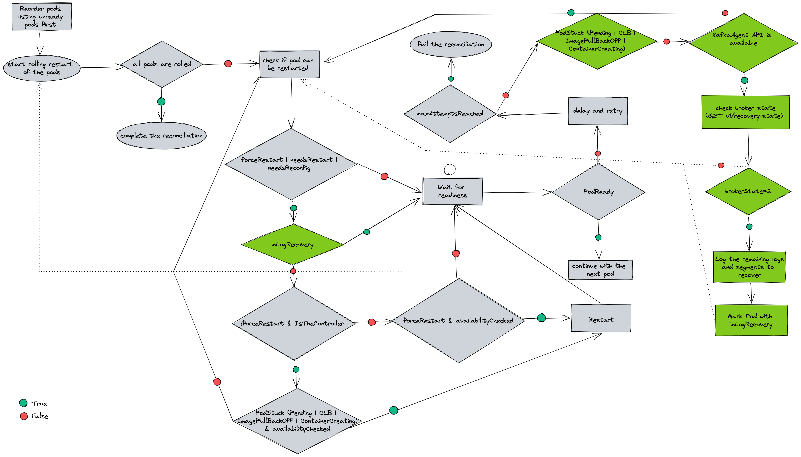

# Avoid broker restart when in log recovery state


This proposal describes a solution for KafkaRoller's shortcoming with brokers in log recovery.

## Current situation

The current logic in KafkaRoller:
- Take a list of Kafka pods and reorder them based on the readiness.
- Roll unready pods first without considering why it could be unready.
- If the pod is the controller, roll it last.
- Do not roll the pod, if it has an impact on the availability such as causing under replicated partitions.
- If a Kafka pod does not become ready within the operational timeout (300000ms by default) after restarting, then it may force restart it without considering why it's taking a long time.

The current flow of KafkaRoller


A Kafka broker can take a long time to become ready while performing log recovery. In this case, KafkaRoller could end up force restarting the broker and this can continue indefinitely, because of the log recovery on the broker startup again. KafkaRoller currently does not have a way to know what state a broker is in before making a decision to force restart it.

KafkaAgent currently collects the `kafka.server:type=KafkaServer,name=BrokerState` metric and creates a `kafka-ready` file on disk if the broker state value is greater than `3`(`RUNNING`) and not `127` (`UNKNOWN`). The Kafka readiness check passes if it finds the file on disk.

## Motivation

To address the issues with restarts and log recovery, KafkaRoller needs to be aware of the current broker state.  If a broker is performing log recovery, KafkaRoller should fail the reconciliation instead of force restarting it.

## Proposal
 
The objective of this proposal is to introduce a REST API endpoint within KafkaAgent, which exposes metrics from a Kafka broker. Furthermore, KafkaRoller would be modified so that it can query this endpoint to determine the current state of a broker, thus preventing unnecessary restarts. Additionally, KafkaRoller would allow a human operator to observe whether the log recovery process is making progress or is stuck.

The following implementation details will describe behaviour of the new API in KafkaAgent and how KafkaRoller would interact with it and handle a broker that is in log recovery.

### Implementation details

**KafkaAgent**:

- Add a web server to accept SSL connections on port 8443.
- Use Jetty for the web server since Kafka already uses it therefore avoids an additional dependency.
- Reuse the broker's own certificate that would be in the container for TLS authentication.
- Configure the server with mTLS authentication.
- Expose an endpoint `v1/broker-state` that includes the API version in the URI path.
- Extend KafkaAgent to collect `kafka.log:type=LogManager,name=remainingLogsToRecover` and `kafka.log:type=LogManager,name=remainingSegmentsToRecover` metrics.
- Use Jetty's native ServerHandler API to handle a `GET` request and return a JSON response that would look like this:
```
{
 "brokerState": 2,
 "recovery": {
     "remainingLogsToRecover": 123,
     "remainingSegmentsToRecover": 456
 }
}
```
The `recovery` field is optional and is only included if the `brokerState` is `2`. Otherwise it would look like this:
```
{
 "brokerState": 3,
}
```
- Return HTTP 404 (Not Found) if a request is sent to an unknown version of the API e.g. `GET /v5/broker-state` and `v5` does not exist.
- Return HTTP 503 (Service Unavailable), if it's not able to get metrics due to an unexpected issue with the broker.

**KafkaRoller**:

The proposed flow of KafkaRoller

(The changes are highlighted in green.)


Currently, if a Kafka pod does not become ready within the operational timeout, it checks how many times the pod has been retried to roll. If it hasn't reached the maximum number of attempts (6 by default and set to 10 by KafkaReconcilor), it reschedules the rolling of the pod by appending it to the list. Otherwise, reconciliation fails.


As described in the graph above, the following steps are added before the retry step:


1. Ensure that the Kafka pod is not in a stuck state. The existing `isPodStuck()` can be used for this. If the pod is stuck, continue with the current behaviour to retry rolling of the pod.
2. Use the Pod DNS name to connect to the KafkaAgent API endpoint. If it cannot connect to the endpoint, continue with the current behaviour to retry rolling of the pod. (The connection might timeout or refused because KafkaAgent is stuck or running older version).
3. Use the cluster operator's client certificate and keys for mTLS authentication.
4. Send `GET v1/broker-state` request to the endpoint.
5. If the HTTP return code is not 200, continue with the current behaviour to retry rolling of the pod.
6. If the `brokerState` value is `2` (`RECOVERY`), follow the new logic for handling log recovery. Otherwise continue with the current behaviour to retry rolling of the pod.


*Handling log recovery*


7. Set `inLogRecovery` to true for the pod  (`inLogRecovery` is a new boolean that would be added to the `RestartContext`).
8. Log the values of `remainingLogsToRecover` and `remainingSegmentsToRecover` from the JSON response in an `INFO` message.
9. Continue with the current behaviour to retry rolling of the pod.
10. On the next retry, check `inLogRecovery` inside the `restartIfNecessary()` function.
11. When `inLogRecovery` is set to true, call `awaitReadiness()` which periodically checks and waits for readiness until the operational timeout reaches.
13. If the operational timeout is reached, repeat from step1.
14. If the maximum number of attempts has been reached, include log recovery in the reason for failure.

### For future consideration:

- The operator might need access to more broker metrics. We can easily implement additional endpoints to expose them.
- The readiness check could also make use of the KafkaAgent endpoint to get the broker state instead of checking for a file on disk. An internal non-TLS endpoint that returns HTTP code based on the broker status would need to be implemented. This can be elaborated on in a further proposal.
- The liveness and readiness checks potentially will need to access non-yammer metrics for KRaft, which could be exposed in the same manner, but would need a new mechanism to collect them.

## Affected projects

* strimzi/kafka-cluster-operator

## Compatibility

After the operator gets updated with the KafkaRoller change, it will expect the KafkaAgent endpoint to be present. However, the KafkaAgent may not have been updated yet.

To maintain backwards compatibility, use the new logic that handles log recovery only if KafkaRoller is able to successfully connect to the KafkaAgent endpoint. If the KafkaAgent endpoint is not responsive, continue with the current behaviour. This ensures compatibility with previous versions. Additionally, in the case that the KafkaAgent API is present, but the agent is stuck or not running due to some reason, then continuing with the current behaviour which may force restart the broker after a timeout could help recovering the agent.

## Rejected alternatives

- Why not use JMX to collect Kafka metrics? There is a user facing JMX settings that has its own authentication mechanism so we want to avoid any conflict with that.
- Why not use Kafka's metrics-reporter? Metric-reporter does not come up early enough in the Kafka process, which is needed for Kafka readiness/liveness probe. With java agent, we would have the endpoint up and available right away and start reporting on metrics immediately. Metrics-reporter also might not be set up until after the log recovery, so relevant metrics could be missing.
