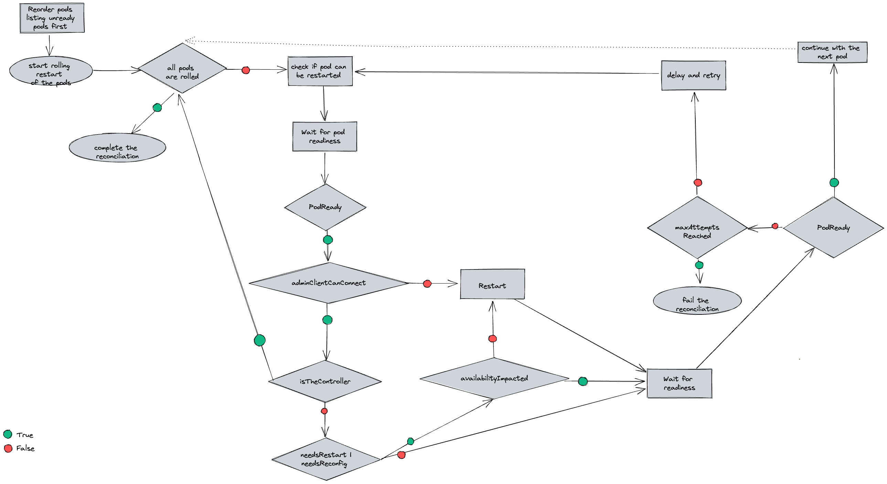
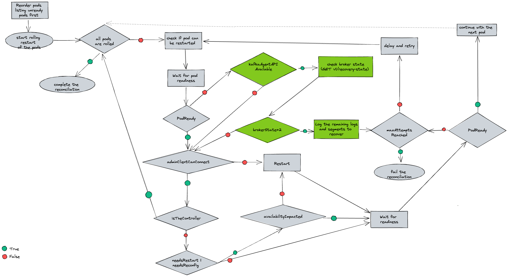

# Avoid broker restart when in log recovery state
> Note: This proposal has been updated since its initial merge.

This proposal describes a solution for KafkaRoller's shortcoming with brokers in log recovery.

## Current situation

The following list outlines the high-level logic currently implemented in `KafkaRoller` for rolling pods:
- Take a list of Kafka pods and reorder them based on the readiness.
- If the pod is the controller, roll it last.
- If pod is not ready before rolling, wait for it to become ready until the operation timeout is reached.
- If pod is in a stuck state e.g `CrashLoopBackOff`, force restart the pod.
- If pod is unschedulable, fail the reconcilation. 
- If the AdminClient connection to pod failed, force restart the pod. 
- Check if rolling the pod would have an impact on the availability such as causing under replicated partitions.
- If rolling the pod does not affect the availibility, then restart the pod and wait for pod readiness. Otherwise consider other pods for rolling first.
- If pod does not became ready within the operation timeout (300000ms by default) after restarting, then retry until the maximum attempt is reached. 

The current flow of KafkaRoller


A Kafka broker can take a long time to become ready while performing log recovery. While the broker is in log recovery, AdminClient connection cannot be made to the broker. In this case, KafkaRoller force restarts the broker and this can continue indefinitely, because of the log recovery on the broker startup again. KafkaRoller currently does not have a way to know what state a broker is in before making a decision to force restart it.

KafkaAgent currently collects the `kafka.server:type=KafkaServer,name=BrokerState` metric and creates a `kafka-ready` file on disk if the broker state value is greater than `3`(`RUNNING`) and not `127` (`UNKNOWN`). The Kafka readiness check passes if it finds the file on disk.

## Motivation

To address the issues with restarts and log recovery, KafkaRoller needs to be aware of the current broker state.  If a broker is performing log recovery, KafkaRoller should fail the reconciliation instead of force restarting it.

## Proposal
 
The objective of this proposal is to introduce a REST API endpoint within KafkaAgent, which exposes metrics from a Kafka broker. Furthermore, KafkaRoller would be modified so that it can query this endpoint to determine the current state of a broker, thus preventing unnecessary restarts. Additionally, KafkaRoller would allow a human operator to observe whether the log recovery process is making progress or is stuck.

The following implementation details will describe behaviour of the new API in KafkaAgent and how KafkaRoller would interact with it and handle a broker that is in log recovery.

### Implementation details

**KafkaAgent**:

- Add a web server to accept SSL connections on port 8443.
- Use Jetty for the web server since Kafka already uses it therefore avoids an additional dependency.
- Reuse the broker's own certificate that would be in the container for TLS authentication.
- Configure the server with mTLS authentication.
- Expose an endpoint `v1/broker-state` that includes the API version in the URI path.
- Extend KafkaAgent to collect `kafka.log:type=LogManager,name=remainingLogsToRecover` and `kafka.log:type=LogManager,name=remainingSegmentsToRecover` metrics.
- Use Jetty's native ServerHandler API to handle a `GET` request and return HTTP 200 (OK) with a body JSON response, for example:
```
{
 "brokerState": 2,
 "recovery": {
     "remainingLogsToRecover": 123,
     "remainingSegmentsToRecover": 456
 }
}
```
The `recovery` field is optional and is only included if the `brokerState` is `2`. Otherwise return HTTP 200 (OK) with a body JSON response without this field, for example:
```
{
 "brokerState": 3,
}
```
- Return HTTP 404 (Not Found) if a request is sent to an unknown version of the API e.g. `GET /v5/broker-state` and `v5` does not exist.
- Return HTTP 503 (Service Unavailable), if it's not able to get metrics due to an unexpected issue with the broker.

**KafkaRoller**:

The proposed flow of KafkaRoller

(The changes are highlighted in green.)

Currently, it waits for the pod to become ready if it's not already in ready state before checking if it can be rolled. If the pod does not become ready within the operation timeout, it logs a warning message and carries on. Instead of carrying on, KafkaRoller will now check the broker state and return an exception if it's in recovery state. The pod then would be retried until the maximum attempt reached.

The following list outlines the high-level logic that will be implemented in `KafkaRoller` for rolling pods:
1. Wait for pod to become ready if it's not in ready state before checking if it can be rolled.
2. If pod does not become ready within the operation timeout, check the broker state.
3. Use the Pod DNS name to connect to the KafkaAgent API endpoint. If it cannot connect to the endpoint (the connection might timeout or refused because KafkaAgent is stuck or running older version), continue with the current behaviour.
4. Use the cluster operator's client certificate and keys for mTLS authentication.
5. Send `GET v1/broker-state` request to the endpoint.
6. If the HTTP return code is not 200, continue with the current behaviour.
7. If the `brokerState` value is `2` (`RECOVERY`):
     - Log the values of `remainingLogsToRecover` and `remainingSegmentsToRecover` from the JSON response in an `INFO` message.
     - Return an exception to repeat from step 1 until the maximum number of attempts is reached.
     - If the maximum number of attempts has been reached, include log recovery in the reason for failure.
8. If the `brokerState` value is not `2` (`RECOVERY`), continue with the current behaviour that may force restart the pod.

### For future consideration:

- The operator might need access to more broker metrics. We can easily implement additional endpoints to expose them.
- The readiness check could also make use of the KafkaAgent endpoint to get the broker state instead of checking for a file on disk. An internal non-TLS endpoint that returns HTTP code based on the broker status would need to be implemented. This can be elaborated on in a further proposal.
- The liveness and readiness checks potentially will need to access non-yammer metrics for KRaft, which could be exposed in the same manner, but would need a new mechanism to collect them.

## Affected projects

* strimzi/kafka-cluster-operator

## Compatibility

After the operator gets updated with the KafkaRoller change, it will expect the KafkaAgent endpoint to be present. However, the KafkaAgent may not have been updated yet.

To maintain backwards compatibility, use the new logic that handles log recovery only if KafkaRoller is able to successfully connect to the KafkaAgent endpoint. If the KafkaAgent endpoint is not responsive, continue with the current behaviour. This ensures compatibility with previous versions. Additionally, in the case that the KafkaAgent API is present, but the agent is stuck or not running due to some reason, then continuing with the current behaviour which may force restart the broker after a timeout could help recovering the agent.

## Rejected alternatives

- Why not use JMX to collect Kafka metrics? There is a user facing JMX settings that has its own authentication mechanism so we want to avoid any conflict with that.
- Why not use Kafka's metrics-reporter? Metric-reporter does not come up early enough in the Kafka process, which is needed for Kafka readiness/liveness probe. With java agent, we would have the endpoint up and available right away and start reporting on metrics immediately. Metrics-reporter also might not be set up until after the log recovery, so relevant metrics could be missing.
