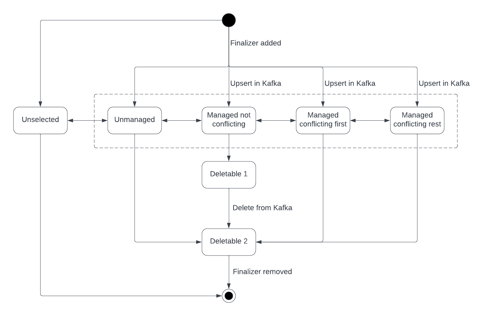

# A unidirectional topic operator

Replace the existing bidirectional topic operator with a unidirectional operator.

## Current situation

The Strimzi Topic Operator provides a Kubernetes API for viewing and modifying topics within a Kafka cluster.
It deviates from the standard operator pattern by being bidirectional.
That is, it will reconcile changes to a `KafkaTopic` resource both to _and from_ a Kafka cluster.
The bidirectionality means applications and users can continue to use Kafka-native APIs (such as the `Admin` client) and tooling (e.g. the scripts provided by Apache Kafka) as required.
The KafkaTopic's `spec` will be updated by the operator to reflect those changes.

The Strimzi community often abbreviates the topic operator as TO, but to avoid ambiguity in this document we will refer to the existing bidirectional topic operator as the BTO, and the proposed unidirectional topic operator as the UTO.

The BTO makes use of ZooKeeper znode watches to know about changes to topic state within the Kafka cluster.

But Apache Kafka is removing its ZooKeeper-dependence which means that the BTO won't work with Kafka clusters that use it's replacement, known as KRaft.

## Motivation

In order to continue to provide a kube-native API for managing Kafka topics we've considered some alternatives which would work with a KRaft-based Kafka cluster:

* Using polling via the Kafka `Admin` client.
* Using a KRaft observer

The polling approach, while simple, has significant drawbacks.
It would scale poorly with the number of topics (in terms of CPU and memory), and would also suffer from increased latency between the time a change was made in Kafka and when it was reflected in Kubernetes.
The increased latency would widen the window for making conflicting changes.

The observer approach could work, but comes with some serious drawbacks:

* The Kafka project does not provide a publicly-supported API for running a KRaft observer, so we'd need to make use of internal APIs which could change between releases without warning. 
  This represents a potential maintenance burden to the project.
* The operator would require persistent storage (for the replicated `__cluster_metadata` log), which would make the operator significantly more difficult to operate.
  For example, if it were realized as a single pod `Deployment`, then the requirement for a persistent volume would tie it to a single AZ, meaning it would not be as highly available as the current operator.
  This could be worked around by having multiple observers with only a single elected leader actually in charge of making modifications at any one time.

Overall, it is clear that the complexity of the operator would be significantly increased by pursuing this direction.

It's also worth reviewing _why_ people want to use an operator for topics. 
There are two broad use cases:

1. Declarative deployments, for example in the form of gitops. 
2. Using `KafkaTopics` operationally as the API through which to manage all topics.

Based on opened issues and Slack conversations with users, it seems that 1. is the most common reason people use the BTO.
However, the BTO doesn't do a great job at satisfying this use case.

* It only supports a single namespace, which means BTO admins cannot easily follow a workspace-per-dev team model.
  It also means that infrastructure-level topics (e.g. `__consumer_offsets` and `__transaction_state`) comingle with per-application topics. 
* It doesn't *enforce* a single source of truth, allowing for changes done directly in Kafka to conflict with declarative deployments. 

Moreover, the BTO doesn't do a good job with item 2. either:

* It only surfaces a subset of topic state through the Kube API (it doesn't include partition leadership/ISR for example)
This is intentional (it doesn't make sense to overload etcd to present this kind of dynamic information), but it undermines the suitability of the BTO for this use case.

For these reasons we are proposing the UTO.

## Proposal

### Goals

* A unidirectional topic operator which is KRaft compatible
<!-- * Support for multiple namespaces -->

### Non-goals

* Supporting replication factor change (this could be added later)

### Maintaining compatibility of the `KafkaTopic` custom resource

We would remain schema-compatible with the existing `KafkaTopic` resource at the API level. 
This means that all the existing `spec` sections could be handled by the new operator and all existing fields of the `status` section would still be present for applications that consume the status.
However, the semantics of a `KafkaTopic` would change incompatibly: The `spec` would no longer be updated when Kafka-side configuration changed.
Instead, if Kafka-side configuration was changed out-of-band (e.g. by using the `Admin` client, or Kafka shell scripts) those changes would eventually (depending on the timed reconciliation interval) be reverted.

As context for the rest of this document, an example `KafkaTopic` currently looks like this:

```yaml=
kind: KafkaTopic
metadata:
  generation: 123
  name: example.topic
spec:
  topicName: example_topic
  replicas: 3
  partitions: 50
  config:
    retention.ms: 123456789
status:
  topicName: example_topic
  observedGeneration: 123
  conditions:
  - type: Ready
    status: True
    lastTransitionTime: 20230301T103000Z
```

Where: 
  * `spec.topicName` is optional and needs only be used for topic names which are not legal kube resource names. 
    When this field is absent the name of the topic is Kafka is taken from the `metadata.name`.
    In the example above of a `KafkaTopic` managing the `example_topic` topic, the `metadata.name` cannot be
    `example_topic` because that's not allowed as resource name in Kube, so the `metadata.name` must be something else and `spec.topicName` is required.
  * `status.topicName` is used to detect a change to the `spec.topicName`, which results in the topic having a `Ready` condition with `status = False` (i.e. is an error).
  * `metadata.generation == status.observedGeneration` implies that the operator has reconciled the latest change to the `spec`.
    When `metadata.generation > status.observedGeneration` it means the resource has been changed, but the operator has not
    yet reacted to the change.
    Whether that reconciliation was successful is indicated by the `Ready` condition having status `True`.
    

Some new fields will be introduced in the following text.

### The "single resource" principal

To avoid ambiguity we will continue to require that a single `KafkaTopic` is used to manage a single topic in a single Kafka cluster.

The fact that there are legal topic names (in Kafka) that are not legal resource names (in Kube) provided the motivation for supporting `spec.topicName`, so that a topic in Kafka could be managed by a `KafkaTopic` with a different `metadata.name`.
As such it's not possible for the Kube apiserver to enforce the single resource principal because multiple `KafkaTopic` resources might refer to the same topic (i.e. the uniqueness constraint on `metadata.name` is insufficient).
It is therefore left to the operator to detect if there are multiple `KafkaTopics` which point to the same topic in Kafka.

To do this, the operator will keep an in-memory mapping of _topic name_ to (`metadata.namespace`, `metadata.name`)-pairs (where _topic name_ is `spec.topicName`, defaulting to `metadata.name` as described above).
This will allow us to detect the case where multiple resources are attempting to manage the same topic in Kafka.
When this happens the unique oldest (as determined by the `metadata.creationTimestamp`) `KafkaTopic` will be considered to manage the topic, and the other `KafkaTopics` will be updated: their `Ready` status will change to `False` with suitable `reason`.

```yaml=
kind: KafkaTopic
metadata:
  generation: 123
  namespace: some-namespace
  name: foo
  creationTimestamp: 20230301T103000Z
status:
  topicName: __consumer_offsets
  observedGeneration: 123
  conditions:
  - type: Ready
    status: True
    lastTransitionTime: 20230301T103000Z
---
kind: KafkaTopic
metadata:
  generation: 456
  namespace: some-namespace
  name: bar
  creationTimestamp: 20230420T103000Z
status:
  topicName: __consumer_offsets
  observedGeneration: 456
  conditions:
  - type: Ready
    status: False
    reason: ResourceConflict
    message: Managed by some-namespace/foo
    lastTransitionTime: 20230420T103000Z
```

### Unidirectionality

As mentioned, we would only synchronize topic state from Kube to Kafka.
Users and applications could create, delete and modify topics using the Kafka protocol (e.g. via the `Admin` client) which would **not** be reflected by a `KafkaTopic` in Kube.

In other words, the existence of at least some `KafkaTopic` resources would be decoupled from the existence of a corresponding topic in Kafka.
While users could choose to create a topic in Kafka by creating a `KafkaTopic`, they could also create, modify and eventually delete topics directly without a `KafkaTopic` ever existing.

When a `KafkaTopic` did exist for a given topic in Kafka then any changes made via other tooling would eventually be reverted.

### "Managed" and "unmanaged" topics

We will refer to a topic which exists in a Kafka cluster and has a corresponding `KafkaTopic` as a _managed topic_.
A topic which exists in a Kafka cluster without a matching `KafkaTopic` is an _unmanaged topic_.

Naturally any topic created due to the creation of a `KafkaTopic` is managed from the outset.

Because topics can be created directly in Kafka we need a mechanism for converting an unmanaged topic to a managed topic, aka "managing" the topic.
This can easily be done by creating a matching `KafkaTopic`: The operator will attempt the `CreateTopics` request using the Kafka Admin client and if it receives a `TOPIC_ALREADY_EXISTS` error will proceed with reconciliation as it would for a `KafkaTopic` modification.
That is, the configuration of the topic in Kafka will be changed to match the `KafkaTopic` (or fail for the same possible reasons and with the same error conditions in the `status` as can happy for any update).

---

#### Example 1: `KafkaTopic` creation

> 1. The user creates a `KafkaTopic`:
> 
>     ```yaml=
>     metadata:
>       generation: 1
>       name: foo
>     spec:
>       partitions: 12
>       replicas: 50
>    ```
> 
> 2. The operator checks its in-memory map to see whether `foo` is already managed by some other resource.
> 
>     1. If so, then the `metadata.creationTimestamps` are compared and if this resource has a more recent timestamp then it is updated with an error condition in its `status`.
>     ```yaml
>     kind: KafkaTopic
>     metadata:
>       generation: 1
>       name: foo
>     status:
>       topicName: foo
>       observedGeneration: 1
>       conditions:
>       - type: Ready
>         status: False
>         reason: ResourceConflict
>         message: Managed by multiple KafkaTopic resources: some-namespace/bar
>         lastTransitionTime: 20230301T103000Z
>     ```
>     The reconciliation ends
>
> 3. Otherwise the operator attempts to it create the topic in Kafka. 
>
> 4. If the `CreateTopics` request fails due to `TOPIC_ALREADY_EXISTS` then the operator updates the topic in Kafka to reflect the `spec` using `incrementalAlterConfigs()`, and/or `createPartitions()`
>
> 5.The `status` is updated to reflect the Admin client requests. In the happy path case it would look like this:
> ```yaml=
> metadata:
>   generation: 1
>   name: foo
> spec:
>   topicName: foo
>   partitions: 12
>   replicas: 50
> status: 
>   observedGeneration: 1
>   topicName: foo
>   conditions:
>   - type: Ready
>     status: True
>     lastTransitionTime: 20230301T103000Z
> ```
> 
---


### Modification to `KafkaTopics` and timed reconciliation

Via a Kube watch, and also based on a timer, the operator will
ensure that the state of a managed topic in a Kafka cluster reflects the `spec` of its `KafkaTopic`.

The process will first describe the topic and its configs and then make alterations, if required.

* Modification to topic config will be via `Admin.incrementalAlterConfigs()` using the `SET` operation.
* Creation of partitions will be supported
* Deletion of partitions is not supported by Kafka and will result in a suitable `status.condition` in the `KafkaTopic`. 
    ```yaml
    status:
      conditions:
      - type: Ready
        status: False
        reason: NotSupported
        message: Decrease of spec.partitions is not supported by Kafka
        lastTransitionTime: 20230301T103000Z
    ```
    The user will then need to decide how to proceed, but typically they might just revert the `spec.partitions`.
* Changes to `spec.replicas` could be supported via Cruise Control, but that is not part of _this_ proposal.
    ```yaml
    status:
      conditions:
      - type: Ready
        status: False
        reason: NotSupported
        message: Changing spec.replicas is not supported by the operator
        lastTransitionTime: 20230301T103000Z
    ```

> Note that both these `NotSupported` reasons can arise both from changes being made to the `KafkaTopic`, or changes made directly in Kafka.
> For example, the UTO cannot tell whether the `spec.partitions` was decreased, or whether it was unchanged and the conflict arises because someone increased the number of partitions directly in Kafka so that it looks like the `KafkaTopic` is requesting a decrease. 
> In any case, when the user takes action to fix the problem the `KafkaTopic` will (eventually) get reconciled and the `status` will revert to `Ready`.

### Topic deletion

By default we will use a [Kube finalizer](https://kubernetes.io/blog/2021/05/14/using-finalizers-to-control-deletion/) for deletion.
This means that deletion via the kube REST API will first mark the resource as scheduled for deletion by setting the `metadata.delectionTimestamp`, allowing the operator to handle the deletion and then update the `KafkaTopic`, removing its `metadata.finalizer` so that the resource is actually removed from `etcd`.

Without a finalizer then the following would be posible:

1. A topic in Kafka is managed by a `KafkaTopic`
2. The operator stops (for any reason)
3. The `KafkaTopic` is deleted
4. The operator starts

The semantics of a managed topic being deleted should be that the topic in Kafka gets deleted, but that fails to happen in this case.
The operator cannot use the existence of a topic in Kafka to infer that the `KafkaTopic` has been deleted because topics in Kafka can be unmanaged.

A small extra benefit of using a finalizer is that any errors during deletion can be reported via the `KafkaTopic`'s `status`.
```yaml
status:
  conditions:
  - type: Ready
    status: False
    reason: KafkaError
    message: Deletion failed: ${Error_Message}
    lastTransitionTime: 20230301T103000Z
```

While the behaviour described above will be the _default_ it will be possible to opt out of this using the UTO's new `STRIMZI_ADD_FINALIZER` config parameter. 

* `STRIMZI_USE_FINALIZER=true`: The presence the `strimzi.io/topic-operator` finalizer will be checked (and added, if missing) on every reconciliation where the `metadata.deletionTimestamp` isn't set, including unmanaged topics. The operator will not add or remove the finalizer on `KafkaTopics` which do not match its label selector.
* `STRIMZI_USE_FINALIZER=false`: The operator will remove the `strimzi.io/topic-operator` finalizer if present. 

---

#### Example 3: `KafkaTopic` deletion propagates to Kafka

> 1. The topic is currently Kube-managed
> 
>     ```yaml=
>     metadata:
>       generation: 123
>       name: foo
>       finalizer: 
>       - strimzi.io/topic-operator
>     spec:
>       # ...
>     status:
>       observedGeneration: 123 # == generation => it is Kube-managed
>     ```
> 
> 2. The user then deletes the resource (e.g. `kubectl delete kafkatopic foo`).
>     Because of the presence of a `metadata.finalizer` the resource remains present.
>     Instead Kube adds the `metadata.deletionTimestamp` field.
> 
>     ```yaml=
>     metadata:
>       generation: 124
>       name: foo
>       finalizer: 
>       - strimzi.io/topic-operator
>       deletionTimestamp: 20230301T000000.000
>     spec:
>       # ...
>     status:
>       observedGeneration: 124 # == generation => it is not syncrhonized
>     ```
> 
> 3. The operator notices the `metadata.deletionTimestamp` field.
>    1. If there is more than one `KafkaTopic` which is trying to manage this topic then deletion from Kafka is not attempted;
>       the operator will remove the finalizer and Kube will remove the resource; 
>       upon timed reconciliation the condition on the other `KafkaTopic` will be removed and reconciliation via that other `KafkaTopic` will proceed as normal.
>    2. If deletion is disallowed via `delete.topic.enable=false` broker configuration then the operator will remove the finalizer and Kube will remove the resource. 
>       The topic in Kafka will thus become unmanaged.
>    3. Otherwise, the operator attempts to delete the topic from Kafka.
>        1. If deletion succeeds the operator will remove `strimzi.io/topic-operator` from the `metadata.finalizer` and Kube will remove the resource.
>        2. If deletion failed with `UNKNOWN_TOPIC_OR_PARTITION` (i.e. the topic didn't exist) the operator will continue to remove the finalizer. I.e. this case is not treated as an error.
>        3. If deletion failed with any other error this is reported via a condition in the `status.conditions` and the finalizer is not removed.
---

Similarly to how it is possible to "manage" an existing unmanaged topic in Kafka, we will also provide a mechanism for "unmanaging" a managed topic, via a `strimzi.io/managed=false` annotation.
This will allow a `KafkaTopic` to be deleted **without** the topic in Kafka being deleted.
This can be useful operationally, for example to change the `metadata.name` of a `KafkaTopic`.

> An alternative to `strimzi.io/managed=false` would be "explicit deletion" via a `spec.delete` flag.
> This alternative was rejected because it's incompatible with gitops.

---

#### Example 4: `KafkaTopic` deletion WITHOUT propagation to Kafka

> 1. Assume the topic is currently Kube-managed
> 
>     ```yaml=
>     metadata:
>       generation: 123
>       name: foo
>       finalizer: 
>       - strimzi.io/topic-operator
>     spec:
>       # ...
>     status:
>       observedGeneration: 123 # == generation => it is Kube-managed
>     ```
> 
> 2. The user changes the `strimzi.io/managed=false` annotation to `false` so that the topic is no longer Kube-managed.
> 
>     ```yaml=
>     metadata:
>       generation: 124
>       name: foo
>       finalizer: 
>       - strimzi.io/topic-operator
>       annotations:
>       - strimzi.io/managed: false # do not synchronize to Kafka
>     spec:
>       # ...
>     status:
>       observedGeneration: 123 # != generation => it is Kube-managed
>     ```
> 
> 
> 3. The user can then delete the resource.
>     Because of the presence of a `metadata.finalizer` the resource is not actually deleted.
>     Instead Kube adds the `metadata.deletionTimestamp` field.
> 
>     ```yaml=
>     metadata:
>       generation: 124
>       name: foo
>       finalizer: 
>       - strimzi.io/topic-operator
>       annotations:
>       - strimzi.io/managed: false # do not synchronize to Kafka
>       deletionTimestamp: 20230301T000000.000

>     spec:
>       # ...
>     status:
>       observedGeneration: 124 # == generation => it is not syncrhonized
>     ```
> 
> 4. The operator notices the `metadata.deletionTimestamp` field.
>     Since the `spec.magnaged` is `False` it does **not** attempt topic deletion.
>     1. It removes `strimzi.io/topic-operator` from the `metadata.finalizer`.
>     2. Kube proceeds to remove the resource.

Note that `strimzi.io/managed: false` also means that a `KafkaTopic` can exist without there being a corresponding topic in Kafka.

---

<!--

### Multi-namespace support

The UTO will support multiple namespaces, subject to the _single resource principal_ [described above](#the-single-resource-principal).

In order to avoid collisions where two or more `KafkaTopics` are trying to manage the same topic in Kafka the operator will enforce a policy for which namespaces can manage which topics. 

---

#### Example

> Conceptually (i.e. this may or may not be configured via YAML):
> 
> ```yaml=
> policy:
> - namespace: team.a
>   topicNames:
>   - config-foo
>   topicNamePrefixes: 
>   - foo-app.
>   - bar-app-
> - namespace: team.b
>   topicNames:
>   - config-quux
>   topicNamePrefixes:
>   - quux-app.
> - namespace: kafka.cluster.admins
>   otherTopics: True
> ```
> 
> Thus:
> 
> - Topic `config-foo` can be only managed from namespace `team.a` (because it's explicitly listed the `topicNames` list for that namespace).
> - Topic `config-quux` can be only managed from namespace `team.b` (because it's explicitly listed the `topicNames` list for that namespace).
> - Topics `foo-app.x` and `foo-app.y` can only be managed by `KafkaTopics `in namespace `team.a` (because the `foo-app.` prefix is associated with this namespace), likewise `bar-app-x` and `bar-app-y` (because the `bar-app-` prefix is also associated with this namespace).
> - Topics `quux-app.x` and `quux-app.y` can only be managed by `KafkaTopics `in namespace `team.b` (because the `quux-app.` prefix is associated with this namespace).
> - Topics `config-gee`, `__consumer_offsets`, and `__transaction_state` could only be managed from the `kafka.cluster.admins` namespace (because it has `otherTopics=true`).
>
> Rules for legal policies:
> 
> * All `topicNamePrefixes` must be disjoint (i.e. no prefix given in a `topicNamePrefixes` is a prefix of any other prefix given in `topicNamePrefixes` over all of the namespaces in the policy).
> * No `topicNamePrefix` maybe be a prefix of any listed `topicNames`.
> * Only one namespace may have `otherTopics: True`
>
> These rules are sufficent to guarantee that any given topic maps unambiguously to a single namespace.
> If a `KafkaTopic` is created that violates these rules the operator will update the `Ready` condition with a suitable error explaining the policy violation.
> If two `KafkaTopics` are created, only one of which violates these rules then only that one will get the `Ready=false` policy violation condition and the `KafkaTopic` which conforms to the policy will be reconciled normally.
---

> This is different to the collision within a single namespace which is detected and notified using a `Ready=false` condition with `reason=ResourceConflict`, described above.
> In the single namespace case the cause is likely a mistake by a team, who need to know about each of the conflicting resources to resolve the problem.
> Support for multiple namespaces is motivated by a kind of multitenancy use case, where the space of topics is partitioned and partitions are uniquely associated with Kube namespaces. 
> This allows management of those topics to be delegated to different teams, each with their own namespace (e.g. using Kube RBAC). 
> We can't assume that either team involved in the conflict know about the existence of the other.
> Therefore a different `reason` seems appropriate.

-->

### Operational considerations

#### Changing `metadata.name`

This WILL be supported by:

1. unmanaging the topic (`strimzi.io/managed: false`).
2. deleting the `KafkaTopic`.
3. recreating the `KafkaTopic` with a new name.

#### Change the `metadata.namespace` 

In the case of a UTO configured for multiple namespaces it will be possible to move the `KafkaTopic` for a topic in Kafka from one namespace to another by:

  1. Unmanaging the `KafkaTopic` in the old namespace (as described above)
  2. Deleting the `KafkaTopic` from the old namespace,
  3. Revising the policy (requiring a UTO restart)
  4. Creating a new `KafkaTopic` in the new namespace.

#### Changing `spec.topicName`

This will NOT be supported.
It will be detected by a mismatch between `spec.topicName` and `status.topicName`.
Changes thus detected will result in an error condition.

#### Decreasing `spec.partitions`

This will NOT be supported, because it's not supported by Kafka.
The user will either need to revert the `spec.partitions`, or recreate the topic in Kafka (which they can do via the `KafkaTopic` or not).

#### Changing `spec.replicas`

This will NOT be supported as part of this proposal.

#### Recreating topics in the Kafka cluster

This WILL be supported.

#### Deployment of application with `KafkaTopics`

Consider an application deployed via a manifest containing a `Deployment` and some `KafkaTopics`.
If the Kafka cluster is configured with `auto.create.topics.enable` there is a race condition between:

1. the operator reacting to the new `KafkaTopics`.
2. the application starting and triggering autocreation of the topics.

**If the operator wins:** then auto-creation will not happen, and the user's intent is honoured.

**If the application wins:** then the topics will be created using the default configuration for the cluster. The operator will later reconcile the `KafkaTopics` which will result in reconfiguration if the default configuration for auto-created topics differs from the `KafkaTopic.spec`. That reconfiguration will either succeed, or fail (e.g. because a `KafkaTopic` has a lower `spec.partitions` than the auto-created topic).

To avoid this it is **recommended** that the UTO not be used with a cluster where `auto.create.topics.enable` is `true`. 
The UTO will emit a `WARN` level log on startup if autocreation is enabled. 

Alternatively: App could be written to wait for topic existency, or use an init container to do the same.

## Summary of modes

This proposal has described a number of different configurations of a KafkaTopic and how the operator will handle them.
The following diagram and subsections summarise the operator's behaviour on transitions between these states.



Although not shown to avoid making the diagram overly complicated, the states within the dashed box are pairwise bidirectionally connected.

### Unselected

* The operator's label selector (`STRIMZI_RESOURCE_LABELS`) doesn't match the `KafkaTopic`'s `metadata.labels`.
* The operator completely ignores the resource (it might be intended for a different instance of the UTO)
* On transition from start: The `metadata.finalizer` is not added.
* On transition from any state in the dashed box, the `metadata.finalizer` is not changed (if it were then changing the `metadata.labels` to unmatch operator instance A and match operator instance B would result in a race on A removing the finalizer and B adding it).
* On deletion any finalizer is not removed, therefore this edge case might result in a zombie `KafkaTopic`.

### Unmanaged

* This is `strimzi.io/managed: false`.
* The operator doesn't propagate changes to Kafka. 
* The presence of the finalizer will be checked-for on each reconciliation of the resource.
* Deletion does not result in deletion of any topics in Kafka (which is why it's not connected to the Deletable 1 state).
* On transition to Deletable 2: The operator will remove the finalizer.
* On transition to any of the other states in the dashed box: The state of the topic in Kafka will be changed to match the `spec`.

### Managed not conflicting

* This is the normal case where changes are propagated to Kafka.
* On transition to Deletable 1: The topic is deleted from Kafka, and then the finalizer is removed.
* Transitions to Unmanaged if `strimzi.io/managed` is changed to `false`.
* Transitions to "Managed Conflicting First" if another `KafkaTopic` is created for the same topic in Kafka.
* Transitions to "Managed Conflicting Rest" is a race case, rare in practice, where a second `KafkaTopic` is created for the same topic in Kafka with the same `metadata.creationTimestamp`.

### Managed conflicting first

* This is the case where there are multiple `KafkaTopics` for the same topic in Kafka, and this one has the unique oldest `metadata.creationTimestamp`.
* It behaves the same as the "Managed not conflicting" case except with respect to deletion. 
* Since other `KafkaTopics` exist for the same topic deletion of this `KafkaTopic` does not result in deletion from Kafka.

### Managed conflicting rest

* This is the case where there are multiple `KafkaTopics` for the same topic in Kafka, and this one does not have the unique oldest `metadata.creationTimestamp`.
* There may, or may not, be another `KafkaTopic` for the same topic in Kafka in state "Managed conflicting first".
* Changes in this state, including deletions, are not propagated to Kafka.

<!-- 
### PolicyViolation

* This is the where a `KafkaTopic` is created in a namespace which is not allowed by the policy. 
* The finalizer is never added, and is not removed. 
* KafkaTopics in this state cannot transition to other state unless the policy is changed, in which case the effect is as-if they'd been created from scratch.
-->

## Affected/not affected projects

* The existing bidirectional Topic Operator would be deprecated and removed once ZooKeeper-based clusters are no longer supported.
* A new unidirectional Topic Operator would be provided as a replacement, which users could migrate to before ZooKeeper-based clusters are no longer supported.
* The schema of `KafkaTopic` would change
* The schema of `Kafka` would also change (see below).
* The CRD changes would be reflected in the `api` module.

## Compatibility

Let's consider each of the public APIs of the BTO in turn and describe the compatiblity story.

### Operator Configuration

#### Standalone case


| Env var						| Status                        |
|-------------------------------------------------------|-------------------------------|
| `STRIMZI_NAMESPACE`					|				|
| `STRIMZI_RESOURCE_LABELS`				| Unchanged			|
| `STRIMZI_KAFKA_BOOTSTRAP_SERVERS`			| Unchanged			|
| `STRIMZI_CLIENT_ID`					| Unchanged			|
| `STRIMZI_FULL_RECONCILIATION_INTERVAL_MS`		| Unchanged			|
| `STRIMZI_TLS_ENABLED`					| Unchanged			|
| `STRIMZI_TRUSTSTORE_LOCATION`				| Unchanged			|
| `STRIMZI_TRUSTSTORE_PASSWORD`				| Unchanged			|
| `STRIMZI_KEYSTORE_LOCATION`				| Unchanged			|
| `STRIMZI_KEYSTORE_PASSWORD`				| Unchanged			|
| `STRIMZI_SSL_ENDPOINT_IDENTIFICATION_ALGORITHM`	| Unchanged			|
| `STRIMZI_SASL_ENABLED`				| Unchanged			|
| `STRIMZI_SASL_MECHANISM`				| Unchanged			|
| `STRIMZI_SASL_USERNAME`				| Unchanged			|
| `STRIMZI_SASL_PASSWORD`				| Unchanged			|
| `STRIMZI_SECURITY_PROTOCOL`				| Unchanged			|
| `STRIMZI_ZOOKEEPER_CONNECT`				| Dropped			|
| `STRIMZI_ZOOKEEPER_SESSION_TIMEOUT_S`			| Dropped			|
| `TC_ZK_CONNECTION_TIMEOUT_MS`				| Dropped			|
| `STRIMZI_REASSIGN_THROTTLE`				| Dropped, see note 1		|
| `STRIMZI_REASSIGN_VERIFY_INTERVAL_MS`			| Dropped, see note 1		|
| `STRIMZI_TOPIC_METADATA_MAX_ATTEMPTS`			| Dropped			|
| `STRIMZI_TOPICS_PATH`					| Dropped			|
| `STRIMZI_STORE_TOPIC`					| Dropped			|
| `STRIMZI_STORE_NAME`					| Dropped			|
| `STRIMZI_APPLICATION_ID`				| Dropped			|
| `STRIMZI_STALE_RESULT_TIMEOUT_MS`			| Dropped			|
| `STRIMZI_USE_ZOOKEEPER_TOPIC_STORE`			| Dropped			|
| `STRIMZI_USE_FINALIZER`				| Added				|


Notes:

1. Although these are present in the BTO source code they have never actually been used.

It is also anticiapted that during development we may want to add support for additional environment variables to configure non-functional aspects of the UTO (e.g. performance-related options like numbers of threads used for processing, etc).

#### CO-managed case

The Topic Operator is usually deployed using the `Kafka` CR (i.e. the Cluster Operator deploys the Topic Operator).
Here is how the schema for the `Kafka` CR will be changed by this proposal:

```yaml
kind: Kafka
spec:
  # ...
  topicOperator:

    # Unused options will be deprecated and ignored
    topicMetadataMaxAttempts: 
    zookeeperSessionTimeoutSeconds:
  
    # Options with same schema, but which may need to be reconfigured
    livenessProbe: # probe values may need to be changed
    readinessProbe: # probe values may need to be changed
    startupProbe: # probe values may need to be changed
    resources: # Resource requirements may differ
    jvmOptions: # JVM options may need to be changed
    logging:  # Logger names will need to be changed

    # Unchanged options
    image: 
    watchedNamespace:
    reconciliationIntervalSeconds:
```

### Changes to the KafkaTopic custom resource API

The CR API is _structurally_ unchanged except:

* `spec.managed` (described above), optional, is added

Furthermore within the same structure:

* `status.conditions` may have new values for the `reason`.

The semantics of the `KafkaTopic` custom resource API will also change:

1. Unidirectional reconciliation
2. The absence of fields will not imply that they take their default values, only that the value is not specified in this CR.

> The reason for 2 is to leave the door open to a further refinement of the UTO in the future.
> Consider the case where a Kafka cluster is centrally managed by an infrastruture team. 
> The infra team want to delegate control over only a subset of the possible topic configs. 
> Configs such as `cleanup.policy` and `compression.type` can be delegated to the application teams.
> But the infra team want to retain control over configs such as `follower.replication.throttled.replicas`, `min.cleanable.dirty.ratio` or `unclean.leader.election.enable`.
> So long as these subsets are disjoint there is no possibility of conflict in allowing two KafkaTopics in different namespaces to manage the different aspects of a single topic in Kafka.
> The disjointness could be enforced by a more sophistocated namespace policy which enumerated the configs.
> The same logic also applies to `spec.partitions` and `spec.replicas`.
> There would be the possibility of conflict around resource _existence_. 
> That is, how should the operator behave if the application team delete their KafkaTopic while a KafkaTopic managing the same topic remains in the infra team's namespace?
> This proposal doesn't attempt to answer that, since it's not proposed to implement it currently.
> But in order to allow this possibility without introducing an incompatible change in the future we need to define the semantics of fields that are unspecified in the `spec` to mean "unspecified by this CR" rather than "takes the default value".

### Metrics

The BTO exports the following metrics


| Metric type	| Metric name				| Status 	|
|---------------|---------------------------------------|---------------|
| counter	| strimzi.reconciliations.periodical	| Unchanged	|
| counter	| strimzi.reconciliations		| Unchanged	|
| counter	| strimzi.reconciliations.failed	| Unchanged	|
| counter	| strimzi.reconciliations.successful	| Unchanged	|
| gauge		| strimzi.resources			| Unchanged	|
| timer		| strimzi.reconciliations.duration	| Unchanged	|
| gauge		| strimzi.reconciliations.paused	| Unchanged	|
| counter	| strimzi.reconciliations.locked	| Unchanged	|
| gauge		| strimzi.resource.state		| Unchanged	|


### Emitted Kube `Events`

Let's consider all the cases in which the BTO emits `Event` resources to the Kube apiserver:

* For errors when accessing the topic store. 
  For UTO there is no topic store, so this cannot happen.
* For errors when creating partitions. 
  For UTO ApiExceptions from the Admin client will be reported via `Ready` condition.
  For other errors application logging and metrics are considered sufficient.
* For errors when changing the configuration of topics in Kafka.
  For UTO ApiExceptions from the Admin client will be reported via `Ready` condition.
  For other errors application logging and metrics are considered sufficient.
* For errors when processing a ZooKeeper znode watch.
  UTO doesn't use znode watches, so this cannot happen.
* On attempts to change a `KafkaTopic`'s `spec.topicName`.
  For UTO this will be reported via the status only.
* On detection of conflicting changes between Kube and Kafka.
  For UTO such conflicts cannot happen.
* On attempts to decrease the number of partitions.
  For UTO this will be reported via the status only.

Thus, the UTO will emit no events.
Any software which consumed BTO events will not be compatible with UTO.

## Migration

### Standalone case

Existing users of the standalone BTO would have to:

1. Review how they're using the BTO and whether they require bidirectionality
   1. If bidirectional support is required by their usage then the UTO cannot be used. The user will have no way of managing topics using `KafkaTopic` resources once ZooKeeper support is removed by Apache Kafka and/or Strimzi.
2. Undeploy the BTO (they can retain their existing `KafkaTopics`)
3. Deploy the UTO (reconfiguring their `Kafka` CR, or raw `Deployment` in the standalone case). 
4. Some reconfiguration of pod resources and JVM options may also be required. 

### CO-Managed case

A new feature gate will be introduced to allow users to adopt the UTO at their own pace.
The new Feature gate will be named `UnidirectionalTopicOperator`.
The following table shows the expected graduation of the `UnidirectionalTopicOperator` feature gate:

| Phase | Strimzi versions       | Default state                                          |
|:------|:-----------------------|:-------------------------------------------------------|
| Alpha | 0.35 - 0.37            | Disabled by default                                    |
| Beta  | 0.38 - 0.39            | Enabled by default                                     |
| GA    | 0.40 and newer         | Enabled by default (without possibility to disable it) |

### Disadvantages

#### Use of finalizers

Using finalizers on `KafkaTopics` means that the operator has to be running (to remove the finalizer) before the resources will actually be deleted.
That can prevent other resources from being removed (for example the `Namespace` containing the `KafkaTopics`).
In these cases it is possible to remove the finalizer manually (e.g. via `kubectl edit`), which will then allow the apiserver to remove any other resources.

#### Compatibility with other tooling

This approach is not easily compatible with other topic management tooling.
This includes things like the `kafka-configs.sh` and other Apache Kafka scripts as well as any other tooling which uses the `Admin` client, including Kafka applications themselves.

In the particular case of a hypthetical "Admin server" that was providing CLI or UI functionality in a Strimzi-aware way, it _might_ be possible to use wrap `Admin` (decorator pattern), or write it using some abstraction over `Admin` which could also support operations on `KafkaTopics` for those interactions which would otherwise result in conflicting sources of truth.

Alternatively it might be possible to use a Kafka-aware proxy to redirect Kafka protocol messages which changed topic state to the Kube API, along with a Topic Operator which had a priviliged connection that was not proxied in this way.
This would result in Kube being the effective source of truth for topic state.


## Future work

This propsal aims to set the direction and define the semantics of the UTO.
It is not intended, by itself, to define the complete post-BTO picture.
Future work _could_ include:

* Providing tooling to conveniently create `KafkaTopics` for existing topics in Kafka.
* Providing tooling to conveniently remove finalizers from `KafkaTopics`
<!-- * Adopting the config partitioning idea to allow multiple `KafkaTopics` to manage disjoint subsets of topics' configurations. -->

## Rejected alternatives

### A KRaft-enabled BTO

This has been investigated, at length, as described above.
While it would be possible, technically to support bidirectionality, it's not clear that many users require it in practice.
There is very significant complexity in supporting bidirectionality, which would manifest as a long term supportability burden for the Strimzi project. 
Adopting the UTO allows us to better support the common use case (gitops), and add long sought-after features (support for multiple namespaces).
