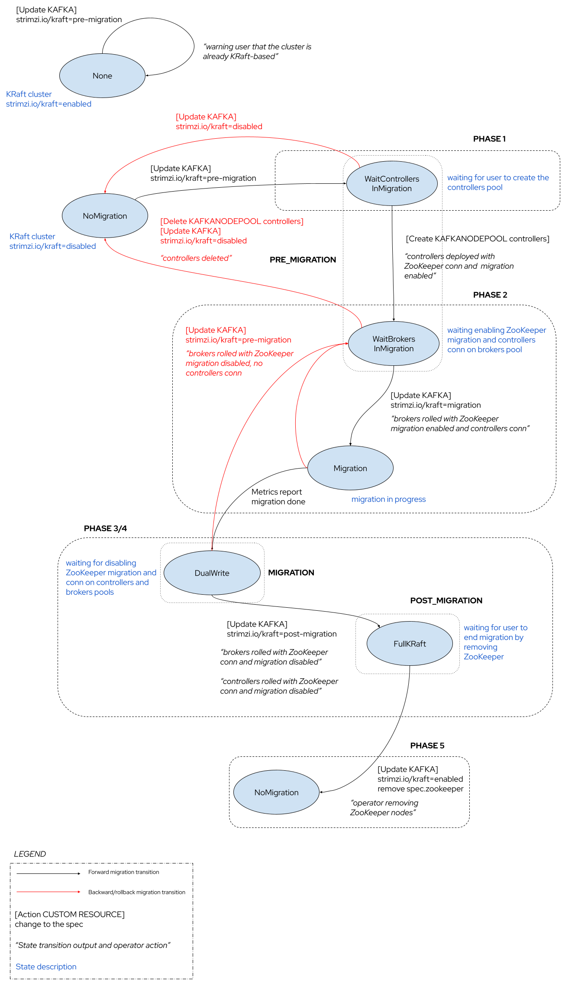

# ZooKeeper to KRaft migration

This proposal is about enabling the Strimzi Cluster Operator to migrate a ZooKeeper-based Apache Kafka cluster to be KRaft-based.
The Strimzi Cluster Operator would allow the user to drive the migration process across multiple phases in a semi-automatic procedure.

## Current situation

Currently, the Strimzi Cluster Operator supports the deployment of KRaft-based Apache Kafka clusters only from scratch.
The KRaft support is still behind a `UseKraft` feature gate which also needs the `KafkaNodePools` one to work correctly.
Through the usage of one or more `KafkaNodePool` custom resources, alongside the main `Kafka` one, the user is able to define pools of brokers and KRaft controllers, taking ZooKeeper out of the picture.

It is not possible to migrate a ZooKeeper-based Apache Kafka cluster to be KRaft based.
If the user has an already deployed Apache Kafka cluster using a ZooKeeper ensemble for storing metadata, the Strimzi Cluster Operator has no support to migrate the running cluster to use a pool of KRaft controllers replacing the ZooKeeper nodes for the same purpose.

There is also no support to upgrade a KRaft-based Apache Kafka cluster to a newer version, but this missing piece is out of the scope for this proposal.

Furthermore, if the user creates one or more `KafkaNodePool` custom resources to deploy KRaft controllers, the operator itself just creates the controller nodes and restarts the Kafka brokers to use them. ZooKeeper is not used anymore but no proper migration takes place (from ZooKeeper to KRaft metadata). Because of KRaft and related migration from ZooKeeper not supported yet, this can drive to the following [issue](https://github.com/strimzi/strimzi-kafka-operator/issues/9108).

The ZooKeeper to KRaft migration implementation is defined by [KIP-866](https://cwiki.apache.org/confluence/display/KAFKA/KIP-866+ZooKeeper+to+KRaft+Migration).
The upstream Apache Kafka community documentation also provides a [ZooKeeper to KRaft Migration](https://kafka.apache.org/documentation/#kraft_zk_migration) guide showing how to run the procedure manually on your cluster.

One of the main points to highlight is that such a process doesn't support migration to a KRaft-based cluster running in "combined" mode:

* Cannot migrate from a ZooKeeper based configuration to a cluster with nodes hosting both controller and broker (so actually reducing the number of nodes by removing the ZooKeeper ones).
* The migration works by having ZooKeeper nodes to be replaced by new KRaft controller nodes.
* Supporting "combined" mode is actually one of the rejected [alternatives](https://cwiki.apache.org/confluence/display/KAFKA/KIP-866+ZooKeeper+to+KRaft+Migration#KIP866ZooKeepertoKRaftMigration-CombinedModeMigrationSupport) in KIP-866.

It means that the user environment should be sized to host more nodes running in parallel, because during the migration process both ZooKeeper nodes and KRaft controllers will be running.
The end of the migration will involve shutting down the ZooKeeper nodes reducing the resources consumption.

## Motivation

The KRaft mode has been declared to be production-ready since Apache Kafka 3.3 release by the Apache Kafka project. 
Anyway, there are still missing features as reported in the official [documentation](https://kafka.apache.org/documentation/#kraft_missing).
The ZooKeeper mode has been deprecated after the Apache Kafka 3.5 version was released while providing the migration process to KRaft mode as preview.
The coming Apache Kafka 3.6 release will have such a migration process supported as GA and the ZooKeeper mode will be supported until Apache Kafka 3.7 (January 2024) but removed after that.
Starting from Apache Kafka 4.0 (April 2024) only KRaft mode will be supported.

Based on the above Apache Kafka community plan, more details in [KIP-833](https://cwiki.apache.org/confluence/display/KAFKA/KIP-833%3A+Mark+KRaft+as+Production+Ready), the Strimzi project needs to be prepared to allow users to migrate their current clusters from running in ZooKeeper mode to KRaft mode.

## Proposal

### Prerequisites

An Apache Kafka cluster is running in ZooKeeper mode.
The cluster has to be migrated to use `KafkaNodePool`(s) first for running the brokers (ZooKeeper nodes are never part of pools).
Without them it’s not possible to deploy the new KRaft controllers (separated from the current Kafka brokers) as the first step of the migration.
So the prerequisite is to have the Kafka cluster still using ZooKeeper but running the Kafka brokers with `KafkaNodePool`(s).
The user can follow the procedure described [here](https://strimzi.io/docs/operators/latest/deploying#proc-migrating-clusters-node-pools-str) in the official documentation, in order to meet this prerequisite.

Before migrating to KRaft, the cluster must be upgraded to Kafka version minimum of 3.5.0 with `inter.broker.protocol.version` set to “3.5”.

### Migration

The migration process is semi-automatic which means having the user driving the process by interacting with the operator (mostly via annotations and custom resources creation/deletion) which is in charge to do the rest (i.e. nodes re-configuration, rolling, checking migration status, ...).

Assume the following prerequisites, with a ZooKeeper based Kafka cluster defined by:

* A `Kafka` custom resource.
* One or more `KafkaNodePool`(s) for running the ZooKeeper based brokers.

If the operator is not using KRaft by default nor has the `+UseKRaft` feature gate enabled, first step for the user would be enabling the `+UseKRaft` feature gate unless it’s already enabled by default in a new operator release (depending on which Strimzi version this proposal will land).
So the current operator may need to be upgraded to the new release.
In both cases, the operator is rolled, a new one starts and it’s able to handle the creation of new Apache Kafka clusters in KRaft mode but not migrating the old ZooKeeper based ones automatically.

Currently, the operator prints the following warning:

```shell
io.strimzi.operator.common.model.InvalidResourceException: Tha Kafka cluster my-cluster is invalid: [At least one KafkaNodePool with the controller role and at least one replica is required when KRaft mode is enabled]
```

This is because with KRaft mode enabled in the operator, the reconciled `Kafka` resource doesn’t have any controller nodes (in any pool).

The migration process can be also rolled back to ZooKeeper at any point before taking the KRaft controllers out of the migration mode.

### Finite State Machine (FSM)

The migration process can be described with a Finite State Machine (FSM).
The operator has a new `KRaftMigrationManager` component in charge of driving and tracking transitions in the FSM.
Transitioning across the states depends on the current state, stored in the `strimzi.io/kraft-migration-state` annotation on the `Kafka` custom resource, and the "input" represented by the user interaction with the operator through the `strimzi.io/kraft-migration` annotation to be applied on the `Kafka` custom resource.

The operator is the owner of the `strimzi.io/kraft-migration-state` annotation.
The user is in charge to use the `strimzi.io/kraft-migration` annotation to drive the migration.

The usage of the `strimzi.io/kraft-migration-state` annotation for tracking the migration state, and not using a dedicated field under `Kafka.status`, is to avoid a permanent API change (on the `Kafka` CRD) for a temporary process, which won't be used anymore when users will move all their current clusters from ZooKeeper to KRaft.

The possible values for the `strimzi.io/kraft-migration` annotation are `pre-migration|migration|post-migration` to represent the desired "direction" in the migration process:
 
* `pre-migration`: used at the very beginning of the migration process, it represents the intention to move into the phase where operator is waiting for the user to create the KRaft controllers pool in order to deploy the corresponding nodes with the ZooKeeper migration enabled. This value can be also used to rollback the migration progress, when still possible, to have brokers working again with ZooKeeper ensemble only.
* `migration`: to move the migration process forward with brokers configured with the ZooKeeper migration enabled and connected to the KRaft controllers, so that Apache Kafka migration component can run the actual metadata migration ending with the "dual write" mode where metadata are both written to ZooKeeper and KRaft. Brokers are also connected to both ZooKeeper nodes and KRaft controllers.
* `post-migration`: to finalize the migration by disabling the ZooKeeper migration on controllers and brokers, rolling the nodes, and finally having a full KRaft based cluster with ZooKeeper ensemble still running but out of the picture.

The state machine is described in the following diagram:



The following sections explain the states and transitions in details.
The "Phase"(s) reflect what is described in the official [ZooKeeper to KRaft Migration](https://kafka.apache.org/documentation/#kraft_zk_migration) guide in the Apache Kafka documentation but with the right degree of automation provided by the operator.
Also, the `PRE_MIGRATION`, `MIGRATION` and `POST_MIGRATION` dotted boxes correspond to the `ZkMigrationState` [enum values](https://github.com/apache/kafka/blob/trunk/metadata/src/main/java/org/apache/kafka/metadata/migration/ZkMigrationState.java#L32) from the Apache Kafka migration component.

#### Phase 1: Provisioning the KRaft controller quorum

Starting from a `NoMigration` (or null) state (with the `strimzi.io/kraft-migration-state` annotation missing), the user applies the `strimzi.io/kraft-migration: pre-migration` on the `Kafka` custom resource to make the operator aware of the migration intention.
The FSM moves to a `WaitControllersInMigration` state where the operator expects the user to create the KRaft controllers pool.
The user creates the `KafkaNodePool` custom resource containing the definition of the KRaft controllers which are going to replace the ZooKeeper nodes.
The operator creates and configures the controllers accordingly with the ZooKeeper migration flag and the connection to the ZooKeeper ensemble. 

```shell
# Enable the migration
zookeeper.metadata.migration.enable=true

# ZooKeeper client configuration
zookeeper.connect=<connection-to-zookeeper>
```

The operator has to wait for the KRaft controllers being ready, the quorum to be formed and leader elected, then the migration process moves to the state of waiting for brokers to register.

The FSM moves to a `WaitBrokersInMigration` state where the operator expects the user to ask for running the actual metadata migration.
It means the operator has to enable the ZooKeeper migration on the brokers pool in order to actually start the migration (Phase 2).

From this state it's still possible to not move forward with the migration.
The user can delete the `KafkaNodePool` custom resource containing the definition of the KRaft controllers and remove the `strimzi.io/kraft-migration` annotation from the `Kafka` custom resource.
The FSM moves back to the `NoMigration` state (or null) actually exiting from the migration process and the operator removes the `strimzi.io/kraft-migration-state` annotation from the `Kafka` custom resource.
There is nothing to do with the brokers which are still configured to work with the ZooKeeper ensemble only.

#### Phase 2: Enabling the migration on the brokers

In the `WaitBrokersInMigration` state, the operator expects the user to ask for running the actual metadata migration.
In order to start the actual migration, the brokers need to be connected to the KRaft controllers and have the ZooKeeper migration enabled.
The user annotates the `Kafka` custom resource running the current ZooKeeper based brokers with `strimzi.io/kraft-migration: migration`.
This annotation drives the operator to update the brokers' configuration with the ZooKeeper migration flag enabled and with the new KRaft controllers quorum connection information as well.

```shell
# KRaft controller quorum configuration
controller.quorum.voters=<voters>
controller.listener.names=CONTROLLER

# The controller.listener.name should also be added to listener.security.property.map
listener.security.protocol.map=PLAINTEXT:PLAINTEXT,CONTROLLER:PLAINTEXT

# Enable the migration
zookeeper.metadata.migration.enable=true

# ZooKeeper client configuration
zookeeper.connect=<connection-to-zookeeper>
```

Finally, the operator rolls the brokers.
After the rolling, the internal Apache Kafka migration component starts the actual metadata migration and the operator has to wait for it to be completed to move to the next phase.
Checking the migration progress can be done using some of the exposed migration metrics.
The FSM moves to `Migration` state first, while migration is ongoing, and finally to the `DualWrite` state.
In both states, the user can rollback the process by applying the `strimzi.io/kraft-migration: pre-migration` on the `Kafka` custom resource.
In this case, the operator configures the brokers with no ZooKeeper migration flag, and no KRaft controllers quorum connection information.
Finally, the operator rolls the brokers and wait for them to be ready again.
The FSM moves back to the `WaitBrokersInMigration`, so actually at the beginning of the Phase 2.

If the user doesn't rollback the migration, next step is to move brokers and controllers out of migration and using KRaft only in Phase 3/4.

#### Phase 3/4: Migrating brokers and controllers to full KRaft

In the `DualWrite` state, the operator expects the user desire to finalize the migration, having a full KRaft based cluster and ZooKeeper out of the picture.
The user applies the `strimzi.io/kraft-migration: post-migration` annotation to the `Kafka` custom resource.
The operator updates the brokers' configuration by removing the ZooKeeper migration flag and connection to the ZooKeeper ensemble.
It also has to replace the `broker.id` with `node.id`.

```shell
# replace broker.id with node.id
node.id=0

# Remove the migration enabled flag
# zookeeper.metadata.migration.enable=true

# Remove ZooKeeper client configuration
# zookeeper.connect=<connection-to-zookeeper>

# Don't set the IBP, KRaft uses "metadata.version" feature flag
# inter.broker.protocol.version=3.5
```

The operator rolls the brokers and waits for them to be ready again.
They are now connected to the KRaft controllers quorum only and not to the ZooKeeper ensemble anymore.

When brokers are rolled and ready again, the operator updates the controllers' configuration by removing the ZooKeeper migration flag and connection to the ZooKeeper ensemble.

```shell
# Disable the migration
# zookeeper.metadata.migration.enable=true

# Remove ZooKeeper client configuration
# zookeeper.connect=<connection-to-zookeeper>
```

Finally, the operator rolls the controllers and wait for them to be ready again.
They are now disconnected from the ZooKeeper ensemble which is totally out of the picture.
The FSM moves to the `FullKRaft` state and ZooKeeper is not used anymore.

Before completing the migration, the `DualWrite` state is also the last opportunity for the user to rollback the migration process by applying the `strimzi.io/kraft-migration: pre-migration` on the `Kafka` custom resource.
In this case, the operator configures the brokers with no ZooKeeper migration flag, and no KRaft controllers quorum connection information.
Finally, the operator rolls the brokers and wait for them to be ready again.
The FSM moves back to the `WaitBrokersInMigration`, so actually at the beginning of the Phase 2.

#### Phase 5: Removing ZooKeeper

At this point the ZooKeeper ensemble is out of the picture, still running but not used anymore.
In the `FullKRaft` state, the operator expects the user to finalize the migration by removing ZooKeeper.
The user removes the `spec.zookeeper` on the `Kafka` custom resource so that the operator can delete the ZooKeeper nodes.
The FSM moves back to a `NoMigration` state (or null) and the operator removes the `strimzi.io/kraft-migration-state` annotation from the `Kafka` custom resource.

### Metrics

During ZooKeeper to KRaft migration, there are some metrics that could be useful to check the status in each of the phases.
More details in the [“Metrics”](https://cwiki.apache.org/confluence/display/KAFKA/KIP-866+ZooKeeper+to+KRaft+Migration#KIP866ZooKeepertoKRaftMigration-Metrics) section of KIP-866.

The most interesting and useful ones are:

| MBean                                                             | Description                                                                                                                        |
|-------------------------------------------------------------------|------------------------------------------------------------------------------------------------------------------------------------|
| kafka.controller:type=KafkaController,name=MetadataType           | An enumeration of: ZooKeeper (1), KRaft (2), or Dual (3). The active controller reports this.                                      |
| kafka.controller:type=KafkaController,name=MigratingZkBrokerCount | A count of ZK brokers that are registered with KRaft and ready for migration. This will only be reported by the active controller. |
| kafka.controller:type=KafkaController,name=ZkMigrationState       | An enumeration of the possible migration states the cluster can be in. This is only reported by the active controller.             |

They could be used the following way:

* `MetadataType`: to understand if the active controller is not in the "dual write" mode anymore (keeping metadata in both ZooKeeper and KRaft) and also out of ZooKeeper, keeping metadata only as KRaft.
* `MigratingZkBrokerCount`: to understand when the migration is starting because after creating the KRaft controllers and forming the quorum, they will "wait for brokers" (beginning of Phase 2). It happens when brokers are switched to the migration mode. Having all brokers registered means migration was started/is going to start.
* `ZkMigrationState`: to get the actual status of the migration. More details [here](https://github.com/apache/kafka/blob/trunk/metadata/src/main/java/org/apache/kafka/metadata/migration/ZkMigrationState.java).

The Kafka Agent could expose a `/kraft-migration` endpoint providing some of/all the metrics above (in JSON format) which are useful during the automated migration process, in order to allow the operator to understand when a phase is completed and the user can drive to the next one.

## Affected/not affected projects

The Strimzi Cluster Operator is the only project affected by this proposal.
Its logic needs to be updated in order to be able to handle the described procedure and running the migration.
No other projects in the Strimzi ecosystem are impacted by this proposal.

## Compatibility

This proposal is not going to break any backward compatibility.
The described procedure is new and doesn't change the Strimzi Cluster Operator behavior when the `strimzi.io/kraft-migration` annotation is not used.
The `strimzi.io/kraft-migration-state` annotation is also new and doesn't have any impact on previous operator versions.

## Rejected alternatives

During the first pass of the proposal review, the following migration FSM was rejected as proposal.


It was based on using two different annotations:

* `strimzi.io/run-kraft-migration`: to be applied on the `Kafka` custom resource with `true|false` values to start/end the overall migration process.
* `strimzi.io/kraft-migration`: to be applied on the `KafkaNodePool`(s) custom resource with `dual|kraft|zk` values to represent the desired "direction" in the migration process by the user:
  * `dual`: allows to move the migration process forward to reach the point of the "dual-write" with KRaft controllers deployed but with metadata written to both ZooKeeper and KRaft. Brokers are also connected to both ZooKeeper nodes and KRaft controllers.
  * `kraft`: allows to move the migration process forward from the "dual-write" to the end of the migration with ZooKeeper out of the picture.
  * `zk`: allows to move the migration process back, when still possible, to have brokers working again with ZooKeeper ensemble only.

It was rejected after the agreement of having more automation on rolling nodes and less user involvement.
It also had more complexity and a corresponding issue in case the user applies the `strimzi.io/kraft-migration` annotation only on some of the brokers pool and not all of them, so actually leaving some brokers out of the migration process.