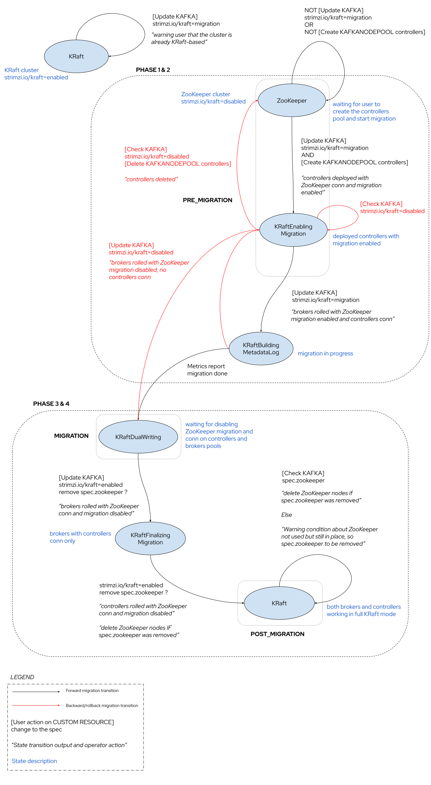
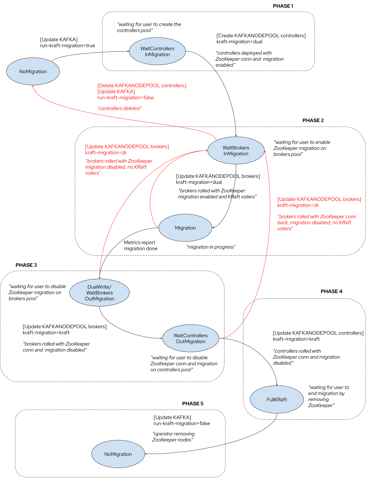
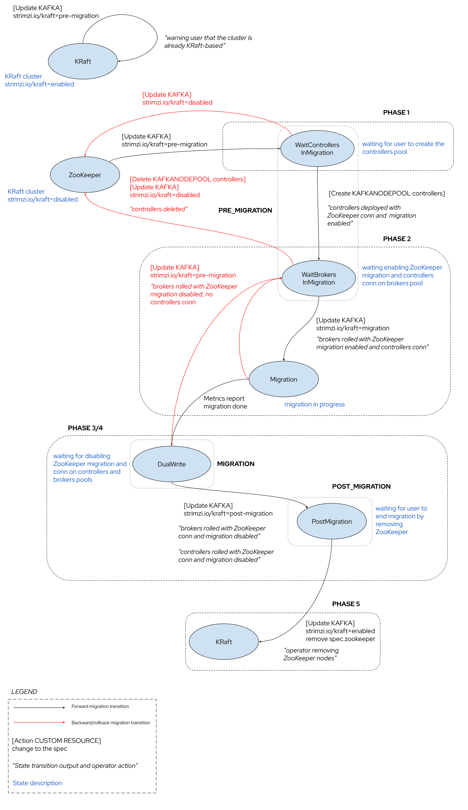

# ZooKeeper to KRaft migration

This proposal is about enabling the Strimzi Cluster Operator to migrate a ZooKeeper-based Apache Kafka cluster to be KRaft-based.
The Strimzi Cluster Operator would allow the user to drive the migration process across multiple phases in a semi-automatic procedure.

## Current situation

Currently, the Strimzi Cluster Operator supports the deployment of KRaft-based Apache Kafka clusters only from scratch.
The KRaft support is still behind a `UseKraft` feature gate which also needs the `KafkaNodePools` one to work correctly.
Through the usage of one or more `KafkaNodePool` custom resources, alongside the main `Kafka` one, the user is able to define pools of brokers and KRaft controllers, and create a fresh cluster that doesn't depend on ZooKeeper.

It is currently not possible to migrate a ZooKeeper-based Apache Kafka cluster to be KRaft-based.

There is also no support to upgrade a KRaft-based Apache Kafka cluster to a newer version, but this missing piece is out of the scope for this proposal.

Furthermore, if the user creates one or more `KafkaNodePool` custom resources to deploy KRaft controllers, the operator itself just creates the controller nodes and restarts the Kafka brokers to use them. ZooKeeper is not used anymore but no proper migration takes place (from ZooKeeper to KRaft metadata). Because KRaft and related migration from ZooKeeper is not supported yet, this leads to the following [issue](https://github.com/strimzi/strimzi-kafka-operator/issues/9108).

The ZooKeeper to KRaft migration implementation is defined by [KIP-866](https://cwiki.apache.org/confluence/display/KAFKA/KIP-866+ZooKeeper+to+KRaft+Migration).
The upstream Apache Kafka community documentation also provides a [ZooKeeper to KRaft Migration](https://kafka.apache.org/documentation/#kraft_zk_migration) guide showing how to run a procedure manually on a cluster not deployed via the Strimzi Cluster Operator.

The key points to highlight about this migration process: 

* Migration to a KRaft-based cluster in "combined" mode is not supported. Specifically, migrating from a ZooKeeper-based configuration to a cluster with nodes serving as both controllers and brokers, resulting in a reduction of nodes by removing the ZooKeeper nodes, is not possible.
* The migration works by having ZooKeeper nodes replaced by new KRaft controller nodes.
* Supporting "combined" mode is actually one of the rejected [alternatives](https://cwiki.apache.org/confluence/display/KAFKA/KIP-866+ZooKeeper+to+KRaft+Migration#KIP866ZooKeepertoKRaftMigration-CombinedModeMigrationSupport) in KIP-866.

It means that the user environment should be sized to host more nodes running in parallel, because during the migration process both ZooKeeper nodes and KRaft controllers will be running.
The end of the migration will involve shutting down the ZooKeeper nodes reducing the resources consumption.

After the migration, the users should be also able to migrate to use combined nodes for an additional reduction of resources, but that is out of the scope for this proposal.
It is anyway not recommended for production workloads.

## Motivation

The KRaft mode has been declared to be production-ready since Apache Kafka 3.3 release by the Apache Kafka project. 
Despite this, there are still missing features as reported in the official [documentation](https://kafka.apache.org/documentation/#kraft_missing).
The ZooKeeper mode has been deprecated after the Apache Kafka 3.5 version was released while providing the migration process to KRaft mode as preview.
The coming Apache Kafka 3.6 release will have such a migration process supported as GA and the ZooKeeper mode will be supported until Apache Kafka 3.7 but removed after that.
Starting from Apache Kafka 4.0 only KRaft mode will be supported.

Based on the above Apache Kafka community plan, more details in [KIP-833](https://cwiki.apache.org/confluence/display/KAFKA/KIP-833%3A+Mark+KRaft+as+Production+Ready), the Strimzi project needs to be prepared to allow users to migrate their current clusters from running in ZooKeeper mode to KRaft mode.

## Proposal

### Prerequisites

In order to start the ZooKeeper to KRaft migration, the following prerequisites should be met:

* A Strimzi-managed Apache Kafka cluster running in ZooKeeper mode.
* Running at Kafka 3.5.0 or higher and with `inter.broker.protocol.version` set to 3.5 or higher.
* Configured to use one or more node pools, with `KafkaNodePool` custom resources, all with the `broker` role.
* No existing node pool(s) which include the `controller` role.
* If the Topic Operator is used, the `UnidirectionalTopicOperator` feature gate has to be enabled since the old Bidirectional Topic Operator does not work in the KRaft mode.
* The `UseKRaft` feature gate should be enabled (explicitly, or via it being beta status).

If the cluster is not configured to use node pools to run brokers, the user can follow the procedure described [here](https://strimzi.io/docs/operators/latest/deploying#proc-migrating-clusters-node-pools-str) in the official documentation, in order to meet such a prerequisite.

### Migration

The user controls the process by interacting with the `Kafka` and `KafkaNodePool` custom resources.
The cluster operator (mostly via annotations and custom resources creation/deletion) performs the necessary operations: node re-configuration, node rolling, checking migration status, etc.
The migration process can be rolled back to ZooKeeper at any point before taking the KRaft controllers out of the migration mode.

### Finite State Machine (FSM)

The migration process can be described with a Finite State Machine (FSM).
Transitioning across the states depends on the current state and "input" from the user.

The current state is stored in the `Kafka.status.metadataState` field updated by the operator depending on the transition in the FSM.

> NOTE: the `Kafka.status.metadataState` field for storing the migration current state would be dropped when releasing `v1` API. It's anyway going to be used just for a transitioning period until community users will migrate all their clusters to be KRaft-based.

The user "input" is represented by the user interaction with the operator through the `strimzi.io/kraft` annotation to be applied on the `Kafka` custom resource.
Currently, the `strimzi.io/kraft` annotation is already used to specify a ZooKeeper-based cluster by using `disabled` as value or a KRaft-based cluster by using `enabled`.
The new `migration` value is added and used by the user to start the migration process which is automated by the operator taking the following actions:

* deploy the controllers, configured with the ZooKeeper migration enabled, through the `KafkaNodePool` custom resources with the `role: controller` provided by the user.
* roll the brokers, configured with the ZooKeeper migration enabled and connected to the newly created controllers.
* run the actual metadata migration by the Apache Kafka migration component.

Furthermore, the already available annotation values are used as follows:

* `enabled` to finalize the migration by disabling the ZooKeeper migration and removing the ZooKeeper connection information on controllers and brokers, rolling the nodes, and finally having a full KRaft-based cluster with ZooKeeper ensemble still running but not used by brokers anymore.
* `disabled` to rollback the migration process, when still possible, to have brokers working again with the ZooKeeper ensemble only.

Other "inputs" for the FSM are represented by:

* the Kafka migration metrics checked by the operator during the actual metadata migration from ZooKeeper to KRaft.
* the readiness of nodes (controllers or brokers) after deploying or rolling them, depending on the step in the process.

The state machine is described in the following diagram:



The following sections explain the states and transitions in details.
The phases reflect what is described in the official [ZooKeeper to KRaft Migration](https://kafka.apache.org/documentation/#kraft_zk_migration) guide in the Apache Kafka documentation but with the right degree of automation provided by the operator.
Also, the `PRE_MIGRATION`, `MIGRATION` and `POST_MIGRATION` dotted boxes correspond to the `ZkMigrationState` [enum values](https://github.com/apache/kafka/blob/trunk/metadata/src/main/java/org/apache/kafka/metadata/migration/ZkMigrationState.java#L32) from the Apache Kafka migration component.

In order to make the process clearer as much as possible, each phase is described by:

* _Preconditions_: conditions that should be met (i.e. current state in the migration FSM) in order to have the operator taking actions on a trigger.
* _Trigger_: what makes the operator actions to run only with verified preconditions.
* _Actions_: what the operator does when preconditions are met (i.e. nodes configuration, rolling, ...) together with things that could be observable during actions (i.e. Kafka metrics changes).
* _Status changes_: how the FSM changes status when the actions are completed.

#### Already running KRaft-based clusters

**_Preconditions_**

The Apache Kafka cluster is running in KRaft mode, so the `strimzi.io/kraft: enabled` annotation is already applied on the `Kafka` custom resource.
The FSM is in the `KRaft` state (as per `Kafka.status.metadataState` field).

**_Trigger_**

The user applies the `strimzi.io/kraft: migration` annotation on the `Kafka` custom resource.

**_Actions_**

The operator starts a reconciliation and updates the `Kafka.status` by adding a warning condition about the cluster being already KRaft-based, so no migration is possible.
The current reconciliation ends.

**_Status changes_**

The FSM stays in the `KRaft` state.
The `Kafka.status` keeps the warning condition, on each subsequent reconciliation, until the user re-applies the `strimzi.io/kraft: enabled` annotation.

#### Phase 1 and 2: Provisioning the KRaft controller quorum, enabling the migration on the brokers or Rollback

At the beginning of this phase, we expect the user to start the pre-migration for the current ZooKeeper-based cluster.

**_Preconditions_**

The Apache Kafka cluster is running in ZooKeeper mode, so the `strimzi.io/kraft: disabled` annotation is already applied on the `Kafka` custom resource.
The FSM is in the `ZooKeeper` state (as per `Kafka.status.metadataState` field) and it keeps staying in this state until the user applies the `strimzi.io/kraft: migration` annotation on the `Kafka` custom resource, and creates the `KafkaNodePool` custom resources(s) for the KRaft controllers.

**_Trigger_**

The user creates the `KafkaNodePool` custom resource(s) containing the definition of the KRaft controllers which are going to replace the ZooKeeper nodes.
The user sets the `strimzi.io/kraft: migration` annotation on the `Kafka` custom resource. 

**_Actions_**

The operator starts a reconciliation and, via the `KafkaReconciler` component, creates and configures the controllers accordingly with the ZooKeeper migration flag and the connection to the ZooKeeper ensemble.
The controllers are automatically created with the following configuration (the user cannot set them manually).

```shell
# Enable the migration
zookeeper.metadata.migration.enable=true

# ZooKeeper client configuration
zookeeper.connect=<connection-to-zookeeper>
```

The operator waits for the KRaft controllers being ready, the quorum to be formed and leader elected, then the migration process moves to the state of waiting for brokers to register.

**_Status changes_**

The FSM moves to a `KRaftEnablingMigration` state to continue the pre-migration by configuring and rolling the brokers with the ZooKeeper migration enabled and connected to the newly created KRaft controllers.
This state is useful if the operator crashes and it needs to recover correctly on startup, not deploying controllers but continuing with rolling brokers.

---

When the controllers are deployed, the operator can proceed the reconciliation by configuring and rolling brokers.

**_Preconditions_**

The FSM is in the `KRaftEnablingMigration` state (as per `Kafka.status.metadataState` field).
The the `strimzi.io/kraft: migration` annotation is already applied on the `Kafka` custom resource.
The controllers are up and running and ready with the ZooKeeper migration enabled.

**_Trigger_**

The operator just finished to deploy the controllers and they are ready or it's restarting after a crash while rolling the brokers.

**_Actions_**

During the current reconciliation and, via the `KafkaReconciler` component, the operator updates the brokers' configuration with the ZooKeeper migration flag enabled and with the new KRaft controllers quorum connection information as well.
More specifically, the brokers are automatically updated with the following configuration (the user cannot set them manually).

```shell
# KRaft controller quorum configuration
controller.quorum.voters=<voters>
controller.listener.names=CONTROLLER

# The controller.listener.name should also be added to listener.security.property.map
listener.security.protocol.map=PLAINTEXT:PLAINTEXT,CONTROLLER:PLAINTEXT

# Enable the migration
zookeeper.metadata.migration.enable=true

# ZooKeeper client configuration
zookeeper.connect=<connection-to-zookeeper>
```

Finally, the operator, via the `KafkaRoller`, rolls the brokers and waits for them to be ready.
The current reconciliation ends.
With brokers rolled, the internal Apache Kafka migration component starts the actual metadata migration, asynchronously, and the operator has to wait for it to be completed to move to the next phase.

**_Status changes_**

The FSM moves to `KRaftBuildingMetadataLog` state and stays there while migration is ongoing.

---

While migration is running, the operator has to check for its status and if it's finished and KRaft controllers are working in "dual write" mode.
This way the next step will be to move brokers and controllers out of migration and using KRaft only in Phase 3/4.

**_Preconditions_**

The FSM is in the `KRaftBuildingMetadataLog` state (as per `Kafka.status.metadataState` field).
The migration is ongoing.

**_Trigger_**

A periodic reconciliation is triggered.

**_Actions_**

The operator checks the Kafka migration metrics by using the Kafka Agent client in order to verify the status of the migration on the Apache Kafka cluster.
The metric to be used for the check is the `ZkMigrationState` which stays in `PRE_MIGRATION` while the actual migration is still going on and moves to `MIGRATION` when it's done. More details in the "Metrics" section.
The current reconciliation ends.

**_Status changes_**

If the migration finished, the FSM moves to the `KRaftDualWriting` state.
If the migration is still ongoing, the FSM stays in the `KRaftBuildingMetadataLog` state.

---

While migration is running, it's still possible to not move forward with finalizing the migration but rolling back instead.

**_Preconditions_**

The FSM is in the `KRaftBuildingMetadataLog` state (as per `Kafka.status.metadataState` field).
The migration is ongoing.

**_Trigger_**

The user can rollback the process by applying the `strimzi.io/kraft: disabled` annotation on the `Kafka` custom resource.

**_Actions_**

In this case, the operator starts a reconciliation and, via the `KafkaReconciler` component, configures the brokers with no ZooKeeper migration flag, and no KRaft controllers quorum connection information.
Finally, the operator rolls the brokers, via the `KafkaRoller`, and waits for them to be ready again.
The current reconciliation ends.

**_Status changes_**

The FSM moves back to the `KRaftEnablingMigration`, so actually at the beginning of the Phase 2.

---

When the controllers are configured with ZooKeeper migration enabled but the user has applied the `strimzi.io/kraft: disabled` annotation on the `Kafka` custom resource during the migration, the brokers are working with the ZooKeeper ensemble again and the user can rollback the overall process by deleting the controllers as well.

**_Preconditions_**

The `strimzi.io/kraft: disabled` annotation is already applied on the `Kafka` custom resource.
The FSM is in the `KRaftEnablingMigration` state (as per `Kafka.status.metadataState` field) and keep staying in this state until the user deletes the controllers pool(s) to rollback (or re-apply `strimzi.io/kraft: migration` to move forward with migration).

**_Trigger_**

The user deletes the `KafkaNodePool` custom resource(s) defining the controllers already running with ZooKeeper migration enabled.

**_Actions_**

In this case, the operator starts a reconciliation an deletes the pods running the controllers.
The current reconciliation ends.

**_Status changes_**

The FSM moves back to the `ZooKeeper`, so actually at the beginning of the Phase 1.
There is no more migration in progress and the Apache Kafka cluster is running in ZooKeeper mode.

#### Phase 3 and 4: Migrating brokers and controllers to full KRaft

At the beginning of this phase, the user has the last opportunity to rollback the migration process.

**_Preconditions_**

The FSM is in the `KRaftDualWriting` state (as per `Kafka.status.metadataState` field).

**_Trigger_**

The user can rollback the process by applying the `strimzi.io/kraft: disabled` annotation on the `Kafka` custom resource.

**_Actions_**

In this case, the operator starts a reconciliation and, via the `KafkaReconciler` component, configures the brokers with no ZooKeeper migration flag, and no KRaft controllers quorum connection information.
Finally, the operator rolls the brokers, via the `KafkaRoller`, and waits for them to be ready again.
The current reconciliation ends.

**_Status changes_**

The FSM moves back to the `KRaftEnablingMigration`, so actually at the beginning of the Phase 2.

---

If the user doesn't rollback the migration, next step is to finalize the migration process. This step is irreversible.

**_Preconditions_**

The FSM is in the `KRaftDualWriting` state (as per `Kafka.status.metadataState` field) and the operator expects the user desire to finalize the migration, having a full KRaft based cluster and ZooKeeper out of the picture.

**_Trigger_**

The user applies the `strimzi.io/kraft: enabled` annotation to the `Kafka` custom resource.

**_Actions_**

The operator starts a reconciliation and, via the `KafkaReconciler` component, updates the brokers' configuration by removing the ZooKeeper migration flag and connection to the ZooKeeper ensemble.
It also has to replace the `broker.id` with `node.id`.
More specifically, the brokers are automatically updated with the following configuration (the user cannot set them manually).

```shell
# replace broker.id with node.id
node.id=0

# Remove the migration enabled flag
# zookeeper.metadata.migration.enable=true

# Remove ZooKeeper client configuration
# zookeeper.connect=<connection-to-zookeeper>

# Don't set the IBP, KRaft uses "metadata.version" feature flag
# inter.broker.protocol.version=3.5
```

The operator rolls the brokers, via the `KafkaRoller`, and waits for them to be ready again.
They are now connected to the KRaft controllers quorum only and not to the ZooKeeper ensemble anymore.

**_Status changes_**

The FSM moves to a `KRaftFinalizingMigration` state to continue the finalization by configuring and rolling the controllers with the ZooKeeper migration disabled and not connected to ZooKeeper anymore.
This state is useful if the operator crashes and it needs to recover correctly on startup not rolling brokers again but continuing with rolling controllers.

---

**_Preconditions_**

The FSM is in the `KRaftFinalizingMigration` state (as per `Kafka.status.metadataState` field).
The the `strimzi.io/kraft: enabled` annotation is already applied on the `Kafka` custom resource.
The brokers are up and running with the ZooKeeper migration disabled and not connect to ZooKeeper ensemble anymore.

**_Trigger_**

The operator just finished to roll the brokers and they are ready or it's restarting after a crash.

**_Actions_**

During the current reconciliation and, via the `KafkaReconciler` component, the operator updates the controllers' configuration by removing the ZooKeeper migration flag and connection to the ZooKeeper ensemble.
More specifically, the controllers are automatically updated with the following configuration (the user cannot set them manually).

```shell
# Disable the migration
# zookeeper.metadata.migration.enable=true

# Remove ZooKeeper client configuration
# zookeeper.connect=<connection-to-zookeeper>
```

Finally, the operator rolls the controllers, via the `KafkaRoller`, and waits for them to be ready again.
They are now disconnected from the ZooKeeper ensemble which remain running but are no longer the source of truth for Kafka metadata.
If the user also removes the `spec.zookeeper` section from the `Kafka` custom resource, then the operator deletes the ZooKeeper nodes pods as well.
The current reconciliation ends.

**_Status changes_**

The FSM moves to the `KRaft` state and ZooKeeper is not used anymore.

### Metrics

During ZooKeeper to KRaft migration, there are some Kafka metrics that will be used to check the status in each of the phases.
More details in the [“Metrics”](https://cwiki.apache.org/confluence/display/KAFKA/KIP-866+ZooKeeper+to+KRaft+Migration#KIP866ZooKeepertoKRaftMigration-Metrics) section of KIP-866.

The most interesting and useful ones are:

| MBean                                                             | Description                                                                                                                        |
|-------------------------------------------------------------------|------------------------------------------------------------------------------------------------------------------------------------|
| kafka.controller:type=KafkaController,name=MetadataType           | An enumeration of: ZooKeeper (1), KRaft (2), or Dual (3). The active controller reports this.                                      |
| kafka.controller:type=KafkaController,name=MigratingZkBrokerCount | A count of ZK brokers that are registered with KRaft and ready for migration. This will only be reported by the active controller. |
| kafka.controller:type=KafkaController,name=ZkMigrationState       | An enumeration of the possible migration states the cluster can be in. This is only reported by the active controller.             |

They are used the following way:

* `MetadataType`: to understand if the active controller is not in the "dual write" mode anymore (keeping metadata in both ZooKeeper and KRaft) and also out of ZooKeeper, keeping metadata only as KRaft.
* `MigratingZkBrokerCount`: to understand when the migration is starting because after creating the KRaft controllers and forming the quorum, they will "wait for brokers" (beginning of Phase 2). It happens when brokers are switched to the migration mode. Having all brokers registered means migration was started/is going to start.
* `ZkMigrationState`: to get the actual status of the migration. More details [here](https://github.com/apache/kafka/blob/trunk/metadata/src/main/java/org/apache/kafka/metadata/migration/ZkMigrationState.java).

The Kafka Agent could expose a `/kraft-migration` endpoint providing some of/all the metrics above (in JSON format) which are useful during the automated migration process, in order to allow the operator to understand when a phase is completed and the user can drive to the next one.

## Affected/not affected projects

The Strimzi Cluster Operator is the only project affected by this proposal.
Its logic needs to be updated in order to be able to handle the described procedure and running the migration.
No other projects in the Strimzi ecosystem are impacted by this proposal.

## Compatibility

This proposal is not going to break any backward compatibility.
The described procedure is new and doesn't change the Strimzi Cluster Operator behavior when the `strimzi.io/kraft` annotation doesn't use the new added values specific to migration.
The `Kafka.status.metadataState` field is also new and doesn't have any impact on previous operator versions.

## Rejected alternatives

### Using different annotations

The following migration FSM was rejected as proposal.



It was based on using two different annotations:

* `strimzi.io/run-kraft-migration`: to be applied on the `Kafka` custom resource with `true|false` values to start/end the overall migration process.
* `strimzi.io/kraft-migration`: to be applied on the `KafkaNodePool`(s) custom resource with `dual|kraft|zk` values to represent the desired "direction" in the migration process by the user:
  * `dual`: allows to move the migration process forward to reach the point of the "dual-write" with KRaft controllers deployed but with metadata written to both ZooKeeper and KRaft. Brokers are also connected to both ZooKeeper nodes and KRaft controllers.
  * `kraft`: allows to move the migration process forward from the "dual-write" to the end of the migration with ZooKeeper out of the picture.
  * `zk`: allows to move the migration process back, when still possible, to have brokers working again with ZooKeeper ensemble only.

It was rejected after the agreement of having more automation on rolling nodes and less user involvement.
It also had more complexity and a corresponding issue in case the user applies the `strimzi.io/kraft-migration` annotation only on some of the brokers pool and not all of them, so actually leaving some brokers out of the migration process.

### Using additional `strimzi.io/kraft` annotation values for migration



It was based on using three different values for the `strimzi.io/kraft` annotation:

* `pre-migration`: used at the very beginning of the migration process, it represents the user's intention to move into the phase where operator is waiting for the user to create one or more `KafkaNodePool`(s) with the `role: controller` in order to deploy the corresponding nodes with the ZooKeeper migration enabled. This value can be also used to rollback the migration progress, when still possible, to have brokers working again with ZooKeeper ensemble only.
* `migration`: indicates the user's intention to move the migration process forward with brokers configured with the ZooKeeper migration enabled, and connected to both ZooKeeper nodes and the KRaft controllers, so that the Apache Kafka migration component can run the actual metadata migration ending with the "dual write" mode where metadata are both written to ZooKeeper and KRaft. Brokers are also connected to both ZooKeeper nodes and KRaft controllers.
* `post-migration`: indicates the user's intention to finalize the migration by disabling the ZooKeeper migration on controllers and brokers, rolling the nodes, and finally having a full KRaft-based cluster with ZooKeeper ensemble still running but not used by brokers anymore.

It was rejected after the agreement of having more automation on rolling nodes and less user involvement.
It also didn't reuse `enabled` and `disabled` values which could replace `pre-migration` and `post-migration` as per the current proposal.
