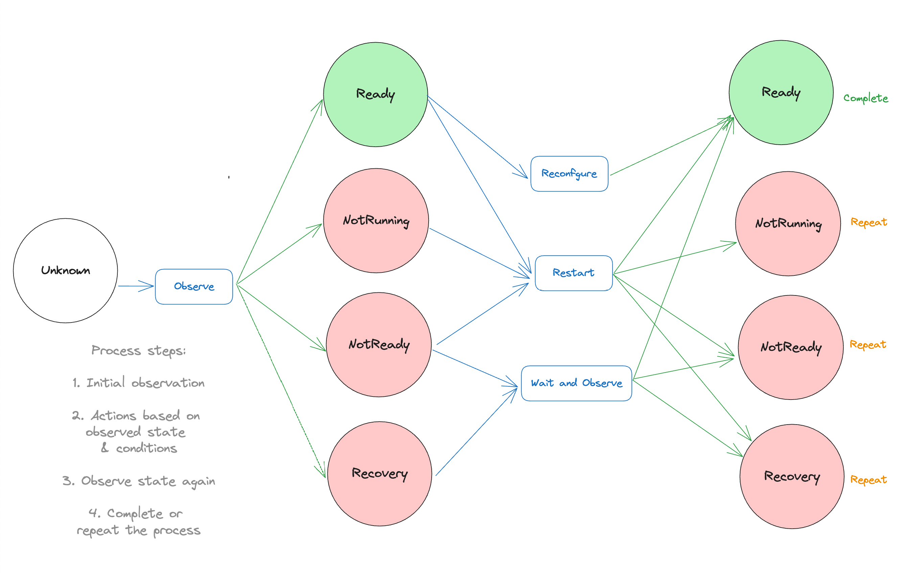

# Kafka Roller 2.0

## Current situation

The Kafka Roller is an internal Cluster Operator component that's responsible for coordinating the rolling restart or reconfiguration of Kafka pods when:
- non-dynamic reconfigurations needs to be applied
- update in Kafka CR is detected
- a TLS certificate is renewed
- pods have been [manually annotated](https://strimzi.io/docs/operators/latest/full/deploying#rolling_pods_manually_alternative_to_drain_cleaner) by the user for controlled restarts
- pod is stuck and has a pending update (e.g. not running with the desired version or configuration)
- Kafka broker is unresponsive to Kafka Admin connections

A pod is considered stuck if it is in one of following states:
- `CrashLoopBackOff`
- `ImagePullBackOff`
- `ContainerCreating`
- `Pending` and `Unschedulable`

### Known Issues

The existing KafkaRoller suffers from the following shortcomings:
- Although it is safe and straightforward to restart one broker at a time, this process is slow in large clusters ([related issue](https://github.com/strimzi/strimzi-kafka-operator/issues/8547)).
- It does not account for partition preferred leadership. As a result, there may be more leadership changes than necessary during a rolling restart, consequently impacting clients because they would need to reconnect everytime.
- Hard to reason about when things go wrong. The code is complex to understand and it's not easy to determine why a pod was restarted from logs that tend to be noisy.
- Slowing down rolling update is not possible and this feature has been requested from users. Being able to configure how long to wait between restart of brokers is useful for clusters that are extra sensitive to rolling updates. 

The following non-trivial fixes and changes are missing from the current KafkaRoller's KRaft implementation:
- KafkaRoller takes a long time to reconcile mixed nodes if they are all in `Pending` state. This is because a mixed node does not become ready until the quorum is formed and KafkaRoller waits for a pod to become ready before it attempts to restart other nodes. In order for the quorum to form, at least the majority of controller nodes need to be running at the same time. This is not easy to solve in the current KafkaRoller without introducing some major changes because it processes each node individually and there is no mechanism to restart multiple nodes in parallel. More information can be found [here](https://github.com/strimzi/strimzi-kafka-operator/issues/9426).

- The quorum health check relies on the `controller.quorum.fetch.timeout.ms` configuration, which is determined by the desired configuration values. However, during certificate reconciliation or manual rolling updates, KafkaRoller doesn't have access to these desired configuration values since they shouldn't prompt any configuration changes. As a result, the quorum health check defaults to using the hard-coded default value of `controller.quorum.fetch.timeout.ms` instead of the correct configuration value during manual rolling updates or when rolling nodes for certificate renewal.

## Motivation

Strimzi users have been reporting some of the issues mentioned above and would benefit from a new KafkaRoller that is designed to address the shortcomings of the current KafkaRoller.

The current code for KafkaRoller does not easily allow growth and adding new functionality such as batch rolling due to its complexity and nested conditions. It makes it challenging for users to debug and understand actions taken on their brokers when things go wrong and configure it correctly for their use cases. It is also not particularly easy to unit test which results in insufficient test coverage for many edge cases, making it challenging to refactor safely. 

As mentioned in `Known Issues` section, the current KafkaRoller still needs various changes and potentially more as we get more experience with KRaft and discover more issues. Adding these non trivial changes to a component that is very complex and hard to reason, is expensive and poses potential risks of introducing bugs because of tightly coupled logics and lack of testability.

Given the number of new features and changes related to KRaft, it is easiest to rewrite it from scratch rather than refactoring the existing component.  Rewriting with a more structured design, the process for evaluating nodes in various states would become more defined and easier to follow.

## Proposal

The objective of this proposal is to introduce a new KafkaRoller with more structured design resembling a finite state machine. The finite station machine design will make it easier to introduce the following features:
- Ability to roll brokers in parallel to speed up updates in large clusters.
- After restarting a broker, allow it to lead the partitions it is the preferred leader for. This will help reducing the impact on clients. 
- Ability to restart controller nodes in parallel when needed, to help recovering controller qourum.
- Add configurable wait time between restarts to allow slowing down rolling update.

The new roller will have the same behaviour of the current roller but with the additional features above, however, the implementation will be different following the finite state machine design. 

## State Machine

Nodes will be observed to transition into states and based on these states, actions will be taken on the nodes, which would result in another state transitions. The process will be repeated for each node until the desired state or the maximum number of attempts is reached. If all nodes reached the desired state, the reconciliation will succeed, otherwise it will fail. There are also some conditions that could result in early termination of the process and fail the reconciliation as well. This will be explained more later. 

Observation of a node is based on different sources such as Kubernetes API, KafkaAgent and Kafka Admin API. These sources will be abstracted so that state machine is not dependent on their specifics as long as it's getting the information it needs. The abstractions also enable much better unit testing.

### States
- UNKNOWN (initial/default)
- NOT_RUNNING 
- NOT_READY
- RECOVERING
- READY (desired state)

### Observation sources and information collected
- Kubernetes API
   - Pod is not Running but is one of CrashLoopBackOff, ImagePullBackOff, ContainerCreating and PendingAndUnschedulable
   - Pod is Running but lacking Ready status
   - Pod is Running and Ready

- KafkaAgent: It collects and expose Kafka metric [Broker State](https://github.com/apache/kafka/blob/3.7/metadata/src/main/java/org/apache/kafka/metadata/BrokerState.java)
   - Broker state is 2 (RECOVERY)
   - Broker state is not 2 (RECOVERY)

- Kafka Admin API
   - Leading all preferred partitions
   - Not leading all preferred partitions

### Actions
- `Observe` - This is a function to transition node's state.
- `Wait and observe` - This is to repeat `Observe` function until desired state or timeout is reached.
- `Restart` - Delete a pod via Kubernetes API and then `Wait and Observe`. This action is followed by preferred leader election trigger via Kafka Admin API for a broker node if it is not leading its preferred replicas yet.
- `Reconfigure` - Apply configuration updates via Kafka Admin API and then `Wait and Observe`.
- `No action` - This means we reached the desired state after taking one of the above actions or no action is needed.

### Observations -> States Map
 | KubeAPI | KafkaAgent | States |
 | :--------------- | :--------------- | :---------------
 | - | - | UNKNOWN
 | Pod is not Running | - | NOT_RUNNING 
 | Pod is Running but lacking Ready status | Broker state != 2 | NOT_READY 
 | Pod is Running but lacking Ready stats | Broker state == 2 | RECOVERING 
 | Pod is Running and Ready | - | READY

### States -> Actions Map
 | States | Actions 
 | :--------------- | :--------------- 
 | UNKNOWN | `Observe`
 | NOT_RUNNING | `Restart` OR `Wait and observe`
 | RECOVERING | `Wait and observe`
 | NOT_READY | `Restart` OR `Wait and observe`
 | READY | `Restart` OR `Reconfigure` OR `No action`

Some states map to multiple possible actions, but only one of them is taken based on the other conditions.

`UNKNOWN` nodes will be observed. This is the initial/default state before observation. 

`NOT_RUNNING` nodes will restarted only if they have `POD_HAS_OLD_REVISION`. This is because, if the node is not running at all, then restarting it likely won't make any difference unless the node is out of date. For example, if a pod is in pending state due to misconfigured affinity rule, there is no point restarting this pod again or restarting other pods, because that would leave them in pending state as well. If the user then fixed the misconfigured affinity rule, then we should detect that the pod has an old revision, therefore should restart it so that pod is scheduled correctly and runs.

`RECOVERING` nodes will be waited and observed only. A Kafka node can take a long time to become ready while performing log recovery and it's not easy to determine how long it might take. Therefore, it's important to avoid restarting the node during this process, as doing so would restart the entire log recovery, potentially causing the node to enter a loop of continuous restarts without becoming ready. Moreover, while a node is in recovery, no other node should be restarted, as this could impact cluster availability and affect the client.

`NOT_READY` nodes will be restarted if they have a restart reason and have not been restarted yet. If it is not ready after being restarted already, we don't want to restart any other nodes to avoid taking down more nodes. 

`READY` nodes will be restarted if they have a restart reason. If they don't have a restart reason but need to be reconfigured, they will be reconfigured. If no reconfiguration is needed, then no action will be taken on these nodes. 

### High level flow diagram describing the flow of the states

### State machine cycles 

As previously mentioned, the process for nodes will be repeated unless the maximum attempt is reached, in which case the reconciliation fails. The maximum number of attempts is hard-coded to 10 in the current roller. It will be the same for the new roller, however this value will be further broken down. The new roller will add 2 other hard-coded maximum attempt values. One is for maximum number of restarts and one is for maximum number of reconfiguration that can be taken on each node. This is because, we want to limit how many times a node can be restarted in each reconciliation because restarting a node 10 times is not productive. Also, in the current roller, if we failed to reconfigure a node, we immediately restart it. Reconfiguration can fail sometimes due to transitive error so it would be useful to retry the reconfiguration a few times before we decide to restart a node. 

In each reconciliation, number of attempts is tracked for each node. The number of attempts is how many times the overall process is repeated per node because of not reaching the desired state and the number of restarts is how many times a node is actually restarted. If any node has reached the maximum number of attempts or restarts, the reconciliation will fail. If the maximum number of reconfiguration is reached, then the node will marked to restart but will not fail the reconciliation. When a new reconcilation starts, these tracked number of actions taken on nodes will be reset.

The current roller also fails the reconciliation in the following situations:
- Cannot connect to KafkaAgent to check broker state metrics (KafkaAgent is crucial when determining safety before rolling nodes, so there is no point to try progress further, if we cannot connect to the KafkaAgent).
- Pod is stuck and does not have old revision (this will prevent the roller from restarting more nodes, which could result in making them stuck as well and bring down the entire cluster)

### Batch rolling

Batch rolling is one of the major features that the new roller is introducing. The proposed algorithm is to group broker nodes without common partitions together for parallel restart while maintaining availability. The algorithm does not take rack information into an account and the reason for this is explained in the `Rejected Alternatives` section. One thing about batching brokers without rack awareness is that batch size would likely descrease as the roller progresses. It may eventually drop to one, in which case, remaining brokers would be restarted one by one. However, the majority of brokers would likely to get restarted in parallel and that would still speed the rolling in large clusters significantly. Of course, this is up for a discussion, not the final decision. 

There is also an interesting future improvement that can make the batch rolling more effective optimizing with Cruise Control. This improvment will not be in the scope of this proposal but included in `Future Improvements` section.

For this feature, a new configuration `maxBrokerBatchSize` will be added. This is the maximum number of brokers that can be restarted in parallel. This will be set to 1 by default therefore the default behaviour remains same as the current roller, restarting one broker at a time. Another configuration added for this feature is `dryRunForBatchRolling`. This will allow batching nodes without restarting them in parallel. The purpose to let the operator, to verify the effectiveness of this feature in their clusters before enabling it. 

The batching algorithm only applies to broker nodes, however, the capability to roll nodes in parallel will be used for controller nodes as well. This is needed when a controller quorum is in a bad state. [#9426](https://github.com/strimzi/strimzi-kafka-operator/issues/9426) mentioned in the `Known Issues` section, is an example of why this feature is important for controller nodes. The new roller will check if there are multiple controller nodes not working affecting the quorum, and restart them in parallel to help recovering it.

### Configurability 

The following are the configuration options for the new roller. Some of them are existing configurations that are used in the same way as the current roller. The new configurations are marked in <b>bold</b>. If exposed to user, the user can configure it via `STRIMZI_` environment variables. Otherwise, the operator will set them to the default values:

| Configuration          | Default value | Exposed to user | Description                                                                                                                                                                                                                                                   |
|:-----------------------|:--------------|:----------------|:--------------------------------------------------------------------------------------------------------------------------------------------------------------------------------------------------------------------------------------------------------------|
| <b>maxRestartAttempts</b>     | 3             | No              | The maximum number of restart attempts per node before failing the reconciliation. This is checked against node's `numRestartAttempts`.                                                                                                               |
| <b>maxReconfigAttempts</b>    | 3             | No              | The maximum number of dynamic reconfiguration attempts per node before restarting the node. This is checked against node's `numReconfigAttempts`.                                                                                                                        |
| maxAttempts             | 10            | No              | The maximum number of times a node can be attempted after not reaching the desired state.  This is checked against the node's `numAttempts`.                                                                                                                      |
| operationTimeoutMs | 60 seconds    | Yes             | The maximum amount of time we will wait for nodes to transition to `READY` state after an action. This is already exposed to the user via environment variable `STRIMZI_OPERATION_TIMEOUT_MS`. |
| <b>maxBrokerBatchSize</b>  | 1             | Yes             | The maximum number of broker nodes that can be restarted in parallel. This will be exposed to the user via the new environment variable `STRIMZI_MAX_RESTART_BATCH_SIZE`.
| <b>dryRunForBatchRolling</b>  | false             | Yes             | If this is set to true as well as `maxBrokerBatchSize` is set to greater than 1, the batch rolling algorithm will be executed but will not restart the nodes in parallel. The batched nodes will only be logged. This conguration will be exposed to the user via the new environment variable `STRIMZI_DRY_RUN_BATCH_ROLLING`.
| <b>postRestartDelay</b>  | 0             | Yes             | Delay between restarts of nodes or batches. It's set to 0 by default, but can be adjusted by users to slow down the restarts. This will allow users to slow the rolling update.   
| <b>preferredLeaderElectionDelay</b>   | 10 seconds             | No             | Delay right after a node restart and before triggering partition leader election so that just-rolled broker is leading all the preferred replicas. This is to avoid situations where leaders moving to a newly started node that does not yet have established networking to some outside networks, e.g. through load balancers.

### Future improvement

In the future, we can optimize Cruise Control's `BrokerSetAwareGoal` to make the batch rolling more efficient when user enabled Cruise Control in their clusters. This goal operates at the level of broker sets, which may correspond to physical or logical boundaries like racks, data centres, availability zones or custom logical groupings defined by administrators. It ensures that replicas of a partition are not assigned to the same broker set by spreading them across sets as evenly as possible. The new roller could then restart brokers in the same set in parallel while maintaining availability of partitions. This goal can be used for both rack aware and non rack aware clusters, comparing to `RackAwareGoal` which relies on Kafka's built-in `broker.rack` property.

This solution still has the limitation mentioned in the `Rejected Alternatives` section, that we can't be certain that other tooling hasn't reassigned some replicas since the last rebalance. In this case, the proposed algorithm can be used to check that brokers in the same set have no common partitions. This can be discussed further in the future.

### Feature Gate

The switch from the old roller to the new roller should be controlled by a new feature gate called `UseNewKafkaRoller`.
With this feature gate disabled, the operator will continue using the old KafkaRoller.
With it enabled, the new roller will be used.
The following table shows the expected graduation of the feature gate:

| Phase | Strimzi versions       | Default state                                          |
|:------|:-----------------------|:-------------------------------------------------------|
| Alpha | 0.46, ?                | Disabled by default                                    |
| Beta  | ? , ?                  | Enabled by default                                     |
| GA    | ?, ?                   | Enabled by default (without possibility to disable it) |

Currently, I'm not sure what would be the feature gate timeline as it is subject to change based on the actual progress.
However, each phase probably will take at least 2 releases. 

## Affected/not affected projects

This proposal affects only
the [`strimzi-kafka-operator`](https://github.com/strimzi/strimzi-kafka-operator).

## Compatibility

The new KafkaRoller introduced by this proposal will used only for KRaft based clusters. 
This proposal should have no impact on any existing Kafka clusters deployed with ZooKeeper. 
The purpose of this proposal is to maintain the same behaviour of the old roller with a finite state machine design while adding the new features.

## Rejected

- Why not use rack information when batching brokers that can be restarted at the same time?
When all replicas of all partitions have been assigned in a rack-aware way then brokers in the same rack trivially share no partitions, and so racks provide a safe partitioning. However nothing in a broker, controller or cruise control is able to enforce the rack-aware property therefore assuming this property is unsafe. Even if CC is being used and rack aware replicas is a hard goal we can't be certain that other tooling hasn't reassigned some replicas since the last rebalance, or that no topics have been created in a rack-unaware way.