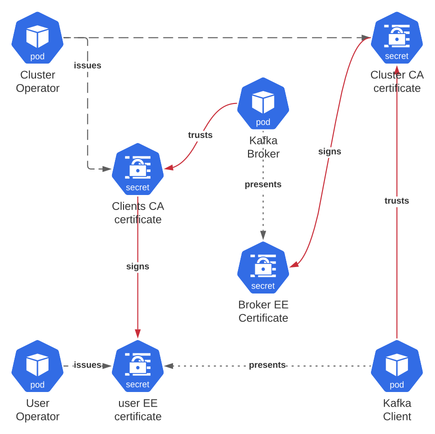
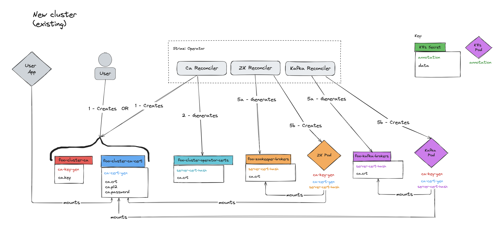
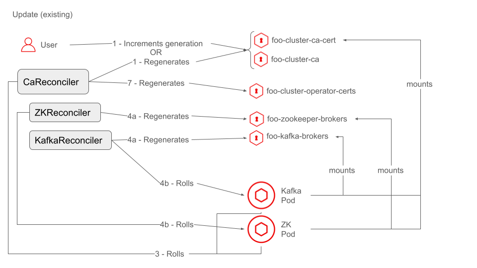
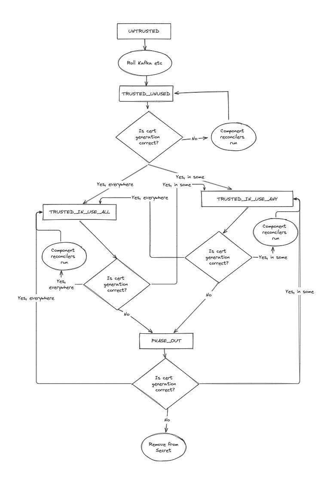
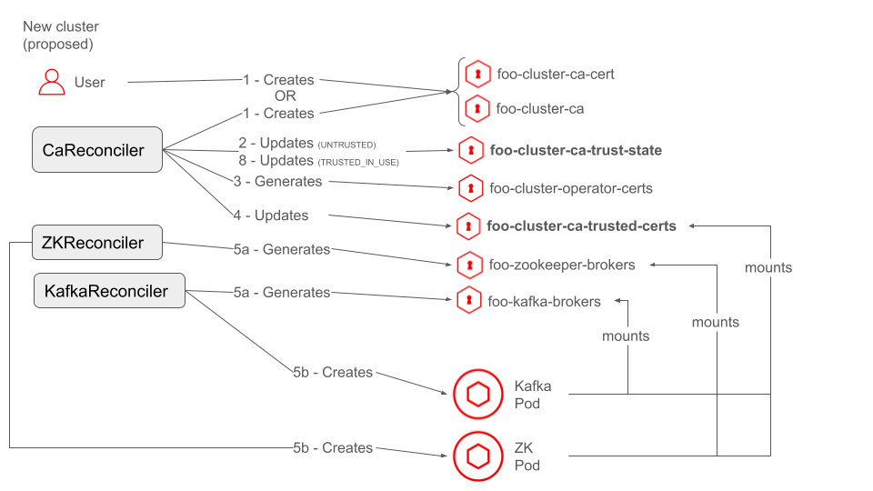
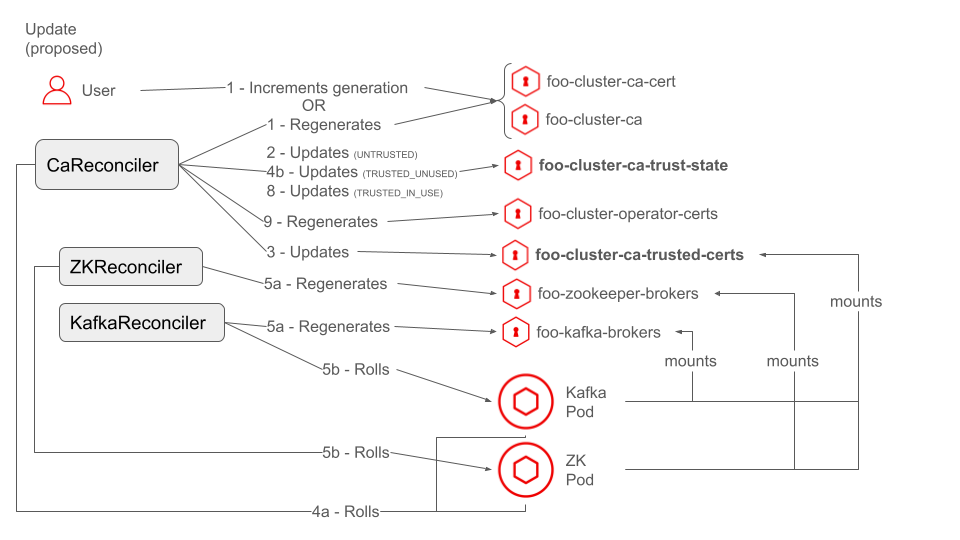

# Decouple CA certificate management from end-entity certificate management

This proposal aims to decouple the management of the cluster CA certificate from the rolling out of trust of the CA certificate to components in a Strimzi cluster.

## Current situation

To provide a secure, TLS-enabled setup by default when deploying Kafka clusters, Strimzi integrated its own CA operations into the Cluster Operator.
The Cluster Operator accomplishes this by using `openssl` to generate self-signed root CA certificates and private keys which it then uses to directly sign end-entity (EE) certificates.
This CA certificate has zero pathlen, which means it cannot sign any intermediate CA.
A _cluster CA_  and _clients CA_ are generated.
These CAs are only used for Kafka clusters and a unique instance of each CA is used for each Kafka cluster.
The cluster CA issues certificates for the following Strimzi components:
* ZooKeeper nodes
* Kafka nodes
* Cluster, User and Topic operators
* Cruise Control
* Kafka Exporter

The clients CA issues certificates for user applications using the User Operator, or through another external mechanism chosen by the user.

As shown in Fig 1, the cluster CA certificate is added to the trust stores of Strimzi components.
This ensures that, for example, ZooKeeper nodes trust each other's certificates as well as the certificates of brokers, and brokers trust certificates issued to other brokers.

> 
> 
> Fig 1: Cluster CA certificate and component relationships
>
> In the diagram, the red lines show trust.
> For example, because the Kafka broker trusts the Cluster CA certificate,
> and the Cluster CA certificate signed the ZK EE certificate
> the broker will trust the ZK EE certificate presented by the ZK node
> during TLS handshake.

The cluster CA certificate also needs to be trusted by Kafka clients connecting to the cluster so that clients trust the certificates presented by the brokers.
The clients CA certificate is added to the broker trust stores too, so that the brokers will trust certificates issued to Kafka client applications that they present to brokers when mutual TLS is enabled on a listener.
Similar to Fig 1, Fig 2 shows the lines of trust, but for the Clients CA certificate.

> 
> 
> Fig 2: Clients CA certificate and component relationships

### Existing Kubernetes Secrets

Strimzi currently uses the following Kubernetes Secrets to store the CA certificates and private keys:
* <CLUSTER_NAME>-cluster-ca-cert for the Cluster CA certificate
* <CLUSTER_NAME>-cluster-ca for the Cluster CA private key
* <CLUSTER_NAME>-clients-ca-cert for the Clients CA certificate
* <CLUSTER_NAME>-clients-ca for the Clients CA private key

The above Kubernetes Secrets are also used as the mechanism for users to inform Strimzi of their own CA private key and public certificate, in the use case where Strimzi is not managing the CA.
The *-ca-cert Kubernetes Secrets also have the purpose of providing users with the certificates they need their applications to trust in order to connect to Kafka.
Due to these two additional uses, the above Kubernetes Secrets are effectively part of the Strimzi public API.

Strimzi currently uses the following Kubernetes Secrets to store server certificates (signed by the cluster CA) that components will present to clients:
* <CLUSTER_NAME>-kafka-brokers for Kafka brokers
* <CLUSTER_NAME>-zookeeper-nodes for ZooKeeper nodes

Strimzi currently uses the following Kubernetes Secrets to store client certificates (signed by the cluster CA) that components will present to Kafka or ZooKeeper when making requests:
* <CLUSTER_NAME>-cluster-operator-certs for the Cluster Operator
* <CLUSTER_NAME>-entity-topic-operator-certs for the Topic Operator
* <CLUSTER_NAME>-entity-user-operator-certs for the User Operator
* <CLUSTER_NAME>-kafka-exporter-certs for the Kafka Exporter
* <CLUSTER_NAME>-cruise-control-certs for Cruise Control

### Existing Kubernetes Secret and Pod Annotations

Strimzi uses both the notion of a "generation" and hashes when keeping track of certificates.

A generation is associated with a specific certificate or private key for either the Cluster or Clients CA.
If Strimzi is managing the CA, it increments the generation each time the certificate is renewed or the private key is replaced (so the corresponding certificate is regenerated as well).
If the user is managing the CA, they are responsible for incrementing the generation.
Strimzi uses the generations during the reconcile loop to track the state of trust and usage of the CA private key and public certificate (as described in the example flows below).

Strimzi uses the following annotations on the <CLUSTER_NAME>-<cluster/clients>-ca-cert and <CLUSTER_NAME>-<cluster/clients>-ca Kubernetes Secrets:
* strimzi.io/ca-cert-generation to indicate the generation of the Cluster CA or Client CA certificate in the Kubernetes Secret
* strimzi.io/ca-key-generation to indicate the generation of the Cluster CA or Client CA private key in the Kubernetes Secret

Strimzi uses the following annotations on Kubernetes Pods and the <CLUSTER_NAME>-kafka-brokers and <CLUSTER_NAME>-zookeeper-nodes Kubernetes Secrets to indicate the generation of the Cluster CA certificate used to sign the certificates that are either stored in the Kubernetes Secret, or presented by the Kubernetes Pod:
* strimzi.io/cluster-ca-cert-generation for certificates signed by the Cluster CA
* strimzi.io/clients-ca-cert-generation for certificates signed by the Clients CA

Strimzi uses the following annotation on Kubernetes Pods to indicate the generation of the Cluster CA private key used to sign the cluster CA certificate that the component running in that Kubernetes Pod currently trusts:
* strimzi.io/cluster-ca-key-generation

Strimzi uses the following annotation on the Kafka and ZooKeeper nodes to store the full SHA1-hash of the certificate the nodes present to clients:
* strimzi.io/server-cert-hash

### Existing reconcile flow

The reconcile loop for certificates using the Cluster CA is split over a couple of classes that run one after another in the following order:
1. CaReconciler
2. ZooKeeperReconciler
3. KafkaReconciler
4. EntityOperatorReconciler
5. CruiseControlReconciler
6. KafkaExporterReconciler

Currently, as part of a reconciliation loop, the CaReconciler handles four things:
1. Verifying the Cluster CA (and Client CA) Kubernetes Secrets. For each CA:
   1. If Strimzi is managing the CA, it either creates or renews the CA certificate and key and stores them in the Kubernetes Secrets listed above.
   2. If Strimzi is **not** managing the CA, it checks that the Kubernetes Secrets for the CA certificate and private key are present in the cluster.
2. Reconciles the <CLUSTER_NAME>-cluster-operator-certs Kubernetes Secret used by the cluster operator's Admin client when connecting to Kafka and ZooKeeper.
   1. This only occurs if all pods in the cluster have the correct strimzi.io/cluster-ca-key-generation annotation, meaning the Cluster CA certificate that is being used to sign the certificate that will be put into the Kubernetes Secret is already trusted by all components.
3. Maybe triggering a rolling update of the ZooKeeper and Kafka nodes, and the EntityOperator, Kafka Exporter and Cruise Control pods, (if they exist) to trust a new Cluster CA certificate. This only happens if either:
   1. The Cluster CA key got replaced during the current reconciliation, or
   2. One or more Kubernetes Pods have the wrong strimzi.io/cluster-ca-key-generation annotation, meaning they do not trust the latest Cluster CA certificate.
      This is only expected to occur if the operator previously updated the Cluster CA key and a rolling update was started during a previous reconciliation, but it was not completed.
4. Maybe deleting an old CA certificate if it is no longer used
   1. This only occurs if all Kubernetes Pods in the cluster have the correct strimzi.io/cluster-ca-cert-generation annotation, meaning all the component certificates have been signed by the latest Cluster CA certificate.

ZooKeeperReconciler and KafkaReconciler classes:
1. Generate the certificates the Kafka and ZooKeeper nodes will present to clients (other ZK/Kafka nodes, the Cluster Operator, Kafka producer and consumers etc) and store them in the Kubernetes Secrets listed above, with the cluster-ca-cert-generation (and clients-ca-cert-generation for Kafka) annotation set to the current value passed in with the Cluster CA (and Clients CA).
2. Create/update the StrimziPodSet used for the nodes in the cluster and add the following annotations:
   1. cluster-ca-cert-generation set to the current values passed in with the Cluster CA.
   2. cluster-ca-key-generation set to the current values passed in with the Cluster CA.
   3. server-cert-hash set to the full SHA1-hash of the certificate that was generated.

EntityOperatorReconciler, CruiseControlReconciler and KafkaExporterReconciler generate the certificates they will use to authenticate with Kafka and ZooKeeper (and for Cruise Control, present to clients using its API) and store them in the Kubernetes Secrets listed above, with the cluster-ca-cert-generation set to the current value passed in with the Cluster CA.

### Example flows

When a new cluster is first created the flow is:

1. Either the user or the CaReconciler creates the Cluster CA certificate and key and stores them in the <CLUSTER_NAME>-cluster-ca-cert and <CLUSTER_NAME>-cluster-ca Kubernetes Secrets respectively.
2. The CaReconciler generates the Cluster Operator EE certificate (signed by the newly generated Cluster CA certificate) and stores it in the <CLUSTER_NAME>-cluster-operator-certs Kubernetes Secret.
3. The CaReconciler skips rolling the ZooKeeper and Kafka nodes, since they don't exist yet.
4. The CaReconciler skips deleting an old CA certificate, since there isn't one.
5. The component reconcilers (KafkaReconciler, ZooKeeperReconciler, EntityOperatorReconciler etc) generate their corresponding EE certificates (signed by the newly generated Cluster CA certificate), store them in Kubernetes Secrets and annotate the Kubernetes Secrets and Pods with the cert and key generations, and (for ZooKeeper and Kafka) the certificate hash.

> 
>
> Fig 3: New cluster create flow
> 
> The numbers in the diagram match the numbers in the full description of the steps.

When the Cluster CA private key is updated by the user, either by using the force-replace annotation, or the ca-cert-generation annotation:
1. If Strimzi is managing the Cluster CA, the CaReconciler regenerates the Cluster CAs certificate and key. The old certificate and key are kept in the respective Kubernetes Secret and renamed to ca-YYYY-MM-DDTHH-MM-SSZ.crt.
2. The CaReconciler skips updating the <CLUSTER_NAME>-cluster-operator-certs Kubernetes Secret (since the components still only trust the old CA certificate).
3. The CaReconciler rolls the ZooKeeper and Kafka nodes to trust the new CA certificates.
4. The CaReconciler skips deleting the old CA certificate, since the new CA certificate isn't fully used yet.
5. The ZooKeeper and Kafka reconcilers:
   1. Generate new certificates signed by the new CA key.
   2. Update the cluster-ca-cert-generation, cluster-ca-key-generation and server-cert-hash annotations on the StrimziPodSets.
   3. During their rolling update step, roll the Kubernetes Pods for ZooKeeper and Kafka to use the new certificates (this is triggered by diffing the server-cert-hash annotation).
6. The EntityOperator, CruiseControl and KafkaExporter reconcilers generate new certificates signed by the new CA key and roll the Kubernetes Pods to use the new certificates.
7. A new reconciliation starts.
8. The CaReconciler makes no changes to the Cluster CAs certificate and key.
9. The CaReconciler updates the <CLUSTER_NAME>-cluster-operator-certs Kubernetes Secret with a new certificate signed by the new CA certificate (since the Kafka and ZooKeeper Kubernetes Pods now have the strimzi.io/cluster-ca-cert-generation and strimzi.io/cluster-ca-key-generation matching the current Cluster CA and therefore the Cluster CA is fully trusted and used).
10. The CaReconciler skips rolling the ZooKeeper and Kafka nodes, since the CA is fully trusted.
11. The CaReconciler removes the old CA certificates and keys that have been named ca-YYYY-MM-DDTHH-MM-SSZ.crt.
12. The component reconcilers roll their Kubernetes Pods, since the Cluster CA passed in has a flag indicating certs have been removed.

> 
>
> Fig 4: Cluster CA private key update flow
> 
> The numbers in the diagram match the numbers in the full description of the steps.
> The diagram omits the EntityOperator, CruiseControl and KafkaExporter reconcilers, and the removal of trust of the old CA certificate and key.

The existing logic assumes a few things:
 - All certificates used by components (unless part way through a renewal) have been signed by the same root CA certificate.
 - The CaReconciler performs its reconciliation steps to (if required) either create or update the CA certificates and keys before the other reconcilers reconcile their resources, i.e. the CA certificate is already present when e.g. the KafkaReconciler starts.
 - There is a single Kubernetes Secret containing the Cluster CA certificate that is used by:
   - The Strimzi Cluster CA or users for storing the most recent CA certificate.
   - The components for mounting into the Kubernetes Pods and used as a Trust Store.
   - User owned Kafka applications as a Trust Store.

## Motivation

In future it would be beneficial if Strimzi can integrate with commonly deployed certificate management solutions, such as [cert-manager][cmio], or [Vault][vault], rather than managing the Cluster CA itself.
These solutions work by providing an API that can be used to request certificates from a particular issuer.

Integrating with these solutions requires a change in how things are managed. Specifically:
 - Strimzi cannot guarantee that the issuer will issue every certificate signed by the same root CA certificate. 
   - For example cert-manager will if possible include the CA certificate to trust when it issues the certificate (if the CA certificate is not a public one), however this is per certificate and not always provided.
   - Using those solutions therefore requires TLS peers to be able to trust multiple root CA certificates.
 - These solutions cannot be responsible for rolling updates to components like Kafka.
   - This means that end-entity certificate generation and the rollout of trust in the CA certificates referenced in those end-entity certificates, needs to be decoupled.
 - These solutions might take a varying amount of time to issue a certificate.
   - Since we do not know how long certificate issuance might take, we can't block the reconcile loop waiting for certificates to be issued.
   - This means it can't be assumed that e.g. the CA certificate is already present when the component reconcilers run (since it not be issued yet).
This would be highly valuable for organizations with compliance requirements with regard to certificates.

Currently, it is hard to integrate one of these certificate management solutions for a couple of reasons:
 - The state of certificates, particularly CA certificates is determined based on multiple different annotations and fields on internal Java objects.
   This makes it hard to comprehend the current state, particularly when doing a renewal and tricky to reason about edge cases that might occur.
 - The component reconcilers directly interact with the Java class that represents the Cluster CA.
   For example, this class contains methods not only to manage the CA certificate and private key, but also generate certificates for Strimzi components (like Cruise Control) and store state about renewals that happened during the current reconcile loop.
   This makes it hard to drop in an alternative to the existing Strimzi Cluster CA, since it's behaviour is relied upon throughout the reconcile loop.

This proposal describes changes to make it easier to reason about the current state of CA certificates and track the roll out of trust.

## Proposal

Strimzi should be updated to decouple the management of the cluster CA certificate, and the consumption of the CA certificate by components (such as ZooKeeper, Kafka and cluster operator).

To do this we will introduce a new Kubernetes Secret.
The new Kubernetes Secret, called <CLUSTER_NAME>-cluster-ca-trusted-certs (referred to from here onwards as trusted-certs Secret) is used to store all Cluster CA certificates that currently need trusting by the cluster and keep track of their current state with respect to issued end entity certificates.
The trusted-certs Secret is mounted onto Kubernetes Pods and used for their TrustStore.
This new Kubernetes Secret is separate from the <CLUSTER_NAME>-cluster-ca and <CLUSTER_NAME>-cluster-ca-cert Kubernetes Secrets that are used by Strimzi to store the latest CA certificate and key (or by the user when they are managing their own CA certificates), and by user applications as a Trust Store.
The cluster operator will update the trusted-certs Kubernetes Secret when it renews the cluster CA certificate (or observes that the user has renewed it).

Introducing this new Kubernetes Secret brings a couple of benefits:
* The existing Kubernetes Secrets used by the user or Strimzi to store the latest CA certificate (and by user applications as a Trust Store) are no longer directly mounted onto Strimzi's Kubernetes Pods.
  This allows Strimzi to more carefully manage when the latest CA certificate is trusted by components.
  If in future components are able to dynamically update their TrustStores, updating the Kubernetes Secret storing the CA certificate doesn't automatically update the CA certificate being trusted.
  This also means when integrating with a certificate management solution Strimzi doesn't need to reuse these Kubernetes Secrets, it can fetch certificates programmatically for example.
* It will be easier to reason about which CA certificates are in use/trusted, both as an end user when viewing the cluster, but also as a developer when reviewing the code.
  This is because currently the state is inferred by observing various Kubernetes annotations and Java class fields.

These benefits will also make it easier to evolve the management of CA certificates in future (see [Future changes](#future-changes)).

Non-goals of the proposal:
* This proposal does not change the management of Clients CA.
  Users can provide custom listener certificates, so allowing integration with a certificate management solution for the Clients CA doesn't bring as many benefits as it does for the Cluster CA.
* This proposal does not introduce integration with a certificate management solution.
  The aim of this proposal is to make it easier to allow this kind of integration in future, but assumes that the Cluster CA is still managed by Strimzi and (other than during renewal) there is a single Cluster CA certificate for the cluster.

### New trusted-certs Kubernetes Secret

A new Kubernetes Secret is introduced which is updated by the cluster operator in its role of managing the cluster (specifically which issued certificates are stored where and rolling pods to use/trust those certificates) to store CA certificates for consumption
by components, and to reflect whether the individual CA certificates are trusted and/or in use in the cluster
This Kubernetes Secret will be mounted into Kubernetes Pods to use a TrustStore.

```yaml
kind: Secret
metdata:
  name: <CLUSTER_NAME>-cluster-ca-trusted-certs # e.g. foo-cluster-ca-trusted-certs
data:
   ${fingerprint}.crt: <PEM encoded CA certificate>
   ${fingerprint}.state: ${state}
```

The `fingerprint` is the fingerprint/thumbprint of the certificate. I.e. the SHA-1 hash of the ASN.1 DER-encoded form of the X509 certificate, which is a commonly used way of identifying certificates using common tooling.
The `state` can be any of the states of the CA certificate trust state machine described below.

### CA certificate state machine

The "CA certificate trust state machine" has the following states:

```
  UNTRUSTED // not yet trusted everywhere it needs to be 
   |
   v
  TRUSTED_UNUSED // trusted everywhere it needs to be, but no EE certificates yet issued with this CA certificate
   |
   v
  TRUSTED_IN_USE_ANY // trusted everywhere, and at least one EE certificate has been issued using this CA certificate
   |
   v
  TRUSTED_IN_USE_ALL // trusted everywhere, and all EE certificates issued using this CA certificate
   |
   v
  PHASE_OUT // trusted everywhere, but no in use EE certificates have been issued by this CA certificate
```

All state transitions are done by the CaReconciler.
During the reconciliation loop the CaReconciler verifies that all CA certificates in the cluster-ca-cert Kubernetes Secret are present in the trusted-certs Kubernetes Secret.
When the CaReconciler identifies that a certificate is missing, it adds it with the initial state of UNTRUSTED.
Below is described the checks/actions/state transitions performed in each state:

- UNTRUSTED
  - Roll the Kafka, ZooKeeper, Entity Operator, Kafka Exporter, and Cruise Control Kubernetes Pods to trust the new CA certificate
  - Once rolling update is complete, transition to TRUSTED_UNUSED
- TRUSTED_UNUSED
  - Compare the cluster-ca-cert-generation annotation on all Kafka related component Kubernetes pods against the one on the <CLUSTER_NAME>-cluster-ca-cert Kubernetes Secret
    - If the Kubernetes Pods do not exist, keep status of TRUSTED_UNUSED
    - If the annotations are correct for **none** of the Kubernetes Pods, keep status of TRUSTED_UNUSED
    - If the annotations are correct on **any (but not all)** Kubernetes Pods, transition to TRUSTED_IN_USE_ANY
    - If the annotations are correct on **all** Kubernetes Pods, transition to TRUSTED_IN_USE_ALL
- TRUSTED_IN_USE_ANY
  - Compare the cluster-ca-cert-generation annotation on all Kafka related component Kubernetes pods against the one on the <CLUSTER_NAME>-cluster-ca-cert Kubernetes Secret
    - If the Kubernetes Pods do not exist, keep status of TRUSTED_IN_USE_ANY
    - If the annotations are correct on **any (but not all)** Kubernetes Pods, keep status as TRUSTED_IN_USE_ANY
    - If the annotations are correct on **all** Kubernetes Pods, transition to TRUSTED_IN_USE_ALL
    - If the annotations are correct on **none** of the Kubernetes Pods, transition to PHASE_OUT
- TRUSTED_IN_USE_ALL
  - Compare the cluster-ca-cert-generation annotation on all Kafka related component Kubernetes pods against the one on the <CLUSTER_NAME>-cluster-ca-cert Kubernetes Secret
    - If the Kubernetes Pods do not exist, keep status of TRUSTED_IN_USE_ALL
    - If the annotations are correct on **all** Kubernetes Pods, keep status as TRUSTED_IN_USE_ALL
    - If the annotations are correct on **any (but not all)** Kubernetes Pods, transition to TRUSTED_IN_USE_ANY
    - If the annotations are correct on **none** of the Kubernetes Pods, transition to PHASE_OUT
- PHASE_OUT
  - Compare the cluster-ca-cert-generation annotation on all Kafka related component Kubernetes pods against the one on the <CLUSTER_NAME>-cluster-ca-cert Kubernetes Secret
    - If the Kubernetes Pods do not exist, keep status of PHASE_OUT
    - If the annotations are correct on **all** Kubernetes Pods, transition to TRUSTED_IN_USE_ALL
    - If the annotations are correct on **any (but not all)** Kubernetes Pods, transition to TRUSTED_IN_USE_ANY
    - If the annotations are correct on **none** of the Kubernetes Pods, remove the entry from the trusted-certs Kubernetes Secret

It is expected that only a single state transition will occur per reconciliation loop.
However, a certificate could be added to the trusted-certs Kubernetes Secret as UNTRUSTED and then transition to TRUSTED_UNUSED within the same reconciliation loop.

> 
>
> Fig 5: CA certificate state machine

### Example flows

When a new cluster is first created the flow is (new/altered steps in bold):

1. Either user or CaReconciler creates the Cluster CA certificate and key and stores them in the <CLUSTER_NAME>-cluster-ca and <CLUSTER_NAME>-cluster-ca-cert Kubernetes Secrets.
2. __The CaReconciler takes the Cluster CA certificate and adds two entries to the trusted-certs Kubernetes Secret, setting the `${fingerprint}.state` key to UNTRUSTED, because this Cluster CA certificate is new and not yet present in any trust store.__
3. The CaReconciler generates the Cluster Operator certificate and stores it in the <CLUSTER_NAME>-cluster-operator-certs Kubernetes Secret.
   It does this even though the state is UNTRUSTED, because the Kubernetes Secret was missing.
4. The CaReconciler skips rolling the ZooKeeper and Kafka nodes, since they don't exist yet.
5. The CaReconciler skips deleting an old CA certificate, since there isn't one.
6. The ZooKeeper and Kafka reconcilers:
   1. Generate their certificates and store them in the <CLUSTER_NAME>-kafka-brokers (for Kafka brokers) and <CLUSTER_NAME>-zookeeper-nodes (for ZooKeeper nodes) Kubernetes Secrets. 
   2. Create the StrimziPodSets for ZooKeeper/Kafka and add the cluster-ca-cert-generation and server-cert-hash annotations.
7. The EntityOperator, CruiseControl and KafkaExporter reconcilers generate their certificates and create their Kubernetes Deployments.
8. A new reconciliation starts.
9. __The CaReconciler sees that the cluster-ca-cert-generation on the ZooKeeper and Kafka Kubernetes Pods is current so updates the state of the Cluster CA in the trusted-certs Kubernetes Secret to TRUSTED_IN_USE_ALL.__

> 
>
> Fig 6: Proposed new cluster create flow
> The numbers in the diagram match the numbers in the full description of the steps.
> The diagram omits the use of annotations and the EntityOperator, CruiseControl and KafkaExporter reconcilers.

When the Cluster CA private key is updated by the user, either by using the force-replace annotation, or the ca-cert-generation annotation:

1. If Strimzi is managing the Cluster CA, the CaReconciler renews the Cluster CA certificate and key. The old certificate and key are kept in the respective Kubernetes Secret and renamed to ca-YYYY-MM-DDTHH-MM-SSZ.crt.
2. __The CaReconciler takes the new Cluster CA certificate and adds two entries to the trusted-certs Kubernetes Secret, setting the `${fingerprint}.state` key to UNTRUSTED.__
3. The CaReconciler skips updating the <CLUSTER_NAME>-cluster-operator-certs Kubernetes Secret (since the components still only trust the old CA certificate).
4. The CaReconciler rolls the Kafka and ZooKeeper Kubernetes Pods to trust the new CA certificate, __then it updates the trusted-certs Kubernetes Secret to put the new CA certificate into TRUSTED_UNUSED.__
5. The CaReconciler skips deleting the old CA certificate from any Kubernetes Secret, since the new CA certificate isn't fully used yet.
6. The ZooKeeper and Kafka reconcilers:
   1. Generate new certificates signed by the new CA key.
   2. Update the cluster-ca-cert-generation and server-cert-hash annotations on the StrimziPodSets.
   3. During their rolling update step, roll the Kubernetes Pods for ZooKeeper and Kafka to use the new certificates (this is triggered by diffing the server-cert-hash annotation on the StrimziPodSet versus the individual Pods).
7. The EntityOperator, CruiseControl and KafkaExporter reconcilers generate new certificates signed by the new CA key and roll the Kubernetes Pods to use the new certificates.
8. A new reconciliation starts.
9. The CaReconciler makes no changes to the Cluster CAs certificate and key.
10. __The CaReconciler checks the trusted-certs Kubernetes Secret and sees there are two CA certificates, one in state TRUSTED_UNUSED and one in state TRUSTED_IN_USE_ALL.__
    1. __For the certificate in state TRUSTED_UNUSED, it sees the fingerprint matches the fingerprint of the latest certificate in the cluster-ca-cert Kubernetes Secret (the one called ca.crt).
       It checks if the cluster-ca-cert-generation annotation on the Kafka and ZooKeeper Kubernetes Pods matches the current CA cert generation.
       It does for all Kubernetes Pods, so the CaReconciler updates the CA certificate state to TRUSTED_IN_USE_ALL.__
    2. __For the certificate in state TRUSTED_IN_USE_ALL, it sees the fingerprint matches the fingerprint of the old certificate in the cluster-ca-cert Kubernetes Secret (the one called ca-YYYY-MM-DDTHH-MM-SSZ.crt).
       It checks if the cluster-ca-cert-generation annotation on the Kafka and ZooKeeper Kubernetes Pods matches the current CA cert generation.
       If it does for all Kubernetes Pods, the CaReconciler updates the CA certificate state to PHASE_OUT.__
11. __Since the CA certificate state for the new CA certificate is TRUSTED_IN_USE_ALL, and the generation annotation on <CLUSTER_NAME>-cluster-operator-certs is out of date, the CaReconciler updates the <CLUSTER_NAME>-cluster-operator-certs Kubernetes Secret with a new certificate signed by the new CA certificate.__
12. A new reconciliation starts.
13. __Since the CA certificate state for the old CA certificate is PHASE_OUT, and it is still not in use, the CaReconciler removes the old Cluster CA certificate from the trusted-certs Kubernetes Secret.__
14. __The CaReconciler rolls the Kafka and ZooKeeper nodes so they no longer trust the old Cluster CA.__
15. The other component reconcilers (i.e. not Kafka or ZooKeeper) roll their Kubernetes Pods, since the Cluster CA passed in has a flag indicating certs have been removed.

> 
>
> Fig 7: Proposed update CA certificate flow
> The numbers in the diagram match the numbers in the full description of the steps.
> The diagram omits the use of annotations and the EntityOperator, CruiseControl and KafkaExporter reconcilers, and the removal of trust of the old CA certificate and key.

Notes:
* The existing annotations strimzi.io/ca-cert-generation and strimzi.io/server-cert-hash are still used to keep track of the certificate being presented by the Kubernetes Pod and which generation of the Cluster CA signed that certificate.
* The strimzi.io/ca-key-generation annotation is no longer needed, because it is being tracked in the trusted-certs Kubernetes Secret.

### Future changes

This proposal does not cover all changes needed to integrate with certificate management solutions.
Instead it aims to make an improvement to the existing logic and act as a first step towards integrating some certificate management solution.
The approach suggested aligns with the approach taken in the [closed proposal on CA abstraction][pr46].

Other/Future proposals will be needed to cover:
 - Refactoring the end-entity certificate issuance process, so that components request a certificate and asynchronously are issued a certificate.
 - Refactoring the tracking of which certificates are signed by which CA certificates.
   Currently, the notion of a "generation" is used, however if Strimzi is no longer managing the CA this concept will likely be replaced as this is not the usual way to identify a certificate and therefore will be tricky to use with a certificate management system.
   In future it would be better to identify the CA certificate used to sign a particular end-entity certificate using fingerprints, since it is clear how a fingerprint relates to a certificate.
   The state machine described in this proposal would not need any major changes to support this, it was just require the check for state transitions to compare fingerprints rather than generation ids.
 - Refactoring the CA certificate management process to allow alternative implementations internally, for example using the cert-manager API.

## Affected/not affected projects

This affects the strimzi-kafka-operator project only.

## Compatibility

In this proposal cluster-ca-cert Kubernetes Secret is still utilised by users managing their own CA and by applications to trust the cluster.
This allows us to change the internals for how the certificates are managed, without causing breaking changes for users.

The strimzi.io/ca-key-generation annotation is no longer needed, because it is being tracked in the trusted-certs Kubernetes Secret.
However, removing it from the component pods would result in unnecessary rolling updates when the operator is downgraded.
Therefore, the annotation will still be added to the pods.
Although the operator will not check the value of this annotation, it will still be kept up-to-date so that if the operator is downgraded the cluster is unaffected.

### Operator upgrade

When the operator is upgraded to a version that includes this proposal it will automatically use this new mechanism for all new and existing Kafka clusters.
For an existing Kafka cluster the flow during an operator upgrade will be (this is the same whether the CA is managed by Strimzi or by the user):

1. The CaReconciler sees the trusted-certs Kubernetes Secret is missing, so creates it, and takes the Cluster CA certificate from the <CLUSTER_NAME>-cluster-ca-cert Kubernetes Secret and places it in the trusted-certs Kubernetes Secret with the state TRUSTED_UNUSED.
2. The ZooKeeper and Kafka reconcilers roll the Kubernetes Pods for ZooKeeper and Kafka, since the Kubernetes Secrets mounted onto the pods has changed.
3. The EntityOperator, CruiseControl and KafkaExporter reconcilers roll the Kubernetes Pods to mount the new trusted-certs Kubernetes Secret.
4. A new reconciliation starts.
5. The CaReconciler checks the trusted-certs Kubernetes Secret and sees there is a CA certificate in the state TRUSTED_UNUSED.
   It checks if the cluster-ca-cert-generation annotation on the Kafka and ZooKeeper Kubernetes Pods matches the current CA cert generation.
   It does, so it updates the CA certificate state to TRUSTED_IN_USE_ALL.
6. Since the CA certificate state is TRUSTED_IN_USE_ALL the CaReconciler updates the <CLUSTER_NAME>-cluster-operator-certs Kubernetes Secret with a new certificate signed by the new CA certificate.

As you can see this will result in one rolling update for Kafka and ZooKeeper.
Since this proposal changes the Kubernetes Secrets that are mounted (from <CLUSTER_NAME>-cluster-ca-cert to <CLUSTER_NAME>-trusted-certs) at least one rolling update is required.

### Operator downgrade

When the operator is downgraded to a version before this proposal it will automatically use the old mechanism for all new and existing Kafka clusters.
For an existing Kafka cluster the flow during an operator downgrade will be (this is the same whether the CA is managed by Strimzi or by the user):

1. The CaReconciler checks the cluster-ca-key-generation on the Kafka and ZooKeeper pods and sees it is correct so does not perform a rolling update.
2. The ZooKeeper and Kafka reconcilers roll the Kubernetes Pods for ZooKeeper and Kafka, since the Kubernetes Secrets mounted onto the pods has changed.
3. The EntityOperator, CruiseControl and KafkaExporter reconcilers roll the Kubernetes Pods to mount the cluster-ca-cert Kubernetes Secret.

As you can see a downgrade will result in one rolling update for Kafka and ZooKeeper.
Since this proposal changes the Kubernetes Secrets that are mounted (from <CLUSTER_NAME>-cluster-ca-cert to <CLUSTER_NAME>-trusted-certs) at least one rolling update is required.

## Rejected alternatives

### Previous proposal

[Pull request 46][pr46] described a more complete picture of how we could update certificate management.
This proposal describes a smaller change that could be implemented first.
This first step brings the advantages of better separation of interests in terms of the Kubernetes Secrets used and making it easier to reason about the state of the system, making debugging easier.
By describing only this smaller change the aim is to make it easier to reach consensus and more likely that this change can be added to Strimzi in a timely manner.

### Using separate Kubernetes Secrets for each component

We could have a separate trust secret for each component (Kafka, ZooKeeper, EntityOperator, CruiseControl, KafkaExporter).
However this would result in a lot of new Kubernetes Secrets and even though the Reconciler classes are separate it is one overall process, so it is acceptable to use a single Kubernetes Secret for all components.

### Using new annotation for tracking certificates

A previous version of this proposal described a new annotation that used the fingerprint of the certificate, instead of the generation currently used.
This can only be used for tracking the rolling update to establish trust, not for rolling out end-entity certificates.
This has been removed from this proposal in favour of keeping the existing method of using a generation, then we can always revisit this in a future proposal to support tools like cert-manager.

### Handling all rolling of components in the component reconcilers

A previous version of this proposal described having the component reconcilers handling all rolling updates.
This change required certain steps to be taken at the very beginning or very end of all the component reconcilers running and required more distinct reconcile loops to renew certificates.
It was also deemed to be too complex to implement in a way that minimised the risk of introducing bugs.

### Introducing two new Kubernetes Secrets

A previous version of this proposal described two new Kubernetes Secrets - trust-state and trusted-certs.
However, since there are no scenarios where we would need to update one but not the other this was rejected in favour of storing all the data in a single Kubernetes Secret.

[cmio]: https://cert-manager.io/
[pr46]: https://github.com/strimzi/proposals/pull/46
[vault]: https://www.vaultproject.io
