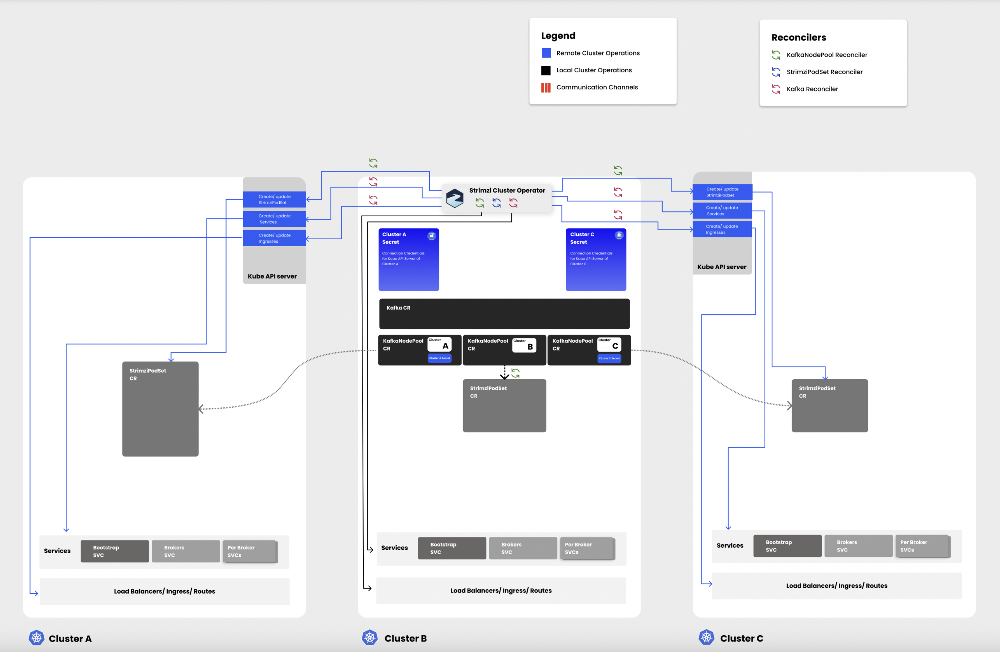
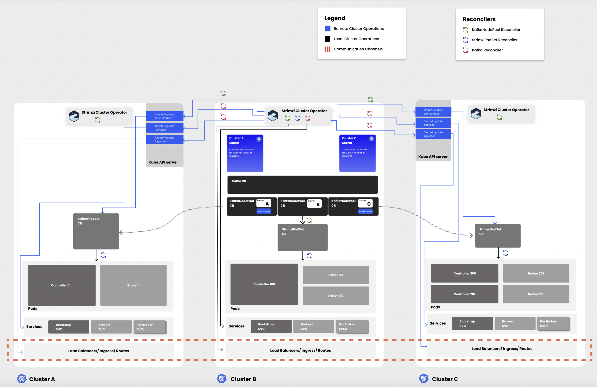
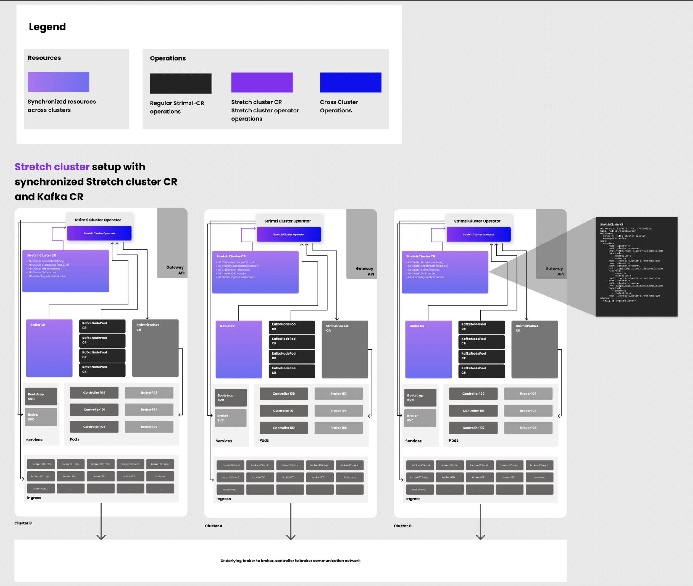

# Stretch Kafka cluster

The Strimzi Kafka operator currently manages Kafka clusters within a single Kubernetes cluster.
This proposal aims to extend support to stretch Kafka clusters, where brokers and controllers of a single Kafka cluster are distributed across multiple Kubernetes clusters.

## Current situation

At present, the availability of Strimzi-managed Kafka clusters is directly tied to the availability of the underlying Kubernetes cluster.
If a Kubernetes cluster experiences an outage, the entire Kafka cluster becomes unavailable, disrupting all connected Kafka clients.

## Motivation

A stretch Kafka cluster allows Kafka nodes to be distributed across multiple Kubernetes clusters, significantly enhancing resilience by enabling the system to tolerate the outage of an entire Kubernetes cluster without disrupting service to clients.
This configuration ensures high availability and seamless client operations, even in the event of cluster-specific failures.

In addition to improving fault tolerance, this approach also facilitates other valuable use cases, such as:

- **Migration Flexibility**: The ability to move Kafka clusters between Kubernetes environments without downtime, supporting maintenance or migrations.
- **Resource Optimization**: Efficiently utilizing resources across multiple clusters, which can be advantageous in environments with varying cluster capacities or during scaling operations.

### Limitations and Considerations
While a stretch Kafka cluster offers several advantages, it also introduces some challenges and considerations:

- **Increased Network Complexity and Costs**: The communication between brokers and controllers across clusters relies on network connectivity, which can be less reliable and more costly than intra-cluster communication.
This necessitates careful consideration of network architecture and associated costs.

- **Latency Requirements**: The stretch Kafka cluster is best suited for environments with low-latency network connections between the Kubernetes clusters.High latency can adversely affect the performance and synchronization of Kafka nodes, potentially leading to delays or errors in replication and client communication.
Defining the minimal acceptable latency between clusters is crucial to ensure optimal performance.

## Proposal

This proposal seeks to enhance the Strimzi Kafka operator to support stretch Kafka clusters, distributing brokers and controllers across multiple Kubernetes clusters.
The intent is to focus on high-availability of the data plane.The proposal outlines high-level topology and design concepts for such deployments, with a plan to incrementally include finer design and implementation details for various aspects.

### Prerequisites

- **Multiple Kubernetes Clusters**: Stretch Kafka clusters will require multiple Kubernetes clusters.
Ideally, an odd number of clusters (at least three) is needed to maintain quorum in the event of a cluster outage.

- **Low Latency**: Kafka clusters should be deployed in environments that allow low-latency communication between Kafka brokers and controllers.
Stretch Kafka clusters should be deployed in environments such as data centers or availability zones within a single region, and not across distant regions where high latency could impair performance.

- **KRaft**: As Kafka and Strimzi transition towards KRaft-based clusters, this proposal focuses exclusively on enabling stretch deployments for KRaft-based Kafka clusters.
While Zookeeper-based deployments are still supported, they are outside the scope of this proposal.

### Design

The cluster operator will be deployed in all Kubernetes clusters and will manage Kafka brokers/controllers running on that cluster.
One Kubernetes cluster will act as the control point for defining custom resources (Kafka, KafkaNodePool) required for stretch Kafka cluster.
The KafkaNodePool custom resource will be extended to include information about a Kubernetes cluster where the pool should be deployed.
The cluster operator will create necessary resources (StrimziPodSets, services etc.) on the target clusters specified within the KafkaNodePool resource.

This approach will allow users to specify/manage the definition of stretch Kafka cluster in a single location.
The operators will then create necessary resources in target Kubernetes clusters, which can then be reconciled/managed by operators on those clusters.

### Reconciling Kafka and KafkaNodePool resources


### Reconciling StrimziPodSet resources


#### KafkaNodePool changes
A new optional field (`target`) will be introduced in the KafkaNodePool resource specification, to allow users to specify the details of the Kubernetes cluster where the node pool should be deployed.
This section will include the target cluster's URL (Kubernetes cluster where resources for this node pool will be created) and the secret containing the kubeconfig data for that cluster.

An example of the KafkaNodePool resource with the new fields might look like:

```yaml
apiVersion: kafka.strimzi.io/v1beta2
kind: KafkaNodePool
metadata:
  name: controller
  labels:
    strimzi.io/cluster: my-cluster
spec:
  replicas: 3
  target:
    clusterUrl: <K8S Cluster URL>
    secret: <SecretName>
  listenerConfig:
    - configuration:
          bootstrap:
            alternativeNames:
              - bootstrap-ext.<kubernetes infra host>
              - broker-100.<kubernetes infra host>
              - broker-101.<kubernetes infra host>
            host: bootstrap-ext.<kubernetes infra host>
          brokers:
          - broker: 100
            host: broker-100.<kubernetes infra host>
          - broker: 101
            host: broker-101.<kubernetes infra host>
          class: nginx
        name: connectext
  roles:
    - controller
  storage:
   .........
```

#### Kafka changes

```yaml
apiVersion: kafka.strimzi.io/v1beta2
kind: Kafka
metadata:
  name: my-cluster
  annotations:
    strimzi.io/node-pools: enabled
    strimzi.io/kraft: enabled
    strimzi.io/stretch-mode: enabled
spec:
  kafka:
    version: 3.7.0
    metadataVersion: 3.7-IV4
    listeners:
      - port: 9093
        tls: true
        name: connectext
        type: ingress
```

A new annotation (`stretch-mode: enabled`) will be introduced in Kafka custom resource to indicate when it is representing a stretch Kafka cluster
This approach is similar to how Strimzi currently enables features like KafkaNodePool (KNP) and KRaft mode.

In a stretch Kafka cluster, we'll need bootstrap and broker services to be present on each Kubernetes cluster and be accessible from other clusters.
The Kafka reconciler will identify all target clusters from KafkaNodePool resources and create these services in target Kubernetes clusters.
This will ensure that even if the central cluster experiences an outage, external clients can still connect to the stretch cluster and continue their operations without interruption.

#### Cross-cluster communication
Kafka controllers/brokers are distributed across multiple Kubernetes environments and will need to communicate with each other.
Currently, the Strimzi Kafka operator defines Kafka listeners for internal communication (controlplane and replication) between brokers/controllers (Kubernetes services using ports 9090 and 9091).
The user is not able to influence how these services are set up and exposed outside the cluster.
We would remove this limitation and allow users to define how these internal listeners are configured in the Kafka resource, just like they do for Kafka client listeners.

Users will also be able to override listener configurations in each KafkaNodePool resource, if the listeners need to be exposed in different ways (ingress host names, Ingress annotations etc.) for each Kubernetes cluster.
This will be similar to how KafkaNodePools are used to override other configuration like storage etc.
To override a listener, KafkaNodePool will define configuration with same listener name as in Kafka resource.

#### Resource cleanup on remote Kubernetes clusters
As some of the Kubernetes resources will be created on a remote cluster, we will not be able to use standard Kubernetes approaches for deleting resources based on owner references.
The operator will need to delete remote resources explicitly when the owning resource is deleted.

- The exact mechanism that will be used for such cleanup in various scenarios is not detailed out yet and will be added here before the proposal is complete.

#### Network policies
In a stretch Kafka cluster, some Network policies will be relaxed to allow communication from other Kubernetes clusters that are specified as targets in various KafkaNodePool resources.
This will allow brokers/controllers on separate Kubernetes clusters to communicate effectively.

#### Secrets
We need to create Kubernetes Secrets in the central cluster that will store the credentials required for creating resources on the target clusters.
These secrets will be referenced in the KafkaNodePool custom resource.

#### Entity operator
We would recommend that all KafkaTopic and KafkaUser resources are managed from the cluster that holds Kafka and KafkaNodePool resources, and that should be the cluster where the entity operator should be enabled.
This will allow all resource management/configuration form a central place.
The entity operator should not be impacted by changes in this proposal.

## Additional considerations

Once the general approach is agreed, this proposal will be updated to include any impact on other important aspects like:
- rolling updates
- scaling brokers/controllers
- certificate rotation
- cruise control
- observability

## Affected/not affected projects

This proposal only impacts strimzi-kafka-operator project.


## Rejected alternatives

- Use network technologies like skupper, submariner etc to allow internal services to be visible on other clusters
  -  introduces additional dependencies and complexity to the Strimzi project




An alternative approach considered was setting up a stretch Kafka cluster with synchronized `KafkaStretchCluster` and `Kafka` custom resources (CRs).
The idea was to introduce a new CR called `KafkaStretchCluster`, which would contain details of all the clusters involved in the stretch Kafka deployment.
The spec would include information such as cluster names, secrets for connecting to each Kubernetes cluster, and a list of node pools across the entire stretch cluster.

The Kafka CR could be created in any of the Kubernetes clusters, and it would be propagated to the remaining clusters through coordinated actions by the Cluster Operator.
Similarly, changes to the Kafka CR could be made in any Kubernetes cluster, and once detected by the Cluster Operator, the changes would be propagated to the CRs in the other clusters.
The `KafkaNodePool` resources would be deployed to individual Kubernetes clusters, requiring users to apply the KafkaNodePool CR in each cluster separately.

### Pros

- Users can modify CRs even if one of the clusters in the setup is unreachable, as there is no central cluster where all CRs must be created.
- This model offers greater resilience and higher fault tolerance.


### Cons

- This approach is challenging to implement, as the Cluster Operator must be coordinated to propagate CR changes across clusters.
- The secrets required to connect to all the Kubernetes clusters would need to be available to all clusters, raising potential security concerns.
- Since Kafka CRs are spread across clusters, it becomes difficult to identify the overall cluster state from the Kafka status, as each CR is reconciled by its own Cluster Operator.
