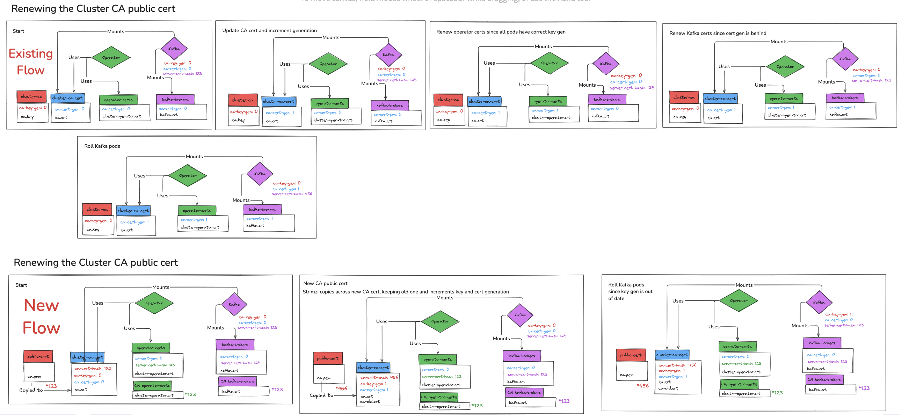
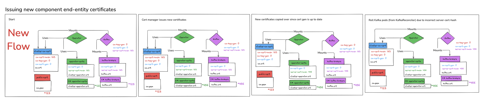
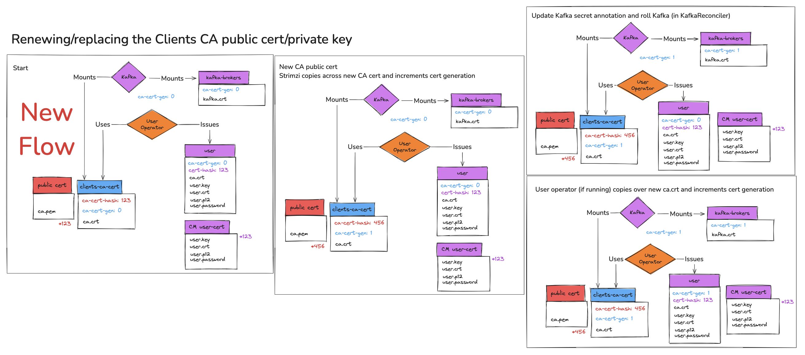

# External Certificate Manager

This proposal aims to allow Strimzi users to use an external certificate manager, specifically [cert-manager](https://cert-manager.io/), to manage certificates.

## Current situation

There are two different categories of certificates that Strimzi handles:
* The "cluster" category refers to certificates that are issued for the Strimzi components:
  * Kafka nodes
  * Cluster, User and Topic operators
  * Cruise Control
  * Kafka Exporter
* The "clients" category refers to certificates that are issued for user applications using the User Operator, or through another external mechanism chosen by the user.

For both categories, to provide a secure, TLS-enabled setup by default when deploying Kafka clusters, Strimzi integrated its own CA operations into the Cluster Operator.
The Cluster Operator accomplishes this by using openssl to generate self-signed root CA certificates and private keys which it then uses to directly sign end-entity (EE) certificates.
This CA certificate has zero pathlen, which means it cannot sign any intermediate CA.
A cluster CA and clients CA are generated.
These CAs are only used for Kafka clusters and a unique instance of each CA is used for each Kafka cluster.

In addition to Strimzi fully managing the certificates as described above, there are options for users to partially manage the certificates:
* Users can [install and use their own CA certificate and private keys](https://strimzi.io/docs/operators/latest/deploying#installing-your-own-ca-certificates-str), instead of using the defaults generated by the Cluster Operator.
  When using this option, both the CA certificate and private key must be provided, and Strimzi still issues the end-entity (EE) certificates that are presented by the components.
* User can provide a Clients CA public certificate, a placeholder value for the private key, and issue their own user certificates independently.
  If using this approach, users can also use `KafkaUser` CRs with `spec.authentication.type` set to `tls-external` with the User Operator managing ACLs and quotas.
* Users can [provide custom listener certificates](https://strimzi.io/docs/operators/latest/deploying#proc-installing-certs-per-listener-str) for TLS encryption.
  This option only affects how user applications connect to Kafka.
  It does not change how the Strimzi components connect to Kafka, or how the Kafka brokers connect to each other.

None of the existing options allow all end-entity certificates to be issued by a tool that isn't Strimzi.

## Motivation

Strimzi's primary purpose is to provide a way to run Apache Kafka clusters on Kubernetes.
Although it is nice that it can issue certificates, it would be beneficial if the certificates could be issued by a dedicated certificate manager, such as [cert-manager](https://cert-manager.io/).
This is a feature that is often requested, especially because many organizations have specific compliance requirements with regard to certificates, for example:
* Requiring that CA private keys are not shared.
* Requiring that self-signed certificates cannot be used.

## Proposal

Strimzi will be updated to allow users to specify that certificates should be issued by an external certificate manager instead of issued by Strimzi.
This proposal will specifically describe how this would work for cert-manager, however the user API for configuration will be written in a way that does not prevent other external certificate managers being added in the future.

The proposal makes a few assumptions:
* Strimzi will not be responsible for installing cert-manager, but we will document the supported versions of cert-manager that we have tested with.
* Strimzi will not be responsible for creating `Issuer` or `ClusterIssuer` custom resources.
* Strimzi will not be responsible for requesting a CA certificate be issued, it will only interact with cert-manager to request end-entity certificates are issued.
* Strimzi will create `Certificate` custom resources (to request a new end-entity certificate is issued) and will allow the user to influence the contents of these resources by exposing options in the `Kafka` custom resource.
* Strimzi will not directly interact with the lower level `CertificateRequest` and `CertificateSigningRequests` custom resources.
* When Strimzi creates a `Certificate` custom resource, cert-manager will issue the certificate within a reasonable amount of time such that Strimzi can wait during the reconciliation.
  If cert-manager is taking longer than expected Strimzi will fail the reconciliation and retry during the next reconciliation.
* Users will provide to the Strimzi Cluster Operator the CA certificates it must trust for the current issuer via a Kubernetes Secret.

### API

The existing `spec.clusterCa` and `spec.clientsCa` fields will be extended to add a new property `type`:

```yaml
spec:
  clusterCa:
    validityDays: <integer> # notBefore=now, notAfter=now + validityDays
    generateCertificateAuthority: <boolean>
    generateSecretOwnerReference: <boolean>
    renewalDays: <integer> # days before notAfter when we should start renewal
    certificateExpirationPolicy: <renew-certificate|replace-key>
    type: <strimzi.io|cert-manager.io> # (1)
    certManagerIssuerRef: # (2)
      name: <string>
      kind: <Issuer|ClusterIssuer>
      group: <string> # cert-manager.io by default
    publicCert: # (3)
      secretName: <string>
      certificate: <string>
```

1. The`type` property will default to `strimzi.io` when not set and will use the existing behaviour, allowing backwards compatibility.
   The option `cert-manager.io` will only be valid if `generateCertificateAuthority` is set to `false`.
2. The property `certManagerIssuerRef` will only be used by Strimzi if `type` is set to `cert-manager.io`.
  The `name`, `kind`, and `group` properties will be copied over into the `Certificate` custom resource Strimzi creates.
3. The property `publicCert` will only be used by Strimzi if `type` is set to `cert-manager.io`.
  The `secretName` and `certificate` properties will be used to locate the CA public certificate that must be trusted by Strimzi components in order to trust the end-entity certificates that cert-manager issues.

### User steps

To make use of this new option the user will have to:

1. Install cert-manager.
2. Create an `Issuer` or `ClusterIssuer` custom resource.
3. Create a `Secret` containing the CA public cert for Strimzi to trust.
   The `Secret` must contain a data entry with all the CAs bundled into one PEM file.
   Users can optionally use [trust-manager](https://cert-manager.io/docs/trust/trust-manager/) to create this Secret, but they are responsible for installing trust-manager and creating the `Bundle` CR with a single `target` entry.
4. Create a `Kafka` resource with `clusterCa.type` and/or `clientsCa.type` set to `cert-manager.io`, and `certManagerIssuerRef` and `publicCert` configured.

### Internal handling of Cluster CA

Strimzi uses two generation annotations to track how Cluster CA certificates are trusted and Cluster CA issued certificates are used:
* `strimzi.io/cluster-ca-key-generation` on Kafka pods to indicate the generation of the CA private key that signed the CA public cert trusted by that pod
* `strimzi.io/cluster-ca-cert-generation` on Secrets containing certificates to indicate the generation of the CA public cert at the time the certificate was issued

The `strimzi.io/cluster-ca-cert-generation` annotation is also used on Kafka pods to indicate the generation of the CA public cert associated with the certificate it is currently presenting.

The following sections go into more detail about how we will use these annotations when cert-manager is issuing certificates.
At a high level:
* Strimzi will use cert path validation using the `java.security` libraries to determine whether a new Cluster CA public cert was signed with a new private key.
* If a new private key was used, Strimzi will increment both the `strimzi.io/ca-key-generation` and `strimzi.io/ca-cert-generation` annotations on the Cluster CA cert Secret and roll the Kafka pods from CaReconciler to trust the new public cert.
* If the private key has not changed, Strimzi will increment only the `strimzi.io/ca-cert-generation` annotation on the Cluster CA cert Secret and roll the Kafka pods from KafkaReconciler to trust the new public cert.
* If a new end-entity certificate is issued, Strimzi will use cert path validation to verify it is trusted by the latest Cluster CA cert Secret before using it.
* Strimzi will update the `strimzi.io/cluster-ca-cert-generation` annotation on the Kafka pods to match the annotation on the Cluster CA cert Secret when it copies over a new end-entity certificate

#### Handling Cluster CA trust rollout

When a new Kafka cluster is created Strimzi will copy the CA public cert from the Secret identified in `clusterCa.publicCert` to the `<CLUSTER_NAME>-cluster-ca-cert` Secret in a data entry named `ca.crt`.
Strimzi will add three annotations to the `<CLUSTER_NAME>-cluster-ca-cert` Secret:
* `strimzi.io/ca-cert-hash` with the value being a hash of the certificate.
* `strimzi.io/ca-key-generation` initially set to 0.
* `strimzi.io/ca-cert-generation` initially set to 0.

During a reconciliation Strimzi will check the hash of the certificate stored in `clusterCa.publicCert` Secret to see if an update is needed.
If the certificate has changed Strimzi will perform cert path validation using the `java.security` libraries to determine whether a new Cluster CA public cert was signed with a new private key.
If the private key has not changes, Strimzi will copy over the new certificate, replacing the existing one.
It will also update the `strimzi.io/ca-cert-hash` and increment the `strimzi.io/ca-cert-generation` annotation.
Each of the component reconcilers will check the `strimzi.io/cluster-ca-cert-generation` on their pods during their reconcile loop, and update the pod annotation and roll the pods if the generation is out of date. 

> 
>
> Fig 1: Existing and proposed workflow when the user provides a new cluster CA public cert

#### Issuing Cluster CA end-entity certificates

When Strimzi needs to issue a certificate, instead of using the existing internal mechanism it will create a `Certificate` custom resource.
Strimzi will specify the required CN/SANs in the `Certificate` resource for the end-entity certificate.
Strimzi will set the `secretName` field in the `Certificate` resource as `<CERT_SECRET>-cm`, where `<CERT_SECRET>` is the name of the Secret Strimzi currently uses, for example `<CLUSTER_NAME>-cluster-operator-certs-cm`.
Strimzi will wait for the usual operation timeout during the reconciliation loop for the `Certificate` status to indicate that the certificate has been issued before continuing.
When issuing cluster certificates (e.g for each Kafka pod etc), once the certificate has been issued, Strimzi will copy the certificate across from the cert-manager provided Secret into its own existing Secret.
Strimzi will annotate the Secret it manages with:
* `strimzi.io/server-cert-hash` annotation with the value being the hash of the certificate being stored in the Secret.
* `strimzi.io/cluster-ca-cert-generation` annotation with the value matching the current value of `strimzi.io/ca-cert-generation` on the `<CLUSTER_NAME>-cluster-ca-cert` Secret.

Similar to today, Strimzi will also add both these annotations to the pod mounting the Secret.

#### Tracking changes to Cluster CA end-entity certificates

Cert-manager will be responsible for renewing all Cluster CA end-entity certificates.
When a certificate is renewed cert-manager will update the related Secret.
During a reconciliation Strimzi will check the hash of the certificate stored in cert-manager Secrets to see if an update is needed.

When cert-manager renews an end-entity certificate Strimzi will perform cert path validation using the `java.security` libraries to determine whether the new certificate is trusted by the latest Cluster CA public cert.
If the certificate is trusted:
* Strimzi will copy over the new certificate into its own Secret.
* Strimzi will update the `strimzi.io/server-cert-hash` annotation to match the new certificate.
* Strimzi will update the `strimzi.io/cluster-ca-cert-generation` annotation to match the `strimzi.io/ca-cert-generation` annotation on the `<CLUSTER_NAME>-cluster-ca-cert` Secret.

If the certificate is not trusted:
* Strimzi will do nothing and complete the reconciliation loop as normal.
* During future reconciliations Strimzi will repeat the cert path validation steps until the user has updated the Cluster CA public cert given to Strimzi to one that trusts the new certificate.

Strimzi will review the `Certificate` resource every time it does a reconciliation to see if any changes to the requested certificate are needed, for example updating SANs.

> 
>
> Fig 2: Proposed workflow when cert-manager issues new component end-entity certificates

#### Handling Cluster CA key replacements

If during a reconciliation Strimzi determines (using cert path validation) that a new private key has been used, Strimzi will:
1. Rename the existing cert in the `<CLUSTER_NAME>-cluster-ca-cert` Secret to `ca-YYYY-MM-DDTHH-MM-SSZ.crt` and copy over the new certificate.
2. Update the `strimzi.io/ca-cert-hash` and increment the `strimzi.io/ca-cert-generation` and `strimzi.io/ca-key-generation` annotations.
3. Roll the Kafka pods to trust the new CA cert, incrementing the `strimzi.io/cluster-ca-key-generation` annotation on the pods.
4. Once new end-entity certificates are issued that trust the new Cluster CA public cert, copy over the new Kafka certificates, updating the `strimzi.io/cluster-ca-cert-generation` annotation on the Secrets.
5. Roll the Kafka pods to use the new Kafka certificates, updating the `strimzi.io/cluster-ca-cert-generation` annotations on the pods.
6. Then on the next reconciliation, since the Kafka pods now have correct cert and key generation, and the Kafka certificate Secrets have the correct cert generation, copy over the new operator certificate.
7. Since the Kafka pods now have correct cert generation, and the Kafka certificate Secrets have the correct cert generation, remove the old CA public cert from the `<CLUSTER_NAME>-cluster-ca-cert` Secret.

**Note:** The above steps require a change to the CaReconciler.
Today we only check the `strimzi.io/cluster-ca-cert-generation` annotation on the Kafka pods to decide whether to update the operator certificate Secret and remove the old Cluster CA cert.
When using cert-manager to manage certificates, Strimzi will also check the annotation on the Kafka certificate Secrets before making either of these changes.

> 
>
> Fig 3: Proposed workflow when the user provides a new cluster CA public cert that has been signed by a new private key

### User Operator/Clients CA

When a new Kafka cluster is created Strimzi will copy the CA public cert from the Secret identified in `clientsCa.publicCert` to the `<CLUSTER_NAME>-clients-ca-cert` Secret.
Strimzi will add two annotations to the `<CLUSTER_NAME>-cluster-ca-cert` Secret:
* `strimzi.io/ca-cert-hash` with the value being a hash of the certificate.
* `strimzi.io/ca-cert-generation` initially set to 0.

#### Issuing KafkaUser certificates

The User operator will be updated to have four environment variables to configure the CA issuer:
- `STRIMZI_CA_TYPE` with either the value `strimzi.io` or `cert-manager.io`
- `STRIMZI_CM_ISSUER_NAME`
- `STRIMZI_CM_ISSUER_KIND`
- `STRIMZI_CM_ISSUER_GROUP`

These will be set by the Cluster operator when the User operator is deployed as part of the Entity operator and when `spec.clientsCa.type` is set to `cert-manager.io`.

When a `KafkaUser` with `spec.authentication.type` set to `tls` is created Strimzi will create a `Certificate` custom resource.
Strimzi will specify the required CN/SANs in the `Certificate` resource for the user certificate.
Strimzi will specify the `Secret` for the certificate to be stored to match the name of the `KafkaUser` resource.
Strimzi will request the certificate in both PEM and PKCS12 format.
Strimzi will wait for the usual operation timeout during the reconciliation loop for the `Certificate` status to indicate that the certificate has been issued before continuing.

#### Tracking changes to KafkaUser certificates

Cert-manager will be responsible for renewing all user certificates.
When a certificate is renewed cert-manager will update the related Secret.
Since the user's clients are directly using the cert-manager created Secret, Strimzi will take no action.

#### Handling Clients CA cert renewals and key replacements

During a reconciliation Strimzi will check the hash of the certificate stored in the user's CA public cert Secret to see if an update is needed.
If the certificate has changed Strimzi will copy over the new certificate to replace the existing one.
It will also update the `strimzi.io/ca-cert-hash` and increment the `strimzi.io/clients-ca-cert-generation` annotations.

Once the annotations are updated Strimzi will update the annotation on the Kafka brokers Secret and the Kafka pods and roll the Kafka pods to trust the new CA cert.

> 
>
> Fig 4: Existing workflow when the user provides a new clients CA public cert

> 
>
> Fig 5: Proposed workflow when the user provides a new clients CA public cert

## Affected/not affected projects

This affects the Cluster Operator and User Operator.

## Compatibility

This feature will be optional and disabled by default.

### Migrating to this feature

To start using this feature in an existing Kafka cluster the user must:
1. Install cert-manager and create an `Issuer`.
2. Create Secrets to store the Cluster CA and/or Clients CA public certs
3. Update the `Kafka` resource to have `clusterCa.type` and/or `clientsCa.type` set to `cert-manager.io`, `clusterCa.generateCertificateAuthority` and/or `clientsCa.generateCertificateAuthority` set to `false`, and `certManagerIssuerRef` and `publicCert` configured.

When using this feature for the ClientsCa:
* On the next Cluster operator reconciliation Strimzi will copy the new certificate over to `<CLUSTER_NAME>-clients-ca-cert` replacing the old certificate and increment the cert generation annotation.
* Strimzi will roll the Kafka pods to trust the new CA cert.
* On the next User Operator reconciliation Strimzi will create `Certificate` resources for all the existing `KafkaUser` custom resources.

When using this feature for the ClusterCa:
* On the next Cluster operator reconciliation Strimzi will copy the new certificate over to `<CLUSTER_NAME>-cluster-ca-cert` (renaming and keeping the old certificate), increment the cert generation annotation and add the key generation annotation.
* Strimzi will roll the pods once to trust the new CA cert.
* Strimzi will create `Certificate` resources for all the components and wait for the certificates to be issued.
* Strimzi will copy over the new certificates into the pod Secrets.
* Strimzi will roll the pods to use the new certificates.

Once all the pods have the correct cert generation annotation Strimzi can update the `<CLUSTER_NAME>-cluster-ca-cert` and/or `<CLUSTER_NAME>-clients-ca-cert` Secrets to remove the old CA cert, roll the Kafka pods, and delete the `<CLUSTER_NAME>-cluster-ca` and/or `<CLUSTER_NAME>-clients-ca` Secrets.

### Stopping using this feature

To revert to user managed CAs the user must:
1. Pause reconciliation for their Kafka cluster.
2. Update the `<CLUSTER_NAME>-cluster-ca-cert` and/or `<CLUSTER_NAME>-clients-ca-cert` Secrets to:
   1. contain their public CA cert (keeping the old cert-manager one)
   2. increment the `strimzi.io/ca-cert-generation` annotation
3. Create the `<CLUSTER_NAME>-cluster-ca` and/or `<CLUSTER_NAME>-clients-ca` private key Secrets
4. Update the `Kafka` resource to change the `clusterCa.certificateIssuer` and/or `clientsCa.certificateIssuer` `type` to `strimzi.io`.
5. Resume reconciliation.

When using this feature for the ClientsCa:
* On the next Cluster Operator reconciliation Strimzi will roll the Kafka pods to trust the new CA cert.
* On the next User Operator reconciliation Strimzi will issue new certificates for all the existing `KafkaUser` custom resources.

When using this feature for the ClusterCa:
* On the next reconciliation Strimzi will first roll the pods once to trust the new CA cert.
* Strimzi will issue new certificates for all the components.
* Strimzi will roll the pods to use the new certificates.

Once all the pods have been rolled the user can update the `<CLUSTER_NAME>-cluster-ca-cert` and/or `<CLUSTER_NAME>-clients-ca-cert` Secrets to remove the old CA cert.
The user is responsible for removing the old `Certificate` resources and uninstalling cert-manager.

Notes:
* Today we do not document how to go from using user managed CAs to Strimzi managed CAs.
  For this reason I have not included how to go from cert-manager CAs to Strimzi managed CAs.

## Rejected alternatives

### Letting Strimzi infer the CA cert to trust

Certain issuers will include CA cert to trust in the Secret for a specific certificate.
Strimzi could use this cert instead of requiring the user to provide one.
However, this is not recommended.
On the cert-manager [website](https://cert-manager.io/docs/trust/) they explicitly state:
"When configuring the client you should independently choose and fetch the CA certificates that you want to trust.
Download the CA out of band and store it in a Secret or ConfigMap separate from the Secret containing the server's private key and certificate."
To keep to this best practice and also allow Strimzi to have the same behaviour for all issuers I have chosen to require the user to provide the CA certs to trust up-front.

### Using lower-level cert-manager CRs

Strimzi could keep control of when to renew/replace certificates/keys and instead use the lower-level custom resources such as `CertificateRequest`.
I chose not to do this since part of the motivation for this feature is to offload certificate management to a dedicated tool.

### Strimzi only interacting with Secrets

Strimzi could not interact with cert-manager custom resources at all and instead just deal with the resulting Secrets directly.
This could work for the ClientsCa, however we already provide the option for users to configure listener certificates, so there is no need for an alternative option.
For the ClusterCa the certificates needed are complex, since there are multiple different nodes and network connections.
It would be very complex for the user to hand-craft the right certificates, and would also restrict their ability to scale up the cluster, 
since they would need to create the new certificates up front.
For these reasons it makes sense for Strimzi to create the `Certificate` custom resources.

### Make a copy of the cert-manager Secret for KafkaUser resources

A previous version of this proposal described the User Operator making a copy of the cert-manager certificate Secret for each `KafkaUser`.
This was removed because there was no check being used to determine whether the Secret data should be copied into the Strimzi managed Secret.
As a result having a copy is not needed.
This also means the user `Secret` will not contain the ClientsCA public cert.
However since the user is managing the CA (via cert-manager) this is not an issue.

### Require the user to pause reconciliation during Cluster CA key replacement

A previous version of this proposal described the user pausing Strimzi reconciliation when the Cluster CA key is replaced.
This was to address a scenario where new end-entity certificates are issued by cert-manager before Strimzi is given the new Cluster CA public cert that trusts those certificates.
This was removed because it is unclear whether this is a reasonable constraint on the user, and if the user does not pause Strimzi could result in the Kafka certificates
being incorrectly updated and Kafka pods failing to start.
Instead, the proposal now describes the use of cert path validation to determine when the Cluster CA key has been replaced.
