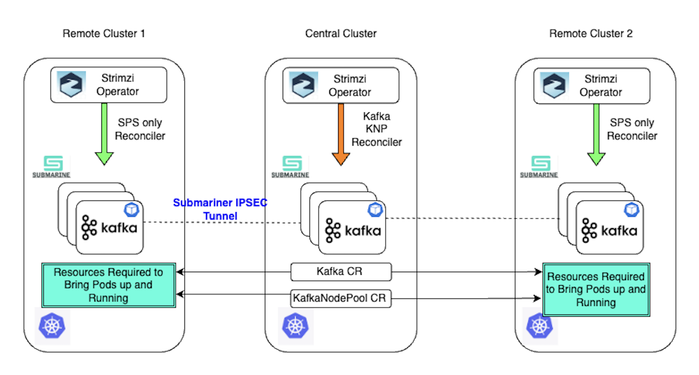

# Stretch Kafka cluster

The Strimzi Kafka operator currently manages Kafka clusters within a single Kubernetes cluster.
This proposal aims to extend this support to stretch Kafka clusters, where brokers and controllers of a single Kafka cluster are distributed across multiple Kubernetes clusters.

## Current situation

At present, the availability of Strimzi-managed Kafka clusters is limited by the availability of the underlying Kubernetes cluster.
If a Kubernetes cluster experiences an outage, the entire Kafka cluster becomes unavailable, disrupting all connected Kafka clients.

## Motivation

A stretch Kafka cluster allows Kafka nodes to be distributed across multiple Kubernetes clusters. This approach also facilitates many valuable use cases, such as:

- **High Availability**: Distributing Kafka brokers across multiple Kubernetes cluster significantly enhances resilience by enabling the system to tolerate the outage of a Kubernetes cluster without disrupting service to clients.

- **Migration Flexibility**: The ability to move Kafka nodes between Kubernetes environments without downtime, supporting maintenance or migrations.

- **Resource Optimization**: Efficiently utilizing resources across multiple clusters, which can be advantageous in environments with varying cluster capacities or during scaling operations.

### Limitations and Considerations
While a stretch Kafka cluster offers several advantages, it also introduces some challenges and considerations:

- **Increased Network Complexity and Costs**: The communication between brokers and controllers across clusters relies on network connectivity, which can be less reliable and more costly than intra-cluster communication.
This necessitates careful consideration of network architecture and associated costs.

- **Latency Requirements**: Stretch Kafka clusters are best suited for environments with low-latency network connections between the Kubernetes clusters.
High latency can adversely affect the performance and synchronization of Kafka nodes, potentially leading to delays or errors in replication and client communication.
Defining the minimal acceptable latency between clusters is crucial to ensure optimal performance.

## Proposal

This proposal seeks to enhance the Strimzi Kafka operator to support stretch Kafka clusters, distributing brokers and controllers across multiple Kubernetes clusters.
The intent is to focus on high-availability of the data plane.
The proposal outlines high-level topology and design concepts for such deployments, with a plan to incrementally include finer design and implementation details for various aspects.

### Prerequisites

- **Multiple Kubernetes clusters**: Stretch Kafka clusters will require multiple Kubernetes clusters.
To ensure Kafka controller quorum in the event of a Kubernetes cluster outage, it is recommended to distribute controllers across at least three Kubernetes clusters. In a two cluster setup, there is a risk of losing quorum if the wrong cluster fails, which can lead to Kafka becoming unavailable.

- **Low Latency**: Kafka clusters should be deployed in environments that allow low-latency communication between Kafka brokers and controllers.
Stretch Kafka clusters should be deployed in environments such as data centers or availability zones within a single region, and not across distant regions where high latency could impair performance.

- **KRaft**: As Kafka and Strimzi transition towards KRaft-based clusters, this proposal focuses exclusively on enabling stretch deployments for KRaft-based Kafka clusters.
While Zookeeper-based deployments are still supported, they are outside the scope of this proposal.

- **A supported cloud native networking technology**: To enable networking between Kubernetes clusters currently requires an additional technology stack.
The prototype detailed within this proposal requires advance manual setup of an overlay network offered by a [Cloud Native Network](https://landscape.cncf.io/guide#runtime--cloud-native-network) project to provide connectivity between Kafka runtimes in different Kubernetes clusters.
There is currently a choice between two projects:
    1. [Submariner](https://submariner.io/) provides an implementation of [Kubernetes Multi-Cluster Services (MCS)](https://multicluster.sigs.k8s.io/guides/#implementation-status).
    The Kafka runtime pods use these new services to communicate between one another.
    Other MCS implementations are expected to be viable, but have not yet been prototyped.
    2. [Cilium](https://cilium.io/) provides support for a [Cluster Mesh](https://docs.cilium.io/en/stable/network/clustermesh/intro/) (an MCS API implementation is currently in beta).
    The MCS API is not used by the prototype, but manual re-configuration of Kubernetes CoreDNS is required.

    The [draft reference documentation](https://aswinayyolath.github.io/stretch-kafka-docs) for the prototype includes detailed steps describing how to pre-configure both [Submariner](https://aswinayyolath.github.io/stretch-kafka-docs/setting-up-submariner/) and [Cilium](https://aswinayyolath.github.io/stretch-kafka-docs/Setting-up-cilium/).

### Design

#### Topology of a stretch cluster



The diagram illustrates a topology comprising of three Kubernetes clusters.

One of these clusters is designated as the "Central cluster", while any additional clusters are considered "remote".
The central cluster acts as the control plane where a user will create all the custom resources for the Kafka cluster - Kafka, KafkaNodePool, KafkaUser, KafkaTopic etc.

A Kafka node pool definition can be configured to specify a Kubernetes cluster (central cluster or one of the member clusters) as the deployment target.
The operator on the central cluster is responsible for creating all necessary resources (including `StrimziPodSet` resources) for the node pool on the target Kubernetes cluster. 

Operators deployed to remote clusters are only responsible for reconciling `StrimziPodSet` resources that are created remotely by the operator running in the central cluster.

This approach will allow users to manage the definition of their stretch Kafka cluster in a single location.

### Prototype

A working prototype can be deployed using the steps outlined in a [draft README](https://aswinayyolath.github.io/stretch-kafka-docs/) that is being iteratively revised.
The following sections will describe the key aspects of the prototype highlighting areas that would benefit from community feedback and input.

#### User configuration of a supported Cloud Native Network project

Multi-Cluster Services or a Cluster Mesh overlay network must be configured manually as a pre-requisite using a supported project.
This configuration must be performed by the user prior to deployment of Strimzi cluster operators.

Each Kubernetes cluster joined to the network is assigned a unique identifier.
This identifier is used by the prototype central operator to build:
1. Valid broker and controller service endpoints values for `advertised.listeners` and `controller.quorum.voters` within the appropriate ConfigMap resources.
2. Broker certificates with appropriate Subject Alternative Names.
The prototype currently expects this identifier to be supplied by the user as a label value on the Kafka node pool resource:

```yaml
apiVersion: kafka.strimzi.io/v1beta2
kind: KafkaNodePool
metadata:
  ...
  labels:
    ...
    strimzi.io/submariner-cluster-id: "cluster1"
```

_Note: The prototype operator code currently expects `submariner-cluster-id`, but this is subject to change for something more generic once additional technologies have been prototyped. One suggestion is `strimzi.io/cluster-network-id`._

_Note: This network identifier could have the same value as the Kubernetes cluster identifier described in the following section and both aspects would benefit from community feedback and input._

#### User configuration of the deployment topology

The operator running in the central Kubernetes cluster must be provided with the following information to allow creation of resources in remote clusters:

- An identifier for each remote Kubernetes cluster.
- A URL endpoint for the Kubernetes API server running in each remote cluster.
- Credential(s) to allow authentication with the remote Kubernetes API servers.

For simplicity and to quickly achieve a working prototype, the information outlined above is currently provided as an environment variable to the central operator.
The value of the environment variable uses a "map" format as shown below:

```yaml
- name: STRIMZI_K8S_CLUSTERS
  value: |
      cluster-id-a.url=<cluster-a URL>
      cluster-id-a.secret=<secret-name-cluster-a>
      cluster-id-b.url=<cluster-b URL>
      cluster-id-b.secret=<secret-name-cluster-b>
```

The secrets referenced here must currently contain the kubeconfig for a the Kubenetes cluster available at the provided URL as the value of secret key 'kubeconfig'.

Additionally, a Kafka node pool resource definition must indicate which cluster will host the Kafka brokers/controllers for that node pool.
The prototype uses a `spec.cluster` field within a KafkaNodePool definition that will have a value that matches one of the identifiers from the above map.
If the `spec.cluster` field is missing from the KafkaNodePool definition, it is currently assumed that the broker/controller pods will run on the central Kubernetes cluster.

_Note: This cluster identifier could have the same value as the network identifier described in the previous section. Community feedback/input very welcome!_

#### Other prototype configuration items and limitations

1. The central cluster operator needs to know which of the Cloud Native Network projects has been pre-configured. This is currently set on the Kafka CR using an annotation:

```yaml
apiVersion: kafka.strimzi.io/v1beta2
kind: Kafka
metadata:
  ...
  annotations:
    ...
    strimzi.io/cross-cluster-type: "submariner"
```

2. All Strimzi cluster operators involved must be aware they are involved in reconciling a stretch Kafka cluster by means of a new environment variable:

```yaml
- name: STRIMZI_STRETCH_MODE
  value: 'true'
```

Within the prototype operator, this is used to conditionally break the expectation that Kafka, KafkaNodePool are located in the same Kubernetes cluster as the StrimziPodSet and Pod resources.

3. The existing Strimzi network policies block cross-cluster network traffic so the prototype requires the following environment variable to be set on the central operator deployment:

```yaml
- name: STRIMZI_NETWORK_POLICY_GENERATION
  value: 'false'
```

4. Submariner [requires an adjustment](https://aswinayyolath.github.io/stretch-kafka-docs/Deploying-Strimzi-in-Stretch-Mode/#updating-clusterrole-for-submariner) to the `ClusterRole` for the Strimzi cluster operator in the central Kubernetes cluster.

5. The prototype operator currently creates new Kubernetes client instances at the required stage of reconciliation for the range of Kubernetes resources involved.
This approach was quick to implement, but results in duplicate code.
A design for better management of Kubernetes clients for remote clusters is required and is dependent upon community input.

**All aspects of user configuration described above would benefit from further discussion within the community.**

## Additional considerations and reference information

#### Example of multi-cluster advertised.listener and controller.quorum.voters

The Operator configures `advertised.listeners` and `controller.quorum.voters` to support cross-cluster communication in a stretch Kafka deployment.

**Default `advertised.listeners` format**

In a regular (single Kubernetes cluster) deployment, the `advertised.listeners` configuration uses this format:

```
advertised.listeners=REPLICATION-9091://<broker-pod-name>.<broker-service-name>.<namespace>.svc:9091,
PLAIN-9092://<broker-pod-name>.<broker-service-name>.<namespace>.svc:9092,
TLS-9093://<broker-pod-name>.<broker-service-name>.<namespace>.svc:9093
```

**Modified format for a stretch Kafka cluster**

When Kafka is deployed using "stretch mode", the operator modifies `advertised.listeners` to include a network identifier, such as the Submariner or Cilium `cluster-id`. The modified format is:

```
advertised.listeners=REPLICATION-9091://<broker-pod-name>.<cluster-id>.<broker-service-name>.<namespace>.svc.clusterset.local:9091,
PLAIN-9092://<broker-pod-name>.<cluster-id>.<broker-service-name>.<namespace>.svc.clusterset.local:9092,
TLS-9093://<broker-pod-name>.<cluster-id>.<broker-service-name>.<namespace>.svc.clusterset.local:9093
```

The `<cluster-id>` is dynamically retrieved from a label on the `KafkaNodePool` resource.

**Modified `controller.quorum.voters` format**

Similarly, `controller.quorum.voters` includes all Kafka controllers running in all of the Kubernetes clusters involved in the stretch Kafka cluster:

```
controller.quorum.voters=<controller-id>@<controller-pod-name>.<cluster-id>.<broker-service-name>.<namespace>.svc.clusterset.local:9090, ...
```

These updates ensure brokers and controllers can be discovered and communicate across clusters without relying on traditional external access methods.

#### Resource cleanup on remote Kubernetes clusters

Currently, resources created in the remote clusters do not have `OwnerReferences`. The main reason is that the `Kafka` and `KafkaNodePool` CRs exist only in the central cluster. If resources in remote clusters were to reference them as owners, they would be immediately deleted by Kubernetes' garbage collection mechanism since their owners do not exist in the remote clusters.

Even if ownership across Kubernetes cluster boundaries were possible, it would introduce another issue: if the central cluster were to go down, any resources in remote clusters with OwnerReferences pointing to central cluster resources would also be deleted automatically. This is not the intended behaviour, as we want remote resources to remain operational even if the central cluster becomes temporarily unavailable.

The prototype does not yet have a mechanism for controlled cleanup of remote resources when a user deliberately deletes the Kafka and KafkaNodePool CRs from the central cluster. Currently, when a user deletes these CRs, all related resources in the central cluster are removed, but remote cluster resources remain. Finding a way to handle this cleanup while avoiding unintended deletions is an open challenge.

#### Entity operator
We would recommend that all KafkaTopic and KafkaUser resources are managed from the cluster that holds Kafka and KafkaNodePool resources, and that should be the cluster where the entity operator should be enabled.
This will maintain all resource management from a central point.
The expectation is that the entity operator will not be impacted by changes made in the prototype, but this currently requires verification.

Other aspects requiring consideration and research:
- rolling updates
- scaling brokers/controllers
- certificate rotation
- cruise control
- observability

## Affected/not affected projects

This proposal only impacts strimzi-kafka-operator project.
