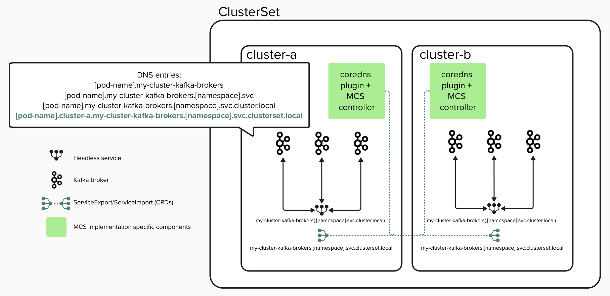

# Stretch Kafka cluster

The Strimzi Kafka Operator currently manages Kafka clusters within a single Kubernetes cluster.
This proposal aims to extend its support to stretch Kafka clusters, where the brokers and controllers of a single Kafka cluster are distributed across multiple Kubernetes clusters.

## Current situation

At present, the availability of Strimzi-managed Kafka clusters is constrained by the availability of the underlying Kubernetes cluster.
If a Kubernetes cluster experiences an outage, the entire Kafka cluster becomes unavailable, disrupting all connected Kafka clients.

While it is possible to enhance availability by running Kubernetes across multiple availability zones and configuring Strimzi with affinity rules, tolerations, or topology spread constraints, such configurations are still limited to a single Kubernetes control plane.
Any failure or disruption to this control plane — or a broader infrastructure issue affecting the cluster — can impact cluster operations and affect connected clients. 
In contrast, the stretch cluster distributes Kafka nodes across independent Kubernetes clusters, each with its own control plane and fault domain.
This enhances fault tolerance by enabling Kafka to continue operating even if one entire Kubernetes cluster becomes unavailable.

The intent is not to imply that Kubernetes control planes are unreliable — they are mature and widely used in HA configurations.
Rather, the stretch approach supports scenarios where users operate multiple isolated Kubernetes clusters for organizational, operational, or regulatory reasons, and want Kafka to span these boundaries while maintaining quorum and availability.

## Motivation

A stretch Kafka cluster allows Kafka nodes to be distributed across multiple Kubernetes clusters. This approach also facilitates many valuable use cases, such as:

- **High Availability**: In a stretch cluster deployment, Kafka brokers are distributed across multiple, fully independent Kubernetes clusters.
Each cluster operates its own control plane and infrastructure.
This separation improves resilience because the failure of one Kubernetes cluster — whether due to control plane issues, networking failures, or infrastructure outages — does not affect the availability of Kafka brokers running in the other clusters.
Clients can continue producing and consuming data without interruption as long as a quorum of brokers and controllers remains operational.
Unlike MirrorMaker 2 (MM2), a stretch cluster provides strong data durability through synchronous replication and enables fast disaster recovery with automated client failover.

- **Migration Flexibility**: A stretch Kafka cluster enables seamless migration, whether it's moving the entire cluster across Kubernetes environments or cloud providers without downtime, or relocating individual Kafka nodes as needed. 
This flexibility helps with maintenance, scaling, and workload transitions between environments.

## Proposal

This proposal seeks to enhance the Strimzi Kafka operator to support stretch Kafka clusters, where broker, controller, and combined-role Kafka Pods are expected to be distributed across all Kubernetes clusters involved.
The goal is to ensure high availability of Kafka client operations — such as producing and consuming messages — even in the event of a single-cluster failure, including failure of the central cluster.
The proposal outlines the high-level topology, design concepts, and detailed implementation considerations for such deployments.

### Limitations and Considerations

While a stretch Kafka cluster offers several advantages, it also introduces some challenges and considerations:

- **Increased Network Complexity and Costs**: The communication between brokers and controllers across clusters relies on network connectivity, which can be less reliable and more costly than intra-cluster communication.
This necessitates careful consideration of network architecture and associated costs.

- **Latency Requirements**: Stretch Kafka clusters are best suited for environments with low-latency and high-bandwidth network connections between the Kubernetes clusters.
High latency can adversely affect the performance and synchronization of Kafka nodes, potentially leading to delays or errors in replication and client communication.
Defining the maximal acceptable latency between clusters is crucial to ensure optimal performance.

### Prerequisites

- **Multiple Kubernetes clusters**: Stretch Kafka clusters require multiple Kubernetes clusters.
The recommended minimum number of clusters is 3 to simplify achieving quorum for Kafka controllers and enhance High Availability (HA) for production-grade deployments.
However, the Cluster Operator does not enforce this as a hard requirement.
Stretch clusters can be deployed with fewer than 3 clusters to allow migration flexibility, resource optimization scenarios, or test and development environments.
It is up to the user to ensure that quorum and HA considerations are properly evaluated according to their specific architecture and requirements.

- **Low Latency and High Bandwidth**: Kafka clusters should be deployed in environments that provide low-latency and high-bandwidth communication between Kafka brokers and controllers.
Stretch Kafka clusters should therefore be deployed in data centers or availability zones within a single region.
Deployments across geographically distant regions, where high latency and limited bandwidth could impair performance, should be avoided.

- **A Multi-Cluster Services API implementation**: To enable networking between Kubernetes clusters currently requires an additional technology stack.
Manual configuration of a [Multi-Cluster Services API (MCS-API)](https://multicluster.sigs.k8s.io/concepts/multicluster-services-api) implementation is required (see [KEP-1645](https://github.com/kubernetes/enhancements/tree/master/keps/sig-multicluster/1645-multi-cluster-services-api#readme)).
Current Multi-Cluster API implementations are listed on [this page](https://multicluster.sigs.k8s.io/guides).
It is the user’s responsibility to ensure that an appropriate configuration is in place for pod-to-pod communication across clusters.

Adoption of MCS is developing across major Kubernetes infrastructure providers including [Google](https://cloud.google.com/kubernetes-engine/docs/concepts/multi-cluster-services) and [Amazon](https://aws.amazon.com/blogs/opensource/kubernetes-multi-cluster-service-discovery-using-open-source-aws-cloud-map-mcs-controller) as well as within major CNCF projects, such as [Istio](https://istio.io/latest/docs/releases/feature-stages/#istio-features).
In choosing to align with this developing Kubernetes standard, Strimzi can continue to benefit as the list of implementations mature and grow.

The actions taken by the Strimzi cluster operator can be consistent across any platform that implements the MCS-API and this avoids the need for customisation or plugins based on the choice of network technology.

It is not feasible to test stretch cluster functionality with every MCS implementation.
Therefore, a single implementation will be selected for test purposes that is most closely aligned with Strimzi test infrastructure.

### High-level architecture

#### Topology of a stretch cluster


The diagram illustrates a topology comprising of three Kubernetes clusters.

One of these clusters is designated as the "Central cluster", while any additional clusters are considered "remote".
The central cluster acts as the control plane where a user will create all the custom resources for the Kafka cluster - Kafka, KafkaNodePool, KafkaUser, KafkaTopic etc.

A Kafka node pool definition can be configured to specify a Kubernetes cluster (central cluster or one of the remote clusters) as the deployment target.
The operator on the central cluster is responsible for creating all necessary resources for the node pool on the target Kubernetes cluster. 

### Low-level design

The following sections will describe the key aspects of the proposal.

#### Step 1: User configuration of the chosen MCS implementation

When configuring Multi-Cluster Services, each participating Kubernetes cluster must be assigned a unique identifier (ClusterID) so that clusters can be determined as members of a given `ClusterSet`.

[KEP-2149: ClusterID for ClusterSet identification](https://github.com/kubernetes/enhancements/tree/master/keps/sig-multicluster/2149-clusterid) defines the `About API` with well-known properties:

- cluster.clusterset.k8s.io (unique identifier for each cluster)
- clusterset.k8s.io (identifier for the ClusterSet the cluster belongs to)

These identifiers can be specified by creating a `ClusterProperty` resource. 
This approach is used by the [AWS Cloud Map MCS controller](https://github.com/aws/aws-cloud-map-mcs-controller-for-k8s), while other implementations such as Submariner or Cilium might provide alternative configuration mechanisms to achieve the same outcome.
It is the users responsibility to refer to the documentation for their chosen MCS implementation to learn how to define their `ClusterSet` and cluster identifiers.

The Strimzi cluster operator will use this identifier in two ways:
1. Generating `advertised.listeners` and `controller.quorum.voters` configuration (see [Configuration of Kafka properties in a stretch cluster](#configuration-of-kafka-properties-in-a-stretch-cluster)).
2. Determining the target Kubernetes cluster for node pool resources.

#### Step 2: Deploy a cluster operator to each Kubernetes cluster

##### Central cluster operator configuration

The operator running in the central Kubernetes cluster must be provided with the following information to allow creation of resources in remote clusters:

- The identifier for each Kubernetes cluster defined in 'Step 1'.
- A URL endpoint for the Kubernetes API server running in each remote cluster.
- Credential(s) to allow authentication with the remote Kubernetes API server(s).

The information outlined above will be provided as environment variables for the cluster operator.
The values of the environment variables use the following format:

```yaml
- name: STRIMZI_REMOTE_KUBE_CONFIG
  value: |
      cluster-id-a.url=<cluster-a URL>
      cluster-id-a.secret=<secret-name-cluster-a>
      cluster-id-b.url=<cluster-b URL>
      cluster-id-b.secret=<secret-name-cluster-b>
```

The secrets referenced here must contain the kubeconfig for the Kubernetes cluster available at the provided URL as the value of secret key 'kubeconfig'.
This allows the central Strimzi operator to authenticate with multiple Kubernetes clusters.

**Example Secret**

Below is an example Kubernetes Secret containing a kubeconfig for a remote cluster

```yaml
apiVersion: v1
kind: Secret
metadata:
  name: secret-name-cluster-a
  namespace: strimzi
type: Opaque
data:
  kubeconfig: <base64-encoded-kubeconfig>
```

##### Remote cluster operator configuration

When deploying the operator to remote clusters, the operator must be configured to reconcile only StrimziPodSet resources by setting the existing environment variable:

```yaml
- name: STRIMZI_POD_SET_RECONCILIATION_ONLY
  value: true
```

This configuration provides important safeguards:

- It minimizes the resources (CPU and memory) required by the operator on remote Kubernetes clusters.
- It simplifies the operator logs by reducing noise.
- It prevents accidental reconciliation of other Strimzi resources (such as Kafka, KafkaNodePool, or KafkaConnect) if they are mistakenly created in the remote cluster.

It is therefore essential to set `STRIMZI_POD_SET_RECONCILIATION_ONLY=true` when deploying the operator to remote clusters in a stretch cluster deployment.
The official Strimzi documentation should clearly state that it is necessary to set STRIMZI_POD_SET_RECONCILIATION_ONLY=true when deploying the operator to remote clusters.

#### Step 3: Create Kafka and KafkaNodePool resources in the central cluster

##### Kafka CR

To enable stretch cluster functionality, users must explicitly opt in by adding the following annotation to the Kafka resource:

```yaml
metadata:
  annotations:
    strimzi.io/enable-stretch-cluster: "true"
```

This annotation signals the user's intent to deploy a stretch Kafka cluster.
However, stretch mode is only activated if both of the following conditions are met:

- The Kafka CR has the `strimzi.io/enable-stretch-cluster: "true"` annotation, and
- The Cluster Operator has the `STRIMZI_REMOTE_KUBE_CONFIG` environment variable set with access credentials for the remote clusters.

If either condition is not satisfied, the deployment falls back to a standard single-cluster setup. In such cases, the operator will log a warning such as:

```
Stretch cluster requested via annotation, but STRIMZI_REMOTE_KUBE_CONFIG is not configured — defaulting to single-cluster deployment.
```

This design ensures:

- No changes are required to the Kafka CRD.
- Stretch and non-stretch Kafka deployments can co-exist under the same Cluster Operator instance.
- Users receive clear feedback when configuration is incomplete or inconsistent.

Additionally, when deploying a stretch cluster, the `StrimziPodSet` resources in the remote clusters (created by the Cluster Operator in the central cluster and reconciled by the Cluster Operator in the remote cluster)  will include the following annotation:


```yaml
metadata:
  annotations:
    strimzi.io/remote-podset: "true"
```

This annotation indicates to the remote Cluster Operator that the `StrimziPodSet` is part of a stretch cluster deployment and enables it to reconcile the resource independently, even though the `Kafka` and `KafkaNodePool` custom resources are not present in the remote cluster.

##### KafkaNodePool CR

The `KafkaNodePool` CR remains in the central cluster but must include a new annotation to indicate the target Kubernetes cluster where the corresponding Kafka node resources should be deployed.
Based on this annotation, the Cluster Operator will create the associated resources — including StrimziPodSet, Services, Secrets, ConfigMaps, and others — in the specified remote cluster.
The `KafkaNodePool` itself is never deployed outside the central cluster.

```yaml
apiVersion: kafka.strimzi.io/v1beta2
kind: KafkaNodePool
metadata:
  annotations:
    strimzi.io/stretch-cluster-alias: "cluster3"
```

The identifier used here is required and must match one of the values defined by the user in 'Step 1' and added to the environment variable map value in 'Step 2'.
This annotation is used to construct critical Kafka configuration properties such as `controller.quorum.voters` and `advertised.listeners`.
If the identifier does not match any of the values defined in the `STRIMZI_REMOTE_KUBE_CONFIG` environment variable, the operator will deploy the node pool to the central Kubernetes cluster.

#### Cluster operator behaviour

The following sections outline actions taken by the cluster operator.
These steps are consistent for any Kubernetes network configuration.

##### Remote cluster resources created by the central operator in a stretch cluster

In a stretch cluster, the Kafka and KafkaNodePool CRs are created only in the central cluster.
However, these CRs will trigger the cluster operator to create several Kubernetes resources that are required for Kafka broker and controller pods to start successfully.
The following table outlines the Kubernetes resources created by each Strimzi Custom Resource (`Kafka`, `KafkaNodePool`, and `StrimziPodSet`).

| Kubernetes Resource                          | Created by Kafka CR | Created by KafkaNodePool CR | Created by StrimziPodSet CR |
|----------------------------------------------|----------------------|----------------------------|----------------------------|
| **Service Account**                          | ✅                   |                            |                            |
| **Config Map for Broker Pods**               |                      | ✅                          |                            |
| **Config Map for Controller Pods**           |                      | ✅                          |                            |
| **Client CA Secret**                         | ✅                   |                            |                            |
| **Client CA Cert Secret**                    | ✅                   |                            |                            |
| **Cluster CA Secret**                        | ✅                   |                            |                            |
| **Cluster CA Cert Secret**                   | ✅                   |                            |                            |
| **Kafka Broker Certificates Secret**         | ✅                   |                            |                            |
| **Kafka Broker Service**                     | ✅                   |                            |                            |
| **Broker Pods**                              |                      |                            | ✅                          |
| **Controller Pods**                           |                      |                            | ✅                          |
| **Persistent Volume Claims (PVCs) for storage** |                      | ✅                          |                            |
| **Pod Disruption Budget**                    | ✅                   |                             |                            |

In a Stretch Kafka deployment, the operator on the central cluster must ensure that all resources derived from the Kafka CR and KafkaNodePool CR are also replicated in the remote clusters, including Persistent Volume Claims (PVCs) for storage.

Furthermore, depending on the listener configuration, the Kafka CR may also create LoadBalancer, Ingress, NodePort, and Route services to expose Kafka externally.

Operators deployed to remote clusters are only responsible for reconciling `StrimziPodSet` resources that are created remotely by the operator running in the central cluster.

This approach will allow a Kafka administrator to manage the definition of their stretch cluster in a single location (control plane).

##### Configuration of Kafka properties in a stretch cluster

Network configuration for Kafka must be set by the cluster operator to allow peer-to-peer communication for Kafka processes across Kubernetes cluster boundaries.
This allows controllers and brokers to discover and communicate with each other across the stretched Kafka cluster.

In a non-stretch (single Kubernetes cluster) Kafka deployment, the `advertised.listeners` of a broker pod typically resolves to the pod's internal DNS address:

```yaml
<broker-pod-name>.<broker-service-name>(.<namespace>.svc):<port>
```

While it is technically valid to append the full DNS suffix `.cluster.local`, Strimzi does not include it by default in `advertised.listeners`, and it is **not required** for intra-cluster communication.
The `.svc` suffix is sufficient for DNS resolution within the Kubernetes cluster.

However, in a stretched Kafka cluster, brokers and controllers are distributed across multiple Kubernetes clusters.
In this case, a broker’s `advertised.listeners` must not only identify the broker pod but also indicate the Kubernetes cluster the pod resides in, so that cross-cluster pod-to-pod communication can happen correctly.

A Multi-Cluster Services (MCS) implementation provides a mechanism to export an existing headless service so that any pod can be discovered from any other Kubernetes cluster that is part of the same `ClusterSet`.



The components and methods for routing traffic across Kubernetes cluster boundaries are specific to the chosen MCS implementation.

The cluster operator running in the central cluster will create the `ServiceExport` resource(s) required during reconciliation of the `Kafka` and `KafkaNodePool` resources.
In response, the MCS controller will create the required `ServiceImport` resource(s) in each participating cluster.
DNS configuration across all clusters in the `ClusterSet` is handled by the MCS implementation, resulting in new cross-cluster DNS records becoming available.
The format for headless MCS DNS records is defined by [KEP-1645](https://github.com/kubernetes/enhancements/blob/master/keps/sig-multicluster/1645-multi-cluster-services-api/specification.md#24---records-for-a-multicluster-headless-service) to be `<hostname>.<clusterid>.<service>.<ns>.svc.<clusterset-zone>`.
The cluster operator will set the `advertised.listeners` and `controller.quorum.voters` Kafka property values to the new exported service endpoints based on the specified format:

```yaml
<broker-pod-name>.<stretch-cluster-alias>.<broker-service-name>.<namespace>.svc.clusterset.local
```

For this mechanism to work correctly, the cluster operator must be deployed in the same namespace in all Kubernetes clusters involved to satisfy the [namespace sameness](https://github.com/kubernetes/enhancements/tree/master/keps/sig-multicluster/1645-multi-cluster-services-api#terminology) requirement.
Additionally, the fully qualified DNS name must be used in this scenario.

Here `<stretch-cluster-alias>` is a unique identifier for each participating Kubernetes cluster.
The `<stretch-cluster-alias>` is dynamically retrieved by the operator from an [annotation](#kafkanodepool-cr) on the `KafkaNodePool` resource.
The `<stretch-cluster-alias>` matches the identifier defined by the user when [configuring Multi-Cluster Services](#step-1-user-configuration-of-the-chosen-mcs-implementation).

**Example of multi-cluster `advertised.listeners` and `controller.quorum.voters`**

In a single Kubernetes cluster deployment, `advertised.listeners` typically look like this:

```yaml
advertised.listeners=REPLICATION-9091://<broker-pod-name>.<broker-service-name>.<namespace>.svc:9091,
PLAIN-9092://<broker-pod-name>.<broker-service-name>.<namespace>.svc:9092,
TLS-9093://<broker-pod-name>.<broker-service-name>.<namespace>.svc:9093
```

In a multi-cluster deployment, the operator running in the Central cluster modifies the format to include `<stretch-cluster-alias>` and appends `.svc.clusterset.local` to enable cross-cluster DNS resolution:

```yaml
advertised.listeners=REPLICATION-9091://<broker-pod-name>.<stretch-cluster-alias>.<broker-service-name>.<namespace>.svc.clusterset.local:9091,
PLAIN-9092://<broker-pod-name>.<stretch-cluster-alias>.<broker-service-name>.<namespace>.svc.clusterset.local:9092,
TLS-9093://<broker-pod-name>.<stretch-cluster-alias>.<broker-service-name>.<namespace>.svc.clusterset.local:9093
```

Similarly, the `controller.quorum.voters` configuration is updated to reference controllers across all participating clusters:

```yaml
controller.quorum.voters=<controller-id>@<controller-pod-name>.<stretch-cluster-alias>.<broker-service-name>.<namespace>.svc.clusterset.local:9090, ...
```

**Why `.svc.clusterset.local` is used**

The `.clusterset.local` suffix is part of the Kubernetes Multi-Cluster Services standard and is specifically designed to enable DNS-based service discovery between Kubernetes clusters.
Using the regular `.svc` suffix only works for resolving services *within the same cluster*, and would fail in cross-cluster scenarios.
By using `.svc.clusterset.local`, the operator ensures that Kafka brokers and controllers can resolve and connect to each other across clusters using DNS, which is essential for stretch cluster functionality.

This change is scoped specifically to stretch cluster mode, and single-cluster deployments will continue to use `.svc` as before.

*Note that `.clusterset.local` is currently the only valid DNS suffix defined by the `MCS API` specification (`KEP-1645`), and is not configurable. While the spec may allow customization in the future, this implementation assumes the current standard. If configurability is introduced later, we can make this suffix configurable in the operator as a simple follow-up — but for now, `.clusterset.local` is a safe and compliant default.*

##### TLS Certificates and SANs for Cross-Cluster Communication

In stretch cluster mode, Kafka brokers and controllers communicate across Kubernetes clusters over TLS.
To ensure secure communication and successful hostname verification (`ssl.endpoint.identification.algorithm=HTTPS`), the operator generates certificates with appropriate Subject Alternative Name (`SAN`) entries.

Each broker and controller pod certificate includes additional SANs for `.clusterset.local`-based DNS names to support cross-cluster resolution.
These DNS names are essential for TLS clients (brokers and controllers) in remote clusters to verify the server identity of peers across the mesh.

**Example: SANs in Stretch Mode**

**Broker certificate (`my-cluster-broker-0.crt`) includes**

```bash
DNS:my-cluster-broker-0.cluster1.my-cluster-kafka-brokers.stretch.svc.clusterset.local #new entry
DNS:my-cluster-broker-0.my-cluster-kafka-brokers.stretch.svc.cluster.local
DNS:my-cluster-kafka-brokers.stretch.svc
DNS:my-cluster-kafka-bootstrap.stretch.svc
...
```

**Controller certificate (`my-cluster-controller-5.crt`) includes**

```bash
DNS:my-cluster-controller-5.cluster1.my-cluster-kafka-brokers.stretch.svc.clusterset.local #new entry
DNS:my-cluster-controller-5.my-cluster-kafka-brokers.stretch.svc.cluster.local
DNS:my-cluster-kafka-brokers.stretch.svc
DNS:my-cluster-kafka-bootstrap.stretch.svc
...
```

The key additional entry in stretch mode is

```
DNS:<pod-name>.<stretch-cluster-id>.<service-name>.<namespace>.svc.clusterset.local
```

This entry is added only when stretch mode is enabled (i.e., when `STRIMZI_REMOTE_KUBE_CONFIG` environment variable is set and the `Kafka` CR is annotated with `strimzi.io/enable-stretch-cluster: "true`).
Regular single-cluster deployments do not include this entry, preserving the existing SAN generation logic.
This ensures secure, DNS-verifiable TLS communication between Kafka nodes across clusters without compromising on hostname verification or requiring any changes to Kafka's default TLS configuration.


### Additional considerations and reference information

#### Authentication and security considerations for multi-cluster access

The operator remains agnostic to the authentication method used; It simply consumes the kubeconfig provided by the user.
Users can choose from multiple authentication mechanisms based on their security requirements.
The responsibility for securing credentials, whether using tokens, certificates or other mechanisms, lies with the user.
Common approaches include token-based authentication using a long-lived `ServiceAccount` token, mTLS authentication with client TLS certificates, OIDC-based authentication leveraging an identity provider, and basic authentication with a username and password.
Each method provides different levels of security and flexibility, allowing users to integrate with their existing security infrastructure while ensuring secure access to remote Kubernetes clusters.

#### External access

When external listeners are configured, they will be set up across all participating clusters, along with their corresponding bootstrap addresses.
External access mechanisms, such as Routes, Ingress, or LoadBalancer services, will be deployed in each cluster, allowing clients to seamlessly connect to the stretch cluster.

#### Resource cleanup on remote Kubernetes clusters

Resources created in the remote clusters will not have `OwnerReferences` to avoid Kubernetes garbage collection from removing them as soon as they are created.
Finalizers will be added by default to the `Kafka` and `KafkaNodePool` resources in the central cluster to ensure the operator removes related remote cluster resources.
A user can disable the finalizers by setting the `STRIMZI_USE_FINALIZER` environment variable to `false`.

#### Rack awareness in stretch clusters
For Kubernetes clusters that are not zone aware, the worker nodes across all Kubernetes clusters involved must be labelled with a zone alias.
The zone alias cannot be the same as the `stretch-cluster-alias`.
Replicas are distributed across multiple Kubernetes clusters based on topology labels across the stretched Kafka cluster.
Broker `ConfigMaps` will be updated to contain rack configuration as they would for a single Kubernetes cluster deployment.

#### Disaster recovery; Handling central cluster failure

In a stretch Kafka deployment, the central Kubernetes cluster manages Kafka resources across multiple clusters, but Kafka brokers and controllers continue operating even if the central cluster fails.
The key challenge is restoring the administrative control plane while ensuring minimal downtime for Kafka clients.

###### Recovery approaches

There are several possible recovery methods:

**1. Manual recovery (baseline approach)**

Users bring up a new Kubernetes cluster and manually apply the `Kafka` and `KafkaNodePool` CRs.
Alternatively, an existing remote cluster can be promoted to central by applying these CRs and updating the cluster operator deployment.
This approach is simple and reliable but requires user intervention.

**2. GitOps based recovery**

Users store CRs in GitOps tools (e.g., ArgoCD, Flux).
When a new central cluster is created, GitOps tools automatically reconcile the resources.
This reduces manual effort but requires GitOps workflows to be set up in advance.

#### Feature Enablement and Rollout Plan
The Stretch Kafka Cluster support will be introduced as an optional feature behind a feature gate called `UseStretchCluster`.
The maturity and rollout of this feature gate will follow the standard Strimzi process:
- The feature gate will be disabled by default, allowing early adopters and community members to safely test the functionality without affecting production environments.
- After at least two Strimzi releases, and based on user feedback and observed stability, enabling the feature gate by default may be considered.

Existing Kafka cluster deployments will remain unaffected unless users explicitly enable the UseStretchCluster feature gate and configure the necessary settings.

## Affected/not affected projects

This proposal only impacts the strimzi-kafka-operator project.

### Entity operator
To maintain the central cluster as the single control plane, all `KafkaTopic` and `KafkaUser` resources must be managed from the central cluster; This is also where the entity operator will be deployed.
The expectation is that the entity operator will not be impacted any further by changes made to support a stretch cluster.

### Kafka Connect, Kafka Bridge and MirrorMaker2
This proposal does not cover stretching Kafka Connect, Kafka MirrorMaker 2 or the Kafka Bridge.
These components will be deployed to the central cluster and will function as they do today.
Operators running in remote clusters will not manage KafkaBridge, KafkaConnect, KafkaConnector, or KafkaMirrorMaker2 resources.

### Drain Cleaner
This proposal does not affect Drain Cleaner.
It will be deployed to all Kubernetes clusters involved in a stretch cluster and will function as normal within the scope of each cluster.

## Rejected alternatives

### Disaster recovery

The following disaster recovery approaches were considered but are out of scope for this proposal due to added complexity or implementation overhead:

#### CR replication with manual failover

The central cluster operator replicates `Kafka` and `KafkaNodePool` resources across remote clusters as backup copies.
These CRs are annotated as inactive (e.g., `strimzi.io/standby=true`) so that remote clusters do not reconcile them.
In case of failure, users remove the standby annotation and update the operator deployment to promote the cluster to central.
While this accelerates recovery, it adds complexity in keeping replicated CRs up to date.

#### Automated failover

The system detects central cluster failure and automatically elects a new primary cluster.
Replicated CRs become active, and the CO resumes reconciliation from the new cluster.
This approach eliminates manual intervention but requires leader election, coordination, and consistent state replication, which are non-trivial challenges.
