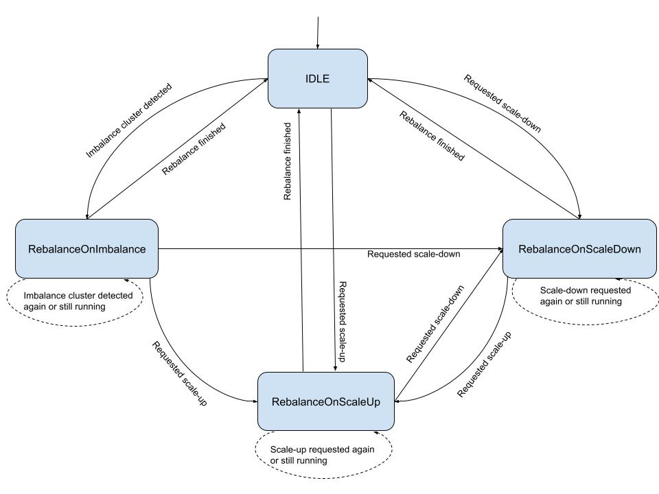
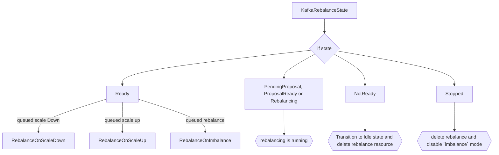

# Auto-rebalance on imbalanced clusters

This proposal introduces support for automatic partition rebalancing whenever a Kafka cluster becomes imbalanced due to unevenly distributed replicas, overloaded brokers, or similar issues.
This feature is opt-in, and when enabled, allows the Strimzi Operator to automatically execute partition rebalances through `KafkaRebalance` custom resources whenever partition imbalances are detected by Cruise Control.

## Motivation

Currently, if the cluster is imbalanced, the user would need to manually rebalance the cluster by using the `KafkaRebalance` custom resource.
With smaller clusters, it is feasible to fix things manually. However, for larger ones it can be very time-consuming, or just not feasible, to fix all the imbalances on your own.
It would be useful for users of Strimzi to be able to have these imbalanced clusters balanced automatically.

### Introduction to Self Healing in Cruise Control

In order to understand how we plan to automatically fix unbalanced Kafka clusters, the sections below will go over how Cruise Control's anomaly detection and self-healing features work to detect the anomalies in the cluster and fix them.


The above flow diagram depicts the self-healing process in Cruise Control.
The anomaly detector manager detects an anomaly (using the detector classes) and forwards it to the notifier.
The notifier then decides what action to take on the anomaly whether to fix it, ignore it or delay.
Cruise Control provides various notifiers to alert the users about the detected anomaly in several ways like Slack, Alerta, MS Teams etc.

#### Anomaly Detector Manager

The anomaly detector manager helps in detecting the anomalies as well as handling them.
It acts as a coordinator between the detector classes and the classes which will handle resolving the anomalies.
Various detector classes like `GoalViolationDetector`, `DiskFailureDetector`, `KafkaBrokerFailureDetector` etc. are used for the anomaly detection, which runs periodically to check if the cluster has their corresponding anomalies or not.
The frequency of this check can be changed via the `anomaly.detection.interval.ms` configuration.
Detector classes use different mechanisms to detect their corresponding anomalies.
For example, `KafkaBrokerFailureDetector`, `DiskFailureDetector` and `TopicAnomalyDetector` utilises Kafka Admin API while `MetricAnomalyDetector` use metrics and `GoalViolationDetector` uses the load distribution (calculated by Cruise Control itself) to detect their anomalies.
The detected anomalies can be of various types:
* Goal Violation - This happens if certain [optimization goals](https://strimzi.io/docs/operators/in-development/deploying#optimization_goals) are violated (e.g. DiskUsageDistributionGoal etc.). These goals can be configured through the `self.healing.goals` option in the Cruise Control configuration.  However, this option is currently forbidden in the `spec.cruiseControl.config` section of the `Kafka` CR.
* Topic Anomaly - When one or more topics in the cluster violate user-defined properties (e.g. some partitions are too large on disk, the replication factor of a topic is different from a given default value etc).
* Broker Failure - This happens when a non-empty broker crashes or leaves a cluster for a long time.
* Disk Failure - This failure happens when one of the non-empty disks fails (in a Kafka cluster with JBOD disks).
* Metric anomaly - This failure happens if metrics collected by Cruise Control have some anomaly in their value (e.g. a sudden rise in the log flush time metrics).

The detected anomalies are inserted into a priority queue where the comparator is based upon the priority value.
The smaller the priority value is, the higher priority the anomaly type has.

The anomaly detector manager calls the notifier to get an action regarding whether the anomaly should be fixed, delayed, or ignored.
If self-healing is enabled and the action is `FIX`, then the anomaly detector manager calls the classes that are required to resolve the anomaly.

Anomaly detection also has various [configurations](https://github.com/linkedin/cruise-control/wiki/Configurations#anomalydetector-configurations), such as the detection interval and the anomaly notifier class, which can affect the performance of the Cruise Control server and the latency of the anomaly detection.

#### Notifiers in Cruise Control

Whenever anomalies are detected, Cruise Control provides the ability to notify the user regarding the detected anomalies using optional notifier classes.
The notification sent by these classes increases the visibility of the operations that are taken by Cruise Control.
The notifier class used by Cruise Control is configurable and custom notifiers can be used by setting the `anomaly.notifier.class` property.
The notifier class returns the `action` that is going to be taken on the flagged anomaly.
These actions have three types:
* `FIX` - Fix the anomaly
* `CHECK` - Check the anomaly at a later time
* `IGNORE` - Ignore the anomaly

The default notifier enabled by Cruise Control is the  `NoopNotifer`.

* This notifier always returns `IGNORE` which means that the anomaly detector manager won't use any class to fix the anomaly.
* This notifier doesn't implement any notification mechanism to the users.

Cruise Control also provides [custom notifiers](https://github.com/linkedin/cruise-control/wiki/Configure-notifications) like Slack Notifier, Alerta Notifier etc. for notifying users regarding the anomalies.
There are multiple other [self-healing notifier](https://github.com/linkedin/cruise-control/wiki/Configurations#selfhealingnotifier-configurations) related configurations you can use to make notifiers more efficient as per the use case.

#### Self Healing

If self-healing is enabled, then an action is returned by the notifier to make a decision whether the anomaly should be fixed or not.
If the notifier has returned `FIX` as the action then the classes which are responsible for resolving the anomaly would be called.
Each detectable anomaly is handled by a specific detector class which then uses another remediation class to run a fix.
For example, the `GoalViolations` class uses the `RebalanceRunnable` class, the `DiskFailure` class use the `RemoveDisksRunnable` class and so on.
An optimization proposal (a collection of replica reassignments and partition leadership changes) will then be generated by these `Runnable` classes and that proposal will be applied on the cluster to fix the anomaly.
In case the anomaly detected is unfixable for e.g. violated hard goals that cannot be fixed typically due to lack of physical hardware (insufficient number of racks to satisfy rack awareness, insufficient number of brokers to satisfy Replica Capacity Goal, or insufficient number of resources to satisfy resource capacity goals), the anomaly wouldn't be fixed and the Cruise Control will log a warning with the `self-healing is not possible due to unfixable goals` message.

## Current situation

Even under normal operation, it's common for Kafka clusters to encounter problems such as partition key skew leading to an uneven partition distribution, or hardware issues like disk failures, which can degrade overall cluster's health and performance.
In Strimzi's current implementation of Cruise Control, fixing these issues needs to be triggered manually i.e. if the cluster is imbalanced then a user might instruct Cruise Control to move the partition replicas across the brokers in order to fix the imbalance using the `KafkaRebalance` custom resource.

Users can currently enable anomaly detection and can also [set](https://strimzi.io/docs/operators/latest/full/deploying.html#setting_up_alerts_for_anomaly_detection) the notifier to one of those included with Cruise Control (`SelfHealingNotifier`, `AlertaSelfHealingNotifier`, `SlackSelfHealingNotifier` etc.).
All the `self.healing` prefixed properties are currently disabled in Strimzi's Cruise Control integration because, initially, it was not clear how self-healing would act if pods were rolled in the middle of rebalances or how Strimzi triggered manual rebalances should interact with Cruise Control triggered self-healing ones.

### Proposal

This proposal is concerned with giving users the option to have their Kafka cluster's balanced automatically whenever they become imbalanced due to overloaded broker, CPU usage etc.
However, the proposal is not to rely on the Cruise Control self-healing implementation directly.
If we were to enable that functionality then, in response to detected anomalies, Cruise Control would issue partition reassignments without involving the Strimzi Cluster Operator.
This could cause potential conflicts with other administration operations and is the primary reason self-healing has been disabled until now.
To resolve this issue, we will only make use of Cruise Control's anomaly detection ability, the triggering of the partition reassignments (rebalance) will be the responsibility of the Strimzi Cluster Operator.
To enable this, we will use an approach based on the existing auto-rebalance for scaling feature (see the [documentation](https://strimzi.io/docs/operators/latest/deploying#proc-automating-rebalances-str) for more details).
We propose using only those anomaly detection classes, related to goal violations, that can be addressed by a partition rebalance.
We will not enable the other anomaly detection classes, related to goal violations, that would require manual interventions at the infrastructure level such as disk or broker failures.
For the latter case, it would be better to spin up new disks or to fix the issue with the broker(s) directly instead of just moving the partitions replicas away from them through rebalancing.
Therefore, given the interventions required, it would be non-trivial for the Strimzi Operator to fix these failures automatically.
Hence, these are not goals of this proposal and could be addressed later in separate proposals.
Following the above approach will provide several advantages:
* we ensure that the operator controls all rebalance and cluster remediation operations.
* using the existing `KafkaRebalance` CR system gives more visibility into what is happening and when, which (as we don't support the Cruise Control UI) enhances observability and will also aid in debugging.

### `imbalance` mode in Strimzi's auto-rebalancing feature

The [`auto-rebalancing`](https://strimzi.io/docs/operators/latest/deploying#proc-automating-rebalances-str) feature in Strimzi allows the operator to run a rebalance automatically when a Kafka cluster is scaled up (by adding brokers) or scaled down (by removing brokers).

Auto-rebalancing in Strimzi currently supports two modes:
* `add-brokers` - auto-rebalancing on scale up
* `remove-brokers` - auto-rebalancing on scale down

To leverage the automated rebalance on imbalanced cluster (those with detected Goal violations), we will be introducing a new mode to the auto-rebalancing feature.
The new mode will be called `imbalance`, which means that cluster imbalance was detected and rebalancing should be applied to all the brokers.
The imbalance mode is configured by creating a new object in the `spec.cruiseControl.autoRebalance` list with its `mode` field set to `imbalance` and the corresponding rebalancing configuration is defined as a reference to a template `KafkaRebalance` custom resource, by using the `spec.cruiseControl.autoRebalance.template` field as a [LocalObjectReference](https://kubernetes.io/docs/reference/kubernetes-api/common-definitions/local-object-reference/).
The `template` field is optional and if not specified, the auto-rebalancing runs with the default Cruise Control configuration (i.e. the same used for unmodified manual `KafkaRebalance` invocations).
To provide users more flexibility, they only have to configure the auto-rebalance modes they wish to use whether it be `add-brokers`, `remove-brokers`, or `imbalance`.
When the auto-rebalance configuration is set with `imbalance` mode enabled, the operator will trigger a partition rebalance whenever a goal violation is detected by the anomaly detector.
To trigger the auto-rebalance, the operator must know that the cluster is imbalanced due to some goal violation anomaly.
We will create our own custom notifier named `StrimziCruiseControlNotifier` to do this.
This notifier's job will be to update the operator regarding the goal violations so that the operator can trigger a rebalance (see section [StrimziCruiseControlNotifier](./106-auto-rebalance-on-imbalanced-clusters.md#strimzicruisecontrolnotifier)).
With this proposal, we are only going to support auto-rebalance on imbalanced cluster.
We also plan to implement the same for topic and metrics related issues, but it will be part of future work since their implementation require different approaches.
For example, when dealing with topic related issues, it will require a coordination with topic operator and metrics issues will require coordination with the Kafka API.

Here is an example of what the configured `Kafka` custom resource could look like:

```yaml
apiVersion: kafka.strimzi.io/v1beta2
kind: Kafka
metadata:
  name: my-cluster
spec:
  kafka:
  # ...
  cruiseControl:
    # ...
    autoRebalance:
      # using the imbalance rebalance mode
      - mode: imbalance
        template:
          name: my-imbalance-rebalance-template
```

It is also possible to use the default Cruise Control rebalancing configuration by omitting the `template` field.

The configuration for Cruise Control rebalance is provided through a `KafkaRebalance` custom resource which is specifically defined as a template and is referenced in the `template` field in the example above.
A `KafkaRebalance` custom resource with the `strimzi.io/rebalance-template: true` annotation set can be used as a template.
When a `KafkaRebalance` with this annotation is created, the cluster operator doesn't run any rebalancing.
This is not an actual rebalance request to get an optimization proposal; it is simply where the configuration for auto-rebalancing is defined.

Here is an example template:

```yaml
apiVersion: kafka.strimzi.io/v1beta2
kind: KafkaRebalance
metadata:
  name: my-imbalance-rebalance-template
  annotations:
    strimzi.io/rebalance-template: "true" # specifies that this KafkaRebalance is a rebalance configuration template
spec:
  goals:
    - CpuCapacityGoal
    - NetworkInboundCapacityGoal
    - DiskCapacityGoal
    - RackAwareGoal
    - MinTopicLeadersPerBrokerGoal
    - NetworkOutboundCapacityGoal
    - ReplicaCapacityGoal
  skipHardGoalCheck: true
  # ... other rebalancing related configuration
```
When the `template` is set, the operator automatically creates (or updates) a corresponding `KafkaRebalance` custom resource (based on the template) when an anomaly is detected and notified by the `StrimziCruiseControlNotifier`
The operator copies over goals and rebalancing options from the referenced `template` resource to the generated rebalancing one.
If the user has not configured the anomaly detection goals in Cruise Control section of the Kafka CR then the operator would set the default goals to be used by the anomaly detector. 
The default anomaly detection goals set by the operator are RACK_AWARENESS_GOAL, MIN_TOPIC_LEADERS_PER_BROKER_GOAL, REPLICA_CAPACITY_GOAL, DISK_CAPACITY_GOAL. 
These are similar to the default goals used in for KafkaRebalance if the users don't mention the rebalance goals.
If the user specifies a rebalance template then the goals mentioned in the rebalance template will be validated against the anomaly detection goals being used by Cruise Control.
The goals in the rebalance template should be either the same or be a subset of the anomaly detection goals being used by Cruise Control.
This is to ensure rebalances are only being run with goals that Cruise Control is checking for anomalies.
The `KafkaRebalance` has 4 modes: `full`, `add-broker`, `remove-broker` and `remove-disks` mode.
The `imbalance` mode will be mapped to the `full` mode in the generated KafkaRebalance resource which means that generated `KafkaRebalance` custom resource will have the mode set as `full` which within the Strimzi rebalancing operator means calling the Cruise Control API to run a rebalancing taking all brokers into account.

The generated `KafkaRebalance` custom resource will be called `<my-cluster-name>-auto-rebalancing-imbalance-<anomalyId>`, where the `<my-cluster-name>` part comes from the `metadata.name` in the `Kafka` custom resource, and `imbalance` refers to applying the rebalance to all the brokers and the `<anomalyId>` would be retrieved from the notifier.

```yaml
apiVersion: kafka.strimzi.io/v1beta2
kind: KafkaRebalance
metadata:
  name: my-cluster-auto-rebalancing-imbalance-<anomalyID>
  finalizers:
    - strimzi.io/auto-rebalancing
spec:
  mode: full
  goals:
    - CpuCapacityGoal
    - NetworkInboundCapacityGoal
    - DiskCapacityGoal
    - RackAwareGoal
    - MinTopicLeadersPerBrokerGoal
    - NetworkOutboundCapacityGoal
    - ReplicaCapacityGoal
  skipHardGoalCheck: true
  # ... other rebalancing related configuration
```

The operator also sets a finalizer, named `strimzi.io/auto-rebalancing`, on the generated `KafkaRebalance` custom resource.
This is needed to avoid the user, or any other tooling, deleting the resource while the auto-rebalancing is still running.
The finalizer is removed when Cruise Control indicates that the partition reassignment (rebalance) process has finished allowing the generated `KafkaRebalance` custom resource to be deleted by the operator itself.
In case the rebalance finishes with error, the error message will be propagated to the Kafka custom resource just like we do for the `remove-broker` and `add-broker` endpoint and the generated `KafkaRebalance` will be deleted.

#### StrimziCruiseControlNotifier

Cruise Control provides the `AnomalyNotifier` interface, which has multiple abstract methods on what to do if certain anomalies are detected.
Some of those methods are:`onGoalViolation()`, `onBrokerFailure()`, `onDiskFailure`, `alert()`.
The `StrimziCruiseControlNotifier` will implement the `AnomalyNotifier` interface.
Every detected anomaly is placed in a priority queue and each of the anomalies have a priority value assigned to them.
Since we are working with only goal related violations, every anomaly will have same priority.
This means that detected anomalies will be fixed on a first come, first served basis.
In situations where the anomaly is unfixable, due to issues like a lack of physical hardware (e.g. insufficient number of racks to satisfy rack awareness, insufficient number of brokers to satisfy `ReplicaCapacityGoal`, or insufficient number of resources to satisfy resource capacity goals), then they will be ignored and the user will be alerted via a condition in the Kafka CR status.
The `StrimziCruiseControlNotifier` will be kept in a separate repository and will override all the methods declared by the `AnomalyNotifier` interface.
We will provide a concrete implementations of the `AnomalyNotifier.alert` method which will alert the operator whenever an anomaly is detected by the operator.
Upon detection of an anomaly, the notifier would create (if it doesn't already exist) or update a ConfigMap with the name `<cluster-name>-goal-violation-map`.
This ConfigMap will contain all the detected anomalies for a given Kafka cluster.

The ConfigMap will look like this:

```yaml
kind: ConfigMap
apiVersion: v1
metadata:
  name: my-cluster-goal-violation-map
data:
  fixableAnomalies: |
    - <anomaly-id-1>:
        - <fixable-goal-1>
        - <fixable-goal-2>
    - <anomaly-id-2>:
        - <fixable-goal-3> 
# ...
```

The advantages of using a single ConfigMap for all the detected anomalies versus one per anomaly are:
1. It provides a single point of reference for all the anomalies
2. When dealing with multiple Kafka clusters, the number of ConfigMap(s) created will be equal to the number of clusters deployed

This generated ConfigMap will contain the list of fixable goal violation anomalies in the section named `fixableAnomalies`.
The `fixableAnomalies` list will state the `anomalyId` of the anomaly as well as the fixable violated goals.
The `fixableAnomalies` list will be populated by the notifier every time it detects an anomaly.
Whenever a rebalance is about to be triggered by the operator the `fixableAnomalies` list will be cleared.
This will be the case for manual rebalances triggered by the user, as well as auto-rebalance rebalances that are happening in `add-broker`, `remove-broker`, or `imbalance` mode.
This is because not matter the reason for triggering the rebalance it is possible that the rebalance will address some or all of the detected anomalies.
If some other anomalies are detected again after the rebalance then they will be updated in the ConfigMap by the notifier and an `imbalance` related rebalance will take place.

The ConfigMap will also have an optional field called `unfixableAnomalies` list which would be created only when an unfixable anomaly is detected i.e. an anomaly having unfixable goals.

```yaml
kind: ConfigMap
apiVersion: v1
metadata:
  name: my-cluster-goal-violation-map
data:
  fixableAnomalies: |
    - <anomaly-id-1>:
        - <fixable-goal-1>
        - <fixable-goal-2>
    - <anomaly-id-2>:
        - <fixable-goal-3> 
  unfixableAnomalies: |
    - <anomaly-id-3>:
        - <unfixed-goal-1>
        - <unfixed-goal-2>
    - <anomaly-id-4>:
        - <unfixed-goal-3> 
# ...
```
The `unfixableAnomalies` list will state the `anomalyId` as well as the unfixable goals associated with them.
The operator will use the `unfixableAnomalies` list to check if there are anomalies with unfixable goals or not.
If the list is not empty then the operator will create a `warning` condition based on the unfixable goal and add it to the `Kafka` CR status.

In case we get an anomaly which has both fixable goals and unfixable goals, we will still `IGNORE` that anomaly. 
This is because Cruise Control won't be able to generate a proposal that can fix all the configured goals for rebalance.

The created ConfigMap will persist when `imbalance` mode is enabled for auto-rebalance and will be deleted if the user decides to remove `imbalance` mode from `spec.kafka.cruiseControl.autoRebalance`.

#### What happens if same anomaly type is detected while the auto-rebalance/manual rebalance is happening

The anomaly detector continues to run, even when a rebalance has been triggered.
Therefore, it is possible that it may detect an anomaly that is currently in the process of being fixed.
If we logged the anomaly in the ConfigMap, we may then trigger another rebalance for an anomaly that was fixed by the ongoing rebalance.
This could result in the operator running multiple rebalances for the anomaly and therefore running a lot of unnecessary rebalances.

To tackle this problem we will ignore all the anomalies that are detected while a rebalance is ongoing.
We will place a check in the auto-rebalance reconciler class which will make sure that if a rebalance is running and a new anomaly is detected, then the anomaly is not added to the `fixableAnomalies` list.
This way we can avoid the rebalance for the same anomaly which is detected again.
It is possible that a new anomaly was ignored in the process but the anomaly detector will detect it again in case the rebalance didn't fix it so we don't have to worry about it.

The above also holds true for the manual rebalances.
If a user is running a manual rebalance, and some anomaly is detected while it is happening, we should still not add it to the `fixable` anomalies list.

#### Using other notifiers when using `imbalance` mode

Users cannot configure the notifier if they are utilising the auto-rebalance on imbalanced cluster.
This is because the operator is using our custom notifier for getting alerts about goal violations.
If the users try to override the notifier while the `imbalance` mode is enabled, then the operator will add warnings in the status field of the Kafka CR and ignore the changes made by the user.

```yaml
status:
  autoRebalance:
    state: Idle
    lastTransitionTime: "2025-09-22T16:04:00Z"
    modes:
      - mode: imbalance
  conditions:
    - type: Warning
      status: "True"
      reason: UnsupportedOperationException
      message: |
        Notifier cannot be overridden since `imbalance` mode is enabled in the `auto-rebalance` configuration
```

If the users really want to have their own way of dealing with the imbalanced clusters then they can disable auto-rebalance in `imbalance` mode and use their own notifier. 

#### What happens if an unfixable goal violation happens

Cruise Control has the ability to figure out if a goal violation can be fixed by the generated optimization proposal or not.
The goal optimizer class does this job by doing analysis/dry-run if we can fix the anomaly by the generated proposal or not.
If a goal such as the `DiskDistributionUsage` goal is violated, but we cannot fix it since the all the disks are already completely populated, then it is marked as unfixable.
We can retrieve those unfixable goals by using the `hasUnfixableGoals` utility provided by the `AnomalyDetectorUtils` class present in Cruise Control.
The notifier based on list returned by this utility checks if there are unfixable goals detected or not. If the list is not empty then the notifier will set the action on the anomaly as `IGNORE` and that anomaly will be ignored.
The notifier will also update the ConfigMap with a `unfixableAnomalies` list and put the goal which cannot be fixed by rebalancing there so that the operator can then set a warning condition based on the unfixable anomaly in the status of the `Kafka` CR:

```yaml
status:
  autoRebalance:
    state: Idle 
    lastTransitionTime: "2025-09-22T16:04:00Z"
    modes:
      - mode: imbalance
  conditions:
    - type: Warning
      status: "True"
      reason: UnfixableViolatedGoal
      message: |
        The detected <anomaly> has unfixable `DiskDistributionGoal` goal.
```

#### Stopping a running rebalance

To stop a running rebalance the user can apply the `strimzi.io/rebalance=stop` annotation on the generated `KafkaRebalance` resource. This would stop the running rebalance and the stopped `KafkaRebalance` resource will be deleted. The user will need to make sure that they disable the `auto-rebalance` mode after they have stopped the rebalance otherwise the rebalance would be triggered again since the anomalies are still present in the cluster.

#### Metrics for tracking the rebalance requests

If the users want to track when the auto-rebalances happen, they can access the Strimzi [metrics](https://github.com/strimzi/strimzi-kafka-operator/blob/main/examples/metrics/grafana-dashboards/strimzi-operators.json#L712) for the `KafkaRebalance` custom resources, this includes when they were visible/created.
These metrics also cover the `KafkaRebalance`(s) which were created automatically, so the users can utilize them to understand when an auto-rebalance was triggered in their cluster.
We will add labels to the metrics to differentiate the created rebalance on basis of mode i.e. the rebalance was triggered for full (for imbalanced cluster), add-broker or remove-broker mode.

### Auto-rebalancing execution for `imbalance` mode

#### Auto-rebalancing Finite State Machine (FSM) for `imbalance` mode

Currently, the auto-rebalancing mechanism runs through a Finite State Machine (FSM) made by the following states:

* **Idle**: Initial state with a new auto-rebalancing initiated when scaling down/up operations were requested. This is also the ending state after an auto-rebalancing completed successfully or failed.
* **RebalanceOnScaleDown**: a rebalancing related to a scale down operation is running.
* **RebalanceOnScaleUp**: a rebalancing related to a scale up operation is running.

With the new `imbalance` mode, we will be introducing a new state to the FSM called `RebalanceOnImbalance`.
This state will be associated with rebalances triggered by imbalanced cluster.

With the new `imbalance` mode, the FSM state transitions would look something like this:



* from **Idle** to:
  * **RebalanceOnScaleDown**: if a scale down operation was requested. This transition happens even if a scale up was requested at the same time but the rebalancing on scaling down has the precedence. The rebalancing on scale up is queued. They will run sequentially.
  * **RebalanceOnScaleUp**: if only a scale up operation was requested. There was no scale down operation requested.
  * **RebalanceOnImbalance**: if a ConfigMap related to goal violation was detected, and the `fixableAnomalies` list is not empty while the `unfixableAnomalies` list is empty. If there are queued scale up or scale down operations, then they will run first.

* from **RebalanceOnScaleDown** to:
  * **RebalanceOnScaleDown**: if a rebalancing on scale down is still running or another one was requested while the first one ended.
  * **RebalanceOnScaleUp**: if a scale down operation was requested together with a scale up and, because they run sequentially, the rebalance on scale down had the precedence, was executed first and completed successfully. We can now move on with rebalancing for the scale up.
  * **Idle**: if a scale down operation was requested, it was executed and completed successfully/failed or a full rebalance was asked due to an anomaly but since the scale-down rebalance is done, we can ignore the anomalies assuming they are fixed by the rebalance. In case, they are not fixed, Cruise Control will detect them again and a new rebalance would be requested.

* from **RebalanceOnScaleUp**:
  * **RebalanceOnScaleUp**: if a rebalancing on scale up is still running or another one was requested while the first one ended.
  * **RebalanceOnScaleDown**: if a scale down operation was requested, so the current rebalancing scale up is stopped (and queued) and a new rebalancing scale down is started. The rebalancing scale up will be postponed.
  * **Idle**: if a scale up operation was requested, it was executed and completed successfully/failed or a full rebalance was asked due to an anomaly but since the scale-up rebalance is done, we can ignore the anomalies assuming they are fixed by the rebalance. In case, they are not fixed, Cruise Control will detect them again and a new rebalance would be requested.

* from **RebalanceOnImbalance**:
  * **RebalanceOnImbalance**: if another goal violation was detected while the first one ended or rebalance is still running.
  * **RebalanceOnScaleUp**: if a rebalancing on scale up is queued and will run if there is no other rebalancing scale down in queue. If a rebalancing scale down is in queue then it will be executed first.
  * **RebalanceOnScaleDown**: if a scale down operation was requested, it will run once the full rebalance is completed.
  * **Idle**: if full rebalance was requested, it was executed and completed successfully or failed.

On each reconciliation, the following process will be used:

1. The `KafkaClusterCreator` creates the `KafkaCluster` instance.
2. The `KafkaAutoRebalancingReconciler.reconcile()` will then check if there was any ConfigMap created with name `<cluster-name>-goal-violation-map` and whether the `fixableAnomalies` and `unfixableAnomalies` list is empty or not, then the `full` rebalance (imbalance mode) would be performed if the `unfixableAnomalies` list is empty and the `fixableAnomalies` list is not empty.
3. If a rebalance is already ongoing and more anomalies are detected, then the operator will just ignore the new anomalies and delete all the anomalies from the `fixableAnomalies` list in the ConfigMap. Any anomalies that are not resolved by the ongoing rebalance will be redetected by the anomaly detector once the FSM returns to the `Idle` state.

The `KafkaAutoRebalancingReconciler.reconcile()` also loads the `Kafka.status.autoRebalance` content:

* `state`: is the FSM state
* `lastTransitionTime`: when the transition to that state happened.
* `modes`: enabled modes (`remove-brokers`, `imbalance` and/or `add-brokers`) if an auto-rebalancing requested.

The FSM is initialized based on the `state` field.

Let's see what happens during the auto-rebalancing process when the FSM starts from the **Idle** state and transitions to **RebalanceOnImbalance**.

#### Idle

This state is set since the beginning when a `Kafka` custom resource is created with the `spec.cruiseControl.autoRebalance` field.
It is also the end state of a previous successfully completed or failed auto-rebalancing.
In case of successful completion, once the rebalance moves to `Ready` state, we will delete the generated `KafkaRebalance` and update the `auto-rebalance` state to `Idle`.
In case of failed auto-rebalancing, once the rebalance moves to `NotReady` state, we will propagate error to the Kafka CR, delete the generated `KafkaRebalance` and the state will be set to `Idle`.
In this state, the operator removes the finalizer and deletes the corresponding generated `KafkaRebalance` custom resource.

#### RebalanceOnImbalance

In this state, an anomaly was detected and a ConfigMap was generated by the notifier with a `fixableAnomalies` list.

 A KafkaRebalance resource will now be applied to the cluster to fix the imbalanced cluster. This KafkaRebalance will be based on the template provided by the user, if no template is provided then the KafkaRebalance will be created with default configurations.



Checking the current `KafkaRebalance` status:

* if `Ready`, the rebalance was successful.
  * if there is a queued rebalancing scale down (`Kafka.status.autoRebalance.modes[remove-brokers]` exists), start the rebalancing scale down and transition to **RebalanceOnScaleDown**.
  * if there is a queued rebalancing scale up (`Kafka.status.autoRebalance.modes[add-brokers]` exists), start the rebalancing scale up and transition to **RebalanceOnScaleUp**.
  * If no queued rebalancing scale down or scale up, just transition to **Idle**, clean `Kafka.status.autoRebalance.modes`, delete the generated `KafkaRebalance` custom resource.
* if `PendingProposal`, `ProposalReady` or `Rebalancing`, the rebalancing is still running.
  * No further actions required.
* if `NotReady`
  * the rebalancing failed, transition to **Idle** and also removing the corresponding mode from the status. The operator also deletes the generated `KafkaRebalance` custom resource and empties the ConfigMap.
* if `Stopped`
  * the rebalancing is stopped, transition to **Idle** and also removing the corresponding mode from the status. The operator deletes the generated `KafkaRebalance` custom resource. The users should then disable the `imbalance` mode of auto-rebalance else a new rebalance would be triggered.

If, during an ongoing auto-rebalancing, the `KafkaRebalance` custom resource is not there anymore on the next reconciliation, it could mean the user deleted it while the operator was stopped/crashed/not running.
In this case, the FSM will assume it as falling in the `NotReady` case above.

## Affected/not affected projects

This change will affect the Strimzi cluster operator and a new repository named `strimzi-notifier` will be added under the Strimzi organisation.

## Backwards compatibility

This change will not cause any backwards compatibility issue. The behaviour stated in the proposal is only enabled if the user is making use of the `imbalance` mode of the auto-rebalancing feature.

## Rejected Alternatives

### Using custom resource for interaction between Operator and Cruise Control I

This alternative is about using a Kubernetes custom resource to create a two-way interaction between the operator and Cruise Control.
The idea was to create a Kubernetes custom resource named `KafkaAnomaly` everytime an anomaly was detected.
The user will get updates regarding the anomaly fix through the generated `KafkaAnomaly` resource which would be updated by the operator by requesting the `state` endpoint with `anomaly_detector` and `executor` substates.

Pros:
* More hold on the self-healing process since everything is driven using the Kafka custom resource.

Cons:
* Very tight coupling with the operator.
* Would be hard to manage multiple `KafkaAnomaly` custom resources (For example, deletion when anomaly is fixed etc.)

### Using custom resource for interaction between Operator and Cruise Control II

This alternative is similar to alternative 1 where we will use a Kubernetes custom resource to create a two-way interaction between the operator and Cruise Control.
The idea was to create a Kubernetes custom resource named `KafkaAnomaly` everytime an anomaly was detected and both the operator and the Notifier would watch the resource for updates.
But with this approach the operator will be responsible to make decision regarding the anomaly should be fixed or not

### Using Cruise Control self-healing ability

If we were to enable the self-healing ability of Cruise Control then, in response to detected anomalies, Cruise Control would issue partition reassignments without involving the Strimzi Cluster Operator.
This could cause potential conflicts with other administration operations and is the primary reason self-healing has been disabled until now.

Pros:
* Allows the operator to ignore the anomalies is some task is already running in the cluster like rolling, rebalance etc.

Cons:
* Very tight coupling with the operator.
* Delaying the anomaly detector progress.

### Using Kubernetes Events but Cruise Control controls auto-rebalance

This alternative is to let Cruise Control handle the self-healing.
Whenever an anomaly is detected by Cruise Control, our notifier will generate an event to alert the operator that an anomaly was detected in the cluster
But the fix would be run by Cruise Control itself and not the operator

Pros:
* Loose coupling with the operator
* Faster decison making as Cruise Control runs the fix

Cons:
* Operator wouldn't play any role in the process

## Future Scope
In the future, we plan to introduce auto-rebalance for topic and metrics related imbalances.
As this feature evolves we can even think of having ways to fix issues like disk failure and broker failures automatically since the fix would be driven by the operator.
If the users wants to use their own notifier can be to extend our notifier and use our alert method i.e `super.alert()` first in their `alert()` method implementation.