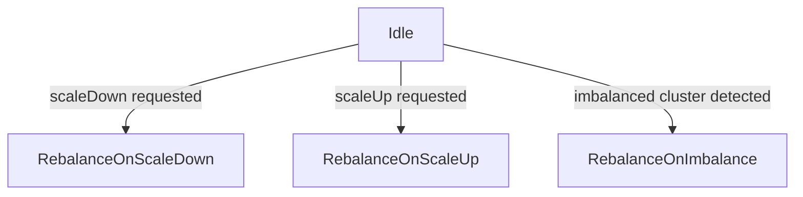
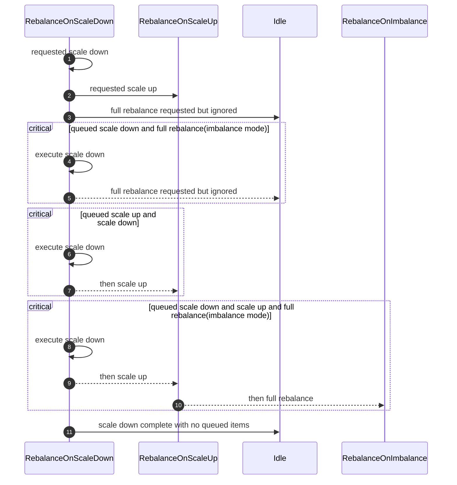
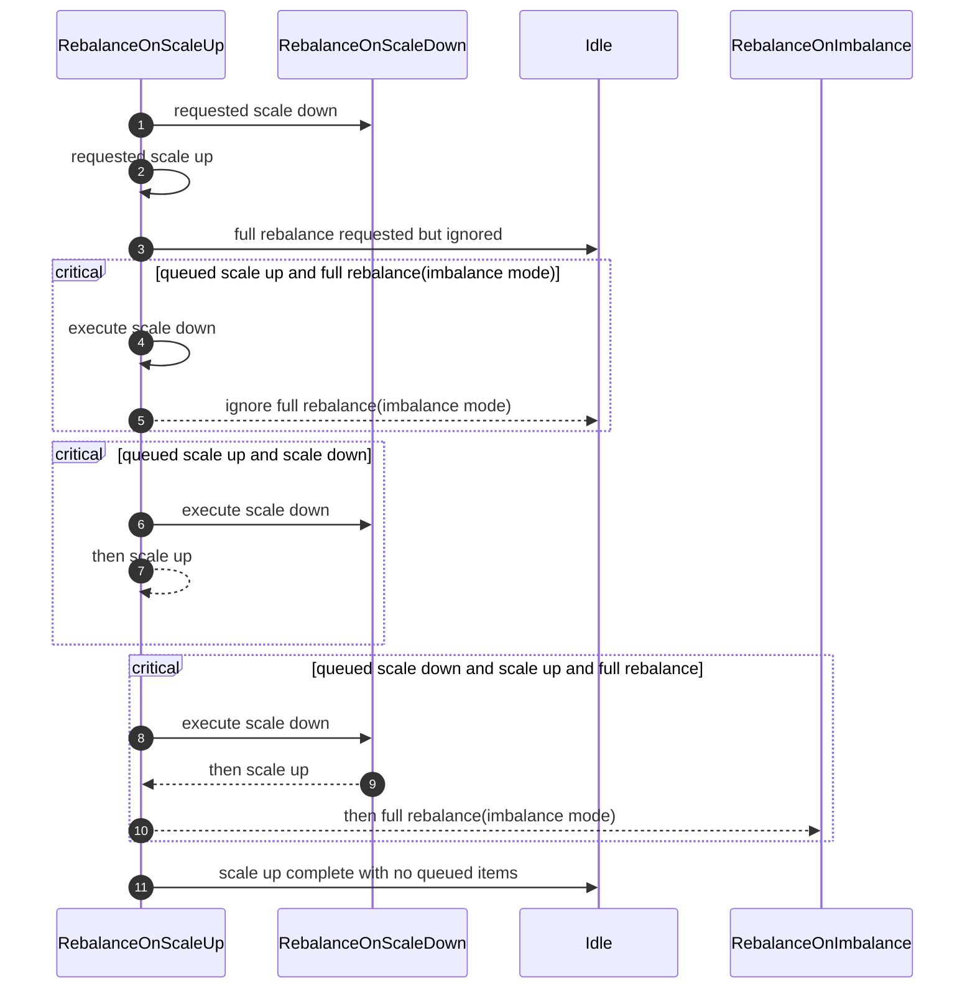
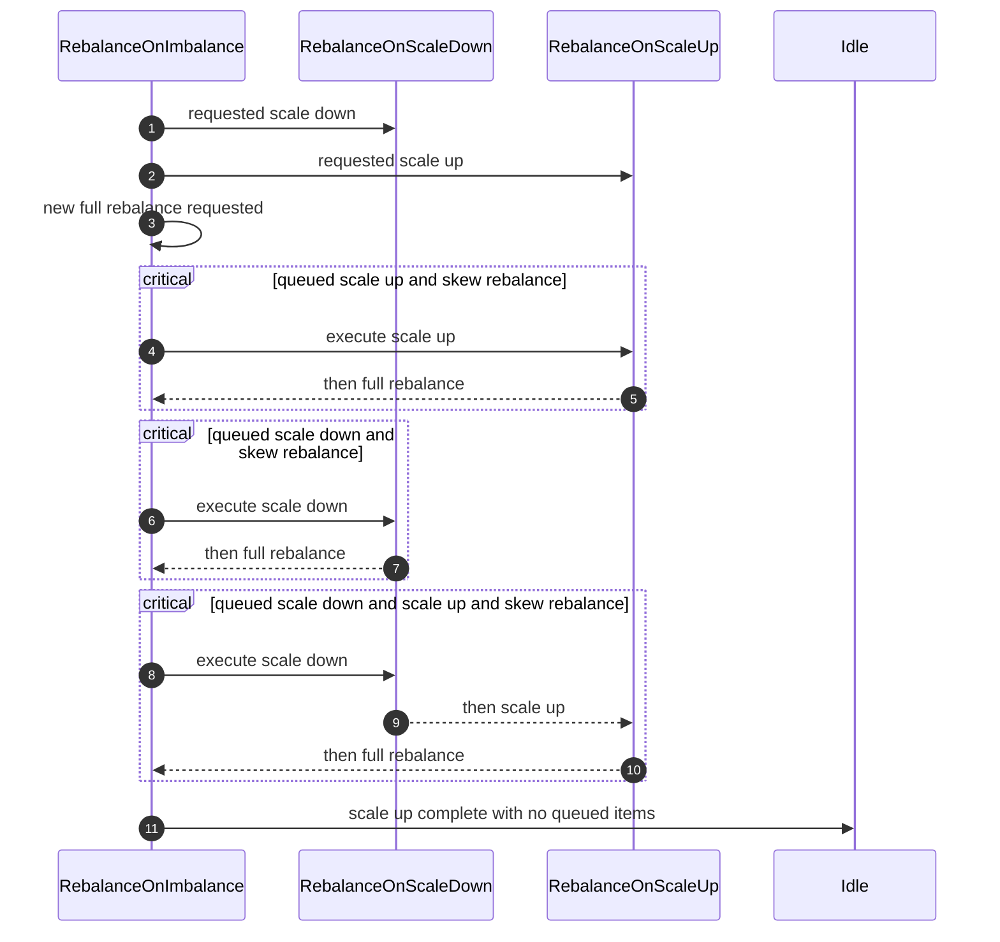
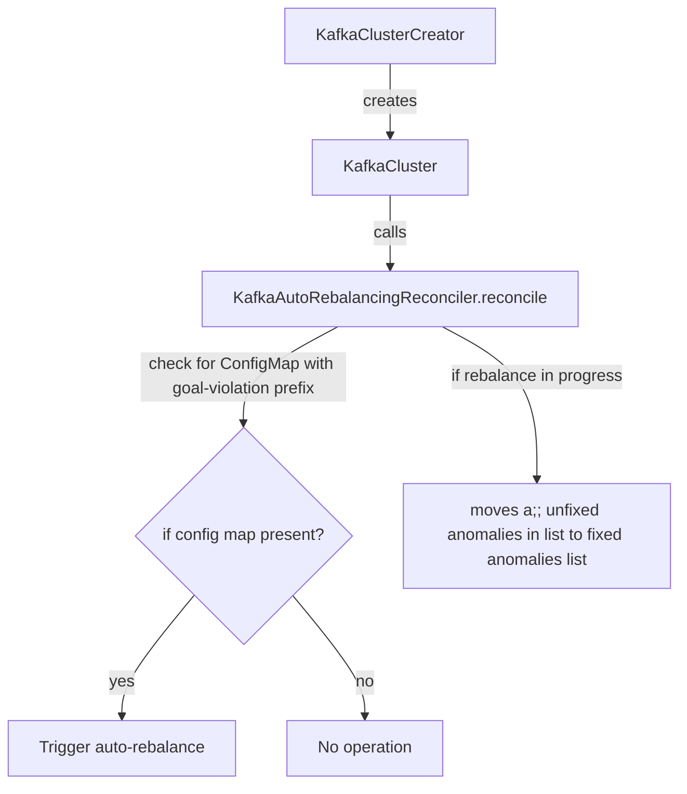
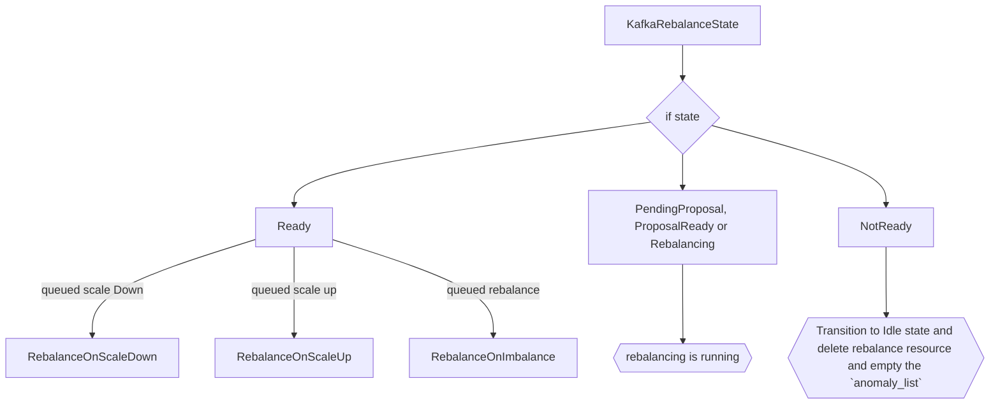

# Auto-rebalance on imbalanced clusters

This proposal introduces support for automatic partition rebalancing whenever a Kafka cluster becomes imbalanced due to unevenly distributed replicas, overloaded brokers, or similar issues.
This feature is opt-in, and when enabled, allows the Strimzi Operator to automatically execute partition rebalances through `KafkaRebalance` custom resources whenever partition imbalances are detected by Cruise Control.

## Motivation

Currently, if the cluster is imbalanced, the user would need to manually rebalance the cluster by using the `KafkaRebalance` custom resource.
With smaller clusters, it is feasible to fix things manually. However, for larger ones it can be very time-consuming, or just not feasible, to fix all the imbalances on your own.
It would be useful for users of Strimzi to be able to have these imbalanced clusters balanced automatically.

### Introduction to Self Healing in Cruise Control

In order to understand how we plan to automatically fix unbalanced Kafka clusters, the sections below will go over how Cruise Control's anomaly detection and self-healing features work to detect the anomalies in the cluster and fix them.


The above flow diagram depicts the self-healing process in Cruise Control.
The anomaly detector manager detects an anomaly (using the detector classes) and forwards it to the notifier.
The notifier then decides what action to take on the anomaly whether to fix it, ignore it or delay.
Cruise Control provides various notifiers to alert the users about the detected anomaly in several ways like Slack, Alerta, MS Teams etc.

#### Anomaly Detector Manager

The anomaly detector manager helps in detecting the anomalies as well as handling them.
It acts as a coordinator between the detector classes and the classes which will handle resolving the anomalies.
Various detector classes like `GoalViolationDetector`, `DiskFailureDetector`, `KafkaBrokerFailureDetector` etc. are used for the anomaly detection, which runs periodically to check if the cluster has their corresponding anomalies or not.
The frequency of this check can be changed via the `anomaly.detection.interval.ms` configuration.
Detector classes use different mechanisms to detect their corresponding anomalies.
For example, `KafkaBrokerFailureDetector` utilises Kafka Admin API whereas `DiskFailureDetector` and `TopicAnomalyDetector` utilises Kafka Admin API.
Furthermore, `MetricAnomalyDetector` use metrics and `GoalViolationDetector` uses the load distribution to detect their anomalies.
The detected anomalies can be of various types:
* Goal Violation - This happens if certain [optimization goals](https://strimzi.io/docs/operators/in-development/deploying#optimization_goals) are violated (e.g. DiskUsageDistributionGoal etc.). These goals can be configured through the `self.healing.goals` option in Cruise Control configuration.  However, this option is forbidden in the `spec.cruiseControl.config` section of the `Kafka` CR.
* Topic Anomaly - When one or more topics in the cluster violate user-defined properties (e.g. some partitions are too large on disk).
* Broker Failure - This happens when a non-empty broker crashes or leaves a cluster for a long time.
* Disk Failure - This failure happens when one of the non-empty disks fails (in a Kafka cluster with JBOD disks).
* Metric anomaly - This failure happens if metrics collected by Cruise Control have some anomaly in their value (e.g. a sudden rise in the log flush time metrics).

The detected anomalies are inserted into a priority queue where the comparator is based upon the priority value.
The smaller the priority value is, the higher priority the anomaly type has.

The anomaly detector manager calls the notifier to get an action regarding whether the anomaly should be fixed, delayed, or ignored.
If self-healing is enabled and the action is `FIX`, then the anomaly detector manager calls the classes that are required to resolve the anomaly.

Anomaly detection also has various [configurations](https://github.com/linkedin/cruise-control/wiki/Configurations#anomalydetector-configurations), such as the detection interval and the anomaly notifier class, which can affect the performance of the Cruise Control server and the latency of the anomaly detection.

#### Notifiers in Cruise Control

Whenever anomalies are detected, Cruise Control provides the ability to notify the user regarding the detected anomalies using optional notifier classes.
The notification sent by these classes increases the visibility of the operations that are taken by Cruise Control.
The notifier class used by Cruise Control is configurable and custom notifiers can be used by setting the `anomaly.notifier.class` property.
The notifier class returns the `action` that is going to be taken on the flagged anomaly.
These actions have three types:
* `FIX` - Fix the anomaly
* `CHECK` - Check the anomaly at a later time
* `IGNORE` - Ignore the anomaly

The default notifier enabled by Cruise Control is the  `NoopNotifer`.

* This notifier always returns `IGNORE` which means that the anomaly detector manager won't use any class to fix the anomaly.
* This notifier doesn't implement any notification mechanism to the users.

Cruise Control also provides [custom notifiers](https://github.com/linkedin/cruise-control/wiki/Configure-notifications) like Slack Notifier, Alerta Notifier etc. for notifying users regarding the anomalies.
There are multiple other [self-healing notifier](https://github.com/linkedin/cruise-control/wiki/Configurations#selfhealingnotifier-configurations) related configurations you can use to make notifiers more efficient as per the use case.

#### Self Healing

If self-healing is enabled, then an action is returned by the notifier to make a decision whether the anomaly should be fixed or not.
If the notifier has returned `FIX` as the action then the classes which are responsible for resolving the anomaly would be called.
Each detectable anomaly is handled by a specific detector class which then uses another remediation class to run a fix.
For example, the `GoalViolations` class uses the `RebalanceRunnable` class, the `DiskFailure` class use the `RemoveDisksRunnable` class and so on.
An optimization proposal (a collection of replica reassignments and partition leadership changes) will then be generated by these `Runnable` classes and that proposal will be applied on the cluster to fix the anomaly.
In case the anomaly detected is unfixable for e.g. violated hard goals that cannot be fixed typically due to lack of physical hardware (insufficient number of racks to satisfy rack awareness, insufficient number of brokers to satisfy Replica Capacity Goal, or insufficient number of resources to satisfy resource capacity goals), the anomaly wouldn't be fixed and the Cruise Control will log a warning with the `self-healing is not possible due to unfixable goals` message.

## Current situation

Even under normal operation, it's common for Kafka clusters to encounter problems such as partition key skew leading to an uneven partition distribution, or hardware issues like disk failures, which can degrade overall cluster's health and performance.
Currently, in any such scenario these issues need to be fixed manually i.e. if the cluster is imbalanced then a user might instruct Cruise Control to move the partition replicas across the brokers in order to fix the imbalance using the `KafkaRebalance` custom resource.

Users can currently enable anomaly detection and can also [set](https://strimzi.io/docs/operators/latest/full/deploying.html#setting_up_alerts_for_anomaly_detection) the notifier to one of those included with Cruise Control (`SelfHealingNotifier`, `AlertaSelfHealingNotifier`, `SlackSelfHealingNotifier` etc.).
All the `self.healing` prefixed properties are currently disabled in Strimzi's Cruise Control integration because, initially, it was not clear how self-healing would act if pods were rolled in middle of rebalances or how Strimzi triggered manual rebalances should interact with Cruise Control triggered self-healing ones.

### Proposal

This proposal allows the users to have their cluster balanced automatically whenever the cluster gets imbalanced due to overloaded broker, CPU usage etc.
If we were to enable the self-healing ability of Cruise Control then, in response to detected anomalies, Cruise Control would issue partition reassignments without involving the Strimzi Cluster Operator.
This could cause potential conflicts with other administration operations and is the primary reason self-healing has been disabled until now.
To resolve this issue, we will only make use of Cruise Control's anomaly detection ability, the triggering of the partition reassignments (rebalance) will the responsibility of the Strimzi Cluster Operator.
To enable this, we will use approach based on the existing auto-rebalance for scaling feature (see the [documentation](https://strimzi.io/docs/operators/latest/deploying#proc-automating-rebalances-str) for more details).
We will be using the anomaly detection classes related to goal violations that can be addressed by a partition rebalances but not other anomaly detection classes related to goal violations that would require manual intervention like disk or broker failures.
The reason behind this is that disk failures and broker failures can cannot be fixed by rebalancing alone, they require manual intervention.
It would much easier to spin up a new disk in case of disk failures and in the same way it is better to fix the issue with the broker directly instead of just moving the partitions replicas away from it through rebalancing. 
Therefore, it would be non-trivial for the Strimzi Operator to fix these failures, hence these are not goals of this proposal and might be addressed later in a separate proposals.
Following the above approach will provide us with the following advantages:
* we ensure that the operator controls all rebalance and cluster remediation operations.
* using the existing `KafkaRebalance` CR system gives more visibility into what is happening and when, which (as we don't support the Cruise Control UI) enhances observability and will also aid in debugging.

### `imbalance` mode in Strimzi's auto-rebalancing feature

The [`auto-rebalancing`](https://strimzi.io/docs/operators/latest/deploying#proc-automating-rebalances-str) feature in Strimzi allows the operator to run a rebalance automatically when a Kafka cluster is scaled up (by adding brokers) or scaled down (by removing brokers).

Auto-rebalancing in Strimzi currently supports two modes:
* `add-brokers` - auto-rebalancing on scale up
* `remove-brokers` - auto-rebalancing on scale down

To leverage the automated rebalance on imbalanced cluster (those with detected Goal violations), we will be introducing a new mode to the auto-rebalancing feature.
The new mode will be called `imbalance`, which means that cluster imbalance was detected and rebalancing should be applied to all the brokers.
The mode is defined by setting the `spec.cruiseControl.autoRebalance.mode` field as `imbalance` and the corresponding rebalancing configuration is defined as a reference to a "template" `KafkaRebalance` custom resource, by using the `spec.cruiseControl.autoRebalance.template` field as a [LocalObjectReference](https://kubernetes.io/docs/reference/kubernetes-api/common-definitions/local-object-reference/).
This field is optional and if not specified, the auto-rebalancing runs with the default Cruise Control configuration (i.e. the same used for unmodified manual `KafkaRebalance` invocations).
To provide users more flexibility, they only have to configure the auto-rebalance modes they wish to use whether it be `add-brokers`, `remove-brokers`, or `imbalance`.
When the auto-rebalance configuration is set with `imbalance` mode enabled, the operator will trigger a partition rebalance whenever a goal violation is detected by the anomaly detector.
To trigger the auto-rebalance, the operator must know that the cluster is imbalanced due to some goal violation anomaly. 
We will create our own custom notifier named `StrimziCruiseControlNotifier` to do the same.
This notifier's job will be to update the operator regarding the goal violations so that the operator can trigger a rebalance (see section [AnomalyDetectorNotifier](./106-auto-rebalance-on-imbalanced-clusters.md#anomalydetectornotifier)).
With this proposal, we are only going to support auto-rebalance on imbalanced cluster.
We also plan to implement the same for topic and metrics related issues, but it will be part of future work since their implementation require different approach.
For example, when dealing with topic related issues, it will require a coordination with topic operator and metrics issues will require coordination with the Kafka API.

Here is an example of what the configured `Kafka` custom resource could look like:

```yaml
apiVersion: kafka.strimzi.io/v1beta2
kind: Kafka
metadata:
  name: my-cluster
spec:
  kafka:
  # ...
  cruiseControl:
    # ...
    autoRebalance:
      # using the imbalance rebalance mode
      - mode: imbalance
        template:
          name: my-imbalance-rebalance-template
```

It is also possible to use the default Cruise Control rebalancing configuration by omitting the `template` field.

```yaml
apiVersion: kafka.strimzi.io/v1beta2
kind: Kafka
metadata:
  name: my-cluster
spec:
  kafka:
    # ...
  cruiseControl:
    # ...
    autoRebalance:
      # using the default Cruise Control rebalancing configuration 
      - mode: imbalance
```

The auto-rebalance configuration for the `spec.cruiseControl.autoRebalance.template` property in the `Kafka` custom resource is provided through a `KafkaRebalance` custom resource defined as a "template".
That is a `KafkaRebalance` custom resource with the `strimzi.io/rebalance-template: true` annotation set.
When it is created, the cluster operator doesn't run any rebalancing.
This is not an actual rebalance request to get an optimization proposal; it is simply where the configuration for auto-rebalancing is defined.
The user can specify rebalancing goals and configuration in the resource.

Here is an example template:

```yaml
apiVersion: kafka.strimzi.io/v1beta2
kind: KafkaRebalance
metadata:
  name: my-imbalance-rebalance-template
  annotations:
    strimzi.io/rebalance-template: "true" # specifies that this KafkaRebalance is a rebalance configuration template
spec:
  goals:
    - CpuCapacityGoal
    - NetworkInboundCapacityGoal
    - DiskCapacityGoal
    - RackAwareGoal
    - MinTopicLeadersPerBrokerGoal
    - NetworkOutboundCapacityGoal
    - ReplicaCapacityGoal
  skipHardGoalCheck: true
  # ... other rebalancing related configuration
```
When the "template" is set the operator automatically creates (or updates) a corresponding "actual" `KafkaRebalance` custom resource based on the "template" when an anomaly is detected and notified by the `StrimziCruiseControlNotifier`
The operator copies over goals and rebalancing options from the referenced "template" resource to the "actual" rebalancing one.
The "imbalance" mode will be mapped to the "full" mode in the actual KafkaRebalance resource which means that  actual `KafkaRebalance` custom resource will have the mode set as `full` which within the Strimzi rebalancing operator means calling the Cruise Control API to run a rebalancing taking all brokers into account.

The generated `KafkaRebalance` custom resource will be called `<my-cluster-name>-auto-rebalancing-imbalance-<anomalyId>`, where the `<my-cluster-name>` part comes from the `metadata.name` in the `Kafka` custom resource, and `imbalance` refers to applying the rebalance to all the brokers and the `<anomalyId>` would be retrieved from the notifier.

```yaml
apiVersion: kafka.strimzi.io/v1beta2
kind: KafkaRebalance
metadata:
  name: my-cluster-auto-rebalancing-imbalance-<anomalyID>
  finalizers:
    - strimzi.io/auto-rebalancing
spec:
  mode: full
  goals:
    - CpuCapacityGoal
    - NetworkInboundCapacityGoal
    - DiskCapacityGoal
    - RackAwareGoal
    - MinTopicLeadersPerBrokerGoal
    - NetworkOutboundCapacityGoal
    - ReplicaCapacityGoal
  skipHardGoalCheck: true
  # ... other rebalancing related configuration
```

The operator also sets a finalizer, named `strimzi.io/auto-rebalancing`, on the "actual" `KafkaRebalance` custom resource.
This is needed to avoid the user, or any other tooling, to delete the resource while the auto-rebalancing is still running.
The finalizer is removed when Cruise Control indicates that the partition reassignment (rebalance) process has finished, with or without errors, allowing the "actual" `KafkaRebalance` custom resource deletion by the operator itself.

#### StrimziCruiseControlNotifier

Cruise Control provides the `AnomalyNotifier` interface, which has multiple abstract methods on what to do if certain anomalies are detected.
Some of those methods are:`onGoalViolation()`, `onBrokerFailure()`, `onDiskFailure`, `alert()`.
The `StrimziCruiseControlNotifier` will implement the `AnomalyNotifier` interface.
Every detected anomaly is placed in a priority queue and each of the anomalies have a priority value assigned to them. 
Since we are working with only goal related violation every anomaly would have same priority, and they will be fixed on the basis of first come, first served mechanism.
In case the anomaly is unfixable due to issues like a lack of physical hardware (e.g. insufficient number of racks to satisfy rack awareness, insufficient number of brokers to satisfy `ReplicaCapacityGoal`, or insufficient number of resources to satisfy resource capacity goals), then they will be ignored.
The `StrimziCruiseControlNotifier` will override all the methods declared by the `AnomalyNotifier` interface.
We will provide a concrete implementations of the `AnomalyNotifier.alert` method which will alert the operator whenever an anomaly is detected by the operator.
Upon detection of an anomaly, the notifier would create a ConfigMap with name set as `<cluster-name>-goal-violation-map`. 

The ConfigMap will look like this:

```yaml
kind: ConfigMap
apiVersion: v1
metadata:
  name: my-cluster-goal-violation-map
data:
  last_anomaly_detection_timestamp: <when last anomaly detection was run>
  rebalance_finished_timestamp: <when the rebalance finished>
  anomalyList: |
    - <anomaly-id-1>
    - <anomaly-id-2>
    - <anomaly-id-3>    
# ...
```

The advantages of using a single ConfigMap for every anomaly are:
1. Single place to put in all the anomalies
2. Even when dealing multiple Kafka clusters, the ConfigMap created will be equal to number of clusters deployed

This generated config map will contain the list of goal violation anomalies in the section named `anomaly_list`. The ConfigMap will also store the timestamps for when the last anomaly detection was run and when the rebalance is finished.
Whenever a rebalance is finished, the `anomalyList` would be set to empty by the operator. 

The `last_anomaly_detection_timestamp` corresponds to when the last anomaly detection was run and will be updated everytime a new anomaly detection is run and the `rebalance_finished_timestamp` refers to the time when the running rebalance is finished and will be updated everytime when the running rebalance is finished.

The created ConfigMap will persist when self-healing is enabled and will be deleted if the user decides to disable self-healing. This is because the ConfigMap is going to help us track the timestamps during the complete process.

#### What happens if same anomaly is detected while the auto-rebalance is happening

The `last_anomaly_detection_timestamp` was before `rebalance_finished_timestamp` timestamps will allow us to tackle cases where the rebalance was happening but anomaly detection also took place in that time period and detects the same anomaly which is being fixed by the rebalance.
Once the rebalance in finished, we can compare the `last_anomaly_detection_timestamp` and `rebalance_finished_timestamp` to compare whether the detection took place before `rebalance_finished_timestamp` or not.
If the `last_anomaly_detection_timestamp` was before `rebalance_finished_timestamp`, we can then ignore all the anomalies.
We don't have to worry about the loss of any other new anomalies which was detected since Cruise Control will detect them again if they persist.

#### Using other notifiers when using `imbalance` mode

Users cannot configure the notifier if they are utilising the auto-rebalance on imbalanced cluster.
This is because the operator is using our custom notifier for getting alerts about goal violations. 
If the users try to override the notifier while the `imbalance` mode is enabled, then the operator would throw warnings in the status field of the Kafka CR and ignore the changes made by the user

```yaml
status:
  autoRebalance:
    state: Idle
    lastTransitionTime: "2025-09-22T16:04:00Z"
    modes:
      - mode: imbalance
  conditions:
    - type: Warning
      status: "True"
      reason: UnsupportedOperationException
      message: |
        Notifier cannot be overridden since `imbalance` mode is enabled in the `auto-rebalance` configuration
```

If the users really want to have their own way of dealing with the imbalanced clusters then they can disable auto-rebalance in `imbalance` mode and use their own notifier. 

#### What happens if an unfixable goal violation happens

In case, there is an unfixable goal violation like `DiskDistributionUsage` goal is violated but even after rebalance we cannot fix it since the all the disks are already completely populated, in that case the notifier would simply ignore that anomaly. This is because Cruise Control provides a check to first see if the violated goal can be fixed or not by trying a dry run internally. If the violated goal is unfixable then that goal is ignored and will not be added to the ConfigMap but the user will be prompted about the unfixable violation in the status section of the Kafka CR.

```yaml
status:
  autoRebalance:
    state: Idle 
    lastTransitionTime: "2025-09-22T16:04:00Z"
    modes:
      - mode: imbalance
  conditions:
    - type: Warning
      status: "True"
      reason: UnfixableViolatedGoal
      message: |
        The detected `DiskDistributionGoal` cannot be fixed.
```

#### Metrics for tracking the rebalance requests

If the users want to track when the auto-rebalance happened or not, they can access the Strimzi [metrics](https://github.com/strimzi/strimzi-kafka-operator/blob/main/examples/metrics/grafana-dashboards/strimzi-operators.json#L712) about when the `KafkaRebalance` custom resources were visible/created. These metrics also cover the `KafkaRebalance`(s) which were created automatically so the users can utilize them to understand when an auto-rebalance wa triggered in their cluster

### Auto-rebalancing execution for `imbalance` mode

#### Auto-rebalancing Finite State Machine (FSM) for `imbalance` mode

Currently, the auto-rebalancing mechanism runs through a Finite State Machine (FSM) made by the following states:

* **Idle**: Initial state with a new auto-rebalancing initiated when scaling down/up operations were requested. This is also the ending state after an auto-rebalancing completed successfully or failed.
* **RebalanceOnScaleDown**: a rebalancing related to a scale down operation is running.
* **RebalanceOnScaleUp**: a rebalancing related to a scale up operation is running.

With the new `imbalance` mode, we will be introducing a new state to the FSM called `RebalanceOnImbalance`.
This state will be associated with rebalances triggered by imbalanced cluster.

With the new `imbalance` mode, the FSM state transitions would look something like this:


* from **Idle** to:
  * **RebalanceOnScaleDown**: if a scale down operation was requested. This transition happens even if a scale up was requested at the same time but the rebalancing on scaling down has the precedence. The rebalancing on scale up is queued. They will run sequentially.
  * **RebalanceOnScaleUp**: if only a scale up operation was requested. There was no scale down operation requested.
  * **RebalanceOnImbalance**: if a ConfigMap related to goal violation was detected, and the `anomaly_list` is not empty



* from **RebalanceOnScaleDown** to:
  * **RebalanceOnScaleDown**: if a rebalancing on scale down is still running or another one was requested while the first one ended.
  * **RebalanceOnScaleUp**: if a scale down operation was requested together with a scale up and, because they run sequentially, the rebalance on scale down had the precedence, was executed first and completed successfully. We can now move on with rebalancing for the scale up.
  * **Idle**: if a scale down operation was requested, it was executed and completed successfully/failed or a full rebalance was asked due to an anomaly but since the scale-down rebalance is done, we can ignore the anomalies assuming they are fixed by the rebalance. In case, they are not fixed, Cruise Control will detect them again and a new rebalance would be requested.



* from **RebalanceOnScaleUp**:
  * **RebalanceOnScaleUp**: if a rebalancing on scale up is still running or another one was requested while the first one ended.
  * **RebalanceOnScaleDown**: if a scale down operation was requested, so the current rebalancing scale up is stopped (and queued) and a new rebalancing scale down is started. The rebalancing scale up will be postponed.
  * **RebalanceOnImbalance**: if a ConfigMap related to goal violation was detected. It will run once the queued scale down and scale up is completed.
  * **Idle**: if a scale up operation was requested, it was executed and completed successfully/failed or a full rebalance was asked due to an anomaly but since the scale-down rebalance is done, we can ignore the anomalies assuming they are fixed by the rebalance. In case, they are not fixed, Cruise Control will detect them again and a new rebalance would be requested.


* from **RebalanceOnImbalance**:
  * **RebalanceOnImbalance**: if another goal violation was detected while the first one ended. If a scale down and scale up is also queued up then they will execute first.
  * **RebalanceOnScaleUp**: if a rebalancing on scale up is queued and will run if there is no other rebalancing scale down in queue. If a rebalancing scale down is in queue then it will be executed first.
  * **RebalanceOnScaleDown**: if a scale down operation was requested, it will run once the full rebalance is completed
  * **Idle**: if full rebalance was requested, it was executed and completed successfully or failed.

On each reconciliation, the following process will be used:



1. The `KafkaClusterCreator` creates the `KafkaCluster` instance.
2. The `KafkaAutoRebalancingReconciler.reconcile()` will then check if there was any ConfigMap created with name  `goal-violation-map` and whether the `anomaly_list` list is empty or not, then the `full` rebalance(imbalance mode) would be performed if the list is not empty.
If the list is not empty, then we trigger the `imbalance` mode (full rebalance). 
3. In case, a rebalance is already ongoing and more anomalies are detected, then the operator will just ignore the new anomalies and delete all the anomalies from the `anomaly_list` in the ConfigMap.

The `KafkaAutoRebalancingReconciler.reconcile()` loads the `Kafka.status.autoRebalance` content:

* `state`: is the FSM state.
* `lastTransitionTime`: when the transition to that state happened.
* `modes`: sets the mode as `imbalance`

The FSM is initialized based on the `state` field.

Let's see what happens during the auto-rebalancing process when the FSM starts from the **Idle** state and transitions to **RebalanceOnImbalance**

#### Idle

This state is set since the beginning when a `Kafka` custom resource is created with the `spec.cruiseControl.autoRebalance` field.
It is also the end state of a previous successfully completed or failed auto-rebalancing.
In case of successful completion, once the rebalance moves to `Ready` state, we will delete the `KafkaRebalance` and move the empty the `anomaly_list` then update the `auto-rebalance` state to `Idle`.
In case of failed auto-rebalancing, once the rebalance moves to `NotReady` state, we will follow the same procedure we used in successful completion.
In this state, the operator removes the finalizer and deletes the corresponding "actual" `KafkaRebalance` custom resource.

#### RebalanceOnImbalance

In this state, an anomaly was detected and a corresponding ConfigMap was generated by the notifier.

 A KafkaRebalance resource will now be applied to the cluster to fix the imbalanced cluster. This kafka rebalance will be based on the template provided by the user, if no template is provided then the kafkaRebalance will be created with default configurations.



Checking the current `KafkaRebalance` status:

* if `Ready`, the rebalance was successful.
  * if there is a queued rebalancing scale down (`Kafka.status.autoRebalance.modes[remove-brokers]` exists), start the rebalancing scale down and transition to **RebalanceOnScaleDown**.
  * if there is a queued rebalancing scale up (`Kafka.status.autoRebalance.modes[add-brokers]` exists), start the rebalancing scale up and transition to **RebalanceOnScaleUp**.
  * If no queued rebalancing scale down or scale up, just transition to **Idle**, clean `Kafka.status.autoRebalance.modes`, delete the "actual" `KafkaRebalance` custom resource.
* if `PendingProposal`, `ProposalReady` or `Rebalancing`, the rebalancing is still running.
  * No further actions required.
* if `NotReady`
  * the rebalancing failed, transition to **Idle** and also removing the corresponding mode from the status. The operator also deletes the "actual" `KafkaRebalance` custom resource and empties the ConfigMap.

If, during an ongoing auto-rebalancing, the `KafkaRebalance` custom resource is not there anymore on the next reconciliation, it could mean the user deleted it while the operator was stopped/crashed/not running.
In this case, the FSM will assume it as `NotReady` so falling in the last case above.

## Affected/not affected projects

This change will affect the Strimzi cluster operator and a new repository named `strimzi-notifier` will be added under the Strimzi organisation.

## Rejected Alternatives

### Using custom resource for interaction between Operator and Cruise Control I

This alternative is about using a Kubernetes custom resource to create a two-way interaction between the operator and Cruise Control.
The idea was to create a Kubernetes custom resource named `KafkaAnomaly` everytime an anomaly was detected.
The user will get updates regarding the anomaly fix through the generated `KafkaAnomaly` resource which would be updated by the operator by requesting the `state` endpoint with `anomaly_detector` and `executor` substates.

Pros:
* More hold on the self-healing process since everything is driven using the Kafka custom resource.

Cons:
* Very tight coupling with the operator.
* Would be hard to manage multiple `KafkaAnomaly` custom resources (For example, deletion when anomaly is fixed etc.)

### Using custom resource for interaction between Operator and Cruise Control II

This alternative is similar to alternative 1 where we will use a Kubernetes custom resource to create a two-way interaction between the operator and Cruise Control.
The idea was to create a Kubernetes custom resource named `KafkaAnomaly` everytime an anomaly was detected and both the operator and the Notifier would watch the resource for updates.
But with this approach the operator will be responsible to make decision regarding the anomaly should be fixed or not

### Using Cruise Control self-healing ability

If we were to enable the self-healing ability of Cruise Control then, in response to detected anomalies, Cruise Control would issue partition reassignments without involving the Strimzi Cluster Operator.
This could cause potential conflicts with other administration operations and is the primary reason self-healing has been disabled until now.

Pros:
* Allows the operator to ignore the anomalies is some task is already running in the cluster like rolling, rebalance etc.

Cons:
* Very tight coupling with the operator.
* Delaying the anomaly detector progress.

### Using Kubernetes Events but Cruise Control controls auto-rebalance

This alternative is to let Cruise Control handle the self-healing.
Whenever an anomaly is detected by Cruise Control, our notifier will generate an event to alert the operator that an anomaly was detected in the cluster
But the fix would be run by Cruise Control itself and not the operator

Pros:
* Loose coupling with the operator
* Faster decison making as Cruise Control runs the fix

Cons:
* Operator wouldn't play any role in the process

## Future Scope
In the future, we plan to introduce auto-rebalance for topic and metrics related imbalances.
As this feature evolves we can even think of having ways to fix issues like disk failure and broker failures automatically since the fix would be driven by the operator.