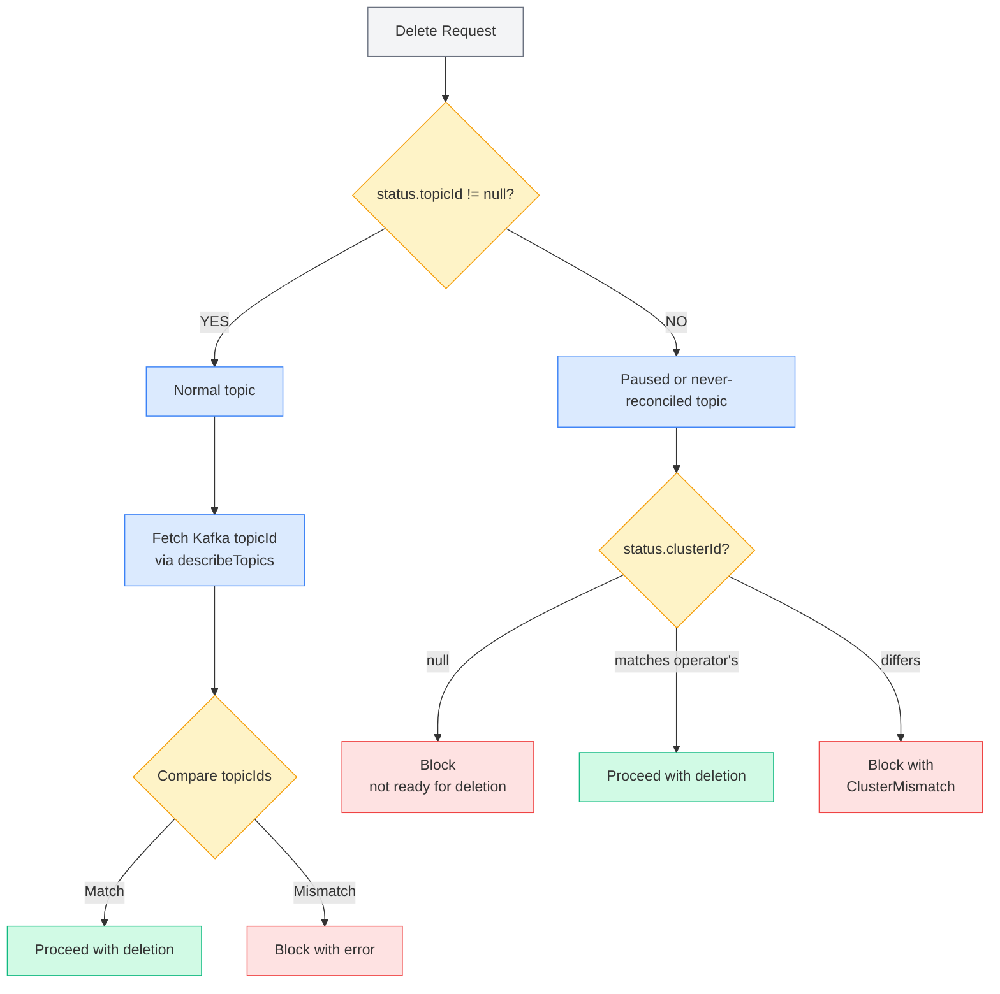
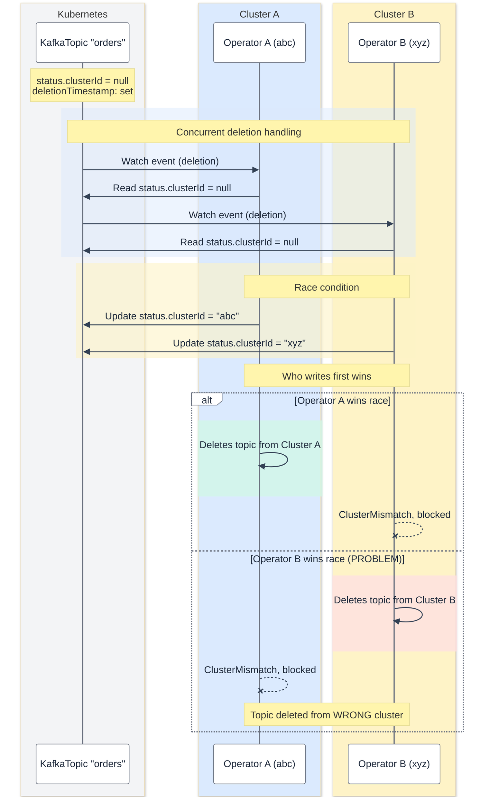

# KafkaTopic Ownership protection

This proposal adds protection to prevent Topic Operators from accidentally managing KafkaTopics that belong to a different Kafka cluster.

## Motivation

When multiple Kafka clusters exist in the same Kubernetes namespace, there is a risk of data loss:
(i.) **Cluster Misconfiguration** - A Topic Operator pointed at the wrong Kafka cluster could modify or delete topics
(ii.) **Accidental Topic Deletion** - Deleting a `KafkaTopic` could affect the wrong cluster
(iii.) **Orphaned Resources** - After cluster deletion, remaining `KafkaTopic` resources could accidentally affect other clusters

This proposal adds a safety mechanism using the Kafka cluster's unique identifier combined with topic ID verification.

## Proposal

This proposal uses a **hybrid approach** combining `status.clusterId` for general ownership protection and `status.topicId` for deletion safety verification.

### Adding `status.clusterId` to KafkaTopic

A new `clusterId` field will be added to `KafkaTopicStatus`:
The `clusterId` is obtained via the Kafka Admin API's `describeCluster()` method.

### Cluster ID Validation Logic (Reconciliation)

When the Topic Operator reconciles a KafkaTopic:
(i.) **`status.clusterId` is null**: Set it to the operator's cluster ID, proceed with reconciliation
(ii.) **`status.clusterId` matches**: Proceed normally
(iii.) **`status.clusterId` differs**: Log warning, set Ready=False with reason `ClusterMismatch`, skip modifications

This ensures that once a KafkaTopic is "claimed" by a cluster, other Topic Operators will not touch it.

### Deletion Safety Check (Hybrid/Combined Approach)

For deletion, we use double verification that eliminates race conditions:
On delete request:

This works (i.) normal topics (has `status.topicId`)** and `topicId` comparison is a factual check against Kafka's actual state.
Topic IDs are globally unique UUIDs, so if `status.topicId` doesn't match what Kafka returns, it is definitely a different topic;
(ii.) paused topics (i.e., no `status.topicId`) fallback to `clusterId` check since `clusterId` was set during normal reconciliation
(before the topic was paused); (iii.) never reconciled topics (no `clusterId`) block deletion entirely. 
The topic must complete at least one successful reconciliation to establish ownership before it can be deleted

## Failure Handling

When the Topic Operator starts, it attemps to fetch the Kafka cluster ID via `describeCluster()`. 
If this fails, (i) operator logs a warning: `"Unable to retrieve Kafka cluster ID. Cluster ID protection will be disabled"`
(ii.) internally `clusterId` is set to `null`; (iii.) operator continues to run without cluster ID protection and (iv.)
eventually all reconciliations proceed without cluster ID validation. 
This let's say **graceful degradation approach** ensures the operator remains functional even if the Kafka cluster is temporarily 
un-available or misconfigured at startup.

When a `KafkaTopic` has a `status.clusterId` that differs from the operator's cluster ID.
We raise, (i.) `TopicOperatorException.ClusterMismatch` with reason `"ClusterMismatch"`;
(ii.) the topic `Ready` condition is set to `False`; (iii.) also condition message has: `"KafkaTopic is owned by cluster '<cached/stored-id>', not this cluster '<current-id>'.`;
(iv.) and very important is that the `status.clusterId` is preserved (i.e., not overridden) when any reconciliation error occurs.

Moreover, when a `KafkaTopic` has the `strimzi.io/pause-reconciliation: "true"` annotation.
The topic (i.) is skipped during normal reconciliation (i.e., no updates to Kafka); (ii.) existing `status.clusterId` is preserved un-changed
(iii.) the condition type is set to `ReconciliationPaused`. 

> [!NOTE]
> On deletion of a paused topic: since `status.topicId` is null, the deletion safety check falls back to
> `status.clusterId` validation. A paused topic with a mismatched `status.clusterId` will be blocked from deletion.

Also when Operator restart with same cluster, the operator fetches the cluster ID again and since Kafka cluster IDs are stable,
operator will resume managing all previously claimed topics normally.

## Behavior Summary

| Scenario           | `status.topicId` | `status.clusterId` | Operator `clusterId`  | Behavior                                    |
|--------------------|------------------|--------------------|-----------------------|---------------------------------------------|
| New topic          | `null`           | `null`             | valid                 | Set both, proceed                           |
| New topic          | `null`           | `null`             | `null` (fetch failed) | Proceed without protection                  |
| Existing topic     | valid            | matches            | valid                 | Proceed normally                            |
| Existing topic     | valid            | differs            | valid                 | **Block** with `ClusterMismatch`            |
| Existing topic     | any              | any                | `null` (fetch failed) | Proceed (protection disabled)               |
| Unmanaged topic    | any              | any                | any                   | Clear both to `null`                        |
| Paused topic       | `null`           | preserved          | any                   | Skip reconciliation                         |
| Delete (normal)    | valid            | matches            | valid                 | Compare topicId with Kafka, delete if match |
| Delete (normal)    | valid            | matches            | valid                 | **Block** if topicId mismatch               |
| Delete (paused)    | `null`           | matches            | valid                 | Proceed with deletion (clusterId fallback)  |
| Delete (paused)    | `null`           | differs            | valid                 | **Block** with `ClusterMismatch`            |
| Delete (unclaimed) | `null`           | `null`             | valid                 | **Block** (not ready for deletion)          |
| Delete (any)       | any              | any                | `null` (fetch failed) | Proceed (protection disabled)               |

## Affected Projects

Affected parts are `api` as well as `topic-operator` module. 
Moreover, with such change we also need to modify `KafkaTopic` status schema inside `CRDs`.

## Backwards Compatibility

Existing topics without `status.clusterId` get it set on next successful reconciliation.
If cluster ID cannot be fetched at startup, protection is disabled (with warning).

## Rejected Alternatives

### Claim-on-Delete Approach

The initial implementation attempted to handle unclaimed topics (those with `status.clusterId == null`) during
deletion by using a "claim-on-delete" pattern: before deleting, the operator would first set `status.clusterId`
to its own cluster ID, effectively claiming the topic just before deletion.
This approach has a race condition.
When two operators both see an unclaimed topic being deleted.
Imagine this scenario:

The hybrid approach (topicId check + clusterId fallback) eliminates this race because; (i.) for normal topics, `topicId` comparison is against Kafka's actual state and not claimed value;
(ii). for un-claimed topics deletion is blocked entirely until the topic is properly reconciled.

### Proceed with deletion when `status.clusterId` is null

Allowing deletion when `status.clusterId` is null was rejected because it reintroduces the original risk:
if a resource has a null `clusterId` (due to error or upgrade), the wrong operator could delete a topic
belonging to another cluster. 
The hybrid approach blocks deletion of unclaimed topics, which is safer.

### TopicId-only approach (no clusterId)

Using only `topicId` for all protection was considered but rejected.
Problem is that paused topics do not have `status.topicId` (i.e., value is `null`) and so we can't compare such values.
New topics that haven't been reconciled yet don't have a `topicId`.
