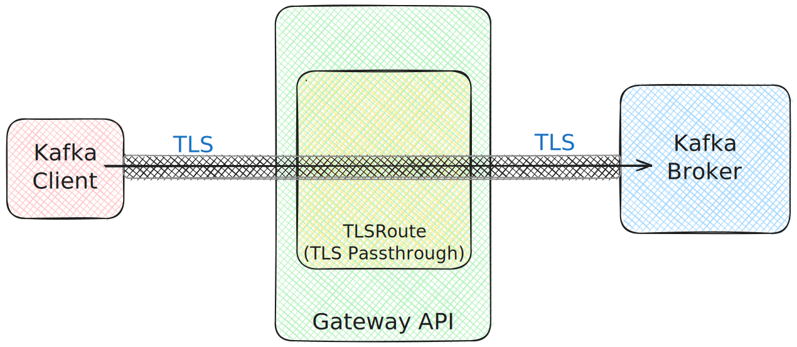
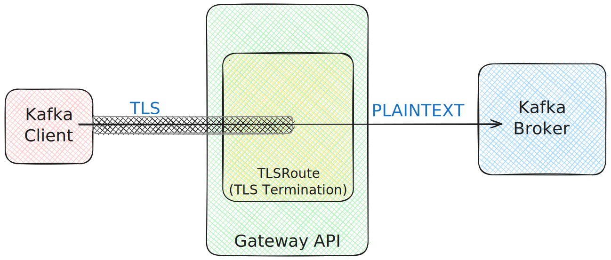

# Gateway API-based `type: tlsroute` listener

This proposal suggests adding a new listener type (`type: tlsroute`) based on the Gateway API and its `TLSRoute` resources.

## Current situation

Strimzi currently supports four types of external listeners:
* Load balancers (`type: loadbalancer`)
* Node ports (`type: nodeport`)
* OpenShift Routes (OpenShift only) (`type: route`)
* Ingress with TLS passthrough (based on the Ingress NGINX Controller for Kubernetes) (`type: ingress`)

The Ingress-based listener (`type: ingress`) is currently deprecated.
The main motivation for the deprecation is the [retirement](https://kubernetes.io/blog/2025/11/11/ingress-nginx-retirement/) of the [Ingress NGINX Controller for Kubernetes](https://github.com/kubernetes/ingress-nginx), on which this listener type was based.

## Gateway API

[Gateway API](https://gateway-api.sigs.k8s.io/) is an API specification only.
It does not provide any implementation on its own.
It provides only the Custom Resource Definitions for the API.
The API is then supported/implemented by other projects.
A list of implementations can be found on the [Gateway API website](https://gateway-api.sigs.k8s.io/implementations/#gateway-controller-implementation-status).

The Gateway API specification is versioned.
Its versioning and release cycle is fully independent on the Kubernetes version.
Each version has two release channels: Standard and Experimental.
The Standard channel contains stable APIs.
The Experimental channel includes everything from the Standard channel plus additional experimental changes and APIs that might still change or be removed in the future.

## Motivation

[Gateway API](https://gateway-api.sigs.k8s.io/) is an official Kubernetes project that focuses on L4 and L7 routing.
It represents the next generation of Kubernetes Ingress.
It supports L7 routing of HTTP and gRPC traffic.
It also supports L4 routing of TCP traffic.
Gateway API aims to address both north-south traffic (to/from the Kubernetes cluster) and east-west traffic (within the Kubernetes cluster through a service mesh).
For this proposal, the focus is north-south traffic routing and providing Apache Kafka access to Kafka clients running outside of the Kubernetes cluster.

Our users have already been able to use Gateway API with Strimzi for some time.
They can, for example, use the `type: cluster-ip` listener designed for access within the Kubernetes cluster and manually manage the Gateway API resources and advertised hosts and ports.
More details can be found in the [Accessing Kafka with Gateway API](https://strimzi.io/blog/2024/08/16/accessing-kafka-with-gateway-api/) blog post on the Strimzi blog.

But with Gateway API becoming the _next_ Kubernetes routing standard, with the growing number of compatible Gateway API implementations, and with the deprecation of `type: ingress` due to Ingress NGINX Controller retirement, it makes sense for Strimzi to add direct support for Gateway API.
The APIs that are relevant to the Kafka protocol (`TLSRoute` and `TCPRoute`) are also finally maturing and moving to the Standard API channel.
Direct support will simplify the configuration of Gateway API resources, as Strimzi will manage them automatically and users will no longer need to do it manually.
It will also make it easier to combine Gateway API with other Strimzi features, such as horizontal autoscaling, which would otherwise be complicated (as users would need to create Gateway API resources when new brokers are added).

## Proposal

Strimzi will implement support for Gateway API using its `TLSRoute` resources.
In the Strimzi API, it will be added as `type: tlsroute`.
`TLSRoute` resources support any TLS traffic and use TLS-SNI (client-specified hostname) to decide where to route traffic.
`TLSRoute` resources typically depend on a `Gateway`.
The `Gateway` represents the _point of access_, and `TLSRoute` resources tell the `Gateway` how and where traffic should be routed.
When using the `type: tlsroute` listener in Strimzi, the Strimzi Cluster Operator will be responsible for managing the `TLSRoute` resources.
But Strimzi will not be involved in `Gateway` management.
Users will bring their own `Gateway` and only reference it in the Strimzi configuration.

`TLSRoute` resources moved to the _Standard_ API in version 1.4 of the Gateway API specification.
In version 1.5, the `v1` version of the `TLSRoute` API was introduced.
While the `v1` version is relatively new, it should provide a stable and future-proof API.
The `v1` API is expected to be supported in version 7.7.0 of the Fabric8 Kubernetes Client as well.
This proposal suggests building `tlsroute` listener support on the `v1` API.

The `type: tlsroute` listener will work on the same principle as the existing `type: ingress` and `type: route` listeners.

### Strimzi API

The `type: tlsroute` API will mostly reuse existing fields already used for other listener types.

The only new field will be the list of _parent references_.
It will be part of the listener configuration and will be named `parentRefs` (the same name used by Gateway API itself).
Parent references are used in `TLSRoute` configuration and define which gateways will handle the TLS routes.
However, parent references might not always point directly to a gateway.
They might also point, for example, to a `ListenerSet` resource (which will further point to one or more `Gateway` resources).
In any case, one or more parent references have to be provided to Strimzi in order to configure the `TLSRoute` resources.
The Strimzi parent reference schema would use the same schema as in the [Gateway API specification](https://gateway-api.sigs.k8s.io/reference/1.5/spec/#parentreference).

In addition to the list of parent references, the `tlsroute` listener will reuse fields already used by other listener types:
* The `host` and `hostTemplate` fields used to configure the hostname specified in the `TLSRoute` resources
* The `advertisedHost`, `advertisedHostTemplate`, `advertisedPort`, and `advertisedPortTemplate` fields to control advertised addresses

The following YAML shows an example of the `type: tlsroute` listener configuration in a `Kafka` CR:
```yaml
listeners:
  - name: external
    port: 9094
    type: tlsroute
    tls: true
    authentication:
      type: tls
    configuration:
      parentRefs:
        - name: kafka-gateway
          sectionName: kafka
      bootstrap:
        host: kafka.192.168.1.221.sslip.io
      advertisedHostTemplate: kafka-{nodeId}-broker.192.168.1.221.sslip.io
      hostTemplate: kafka-{nodeId}-broker.192.168.1.221.sslip.io
```

`TLSRoute` resources support TLS passthrough as well as TLS termination mode.
TLS passthrough means that the TLS connection is forwarded to Strimzi as-is, including encryption.
In this case, the TLS connection will use the TLS certificate from the Kafka brokers and can use mTLS authentication as well.



TLS termination means that the TLS connection will be terminated in the gateway.
The Kafka client will connect with encryption, but the connection will be decrypted by the Gateway.
And from the Gateway it will continue in an unencrypted work to the Apache Kafka brokers.
In this case, the connection will use the Gateway's TLS certificate and mTLS authentication would not be available.
From a Strimzi perspective, the connection will not use TLS encryption.
Support for TLS termination mode is new, and I have not found any Gateway API implementation supporting it yet.
But I expect it will eventually be supported.



To support both modes, Strimzi will support `type: tlsroute` listeners both with and without TLS encryption enabled in the Strimzi listener.
mTLS authentication will be allowed only when TLS encryption is enabled.

The actual port used by `TLSRoute` resources is configured in the `Gateway` resource.
So Strimzi will not be aware of it.
Therefore, `type: tlsroute` listeners will use port 443 as the default advertised port, which is the same as for `type: route` and `type: ingress` listeners.
Where needed, users can use the `advertisedPort` configuration to override the advertised port.

#### `TLSRoute` templates

Additionally, two new fields will be added to the `Kafka` CR template section (`.spec.kafka.template`):
* `externalBootstrapTLSRoute`
* `perBrokerTLSRoute`

And one new field will be added to the `KafkaNodePool` CR template section (`.spec.template`):
* `perBrokerTLSRoute`

These fields will be used for additional configuration of `TLSRoute` labels and annotations.
This mirrors the existing fields for OpenShift Routes and Ingress resources.

### `TLSRoute` resources

Similarly to Ingress resources or OpenShift Routes, `TLSRoute` resources always point to a Kubernetes Service and forward traffic to it.
The `type: tlsroute` listener will use the same architecture as these other listeners:
* One per-listener bootstrap service pointing to all Kafka brokers will be created for bootstrapping
* One bootstrap `TLSRoute` will be created and will point to the bootstrap service
* One per-broker service will be created for each broker
* One per-broker `TLSRoute` will be created and will point to the corresponding per-broker service

The naming of these resources will follow the same rules as for the current listeners.

The created bootstrap `TLSRoute` resource will look like this:

```yaml
apiVersion: gateway.networking.k8s.io/v1
kind: TLSRoute
metadata:
  labels:
    strimzi.io/cluster: my-cluster
    strimzi.io/component-type: kafka
    strimzi.io/kind: Kafka
    strimzi.io/name: my-cluster-kafka
  name: my-cluster-kafka-bootstrap
  ownerReferences:
    - apiVersion: kafka.strimzi.io/v1
      blockOwnerDeletion: true
      controller: false
      kind: Kafka
      name: my-cluster
      uid: c111cc18-9056-4888-a426-c5c701b0ae90
spec:
  hostnames:
    - kafka.192.168.1.221.sslip.io
  parentRefs:
    - group: gateway.networking.k8s.io
      kind: Gateway
      name: kafka-gateway
      sectionName: kafka
  rules:
    - backendRefs:
        - name: my-cluster-kafka-bootstrap
          port: 9094
```

The created per-broker `TLSRoute` resources will look like this:

```yaml
apiVersion: gateway.networking.k8s.io/v1
kind: TLSRoute
metadata:
  labels:
    strimzi.io/cluster: my-cluster
    strimzi.io/component-type: kafka
    strimzi.io/kind: Kafka
    strimzi.io/name: my-cluster-kafka
    strimzi.io/pool-name: aston
  name: my-cluster-aston-1000
  ownerReferences:
    - apiVersion: kafka.strimzi.io/v1
      blockOwnerDeletion: true
      controller: false
      kind: KafkaNodePool
      name: aston
      uid: c111cc18-9056-4888-a426-c5c701b0ae90
spec:
  hostnames:
    - kafka-1000-broker.192.168.1.221.sslip.io
  parentRefs:
    - group: gateway.networking.k8s.io
      kind: Gateway
      name: kafka-gateway
      sectionName: kafka
  rules:
    - backendRefs:
        - name: my-cluster-aston-1000
          port: 9094
```

After creating the `TLSRoute` resources, Strimzi will wait for the `.status` section to be updated and contain at least one parent reference.
This indicates that the `TLSRoute` was accepted by the gateway.
Strimzi will not perform a detailed check of which gateway is among the parent references.
It will also not check for any other conditions and try to detect any other warnings, errors, or failures.
In case the `TLSRoute` does not have any parent references after the configured time limit (the Cluster Operator _reconciliation timeout_), the reconciliation will fail with a corresponding error.
This will help provide flexibility and simplify support for different implementations, that might behave differently when it comes to exact conditions, warnings, and errors..

### Testing strategy

While system tests for `type: tlsroute` might be added in the future, they are not covered by this proposal.
We already have other listener types that rely fully on unit and manual testing only (e.g., Ingress).
The value of system tests is also diminished in scenarios with multiple different implementations that might behave differently.

## Out of scope

### Support for default gateways

Support for the [experimental `useDefaultGateways` flag](https://gateway-api.sigs.k8s.io/reference/spec/#gatewaydefaultscope) in the `TLSRoute` `.spec` section is out of scope for this proposal.
Support for it might be added in the future.

### Listener based on Gateway API `TCPRoute` resources

Another way to expose Apache Kafka with Gateway API could be `TCPRoute` resources.
TCP routes allow routing of TCP traffic without TLS encryption and without TLS-SNI.
The main advantage of TCP routes is that they allow users to freely choose whether they want to use TLS encryption.

However, TCP routes are harder to configure because, without TLS-SNI, every `TCPRoute` needs to have a unique address.
For example, a different gateway with a unique IP address, or a different port number.
So for a cluster with 10 brokers, you would need 11 different IP addresses or 11 different ports.
And you would need to configure each of them on a per-broker basis.
That is why this proposal chooses TLS routes as its basis and does not provide any support for TCP routes.

Integrating Strimzi directly with TCP routes is out of scope for this proposal.
However, users with unique requirements who prefer using TCP routes can continue to use the manual configuration approach.
It is also possible that future proposals will add direct support for TCP routes as well.

### Support for east-west traffic

Any use of Gateway API for routing internal Kubernetes traffic or service mesh integration is out of scope and is not addressed by this proposal.
It might, however, be addressed in a future proposal.

### Migration from `type: ingress` listener

The exact process for migrating from the `type: ingress` listener is out of scope for this proposal as it depends on the specific Ingress and Gateway API implementation and on user's infrastructure.
Strimzi will not provide any documentation documenting such a migration.

However, users can always:

1. Add a new `type: tlsroute` listener.
2. Reconfigure their Kafka clients to use the the new listener.
3. Remove the old `type: ingress` listener.

## Affected projects

This proposal affects only the Strimzi Cluster Operator.

## Backwards compatibility

This proposal is fully backwards compatible.
The existing listeners are not affected in any way by the new listener.

## Rejected alternatives

N/A.
