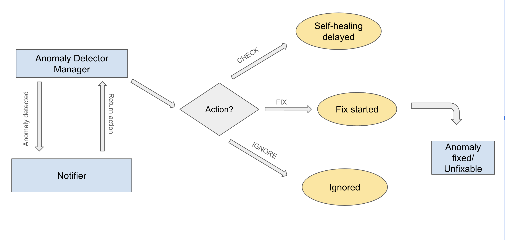
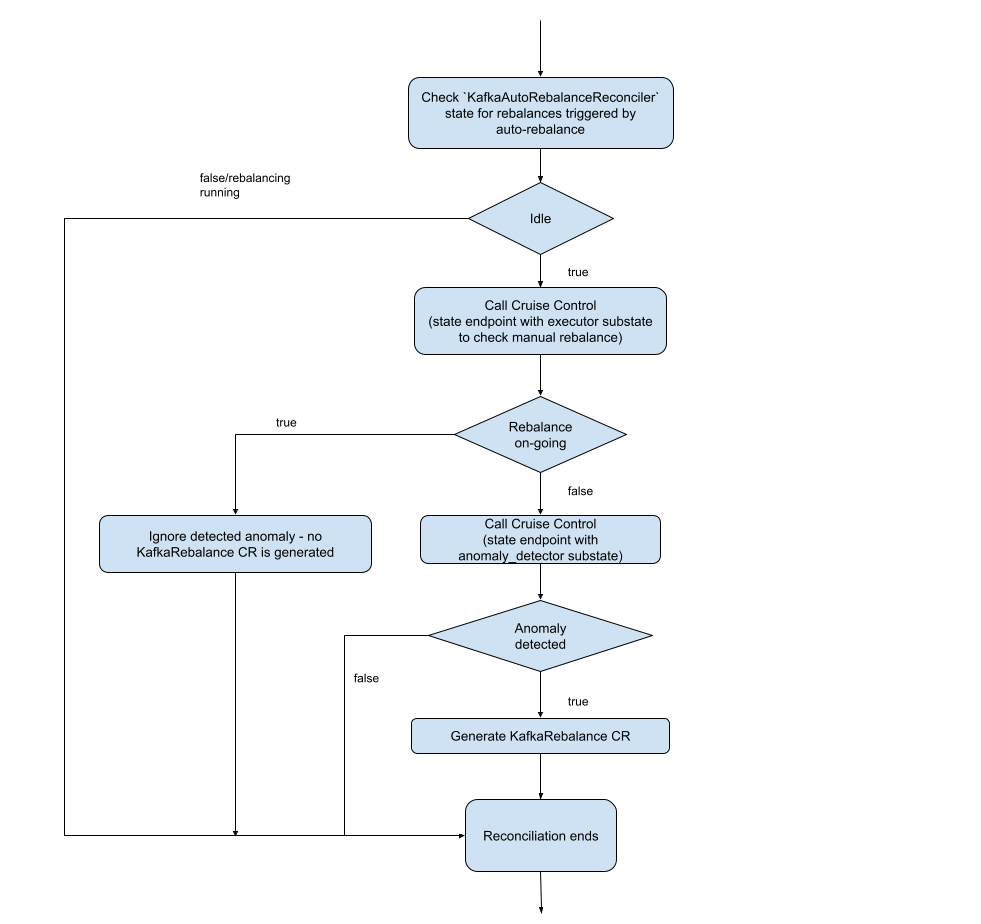
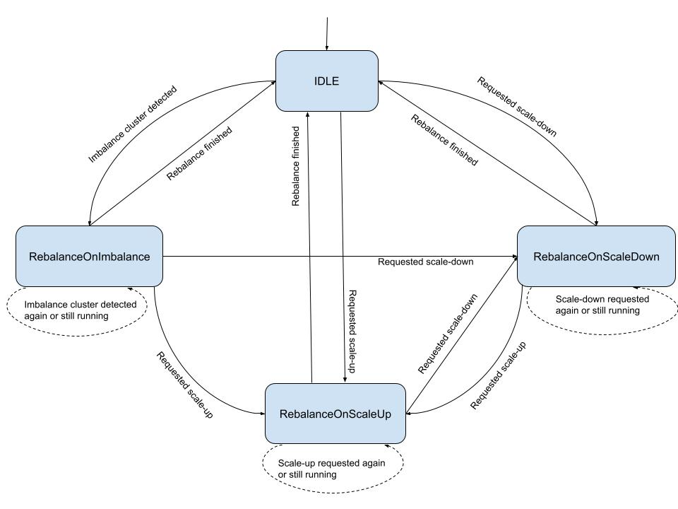
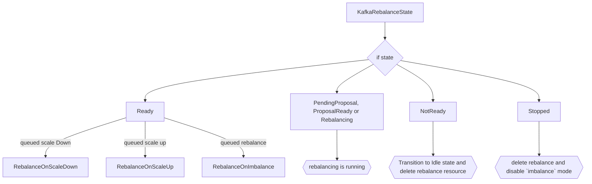

# Auto-rebalance on imbalanced clusters

This proposal introduces support for automatic partition rebalancing whenever a Kafka cluster becomes imbalanced due to unevenly distributed replicas, overloaded brokers, or similar issues.

This feature is opt-in.
When enabled, it allows the Strimzi Operator to automatically execute partition rebalances through `KafkaRebalance` custom resources whenever cluster imbalances are detected by Cruise Control.

## Motivation

Currently, if the cluster is imbalanced, the user would need to manually rebalance the cluster by using the `KafkaRebalance` custom resource.
Every cluster requires manual intervention to trigger rebalancing when imbalances are detected, regardless of its size.
Automating this process would reduce operational overhead and benefit all users by eliminating the need for constant manual monitoring and rebalancing.

### Introduction to Self Healing in Cruise Control

In order to understand how we plan to automatically fix unbalanced Kafka clusters, the sections below will go over how Cruise Control's anomaly detection and self-healing features work to detect the anomalies in the cluster and fix them.



The above flow diagram depicts the self-healing process in Cruise Control.
The anomaly detector manager detects an anomaly (using the detector classes) and forwards it to the notifier.
The notifier then decides what action to take on the anomaly whether to fix it, ignore it, or delay it.
Cruise Control provides various notifiers to alert the users about the detected anomaly in several ways like Slack, Alerta, MS Teams etc.

#### Anomaly Detector Manager

The anomaly detector manager helps in detecting the anomalies as well as handling them.
It acts as a coordinator between the detector classes and the classes which will handle resolving the anomalies.
Various detector classes like `GoalViolationDetector`, `DiskFailureDetector`, `KafkaBrokerFailureDetector` etc. are used for the anomaly detection, which runs periodically to check if the cluster has their corresponding anomalies or not.
The frequency of this check can be changed via the `anomaly.detection.interval.ms` configuration.
Detector classes use different mechanisms to detect their corresponding anomalies.
For example, broker, disk, and topic failure detection utilize the Kafka Admin API, metric anomaly detection uses collected metrics, and goal violation detection uses the load distribution calculated by Cruise Control itself.
The detected anomalies can be of various types:
* Goal Violation - This happens if certain [optimization goals](https://strimzi.io/docs/operators/in-development/deploying#optimization_goals) are violated (e.g. DiskUsageDistributionGoal etc.). These goals can be configured through the `anomaly.detection.goals` option in the Cruise Control configuration. However, this option is currently forbidden in the `spec.cruiseControl.config` section of the `Kafka` CR.
* Topic Anomaly - When one or more topics in the cluster violate user-defined properties (e.g. some partitions are too large on disk, the replication factor of a topic is different from a given default value etc).
* Broker Failure - This happens when a non-empty broker crashes or leaves a cluster for a long time.
* Disk Failure - This failure happens when one of the non-empty disks fails (in a Kafka cluster with JBOD disks).
* Metric anomaly - This failure happens if metrics collected by Cruise Control have some anomaly in their value (e.g. a sudden rise in the log flush time metrics).

The detected anomalies are inserted into a priority queue where the comparator is based upon the priority value.
The smaller the priority value is, the higher priority the anomaly type has.

The anomaly detector manager calls the notifier to get an action regarding whether the anomaly should be fixed, delayed, or ignored.
If self-healing is enabled and the action is `FIX`, then the anomaly detector manager calls the classes that are required to resolve the anomaly.

Anomaly detection also has various [configurations](https://github.com/linkedin/cruise-control/wiki/Configurations#anomalydetector-configurations), such as the detection interval and the anomaly notifier class, which can affect the performance of the Cruise Control server and the latency of the anomaly detection.

#### Notifiers in Cruise Control

Whenever anomalies are detected, Cruise Control provides the ability to notify the user regarding the detected anomalies using optional notifier classes.
The notification sent by these classes increases the visibility of the operations that are taken by Cruise Control.
The notifier class used by Cruise Control is configurable and custom notifiers can be used by setting the `anomaly.notifier.class` property.
The notifier class returns the `action` that is going to be taken on the flagged anomaly.
These actions have three types:
* `FIX` - Fix the anomaly
* `CHECK` - Check the anomaly at a later time
* `IGNORE` - Ignore the anomaly

The default notifier enabled by Cruise Control is the  `NoopNotifier`.

* This notifier always returns `IGNORE` which means that the anomaly detector manager won't use any class to fix the anomaly.
* This notifier doesn't implement any notification mechanism to the users.

Cruise Control also provides [custom notifiers](https://github.com/linkedin/cruise-control/wiki/Configure-notifications) like Slack Notifier, Alerta Notifier etc. for notifying users regarding the anomalies.

Users can develop their own notifiers by implementing Cruise Control's `AnomalyNotifier` interface and configuring it via the `anomaly.notifier.class` property in the Cruise Control configuration.
This pluggable mechanism provides flexibility for integrating with organization-specific alerting, ticketing, or approval systems.

There are multiple other [self-healing notifier](https://github.com/linkedin/cruise-control/wiki/Configurations#selfhealingnotifier-configurations) related configurations you can use to make notifiers more efficient as per the use case.

#### Self Healing

If self-healing is enabled, Cruise Control will either fix or not fix the detected anomaly based on the action returned by the configured notifier.
If the notifier has returned `FIX` as the action then the classes which are responsible for resolving the anomaly would be called.
Each detectable anomaly is handled by a specific detector class which then uses another remediation class to run a fix.
For example, the `GoalViolations` class uses the `RebalanceRunnable` class, the `DiskFailure` class use the `RemoveDisksRunnable` class and so on.
An optimization proposal (a collection of replica reassignments and partition leadership changes) will then be generated by these `Runnable` classes and that proposal will be applied on the cluster to fix the anomaly.
In case the anomaly detected is unfixable for e.g. violated hard goals that cannot be fixed typically due to lack of physical hardware (insufficient number of racks to satisfy rack awareness, insufficient number of brokers to satisfy Replica Capacity Goal, or insufficient number of resources to satisfy resource capacity goals), the anomaly wouldn't be fixed and the Cruise Control will log a warning with the `self-healing is not possible due to unfixable goals` message.

## Current situation

Even under normal operation, it is common for Kafka clusters to encounter problems such as partition key skew leading to an uneven partition distribution, or hardware issues like disk failures, which can degrade the overall cluster's health and performance.
In Strimzi's current implementation of Cruise Control, fixing these issues needs to be triggered manually i.e. if the cluster is imbalanced then a user might instruct Cruise Control to move the partition replicas across the brokers in order to fix the imbalance using the `KafkaRebalance` custom resource.

Users can currently enable anomaly detection and can also [set](https://strimzi.io/docs/operators/latest/full/deploying.html#setting_up_alerts_for_anomaly_detection) the notifier to one of those included with Cruise Control (`SelfHealingNotifier`, `AlertaSelfHealingNotifier`, `SlackSelfHealingNotifier` etc.).
All the `self.healing` prefixed properties are currently disabled in Strimzi's Cruise Control integration because, initially, it was not clear how self-healing would act if pods were rolled in the middle of rebalances or how Strimzi triggered manual rebalances should interact with Cruise Control triggered self-healing ones.

### Proposal

This proposal is concerned with giving users the option to have their Kafka clusters balanced automatically whenever they become imbalanced due to overloaded brokers, high CPU usage, or similar constraints.
However, the proposal is not to rely on the Cruise Control self-healing implementation directly.
If we were to enable that functionality then, in response to detected anomalies, Cruise Control would issue partition reassignments without involving the Strimzi Cluster Operator.
This could cause potential conflicts with other administration operations and is the primary reason self-healing has been disabled until now.
To resolve this issue, we will only make use of Cruise Control's anomaly detection ability, the triggering of the partition reassignments (rebalance) will be the responsibility of the Strimzi Cluster Operator.
To enable this, we will use an approach based on the existing auto-rebalance for scaling feature (see the [documentation](https://strimzi.io/docs/operators/latest/deploying#proc-automating-rebalances-str) for more details).
We propose using only those anomaly detection classes, related to goal violations, that can be addressed by a partition rebalance.
We will not enable the other anomaly detection classes, related to goal violations, that would require manual interventions at the infrastructure level such as disk or broker failures.
For the latter case, it would be better to spin up new disks or to fix the issue with the broker(s) directly instead of just moving the partitions replicas away from them through rebalancing.
Therefore, given the interventions required, it would be non-trivial for the Strimzi Operator to fix these failures automatically.
Hence, these are not goals of this proposal and could be addressed later in separate proposals.
Following the above approach will provide several advantages:
* we ensure that the operator controls all rebalance and cluster remediation operations.
* using the existing `KafkaRebalance` CR system gives more visibility into what is happening and when, which (as we don't support the Cruise Control UI) enhances observability and will also aid in debugging.

### `imbalance` mode in Strimzi's auto-rebalancing feature

The [`auto-rebalancing`](https://strimzi.io/docs/operators/latest/deploying#proc-automating-rebalances-str) feature in Strimzi allows the operator to run a rebalance automatically when a Kafka cluster is scaled up (by adding brokers) or scaled down (by removing brokers).

Auto-rebalancing in Strimzi currently supports two modes:
* `add-brokers` - auto-rebalancing on scale up
* `remove-brokers` - auto-rebalancing on scale down

To leverage the automated rebalance on imbalanced clusters (those with detected goal violations), we will be introducing a new mode to the auto-rebalancing feature.
The new mode will be called `imbalance`, which means that cluster imbalance was detected and rebalancing should be applied to all the brokers.
The imbalance mode is configured by creating a new object in the `spec.cruiseControl.autoRebalance` list with its `mode` field set to `imbalance` and the corresponding rebalancing configuration is defined as a reference to a template `KafkaRebalance` custom resource, by using the `spec.cruiseControl.autoRebalance.template` field as a [LocalObjectReference](https://kubernetes.io/docs/reference/kubernetes-api/common-definitions/local-object-reference/).
The `template` field is optional and if not specified, the auto-rebalancing runs with the default Cruise Control configuration (i.e. the same used for unmodified manual `KafkaRebalance` invocations).
To provide users more flexibility, they only have to configure the auto-rebalance modes they wish to use, whether it be `add-brokers`, `remove-brokers`, or `imbalance`.
When the auto-rebalance configuration is set with `imbalance` mode enabled, the operator will trigger a partition rebalance whenever a goal violation is detected by the anomaly detector.
For the operator to trigger the auto-rebalance, it must be aware that the cluster is imbalanced due to a goal violation anomaly.
We will make use of the `state` endpoint of Cruise Control to do this.
The operator will use this endpoint to understand if there are any goal violations so that the operator can trigger a rebalance (see section "KafkaAutoRebalanceReconciler using state endpoint" below).
With this proposal, we will only support auto-rebalance for cluster imbalances caused by goal violations.
We also plan to implement the same for topic and metrics related issues, but these will be part of future work since their implementation requires different approaches.
For example, when dealing with topic related issues, it will require a coordination with topic operator and metrics issues will require coordination with the Kafka API.

Here is an example of what the configured `Kafka` custom resource could look like:

```yaml
apiVersion: kafka.strimzi.io/v1beta2
kind: Kafka
metadata:
  name: my-cluster
spec:
  kafka:
  # ...
  cruiseControl:
    # ...
    autoRebalance:
      # using the imbalance rebalance mode
      - mode: imbalance
        template:
          name: my-imbalance-rebalance-template
```

It is also possible to use the default Cruise Control rebalancing configuration by omitting the `template` field.

The configuration for Cruise Control rebalance is provided through a `KafkaRebalance` custom resource which is specifically defined as a template and is referenced in the `template` field in the example above.
A `KafkaRebalance` custom resource with the `strimzi.io/rebalance-template: true` annotation set can be used as a template.
When a `KafkaRebalance` with this annotation is created, the cluster operator doesn't run any rebalancing.
This is not an actual rebalance request to get an optimization proposal; it is simply where the configuration for auto-rebalancing is defined.

Here is an example template:

```yaml
apiVersion: kafka.strimzi.io/v1beta2
kind: KafkaRebalance
metadata:
  name: my-imbalance-rebalance-template
  annotations:
    strimzi.io/rebalance-template: "true" # specifies that this KafkaRebalance is a rebalance configuration template
spec:
  goals:
    - CpuCapacityGoal
    - NetworkInboundCapacityGoal
    - DiskCapacityGoal
    - RackAwareGoal
    - MinTopicLeadersPerBrokerGoal
    - NetworkOutboundCapacityGoal
    - ReplicaCapacityGoal
  skipHardGoalCheck: true
  # ... other rebalancing related configuration
```
When the `template` is set, the operator automatically creates (or updates) a corresponding `KafkaRebalance` custom resource (based on the template) when an anomaly is detected and notified by the `state` endpoint.
The operator copies over goals and rebalancing options from the referenced `template` resource to the generated rebalancing one.
If the user has not configured the anomaly detection goals in Cruise Control section of the Kafka CR then the operator would set the default goals to be used by the anomaly detector. 
The default anomaly detection goals set by the operator are `RACK_AWARENESS_GOAL`, `MIN_TOPIC_LEADERS_PER_BROKER_GOAL`, `REPLICA_CAPACITY_GOAL`, `DISK_CAPACITY_GOAL`. 
These are similar to the default goals used in for KafkaRebalance if the users don't mention the rebalance goals.
**Template Goal Validation:**

If the user specifies a rebalance template, the operator validates that the goals in the template are a subset of the anomaly detection goals configured for Cruise Control.
This ensures rebalances are only triggered for goals that Cruise Control actively monitors for violations.

**When validation occurs:**
- During every `Kafka` CR reconciliation cycle, as part of the `KafkaAutoRebalanceReconciler.reconcile()` method
- The validation happens **after** Cruise Control is deployed but **before** any anomaly detection or rebalancing logic executes
- The operator first checks if the `imbalance` mode is configured in `spec.cruiseControl.autoRebalance`
- If `imbalance` mode is enabled and a template is specified, the operator validates that:
  - All goals in the template exist in the `anomaly.detection.goals` configuration (or defaults if not configured)
  - The template reference points to a valid `KafkaRebalance` resource with the `strimzi.io/rebalance-template: true` annotation
- This validation runs on **every reconciliation**, ensuring configuration changes are caught immediately
- Configuration errors are detected early, preventing invalid auto-rebalance attempts and providing immediate feedback to users

**How the operator retrieves anomaly detection goals:**

The `KafkaAutoRebalanceReconciler` retrieves the anomaly detection goals from the Kafka CR's Cruise Control configuration:
1. The operator accesses `kafkaCr.getSpec().getCruiseControl().getConfig()` which returns a `Map<String, Object>`
2. It looks up the `anomaly.detection.goals` key using `CruiseControlConfigurationParameters.ANOMALY_DETECTION_CONFIG_KEY.getValue()`
3. The value is a comma-separated string of goal names (e.g., `"RackAwareGoal,ReplicaCapacityGoal,DiskCapacityGoal"`)
4. If the key is not present or empty, the operator uses the default anomaly detection goals defined in `CruiseControlConfiguration.CRUISE_CONTROL_DEFAULT_ANOMALY_DETECTION_GOALS_LIST`:
   - `RACK_AWARENESS_GOAL`
   - `MIN_TOPIC_LEADERS_PER_BROKER_GOAL`
   - `REPLICA_CAPACITY_GOAL`
   - `DISK_CAPACITY_GOAL`
5. The operator parses the goals string into a list and compares it against the template goals to ensure the template goals are a subset.

**Validation behavior:**
- If validation **passes**: Auto-rebalance proceeds normally when anomalies are detected
- If validation **fails**: 
  - A `Warning` condition is added to the `Kafka` CR status
  - Auto-rebalance for the `imbalance` mode is **suspended** (not triggered)
  - Other operations (manual rebalances, scale-up/down auto-rebalances) continue normally
  - Users must correct the template configuration to resume imbalance auto-rebalancing

The `KafkaRebalance` has 4 modes: `full`, `add-broker`, `remove-broker` and `remove-disks` mode.
The `imbalance` mode will be mapped to the `full` mode in the generated KafkaRebalance resource which means that the generated `KafkaRebalance` custom resource will have the mode set as `full` which within the Strimzi rebalancing operator means calling the Cruise Control API to run a rebalancing taking all brokers into account.

The generated `KafkaRebalance` custom resource will be called `<my-cluster-name>-auto-rebalancing-goal-violation`, where the `<my-cluster-name>` part comes from the `metadata.name` in the `Kafka` custom resource, `goal-violation` means that a goal related imbalance was detected in the cluster.

```yaml
apiVersion: kafka.strimzi.io/v1beta2
kind: KafkaRebalance
metadata:
  name: my-cluster-auto-rebalancing-goal-violation
  finalizers:
    - strimzi.io/auto-rebalancing
spec:
  mode: full
  goals:
    - CpuCapacityGoal
    - NetworkInboundCapacityGoal
    - DiskCapacityGoal
    - RackAwareGoal
    - MinTopicLeadersPerBrokerGoal
    - NetworkOutboundCapacityGoal
    - ReplicaCapacityGoal
  skipHardGoalCheck: true
  # ... other rebalancing related configuration
```

The operator also sets a finalizer, named `strimzi.io/auto-rebalancing`, on the generated `KafkaRebalance` custom resource.
This is needed to avoid the user, or any other tooling, deleting the resource while the auto-rebalancing is still running.
The finalizer is removed when Cruise Control indicates that the partition reassignment (rebalance) process has finished allowing the generated `KafkaRebalance` custom resource to be deleted by the operator itself.
In case the rebalance finishes with an error, the error message will be propagated to the Kafka custom resource just like we do for the `remove-broker` and `add-broker` endpoint and the generated `KafkaRebalance` will be deleted.

#### State endpoint in Cruise Control

Cruise Control provides the `state` endpoint to query the state of Cruise Control at any time by issuing an HTTP GET request.
The operator will use this endpoint with specific substates to coordinate auto-rebalancing operations.

**Executor Substate (`state?substates=executor`)**

The executor substate provides information about ongoing rebalance operations in Cruise Control.
The operator queries this substate to determine if any manual or automatic rebalance is currently in progress.
This prevents the operator from triggering a new auto-rebalance while another rebalance operation is already running.

**Anomaly Detector Substate (`state?substates=anomaly_detector`)**

The anomaly detector substate provides information about detected anomalies in the cluster, including goal violations.
The operator queries this substate to identify when cluster imbalances occur and determine whether an auto-rebalance should be triggered.
The response includes details about fixable and unfixable goal violations, anomaly timestamps, and the current status of detected anomalies.

For more information, refer to the [state endpoint documentation](https://github.com/linkedin/cruise-control/wiki/rest-apis#query-the-state-of-cruise-control).

### Flow diagram depicting process of auto-rebalance on imbalance

The following diagram depicts the complete auto-rebalance on imbalance process, showing how the operator queries the Cruise Control state endpoint, detects goal violations, and triggers rebalance operations:



#### Reconciliation logic using the state endpoint

The operator will interact with the cruise control `state` endpoint to understand when an anomaly is detected and when it should take any action.
The `KafkaAutoRebalanceReconciler` class will hold all the logic for the auto-rebalance triggered on scale up, scale down or imbalance.
The reconciler currently detects any sort of scale down or scale up automatically every reconciliation.
We will configure the KafkaAutoRebalanceReconciler to detect the imbalanced cluster every reconcilation too. 
But we also need to make sure that we don't detect any goal violations when a rebalance is already ongoing (manual or automatic rebalance).
An ongoing rebalance can mean that some goal violation which might be detected in that particular reconciliation will be fixed already by the rebalance and we don't need any extra rebalance.
For the rebalances that are triggered automatically, if the auto-rebalance state machine is not in `Idle` state and is currently in `RebalanceOnScaleUp`, `RebalanceOnScaleDown` or `RebalanceOnImbalance` then it means that a rebalance is happening.
Talking about the priority of rebalance operations, scale down rebalance operations are the most priority followed by scale down and then rebalance on imbalance.
We can ignore the goal violation detection in the cases where rebalances are already running.
For manual rebalances, we can't use the above mechanism, therefore to do that we will make use of the `executor` state endpoint.
Every reconciliation, the operator will query the Cruise Control service:
```
GET http://<cluster-name>-cruise-control:9090/kafkacruisecontrol/state?substates=executor&json=true
```
If there is no ongoing rebalance, only then the operator will check for goal violations.
Here is an example JSON returned by the executor state if there is no rebalance happening:
```json
{
  "ExecutorState": {
    "state": "NO_TASK_IN_PROGRESS"
  },
  "version": 1
}
```
If there is some task already ongoing, then the returned JSON would be:

```json
{
  "ExecutorState": {
    "state": "LEADER_MOVEMENT_TASK_IN_PROGRESS",
    "status": {
      "finishedLeadershipMovements": 0,
      "totalLeadershipMovements": 1,
      "maximumBrokerLeadershipMovementConcurrency": 250,
      "minimumBrokerLeadershipMovementConcurrency": 250,
      "averageBrokerLeadershipMovementConcurrency": 250.0,
      "clusterLeadershipMovementConcurrency": 1000
    },
    "triggeredSelfHealingTaskId": "c2071b83-b011-4924-8fa9-8d3cb0b2ebb9",
    "triggeredTaskReason": "Self healing for GOAL_VIOLATION: {Unfixable goal violations: {}, Fixable goal violations: {DiskUsageDistributionGoal}, Exclude brokers recently (removed: true demoted: true), Provision: OVER_PROVISIONED ([RackAwareGoal] Remove at least 1 rack with brokers.)}"
  },
  "version": 1
}
```

If there is no manual or auto-rebalance running, then we can move forward to check if there were any detected goal violations or not.
The `KafkaAutoRebalanceReconciler` will query the Cruise Control state endpoint with the anomaly detector substate during every reconciliation if no rebalance is already running.
The operator will query the Cruise Control service:
```
GET http://<cluster-name>-cruise-control:9090/kafkacruisecontrol/state?substates=anomaly_detector&json=true
```
Here is an example JSON returned by the state endpoint when called with the `anomaly_detector` substate:
```json
{
  "AnomalyDetectorState": {
    "selfHealingEnabled": [
      "BROKER_FAILURE",
      "DISK_FAILURE",
      "GOAL_VIOLATION",
      "METRIC_ANOMALY",
      "TOPIC_ANOMALY",
      "MAINTENANCE_EVENT"
    ],
    "selfHealingDisabled": [],
    "selfHealingEnabledRatio": {
      "BROKER_FAILURE": 1.0,
      "DISK_FAILURE": 1.0,
      "GOAL_VIOLATION": 1.0,
      "METRIC_ANOMALY": 1.0,
      "TOPIC_ANOMALY": 1.0,
      "MAINTENANCE_EVENT": 1.0
    },
    "recentGoalViolations": [
      {
        "anomalyId": "c2071b83-b011-4924-8fa9-8d3cb0b2ebb9",
        "detectionDate": "2024-12-17T09:26:00Z",
        "statusUpdateDate": "2024-12-17T09:26:04Z",
        "fixableViolatedGoals": [
          "DiskUsageDistributionGoal"
        ],
        "unfixableViolatedGoals": [],
        "status": "FIX_STARTED"
      }
    ],
    "recentBrokerFailures": [],
    "recentMetricAnomalies": [],
    "recentDiskFailures": [],
    "recentTopicAnomalies": [],
    "recentMaintenanceEvents": [],
    "metrics": {
      "meanTimeBetweenAnomalies": {
        "GOAL_VIOLATION": 3.28,
        "BROKER_FAILURE": 0.0,
        "METRIC_ANOMALY": 0.0,
        "DISK_FAILURE": 0.0,
        "TOPIC_ANOMALY": 0.0
      },
      "meanTimeToStartFix": 2890.0,
      "numSelfHealingStarted": 1,
      "numSelfHealingFailedToStart": 0,
      "ongoingAnomalyDuration": 0.0
    },
    "ongoingSelfHealingAnomaly": "c2071b83-b011-4924-8fa9-8d3cb0b2ebb9",
    "balancednessScore": 88.45
  },
  "version": 1
}
```
The `recentGoalViolations` field in the above JSON depicts which goal violations happened in the cluster and when they occurred.
The `recentGoalViolations` list will grow as new violations are detected, but we will always be interested in the latest violated goal.
This is because the `recentGoalViolations` list contains both violations that were already fixed by previous rebalances as well as violations that still need to be addressed.
We will process only the most recent goal violation (the first element in the list when sorted by `detectionDate` in descending order) because earlier violations in the list may have already been resolved by previous rebalance operations.
We will then convert the received JSON input into a JSON object and retrieve the `detectionDate` from the most recent entry in the `recentGoalViolations` field.
This `detectionDate` timestamp will be used to determine whether a new auto-rebalance should be triggered.

#### Logic to trigger rebalance

1.	We use the `lastTransitionTime` field in the `KafkaAutoRebalanceStatus` and the detection timestamp to determine whether a rebalance should be triggered or not.
2.	Every time the autoRebalance state machine transitions—e.g., from `Idle` to `RebalanceOnImbalance` or any other state—the `lastTransitionTime` is updated.
3.	A rebalance on imbalance will be triggered when the anomaly detection timestamp is greater than the current `lastTransitionTime`.
4. If the anomaly detection timestamp is greater than the `lastTransitionTime` of the `KafkaAutoRebalanceReconciler` state machine, it means that the goal violation was detected after any sort of rebalance that happened in the cluster.

#### What happens if there are no rebalances running and an anomaly is detected (The Happy Path)

1.	We check whether the anomaly detection timestamp is greater than the `lastTransitionTime` in the `status.autoRebalance` section of the Kafka CR.
2.	If the condition passes then we will trigger a rebalance and once the rebalance is complete we will move the state of the `autoRebalance` machine to `Idle`.

#### What happens if the anomaly is detected during a running rebalance

As discussed above, we first check the state of the `autoRebalance` state machine as well as the status of any manual rebalances.
If the `autoRebalance` is not in the `Idle` state and is currently in other states like `RebalanceOnImbalance`, `RebalanceOnScaleUp`, or `RebalanceOnScaleDown`, then it means a rebalance is already running. 
Additionally, if the request to the `state` endpoint with the `executor` substate shows any task in progress, then it means a rebalance is already running.
In both scenarios, we will simply ignore the newly detected anomaly since it might be resolved by the ongoing rebalance operation.
If the anomaly is not resolved by the current rebalance, the anomaly detector will detect it again in a subsequent detection cycle, and a new rebalance will be triggered at that time.

#### What happens if some rebalance fails:

With the new `imbalance` mode, we will be introducing two new states to the FSM called `RebalanceOnImbalance` and `RebalanceOnImbalanceNotComplete`
In case a rebalance fails, the operator will move to `RebalanceOnImbalanceNotComplete` when an auto-rebalance fails.
This `state` is added to let the user know that the rebalance on imbalance failed due to some reason, and we also don't want to retrigger the failed rebalance in next reconciliation since the goal violation detection will run again in the next reconciliation.
If the violation was not fixed earlier, it would be fixed in the next cycle.
Re-triggering the failed rebalance means that we would run an extra rebalance, first the failed one and then the one triggered again in case there was some new violation detected.
We will also delete the auto generated rebalance.

#### What happens if an unfixable goal violation happens

The `recentGoalViolation` property in the JSON returned by the `state` endpoint with `anomaly_detector` substate also provides information on fixable goals and unfixable goals under the `fixableViolatedGoals` and `unfixableViolatedGoals` lists in the JSON.
Here is an example JSON:

```json
    "recentGoalViolations": [
      {
        "anomalyId": "c2071b83-b011-4924-8fa9-8d3cb0b2ebb9",
        "detectionDate": "2024-12-17T09:26:00Z",
        "statusUpdateDate": "2024-12-17T09:26:04Z",
        "fixableViolatedGoals": [
          "DiskUsageDistributionGoal"
        ],
        "unfixableViolatedGoals": [],
        "status": "FIX_STARTED"
      }
    ]
```

We will add a check to ensure that if the anomaly has a non-empty `unfixableViolatedGoals` list, then we will not trigger any rebalance in such cases.
This is consistent with Cruise Control's behavior where the presence of ANY unfixable goals prevents the entire fix operation from being executed, even if there are also fixable goals present.

**Important Edge Case:** If a goal violation contains BOTH fixable goals and unfixable goals (i.e., both `fixableViolatedGoals` and `unfixableViolatedGoals` lists are non-empty), the operator will NOT trigger a rebalance. This follows Cruise Control's design principle that unfixable goals typically indicate infrastructure constraints (e.g., insufficient racks for rack-awareness, insufficient brokers for replica capacity) that cannot be resolved through partition reassignment alone. Attempting to rebalance only the fixable goals while unfixable goals remain would result in an incomplete fix and could lead to repeated rebalance attempts.

The operator can retrieve the unfixable goals from the `unfixableViolatedGoals` list in the JSON response.
When unfixable goals are detected, the operator will set a warning condition in the status of the `Kafka` CR to alert users that manual intervention is required:

```yaml
status:
  autoRebalance:
    state: Idle 
    lastTransitionTime: "2025-09-22T16:04:00Z"
    modes:
      - mode: imbalance
  conditions:
    - type: Warning
      status: "True"
      reason: UnfixableViolatedGoal
      message: |
        The detected goal violation contains unfixable goals: [DiskDistributionGoal]. 
        These violations typically require infrastructure-level changes such as adding more brokers, racks, or resources. 
        Auto-rebalance will not be triggered until the unfixable goals are resolved.
        Fixable goals detected: [NetworkInboundCapacityGoal]. These will be addressed once unfixable goals are resolved.
```

The warning message will include both the unfixable goals (requiring manual intervention) and any fixable goals (which will be addressed once the infrastructure constraints are resolved).

#### What happens if the rebalance template contains invalid goals

When a user specifies a rebalance template with the `template` field, the operator validates that the goals in the template are a subset of the goals configured for anomaly detection in Cruise Control.

**Edge Case - Template Goals Not in Anomaly Detection Goals:**
If the rebalance template specifies goals that are NOT included in the `anomaly.detection.goals` configuration, the validation will fail. This prevents the operator from triggering rebalances for goals that Cruise Control is not actively monitoring for violations.

For example, if the anomaly detection goals are configured as `[RackAwareGoal, ReplicaCapacityGoal, DiskCapacityGoal]` but the rebalance template specifies `[RackAwareGoal, CpuCapacityGoal]`, the validation will fail because `CpuCapacityGoal` is not in the anomaly detection goals list.

When this validation fails, the operator will:
1. Add a warning condition to the `Kafka` CR status
2. NOT trigger any auto-rebalances for the `imbalance` mode until the configuration is corrected
3. Log a warning message indicating which goals failed validation

Example warning condition:

```yaml
status:
  autoRebalance:
    state: Idle
    lastTransitionTime: "2025-09-22T16:04:00Z"
    modes:
      - mode: imbalance
  conditions:
    - type: Warning
      status: "True"
      reason: InvalidRebalanceTemplateGoals
      message: |
        The rebalance template 'my-imbalance-rebalance-template' contains goals that are not configured in anomaly.detection.goals.
        Invalid goals: [CpuCapacityGoal, NetworkInboundCapacityGoal]
        Configured anomaly detection goals: [RackAwareGoal, ReplicaCapacityGoal, DiskCapacityGoal]
        Please update the template to only include goals that are being monitored for anomalies.
```

Users must either:
- Update the rebalance template to only include goals from the anomaly detection configuration, or
- Update the Cruise Control `anomaly.detection.goals` configuration to include the additional goals

#### Stopping a running rebalance

To stop a running rebalance, users can apply the `strimzi.io/rebalance=stop` annotation on the generated `KafkaRebalance` resource.
This will stop the running rebalance and the stopped `KafkaRebalance` resource will be deleted.
Users will need to ensure that they disable the `imbalance` mode of auto-rebalance after stopping the rebalance; otherwise, the rebalance will be triggered again since the anomalies are still present in the cluster.

#### Metrics for tracking the rebalance requests

If users want to track when auto-rebalances happen, they can access the Strimzi [metrics](https://github.com/strimzi/strimzi-kafka-operator/blob/main/examples/metrics/grafana-dashboards/strimzi-operators.json#L712) for the `KafkaRebalance` custom resources. This includes tracking when they were visible/created.
These metrics also cover the `KafkaRebalance` resources which were created automatically, so users can utilize them to understand when an auto-rebalance was triggered in their cluster.
We will add labels to the metrics to differentiate the created rebalances based on mode (i.e., whether the rebalance was triggered for `full` mode for imbalanced clusters, `add-broker` mode, or `remove-broker` mode).
Cruise Control currently does not have any metrics to depict what type of anomaly was detected and when.
Therefore, we will add a new counter metric named `strimzi_auto_rebalance_anomalies_detected_total` which will be incremented whenever an anomaly is detected by the anomaly detector. We will also add labels to differentiate anomalies based on fixability (`fixable`, `unfixable`, `mixed`) and type of anomaly (`goal_violation`, `broker_failure`, `disk_failure`, etc.).
These metrics will be exposed by the operator and will only be available when the user has configured the `imbalance` mode of auto-rebalance.

### Auto-rebalancing execution for `imbalance` mode

#### Auto-rebalancing Finite State Machine (FSM) for `imbalance` mode

Currently, the auto-rebalancing mechanism runs through a Finite State Machine (FSM) made by the following states:

* **Idle**: Initial state with a new auto-rebalancing initiated when scaling down/up operations were requested. This is also the ending state after an auto-rebalancing completed successfully or failed.
* **RebalanceOnScaleDown**: a rebalancing related to a scale down operation is running.
* **RebalanceOnScaleUp**: a rebalancing related to a scale up operation is running.

As we discussed above, with the new `imbalance` mode, we will be introducing a new state to the FSM called `RebalanceOnImbalance`.
This state will be associated with rebalances triggered by imbalanced cluster.

With the new `imbalance` mode, the FSM state transitions will look like this:



* from **Idle** to:
  * **RebalanceOnScaleDown**: if a scale down operation was requested. This transition happens even if a scale up was requested at the same time but the rebalancing on scaling down has the precedence. The rebalancing on scale up is queued. They will run sequentially.
  * **RebalanceOnScaleUp**: if only a scale up operation was requested. There was no scale down operation requested.
  * **RebalanceOnImbalance**: if a goal violation is detected, and the `fixableViolatedGoals` list is not empty while the `unfixableViolatedGoals` list is empty in the JSON. If there are queued scale up or scale down operations, then they will run first.

* from **RebalanceOnScaleDown** to:
  * **RebalanceOnScaleDown**: if a rebalancing on scale down is still running.
  * **RebalanceOnScaleUp**: if a scale down operation was requested together with a scale up and, because they run sequentially, the rebalance on scale down had the precedence, was executed first and completed successfully. We can now move on with rebalancing for the scale up.
  * **Idle**: if a scale down operation was requested, it was executed and completed successfully/failed or a full rebalance was asked due to an anomaly but since the scale-down rebalance is done, we can ignore the anomalies assuming they are fixed by the rebalance. In case, they are not fixed, Cruise Control will detect them again and a new rebalance would be requested.

* from **RebalanceOnScaleUp**:
  * **RebalanceOnScaleUp**: if a rebalancing on scale up is still running.
  * **RebalanceOnScaleDown**: if a scale down operation was requested, so the current rebalancing scale up is stopped (and queued) and a new rebalancing scale down is started. The rebalancing scale up will be postponed.
  * **Idle**: if a scale up operation was requested, it was executed and completed successfully/failed or a full rebalance was asked due to an anomaly but since the scale-up rebalance is done, we can ignore the anomalies assuming they are fixed by the rebalance. In case, they are not fixed, Cruise Control will detect them again and a new rebalance would be requested.

* from **RebalanceOnImbalance**:
  * **RebalanceOnImbalance**: if a rebalancing on imbalance is still running.
  * **RebalanceOnScaleUp**: if a rebalancing on scale up is in queue, then the rebalance on imbalance will be stopped and the scale up will happen first. If there is a rebalancing scale down in queue too, then it will be executed before both scale up and rebalance on imbalance.
  * **RebalanceOnScaleDown**: if a scale down operation was requested, then the rebalance on imbalance will be stopped and the scale down will be allowed to finish first and after that rebalance on imbalance will be executed.
  * **Idle**: if full rebalance was requested, it was executed and completed successfully or failed.

On each reconciliation, the following process will be used:

1. The operator creates the cluster model instance.
2. The auto-rebalance reconciliation logic checks for ongoing rebalances and the state of the `auto-rebalance`.
3. If the state is `Idle` and no rebalance is running, then we request the `state` endpoint with `anomaly_detector` substate to get the detected violations and its respective timestamp. 
4. If the detected anomaly timestamp is greater than the `lastTransitionTime` of the auto-rebalance state and the `unfixableViolatedGoals` list is empty then we trigger the auto-rebalance on imbalance.

The auto-rebalance reconciliation logic also loads the `Kafka.status.autoRebalance` content:

* `state`: is the FSM state
* `lastTransitionTime`: when the transition to that state happened.
* `modes`: enabled modes (`remove-brokers`, `imbalance` and/or `add-brokers`) if an auto-rebalancing requested.

The FSM is initialized based on the `state` field.

Let's see what happens during the auto-rebalancing process when the FSM starts from the **Idle** state and transitions to **RebalanceOnImbalance**.

#### Idle

This state is set initially when a `Kafka` custom resource is created with the `spec.cruiseControl.autoRebalance` field configured.
It is also the end state of a previously completed or failed auto-rebalancing operation.
In case of successful completion, once the rebalance moves to the `Ready` state, we will delete the generated `KafkaRebalance` and update the `auto-rebalance` state to `Idle`.
In case of failed auto-rebalancing, once the rebalance moves to the `NotReady` state, we will propagate the error to the Kafka CR, delete the generated `KafkaRebalance`, and set the state to `Idle`.
In this state, the operator removes the finalizer and deletes the corresponding generated `KafkaRebalance` custom resource.

#### RebalanceOnImbalance

In this state, a goal violation anomaly was detected when we sent a request to the `state` endpoint with `anomaly_detector` substate.
A `KafkaRebalance` resource will now be applied to the cluster to fix the cluster imbalance. This `KafkaRebalance` will be based on the template provided by the user; if no template is provided, then the `KafkaRebalance` will be created with default configurations.



Checking the current `KafkaRebalance` status:

* if `Ready`, the rebalance was successful.
  * if there is a queued rebalancing scale down (`Kafka.status.autoRebalance.modes[remove-brokers]` exists), start the rebalancing scale down and transition to **RebalanceOnScaleDown**.
  * if there is a queued rebalancing scale up (`Kafka.status.autoRebalance.modes[add-brokers]` exists), start the rebalancing scale up and transition to **RebalanceOnScaleUp**.
  * If no queued rebalancing scale down or scale up, just transition to **Idle**, clean `Kafka.status.autoRebalance.modes`, delete the generated `KafkaRebalance` custom resource.
* if `PendingProposal`, `ProposalReady` or `Rebalancing`, the rebalancing is still running.
  * No further actions required.
* if `NotReady`
  * The rebalancing failed. Transition to **Idle**, propagate the error to the `Kafka` CR status, and delete the generated `KafkaRebalance` custom resource.
  * The next anomaly detection cycle will detect if the issue persists and trigger a fresh rebalance.
* if `Stopped`
  * the rebalancing is stopped, transition to **Idle** and also removing the corresponding mode from the status. The operator deletes the generated `KafkaRebalance` custom resource. The users should then disable the `imbalance` mode of auto-rebalance else a new rebalance would be triggered.

If, during an ongoing auto-rebalancing, the `KafkaRebalance` custom resource is not there anymore on the next reconciliation, it could mean the user deleted it while the operator was stopped/crashed/not running.
In this case, the FSM will assume it as falling in the `NotReady` case above.

### Deletion of Auto-Generated KafkaRebalance Resources

The auto-generated `KafkaRebalance` resource (`<cluster-name>-auto-rebalancing-goal-violation`) is deleted by the operator in the following scenarios:

1. **Successful completion** (`Ready` state): After the rebalance completes successfully, the operator removes the `strimzi.io/auto-rebalancing` finalizer and deletes the resource.

2. **Failure** (`NotReady` state): When the rebalance fails, the error is propagated to the `Kafka` CR status, then the operator removes the finalizer and deletes the resource. Future reconciliations may detect the same anomaly and trigger a new rebalance attempt.

3. **Manual stop** (`Stopped` state): If the user stops the rebalance via the `strimzi.io/rebalance=stop` annotation, the operator deletes the resource after transitioning to `Idle`. Users must disable the `imbalance` mode to prevent the rebalance from being immediately re-triggered.

The operator uses cascading deletion to ensure both the `KafkaRebalance` resource and its associated ConfigMap (storing rebalancing progress) are removed together.

## Affected/not affected projects

This change will affect the Strimzi cluster operator.

### Required API Changes

The following enum values need to be added to support this feature:

1. **KafkaAutoRebalanceMode enum**:
   - Add `imbalance` mode to support automatic rebalancing on goal violations

2. **KafkaAutoRebalanceState enum**:
   - Add `RebalanceOnImbalance` - State when a rebalancing related to cluster imbalance is running

These enum additions are required for the auto-rebalance on imbalance feature to function correctly.

## Backwards compatibility

This change will not cause any backwards compatibility issue. The behavior stated in the proposal is only enabled if the user is making use of the `imbalance` mode of the auto-rebalancing feature.

## Rejected Alternatives

### Using custom resource for interaction between Operator and Cruise Control I

This alternative is about using a Kubernetes custom resource to create a two-way interaction between the operator and Cruise Control.
The idea was to create a Kubernetes custom resource named `KafkaAnomaly` everytime an anomaly was detected.
The user will get updates regarding the anomaly fix through the generated `KafkaAnomaly` resource which would be updated by the operator by requesting the `state` endpoint with `anomaly_detector` and `executor` substates.

Pros:
* More hold on the self-healing process since everything is driven using the Kafka custom resource.

Cons:
* Very tight coupling with the operator.
* Would be hard to manage multiple `KafkaAnomaly` custom resources (For example, deletion when anomaly is fixed etc.)

### Using custom resource for interaction between Operator and Cruise Control II

This alternative is similar to alternative 1 where we will use a Kubernetes custom resource to create a two-way interaction between the operator and Cruise Control.
The idea was to create a Kubernetes custom resource named `KafkaAnomaly` everytime an anomaly was detected and both the operator and the Notifier would watch the resource for updates.
But with this approach the operator will be responsible to make decision regarding the anomaly should be fixed or not

### Using Cruise Control self-healing ability

If we were to enable the self-healing ability of Cruise Control then, in response to detected anomalies, Cruise Control would issue partition reassignments without involving the Strimzi Cluster Operator.
This could cause potential conflicts with other administration operations and is the primary reason self-healing has been disabled until now.

Pros:
* Allows the operator to ignore the anomalies if some task is already running in the cluster like rolling, rebalance etc.

Cons:
* Very tight coupling with the operator.
* Delaying the anomaly detector progress.

### Using Kubernetes Events but Cruise Control controls auto-rebalance

This alternative is to let Cruise Control handle the self-healing.
Whenever an anomaly is detected by Cruise Control, our notifier will generate an event to alert the operator that an anomaly was detected in the cluster
But the fix would be run by Cruise Control itself and not the operator

Pros:
* Loose coupling with the operator
* Faster decision-making as Cruise Control runs the fix

Cons:
* Operator wouldn't play any role in the process.

## Future Scope
In the future, we plan to introduce auto-rebalance for topic-related and metric-related imbalances.
Topic-related issues will require coordination with the Topic Operator, while metric-related issues will require coordination with the Kafka Admin API.
As this feature evolves, we can also explore ways to automatically fix issues like disk failures and broker failures, since the fix would be driven by the operator rather than Cruise Control directly. However, these types of failures typically require infrastructure-level interventions and will need careful design to ensure safe automation.