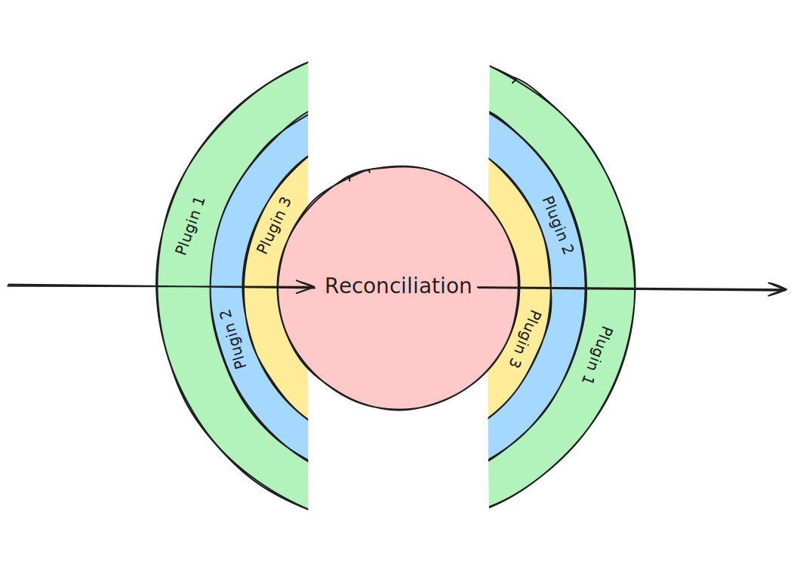
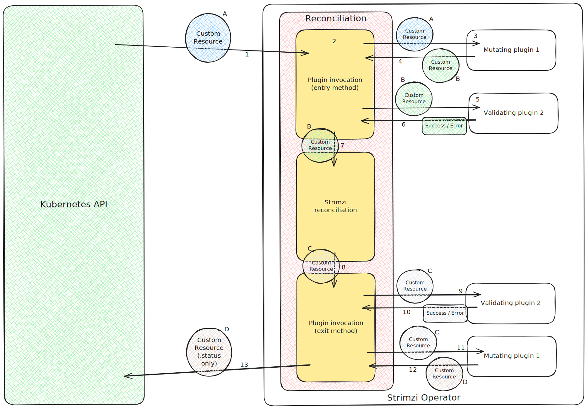

# Strimzi _Gatekeeper_ plugin system

This proposal suggests introducing a new plugin system called _Gatekeeper_.

## Current situation

Strimzi currently supports only one type of plugin: Pod Security Provider plugins.
The Pod Security Provider plugins can be used to inject security contexts into the containers deployed by the Strimzi Cluster Operator.
The Pod Security Provider plugins are called directly from the Cluster Operator methods that generate containers.
Strimzi users can use the built-in providers or provide their own custom provider.

## Motivation

The motivation for the Gatekeeper plugin system comes from two sources.
The first is the internal code structure, including its complexity and testability.
The second is the ability to add new custom features that might or might not be part of the core Strimzi project.

### Strimzi code structure, complexity, and testability

While the Pod Security Provider plugins are useful, their design is not practical, especially in the way they integrate with the Cluster Operator.
Because they integrate directly into the methods that generate the containers, they lead to complex internal logic within the core operator methods.
The operator has to:
* Take into account the security context configured by the user in the custom resource
* Pass it through the Pod Security Provider plugin to get the security context that should be used
* Set it in the container

This increases the complexity of the operator code.
It also increases the testing requirements, because you need to test the various combinations within the core operator.

Although Pod Security Provider plugins are currently the only supported plugin type, similar patterns are repeated elsewhere in the code base.
Some examples:
* We have multiple sources of labels.
  We have the Cluster Operator environment variables defining custom labels for all resources of a specific type.
  We have the Pod template defined in the custom resource.
  We add the labels Strimzi itself requires.
  In some cases - such as the Bridge - we have additional custom discovery labels.
  We have to combine all of these in the model classes when generating the Pods.
  Ideally, the unit tests for the model classes should cover all these different combinations.
* The same situation applies to environment variables.
  We have the environment variables defined by the Strimzi Cluster Operator itself.
  We have the environment variables from the template section of the custom resource.
  And we have a set of static environment variables that we just copy to every container (HTTP Proxy configuration, FIPS mode disabling, etc.).
  Once again, the core methods of the Cluster Operator that generate the containers need to combine these values and create the container definition.
  Their unit tests should ideally cover all the different combinations.
* A similar situation exists for many other fields as well, such as annotations, image pull secrets, and so on.

Following the current design model, many of the new features requested by our users would need to be added to this mix.
That would further increase code complexity and make the unit tests even more complicated as they try to cover every combination.
If we were able to break this monolithic approach into different layers, it might help us reduce code complexity, improve test coverage, and make it much easier to add new features.
The Gatekeeper plugin system described in this proposal aims to offer a way to do that.

### Adding new custom features
  
The previous section described internal challenges related to maintaining the current code and adding new features to Strimzi.
The lack of pluggable entry points also makes it hard to add new custom features that might not be interesting to the whole Strimzi community.
That often leaves our users in a tough position:
* They can keep trying to convince us (Strimzi maintainers) that some feature is valid for everyone, but they might never succeed.
* They can try to implement their features at a different level (for example as a Kubernetes admission controller).
* They can fork Strimzi and maintain their feature in their own fork while trying to keep it working and up-to-date.

None of these options is ideal.
While the Gatekeeper plugin system described below does not solve every user requirement, it could help in at least some cases.
One of the later sections describes examples of Gatekeeper plugins that users might implement to address these issues.

## Proposal

Gatekeeper plugins would be invoked at the beginning and at the end of the reconciliation, controlling entry to and exit from that reconciliation.
When reconciliation starts, the custom resource being reconciled would be passed to the _entry_ method of the Gatekeeper plugin.
When reconciliation completes, whether successfully or with an error, the result and the updated custom resource(s), including status, would be passed to the _exit_ method of the Gatekeeper plugins.)

There would be two types of Gatekeeper plugins:
* Validating plugins
* Mutating plugins

The validating plugins would receive the custom resource(s) and would be able to fail reconciliation by raising an error.
But they would not be able to modify the custom resource(s) and/or their status.

The mutating plugins would be able to fail the reconciliation by raising an error.
They would also be able to modify the custom resource(s) before the reconciliation starts or modify their status when the reconciliation ends.

The modifications done to the custom resource in the _entry_ method will be internal only and will be used only within the same reconciliation.
The updated resources would not be updated in the Kubernetes API and the changes done by the plugin would not be stored anywhere.
The changes will also not be visible to other applications through the Kubernetes API.
As a result, the plugins would need to apply the changes to the custom resource at every invocation.
_(This is similar to how virtual node pools were used during migration to node pools or how Connect and MirrorMaker2 custom resources were modified internally during migration from the `v1beta2` to `v1` APIs.)_

For example:
* User creates a `Kafka` CR with the following configuration:
  ```yaml
  apiVersion: kafka.strimzi.io/v1
  kind: Kafka
  metadata:
    name: my-cluster
  spec:
    kafka:
      # ...
  ```
* A TLSv1.3 enforcer implemented as mutating plugin would inject into it TLSv1.3 configuration in its _entry_ method:
  ```yaml
  apiVersion: kafka.strimzi.io/v1
  kind: Kafka
  metadata:
    name: my-cluster
  spec:
    kafka:
      config:
        ssl.protocol: TLSv1.3
        ssl.enabled.protocols: TLSv1.3
      # ...
  ```
* This modified resource would be used for the reconciliation.
  However, it would never be stored to the Kubernetes API in this form and other users using the Kubernetes API would never see it in this form.

Modifications done by the _exit_ methods to the `.status` section of the custom resource would be persisted to the Kubernetes API and visible to users and other applications.
However, Strimzi cleans up the `.status` section during the reconciliation.
So the plugins might need to update the status in the same way in every reconciliation as well.

For example:
* A `Kafka` CR was reconciled and is Ready:
  ```yaml
  apiVersion: kafka.strimzi.io/v1
  kind: Kafka
  metadata:
    name: my-cluster
  spec:
    # ...
  status:
    conditions: 
      - lastTransitionTime: "2019-08-20T11:37:00.706Z"
        status: "True"
        type: Ready
  ```
* A Security helper implemented as mutating plugin would inject a warning condition in its _exit_ method:
  ```yaml
  apiVersion: kafka.strimzi.io/v1
  kind: Kafka
  metadata:
    name: my-cluster
  spec:
    # ...
  status:
    conditions: 
      - lastTransitionTime: "2019-08-20T11:37:00.706Z"
        status: "True"
        type: Ready
      - lastTransitionTime: "2019-08-20T11:37:00.706Z"
        status: "True"
        type: Warning
        message: "Listener plain does not have TLS encryption enabled"
  ```
* This modified resource (its `.status` section) would be stored in the Kubernetes API.
  Users and other tools querying the Kubernetes API would see the warning message.

All modifications - regardless whether in the _entry_ or _exit_ methods - would of course also need to follow the Strimzi API.
The plugins would not be able to add any new fields.

Each plugin would be allowed to implement the _entry_ and _exit_ methods for one or more custom resources.
That would allow us to write plugins that, for example, apply only to `Kafka` resources.
Or plugins that want to gate all custom resources.

#### Error handling

An error raised by the plugin in its _entry_ method will be treated as any other reconciliation failure.
The exact error will be added to the status section of the custom resource and reported in the operator logs.
It would also trigger the _exit_ methods of all the Gatekeeper plugins.
This applies to both unexpected errors due to some bug or issue as well as to the resource being rejected by a (validating) plugin.

### Implementation

### Configuring Gatekeeper plugins

There would be three different groups of Gatekeeper plugins:
* Mandatory plugins would be hardcoded in the Strimzi source code and would not be configurable.
  These might be the plugins that Strimzi requires to work.
* Default plugins would have a default configuration hardcoded in the Strimzi source code.
  These would be the plugins Strimzi provides and _recommends_.
  But the default plugins could be changed by users who wish to configure their own default plugins.
* Custom plugins would be unset by default, and users would need to configure them explicitly.
  Custom plugins would be the plugins provided by Strimzi but disabled by default.
  Or custom plugins brought in by the user.

Having these three groups is important because it allows us to define the plugins that must always be used.
It also allows us to provide plugins that we believe should be used because they are broadly useful or needed for backward compatibility.
Finally, it allows users to add their own plugins without reconfiguring the default ones.

The default plugins would be configured through the Cluster Operator environment variable `STRIMZI_GATEKEEPER_DEFAULT_PLUGINS`.
When unset, the default plugins from the Strimzi source code would be used.
When set, the plugins configured in the environment variable would fully replace the default plugins hardcoded in the Strimzi source code.
The custom plugins would be configured through the Cluster Operator environment variable `STRIMZI_GATEKEEPER_CUSTOM_PLUGINS`.
Users should generally configure custom plugins through this variable.
The default plugin configuration should be used when a user wants to disable one or more default plugins.

The configuration will be independent for each operator and will not be mirrored automatically.
The main reason is that plugins might often apply only to some operators (for example, only to the Cluster Operator) and might not be present in the others.
So mirroring the configuration might lead to errors.
Users can use the `template` section of `.spec.entityOperator` to configure the Gatekeeper plugins for User and Topic operators.
When using standalone Topic or User operators, users can set these variables in their standalone deployments.

#### Per-resource configuration

The plugins will be configured only on a per-operator basis.
They will not support any direct configuration on a per-custom resource basis.
However, plugins (their authors) can for example decide to provide an option to skip some resources based on an annotation.
For example, a plugin `MyGateKeeperPlugin` can check for an annotation such as `my-gatekeeper-plugin.scholz.cz/skip=true` and decide based on it whether to take any action or not.

However, this is something that needs to be decided on a plugin by plugin basis by their authors.
There will be now general way to skip the plugins that would be provided by Strimzi and allow skipping all plugins.

#### Ordering

The Gatekeeper plugins will be ordered.
At reconciliation _entry_, they will always be called in the following order:
* Custom plugins
* Default plugins
* Mandatory plugins

Within each plugin group, the plugins will be invoked in the order specified by the user or by the Strimzi source code.
Plugins from `STRIMZI_GATEKEEPER_CUSTOM_PLUGINS` (and `STRIMZI_GATEKEEPER_DEFAULT_PLUGINS` if set) will be called in the order as specified by the user.
The mandatory and default (when `STRIMZI_GATEKEEPER_DEFAULT_PLUGINS` is not set) plugins will be called in the order as specified by Strimzi.

At reconciliation _exit_, they will always be called in the following order:
* Mandatory plugins
* Default plugins
* Custom plugins

Within each plugin group, the plugins will be invoked in the reverse order specified by the user or by the Strimzi source code.



The plugins are _wrapping_ the reconciliation.
So the reverse order at _exit_ naturally corresponds to this.
It also helps to ensure that our mandatory plugins are always executed closest to the reconciliation.

#### Example

The following diagram shows the Strimzi reconciliation flow with the Gatekeeper plugins:

1. When a custom resource is created or updated, Kubernetes triggers Strimzi operator through a watch and sends it the Custom Resource A (CR)
2. Strimzi reconciliation starts with the invocation of the Gatekeeper plugins
3. The CR (A) is passed to first plugin, which in this case is mutating plugin
4. The plugin modifies the CR (A) and returns it back to Strimzi as CR (B)
5. Strimzi takes the CR (B) and passes it to the next plugin
6. In this case a validating plugin which returns only a success or an error after validating the CR (B)
7. The CR (B) is passed to the regular Strimzi reconciliaiton process which manages given operand accordingly
8. At the end, when the core Strimzi reconciliation is completed, Strimzi prepares the new `.status` section and together with the rest of the custom resource invokes with it the plugins as CR (C)
9. It is first passed to the plugin 2
10. Validating plugin 2 does not change it and only returns success or failure
11. Next it passes it to the plugin 1
12. Mutating plugin modifies the `.status` section (e.g. add a warning condition) and return CR (D)
13. Strimzi uses the `.status` section from CR (D) and updates it in the Kubernetes API server



#### Plugin interfaces

The Gatekeeper plugins would be defined through a series of interfaces.

The first interface, `GatekeeperPlugin`, would define the plugins.
It would contain a single method, `configure(...)`, which would be called once at startup when the plugin is instantiated.
As a parameter, it would accept a `GatekeeperPluginConfigurationContext` record.
Initially, the context would contain an instance of the Fabric8 Kubernetes client and an instance of the Strimzi `PlatformFeatures` class describing the environment in which the operator is running.
The `configure(...)` method would return `void`.

There would also be two additional interfaces per each supported operand type:
* Mutating plugin interface named `GatekeeperMutating<OperandType>Plugin` (e.g. `GatekeeperMutatingKafkaPlugin` or `GatekeeperMutatingKafkaBridgePlugin`)
* Validating plugin interface named `GatekeeperValidating<OperandType>Plugin` (e.g. `GatekeeperValidatingKafkaPlugin` or `GatekeeperValidatingKafkaBridgePlugin`)

Plugins would exist for the following operand types:
* `Kafka` (handles both `Kafka` and `KafkaNodePool` resources)
* `KafkaConnect` (handles both `KafkaConnect` and `KafkaConnector` resources)
* `KafkaMirrorMaker2`
* `KafkaBridge`
* `KafkaRebalance`
* `KafkaUser`
* `KafkaTopic`

At least initially, there would be no plugin support for `StrimziPodSet` resources.
`StrimziPodSet` resources are internal resources only and are not exposed to Strimzi users.
They also serve a very simple purpose - to create the Pods.
And if needed, any modifications to the Pods can be easily done also through Kubernetes's own mechanisms.
However, this can be reconsidered in the future if we see some demand and use-cases for it.

Using multiple small interfaces per plugin type (Mutable / Validating) and per resource type was chosen intentionally.
While it means that we will have 14 different interfaces, it provides much better overview of what the plugin actually implements compared to having for example just 2 big interfaces with many methods.
The plugin implementations can choose which and how many interfaces will be implemented in their plugin class.
It also allows us to better log which plugins are actually called, because we will know what custom resources are supported by given plugin.
And we will not be needed to make unnecessary calls to some default methods that would do nothing.

Each interface would have two methods:
* `<Type>Entry` (e.g. `kafkaEntry`) called at the beginning of the reconciliation
* `<Type>Exit` (e.g. `kafkaExit`) called at the end of the reconciliation

The interfaces would provide default implementations of these methods that _do nothing_.

The _entry_ method would have two or three parameters:
* `Gatekeeper<Type>EntryContext` would be a record containing additional information passed to the plugin.
Initially, it would be an empty record without any fields.
However, it might be used in the future.
* The custom resource which the plugin should evaluate.
* In case of Kafka and Kafka Connect plugins, a collection with the secondary resources (Kafka node pools or connectors).
* For mutating plugins, the method would return a completion stage containing the updated custom resources.
For Kafka and Kafka Connect, it would return a record with the primary custom resource and a collection of the secondary custom resources.
Validating plugins would return a _void_ completion stage.

The _exit_ method would have two or three parameters:
* `Gatekeeper<Type>ExitContext` would be a record containing additional information passed to the plugin.
Initially, it would be an empty record without any fields.
However, it might be used in the future.
* The custom resource which the plugin should evaluate including the updated status section.
* In case of Kafka and Kafka Connect plugins, a collection with the secondary resources (Kafka node pools or connectors).
* For mutating plugins, the method would return a completion stage containing the updated custom resources.
For Kafka and Kafka Connect, it would return a record with the primary custom resource and a collection of the secondary custom resources.
Only the updates to the `.status` section of these resources would take any effect.
Validating plugins would return a _void_ completion stage.

#### Loading and calling the plugins

The same mechanism currently used for Pod Security Provider plugins would also be used for Gatekeeper plugins.
The plugins would be loaded at operator startup through a `GatekeeperPluginFactory` singleton class.
The factory will take the configured plugins and load them through the Java Service Loader mechanism based on the `GatekeeperPlugin` interface.
If any configured plugins are missing, the operator will report an error and fail to start.
The loaded plugins would also be initialized as part of `GatekeeperPluginFactory` initialization by calling their `configure(...)` methods.
The initialized plugins would be stored as static fields inside `GatekeeperPluginFactory`.
The `GatekeeperPluginFactory` class would then be used by the assembly operators to call the plugins during reconciliations.

#### Java modules

As with Pod Security Providers, the interfaces needed to implement the Gatekeeper plugins will be part of the `api` module.
The actual implementations provided by Strimzi will be part of:
* The corresponding operator module for plugins related to a single operator only
* The `operator-common` module for plugins shared by all operators
* A separate repository for any plugins we might provide to Strimzi users as maintained by Strimzi but fully optional

Users' own custom plugins will live in their own repositories.

### Use cases

The Gatekeeper plugins provide significant opportunities.
Apart from validating or modifying resources, they can also integrate with other systems and platforms, for example by making remote calls.
This section covers some examples that would be good candidates for this mechanism.

#### Internal use cases

The motivation section already described several internal use cases where Gatekeeper plugins might allow us to simplify our code base and tests.

Let's take labels as a detailed example.
Strimzi could provide two different Gatekeeper plugins:
* 3scale discovery labels plugin
* Custom environment variable-based labels plugin

The _3scale discovery labels plugin_ would be a mutating Gatekeeper plugin for `KafkaBridge` resources.
In its _entry_ method, it would inject the 3scale discovery labels into the `KafkaBridge` CR, so that they are correctly set by the Cluster Operator.
Its _exit_ method would not do anything.

The _Custom environment variable-based labels plugin_ would be a mutating Gatekeeper plugin handling `Kafka`, `KafkaConnect`, `KafkaMirrorMaker2`, and `KafkaBridge` resources.
It would read the environment variables with the custom labels (such as `STRIMZI_CUSTOM_KAFKA_BRIDGE_LABELS`, to continue using `KafkaBridge` as the example).
And in the _entry_ method, it would inject these labels into the template section of the corresponding custom resource.
Its _exit_ method would not do anything.

These plugins could be configured as _default_ plugins.
They would have their own unit tests covering how they _inject_ labels into the custom resource.
This would allow us to simplify the logic in the Cluster Operator model classes, because they would no longer need to handle special label sources such as environment variables.
It would also simplify the tests, because the model classes would only need to handle the default Strimzi labels and the labels from the template section of the custom resource.

The same simplification could be applied to other parts of our code.
For example:
* Environment variable configuration
* Image pull secrets
* Annotations
* Security context (possibly replacing the Pod Security Providers in the future by injecting the desired security context into the template section directly)

#### Other use cases

There are various use cases that Strimzi might want to provide and that could be implemented as Gatekeeper plugins.
For example:

* **Security enforcement:** Enforce particular security requirements through Gatekeeper plugins.
  Similar to Pod Security Providers managing Kubernetes security contexts, we could have additional plugins for other security-related concerns.
  For example, they could enforce TLSv1.3 or quantum-safe cipher suites in Apache Kafka configuration.
  This could be done in either a validating or mutating fashion.
* **Pre/Post update hooks:** Execute custom tasks before or after the operator or operand is upgraded.
  While we currently do not have any specific use case, such a feature might be useful in the future.
* **Access Operator alternative:** A validating Gatekeeper plugin for `Kafka` and `KafkaUser` could be used to copy cluster or user information into different namespaces or clusters.
  The plugin would wait for the reconciliation to complete and in the _exit_ method it would distribute the credentials or cluster coordinates to places defined in annotation.
  _(Included as an example only - the actual replacement of Access Operator by a Gatekeeper plugin would require a separate proposal.)_
* **Help with backward compatibility tasks.**
  For example by translating old annotations to new annotations ([#12342](https://github.com/strimzi/strimzi-kafka-operator/issues/12342)).
  Or by rewriting the resources to use new instead of old APIs internally (such as when changing from `v1beta2` to `v1` API).

#### External use cases

There are also external use cases that would not be suitable for inclusion in Strimzi directly.
This might happen because of limited demand among Strimzi users.
It might also happen because the feature or its implementation is unique to a given user or vendor.
Gatekeeper plugins would allow users to handle these use cases through custom plugins without modifying the Strimzi source code.
These use cases include, for example:

* **Metering:** Provide usage information.
  Strimzi itself has no _call-home_ functionality and no interest in including one.
  But vendors might be interested in implementing one in their own metering for better information about how and where their product is used.
* **Monitoring and Management system registration:** Register the operands into various monitoring and management systems or UIs.
* **Licensing:** Enforce custom licensing rules, check license compliance and so on.
  Strimzi as an open-source project is distributed and used for free.
  However, vendors might have their own licensing rules for their products.
  Validating Gatekeeper plugins would allow them to check and enforce those rules in their own Strimzi builds.
* **Auditing:** Help to audit the deployed operands, their configurations, or their configuration changes by synchronizing with external auditing systems.
* **Enforcement:** Enforce custom rules and configuration.
  For example, everything needs to use TLS encryption.
* **Enrichment and Modification:** Enrich the deployed operands by adding additional configurations.
  For example, automatically mount a custom plugin or company CA certificates into the operand containers.
* **Disable features or components:** Users/vendors who want to use/support only some features can use the Gatekeeper plugin to reject any resources using the forbidden features with an appropriate error.

#### Currently opened issues

There are also issues and discussions that could be addressed through Gatekeeper plugins without major impact on the rest of the operator code.
For example:

* **[#12537](https://github.com/strimzi/strimzi-kafka-operator/issues/12537):** Secret / ConfigMap reload hooks.
  Hashes of Secrets or ConfigMaps could be collected within the plugin and injected as a Pod annotation into the custom resource.
* **[#10823](https://github.com/strimzi/strimzi-kafka-operator/issues/10823):** Support for Passing Username as Secret in KafkaClientAuthenticationPlain.
  A Gatekeeper plugin could load an external username and inject it into the custom resource.
* **Manual cluster ID configuration:** Configure the desired cluster ID in an annotation, and a Mutating Gatekeeper plugin will inject it into the status when the reconciliation starts.

### Supportability

_With great power comes great responsibility._
Gatekeeper plugins provide a powerful abstraction.
However, when used incorrectly, they could also break many things.
For example, this could happen if a mutating plugin makes an invalid change to a custom resource,
or if a plugin takes too long while making external calls.
This creates a risk for Strimzi users and might make it harder to support them.

To mitigate these issues, we should make sure that:
* The documentation makes these risks clear and recommends using plugins only from trusted sources.
* We provide guidance on things plugin authors should avoid (e.g. do not modify metadata).
* Add thorough logging when invoking Gatekeeper plugins so that the logs clearly show which plugins are being used.

This approach could also improve supportability.
For example, a plugin could log the full custom resource at the beginning of reconciliation.

While we could provide also some additional mitigation measured such as hardcoded execution timeout, it might lead to limiting the possible applications of the plugins.
So it is better to rely on the responsibility of the plugin authors and users.

### Cross-version support

The Gatekeeper plugins should be able to work across multiple Strimzi versions without updates.
However, it will always, to some extent, depend on:
* What the plugin does and what libraries are used for it
* What dependency updates and API changes occurred in a given Strimzi release.

For example, if the plugin does some custom Kubernetes integration based on the Fabric8 library, it might need to be updated when the Fabric8 library updates in Strimzi.

### Initial plugins

The initial implementation would include the following plugins:
* **Custom resource logging plugins:** used as an example of a validating plugin.
  It would log the full YAML of the custom resource(s).
  It would be shipped as part of Strimzi, but would not be enabled by default.
* **Labels from environment variables plugin:** would read labels from the existing environment variables and inject them into the custom resource.
  This plugin will be enabled by default as a _default_ plugin and will replace the related Cluster Operator functionality.
* **Default environment variable plugin:** would read selected environment variables such as `HTTP_PROXY` and inject them into the custom resources.
  This plugin will be enabled by default as a _default_ plugin and will replace the related Cluster Operator functionality.
* **ImagePullSecrets plugin:** would read the default image pull secrets from the existing environment variable and inject them into the custom resources.
  This plugin will be enabled by default as a _default_ plugin and will replace the related Cluster Operator functionality.
* **3scale discovery labels plugin:** would inject the 3scale discovery labels into the `KafkaBridge` resource.
  This plugin will be enabled by default as a _default_ plugin and will replace the related Cluster Operator functionality.

The existing functionality these plugin would replace is relatively simple and moving it to the plugins should constitute a minimal risk.

## Future plans

Gatekeeper plugins would provide a powerful extension point for Strimzi.
However, they would not solve all use cases.
Additional extension points might be considered in the future, such as pluggable rollers for Kafka and Kafka Connect or pre- and post-rolling-update plugins for them.
These might be provided as separate plugins, or as extensions to Gatekeeper plugins where appropriate.

## Affected projects

This proposal affects the `strimzi-kafka-operator` repository.

## Backwards compatibility

This proposal is fully backward compatible.

## Rejected alternatives

### Using external tools

Some of the things made possible through Gatekeeper plugins could also be done through Kubernetes webhooks and/or Kyverno and Open Policy Agent policies.
These tools provided a major inspiration for this proposal.
However, these tools are not easy to deploy and manage:
* Kubernetes webhooks are set up at the cluster level (requiring special permissions to create and configure) and require things such as mandatory TLS configurations.
* Tools such as Kyverno or Open Policy Agent require users to run and manage yet another tool.

Having the plugins directly inside the Strimzi operators also opens the door to additional use cases and allows evaluation of multiple resources together (`Kafka` + `KafkaNodePools`, `KafkaConnect` + `KafkaConnectors`).

### Using web-hooks instead of Java plugins

The Gatekeeper plugins can be implemented as separate deployments called through a webhook mechanism.
However, this would make it harder to deploy and manage them.
And it might also impact the performance.
If desired, a webhook-based mechanism could be implemented in the future as a separate Gatekeeper plugin.
(Such a plugin could take a list of webhooks to call from an annotation or ConfigMap.)
