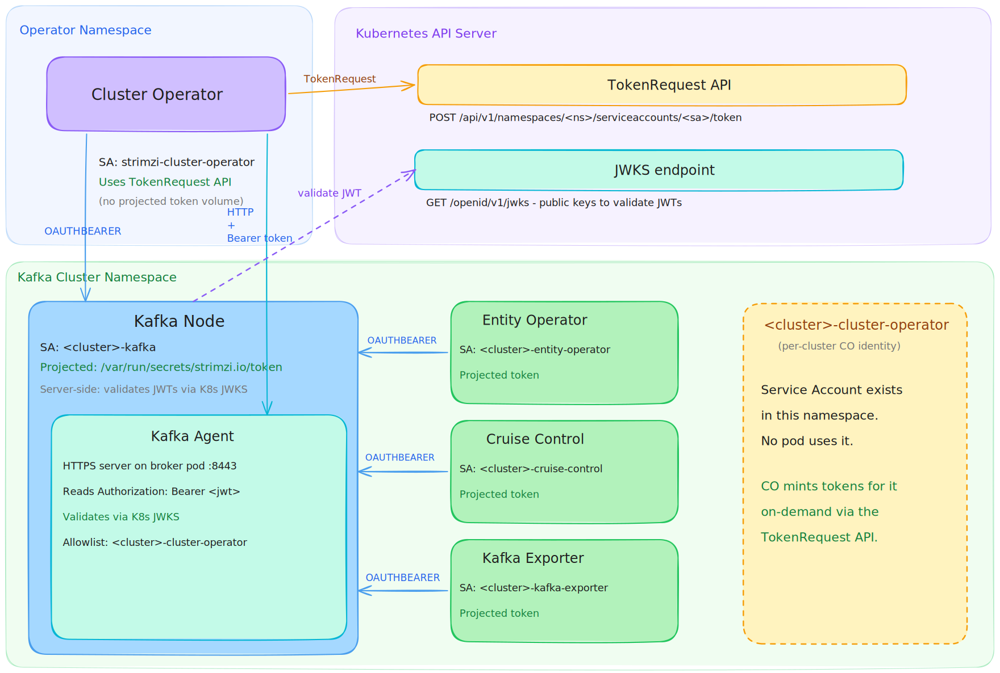

# Configurable Security for Internal Kafka Cluster Communication

This proposal introduces new options for configuring encryption and authentication for internal communication within a Kafka cluster.

## Current Situation

Every Apache Kafka cluster powered by Strimzi has several layers of internal communication.

Some use the Kafka protocol:

* Kafka control plane communication:
  * Communication within the controller quorum
  * Brokers communicating with the controllers
* Kafka data plane communication:
  * Replicating data between Kafka brokers
* Strimzi control plane communication:
  * Cluster, Topic, and User operators talking with the Kafka cluster
  * Cruise Control communicating with the Kafka cluster
  * Cruise Control Metrics Reporter collecting metrics for Cruise Control
  * Kafka Exporter extracting additional metrics from the Kafka cluster
  * Quotas and tiered storage plugins

Others use HTTP:

* Communication between operators and Cruise Control
* Communication between the Cluster operator and the Kafka Agent running inside the Kafka nodes

Currently, all this communication uses TLS encryption with mTLS authentication.
This is hardcoded and cannot be changed.

The only exception is the HTTP interface of Cruise Control, which uses its own API key-based authentication mechanism over HTTPS.

TLS encryption with mTLS authentication has allowed us to provide _secure by default_ Apache Kafka clusters.
However, it has its own challenges.
Because of Kafka's distributed and multilayered architecture, we cannot _just use_ regular server certificates.
We have to manage Certificate Authorities to establish trust between the different Kafka layers (brokers, controllers, etc.).
Historically, this has been a source of serious bugs.
Managing certificates is also not something that we would consider our core competency.
As a Strimzi project, users may trust us for our Kafka capabilities, but not necessarily for certificate management.
While many Strimzi users value security and want to run Strimzi in a secure way, neither they nor we really want Strimzi to act as a certificate management tool.

That is why we previously decided to work towards supporting [cert-manager](https://cert-manager.io/) as a trusted certificate management tool.
Instead of managing its own certificates, Strimzi would rely on cert-manager (or, in the future, possibly other certificate managers) to provide the TLS certificates.
This direction has been approved in the [SEP-100 proposal](https://github.com/strimzi/proposals/blob/main/100-external-certificate-manager.md), and the implementation is currently in progress.

## Motivation

While cert-manager support would be a major step forward, it does not change the fact that TLS encryption and mTLS authentication will still be hardcoded and required for any Strimzi-based Kafka cluster.
There are various reasons why hardcoded TLS encryption and mTLS authentication are not optimal.
Strimzi users seem to request this for two main reasons.

The first reason is performance and cost.
Using TLS for internal communication within the cluster has significant performance and cost implications.
Not having to encrypt / decrypt the data means that we need less processing in the clients and brokers which should help to reduce latency and increase performance.
Disabling TLS should also allow Kafka to use the _zero-copy_ principle when dispatching data to consumers.
Reducing the CPU load required for the TLS processing also help to reduce the overall resource requirement and reduce the costs.
Especially when running in isolated environments, some users are willing to skip TLS encryption for performance gains or cost optimizations.

The second reason is service mesh integration.
Service meshes such as Istio provide an alternative way to secure communication.
Instead of configuring TLS encryption directly in each component, you can tunnel all communication through the service mesh, which provides encryption (and authentication).
The current situation with hardcoded TLS encryption and mTLS authentication leads, at best, to _double encryption_, where the Strimzi-encrypted traffic is encrypted a second time by the service mesh.
In some cases, it can even break communication completely.

To address these requests, Strimzi would need to allow disabling TLS encryption.
Unfortunately, while encryption and authentication are in general separate concerns, mTLS couples the authentication and encryption layers.
Disabling TLS encryption means that we also lose the authentication layer.
While a Kafka cluster can theoretically work without authentication on its internal interfaces, it would mean that you would have to either disable authorization or configure the `ANONYMOUS` user as a superuser.
This would need to be done not just for internal communication but for the whole Kafka cluster, including communication with regular Kafka clients.
It would significantly compromise the security of the Kafka cluster.

That is why this proposal has to deal with both the encryption and authentication layers.
To provide acceptable security, it needs to allow disabling TLS encryption and provide an alternative authentication mechanism that does not rely on TLS encryption.

NOTE:
_This proposal does not aim to supersede the SEP-100 proposal._
_Instead, it aims to complement it by making TLS encryption and mTLS authentication optional and providing alternatives._

## Proposal

This proposal focuses on two tasks:
* Allowing users to disable TLS encryption for internal communication
* Providing an alternative authentication mechanism

The proposed alternative authentication mechanism is based on Kubernetes Service Accounts and their tokens.
The Service Account tokens can be used in an OAuth-like fashion and are supported by Apache Kafka's `OAUTHBEARER` SASL mechanism.
They work on most Kubernetes clusters without requiring additional dependencies such as Keycloak.

The main purpose of Service Account-based authentication is to provide an alternative authentication mechanism when TLS encryption is disabled.
However, users will be able to use the Service Account-based authentication regardless of whether TLS is disabled or not.
For example, if they prefer the use of short-lived tokens over long-lived certificates for authentication, they might want to use the TLS encryption with Service Account authentication.

### Disabling TLS

Disabling TLS encryption and mTLS authentication is straightforward.
We just need to generate the various configurations without enabling TLS.

### Service Account Authentication

Service Accounts are non-human accounts provided by Kubernetes.
A Service Account is used by the Strimzi Cluster Operator to communicate with the Kubernetes API.
The Cluster Operator already creates and assigns a dedicated Service Account to every component we deploy (for example, one for Kafka nodes, one for the Entity Operator, etc.).
The Service Account identity is based on the Service Account name and its namespace.
Service Accounts are based on JWT tokens that can be authenticated using OIDC validation and JSON Web Key Sets (JWKS).

However, using the regular Service Account tokens would be potentially insecure.
If they are leaked as part of Strimzi authentication, they could also be used to communicate with the Kubernetes API.
Conversely, any Service Account token would pass Strimzi authentication.

Kubernetes allows us to get additional Service Account tokens with a specific audience.
The audience allows us to distinguish arbitrary Service Account tokens from tokens issued for Strimzi authentication.
These tokens can be issued in two different ways:
* Through [projected volumes](https://kubernetes.io/docs/concepts/storage/projected-volumes/#serviceaccounttoken), which allow us to mount the token as a file into a Pod.
  This mechanism will be used to project the tokens into the Pods that belong to the Kafka operand (Kafka nodes, Entity Operator, Cruise Control, Kafka Exporter).
  These components will use their existing Service Accounts.
* Using the [`TokenRequest` Kubernetes API](https://kubernetes.io/docs/reference/kubernetes-api/authentication-resources/token-request-v1/).
  This will be used by the Cluster Operator.
  While the Cluster Operator has its own Service Account for which the projected volume can be used, this Service Account is bound to the Cluster Operator namespace.
  Its identity would change when you deploy a new Cluster Operator into another namespace (for example, as part of a phased upgrade).
  The identity would also be shared between all Kafka operands managed by this Cluster Operator.
  Instead, we will create a new Service Account for each Kafka cluster.
  This Service Account will live in the Kafka cluster's namespace and will be named `<cluster-name>-cluster-operator`.
  The Cluster Operator will use the `TokenRequest` API to get the token for this account and use it to authenticate with the given Kafka cluster.

The audience used by these tokens will be based on the name of the Kafka cluster and its namespace to ensure uniqueness.
The default expiration for the tokens will be 3600 seconds, which is the recommended value by Kubernetes.



Using the Service Account for authentication would introduce stronger dependency on the Kubernetes API.
The tokens have default expiration of 1 hour and typically do not use longer expiration then 24 hours.
So when the Kubernetes API is not available when the token needs to be refreshed, the authentication would fail.
Today, we also rely on the Kubernetes API to load the certificates.
But because they are long-lived, a running Kafka cluster might work for much longer before it is impacted by Kubernetes API server outage.

However, this is acceptable trade-of:
* We are using more secure short-lived credentials which always carry this risk
* Outages of the Kubernetes API server are not a major concern.
  The Kubernetes control plane supports high availability and should use it in production-grade Kubernetes clusters.
  Also, in many situation, Kubernetes API outages would be accompanied by outages of the worker nodes, Pod restarts, etc.
  In which case even the operands reliant on mTLS would be affected.
* The Service Account based authentication is an opt-in feature.
  User who prefer to use on mTLS can remain on it.

#### Kafka Authentication

On the Apache Kafka side, we will use the existing Strimzi OAuth library to perform authentication on the control plane and replication listeners.

```proeprties
listener.name.replication-9091.sasl.enabled.mechanisms=OAUTHBEARER
listener.name.replication-9091.oauthbearer.sasl.server.callback.handler.class=io.strimzi.kafka.oauth.server.JaasServerOauthValidatorCallbackHandler
listener.name.replication-9091.oauthbearer.sasl.jaas.config=org.apache.kafka.common.security.oauthbearer.OAuthBearerLoginModule required \
                                                  unsecuredLoginStringClaim_sub="unused" \
                                                  oauth.check.access.token.type="false" oauth.custom.claim.check="@.aud anyof ['strimzi.io']" \
                                                  oauth.valid.issuer.uri="https://kubernetes.default.svc.cluster.local" \
                                                  oauth.jwks.endpoint.uri="https://kubernetes.default.svc.cluster.local/openid/v1/jwks" \
                                                  oauth.jwks.refresh.seconds="300" \
                                                  oauth.username.claim="sub" \
                                                  oauth.ssl.truststore.location="/var/run/secrets/kubernetes.io/serviceaccount/ca.crt" \
                                                  oauth.ssl.truststore.type="PEM"  \
                                                  oauth.include.accept.header="false" \
                                                  oauth.server.bearer.token.location="/var/run/secrets/kubernetes.io/serviceaccount/token" \
                                                  oauth.access.token.location="/var/run/secrets/strimzi.io/token";
listener.name.replication-9091.oauthbearer.sasl.mechanism=OAUTHBEARER
listener.name.replication-9091.oauthbearer.sasl.login.callback.handler.class=io.strimzi.kafka.oauth.client.JaasClientOauthLoginCallbackHandler
```

Clients connecting to these listeners will also use it:

```properties
security.protocol=SASL_PLAINTEXT
sasl.mechanism=OAUTHBEARER
sasl.login.callback.handler.class=io.strimzi.kafka.oauth.client.JaasClientOauthLoginCallbackHandler
sasl.jaas.config=org.apache.kafka.common.security.oauthbearer.OAuthBearerLoginModule required oauth.access.token.location="/var/run/secrets/strimzi.io/token";
```

In the Cluster Operator, we will use our own callback handler that will obtain the token from the Kubernetes API using `TokenRequest` instead of reading it from a file.
At least initially, this handler will live only in the Cluster Operator module in the Strimzi Operators repository.

#### Kafka Authorization

As with the current mTLS authentication, we will configure the internal users as superusers.
Instead of the TLS-based usernames (e.g. `User:CN=my-cluster-entity-topic-operator,O=io.strimzi`), we will use the Service Account-based identity (e.g. `User:system:serviceaccount:myproject:my-cluster-entity-operator`).

#### Kafka Agent Authentication

The Kafka Agent is a helper utility that runs as a Java agent inside the Kafka nodes.
It uses HTTP to expose additional information about the Kafka cluster, such as its readiness or data recovery state.
It has two listeners:
* Listener on port 8080 without any encryption or authentication is used by the Pod health check.
  This listener is exposed only locally within the Pod itself.
  This listener will remain unchanged.
* Listener on port 8443 is used by the Cluster Operator to query the Kafka node state.
  This listener is exposed outside the Pod and is currently using TLS encryption and mTLS authentication.
  This listener will continue to use the port 8443.
  Its security will be adjusted together with the Kafka cluster security configuration.
  To support Service Account-based authentication, we will add our own custom Jetty handler to verify the Service Account tokens similarly to how the Kafka nodes do.

The Kafka Agent client inside the Cluster Operator will also be extended to support both TLS encryption and mTLS authentication as well as Service Account-based authentication.
It will use the token obtained through the `TokenRequest` API similarly to how the Cluster Operator does when connecting to Kafka.

#### Cruise Control Authentication

Cruise Control is connecting to the Kafka cluster using the Kafka protocol to collect metrics as well as to balance the Kafka cluster (execute reassignments, etc.).
The Kafka connections will be configurable as described in this protocol.
So users would be able to disable TLS / mTLS as well as use the Service Account tokens.

However, Cruise Control also has its own HTTP-based listener for its own REST API.
This API is used by the Cluster and Topic Operators to communicate with Cruise Control
This HTTP API uses its own API key-based authentication.
This will remain unchanged for the time being, and the new cluster configuration will only be used to enable or disable TLS encryption on the HTTP API.
The authentication will remain unchanged.

In the long term, we should aim to add support for Service Account-based authentication to the Cruise Control HTTP interface as well.
That would also help improve some of the limitations of the current authentication model, such as lack of credential rotation.
However, the development and maintenance of the Cruise Control project seems to be paused for the moment.
This should be revisited later depending on the future of Cruise Control.

### Configuring the Internal Cluster Security

With the ongoing work on cert-manager support, we currently have multiple parallel streams of work related to cluster security that might lead to API changes.
This proposal therefore suggests using only an annotation for now to configure cluster security.
Using an annotation means that we are not binding to a specific API layout just yet by adding it to the custom resource spec.

Once both the work on this proposal and the cert-manager integration are complete, we can try to come up with a permanent API.
Given that we just released version 1.0.0 and finalized the `v1` API, we should have enough time to finalize it before the next API version change.

The cluster security would be configured in the `strimzi.io/internal-cluster-security` annotation.
This annotation would contain JSON with the configuration.
When the annotation is not set, Strimzi will default to the current state with TLS encryption and mTLS authentication.

The reason why a single annotation with JSON object is used instead of having multiple annotations with a single value is because it gives us the flexibility to add additional values if needed.
For example, if it turns out that users want to configure the token expiration or use different Kubernetes endpoints as part of the token authentication, the corresponding fields can be easily added to the JSON structure.

It will initially contain two sections:
* `encryption`
* `authentication`

Both sections will have a `type` field.
Both will support the `none` type to indicate no encryption or authentication.
The `encryption` section will have an additional type `strimzi-tls`.
The `authentication` section will have additional types `strimzi-mtls` and `kubernetes-sa`.

The `strimzi-tls` and `strimzi-mtls` types will indicate the existing TLS encryption and mTLS authentication.
The following configuration would have the same meaning as the current defaults:

```yaml
metadata:
  annotations:
    strimzi.io/internal-cluster-security: |
                      {
                          "encryption":
                              {
                                  "type": "strimzi-tls"
                              },
                          "authentication":
                              {
                                  "type": "strimzi-mtls"
                              }
                      }
  spec:
    # ...
```

The `kubernetes-sa` authentication type will have additional options:
* `expirationSeconds` with `3600` seconds as the default value

Further options might be added in the future based on user feedback.
_(While this proposal was tested on a prototype, it is hard to predict how various Kubernetes environments might be configured.)_

The configuration with no encryption and Service Account-based authentication would look like this:

```yaml
metadata:
  annotations:
    strimzi.io/internal-cluster-security: |
                      {
                          "encryption":
                              {
                                  "type": "none"
                              },
                          "authentication":
                              {
                                  "type": "kubernetes-sa",
                                  "expirationSeconds": 1800
                              }
                      }
  spec:
    # ...
```

At the start of the reconciliation, the Cluster Operator will validate the settings:
* Ensure the configuration is valid JSON with a valid layout
* Ensure the configuration makes sense (e.g. no mTLS authentication with disabled encryption)

#### Moving to the Final `Kafka` Custom Resource API

Eventually - once we settle on the final `Kafka` API for configuring the cluster security (see the "Future Work" section below) - users will have to migrate from the `strimzi.io/internal-cluster-security` annotation to the new API.
This will be done in several steps.

* In the Phase 0 (this proposal), all users will rely on the annotation
* In the Phase 1, we will introduce the new API in the `Kafka` CR.
  In this phase, the annotation will still be supported, but it would internally convert to the new API (e.g. using an internal mutating Gatekeeper plugin).
  This phase will take several releases and users will have time to migrate from the annotation to the `Kafka` CR API during this time window.
* In the Phase 2, we will drop the support for the annotation and only the `Kafka` CR API will be used.
  The `strimzi.io/internal-cluster-security` annotation will be ignored by the Cluster Operator.
  Any clusters that were not migrated to the new API will not be broken, but their reconciliation will be failing until the resource is updated to use the new API.

### Changing the Configuration

Changing the encryption or authentication configuration while the Kafka cluster remains online and available would require a complicated multi-phase process.
We would first need to roll out a new listener with the new configuration to all internal interfaces (brokers, controllers, the Kafka Agent, etc.).
Then we would be able to reconfigure the components to use the new listeners.
Finally, we would remove the old listeners.
This is complicated not only because of the multi-phase nature of the process, but also because of the number of ports involved.
The resulting variability in port numbers would also introduce a lot of _chaos_ (for example, you would no longer know for sure that replication uses port 9091).

In reality, we expect changes to the internal communication security configuration to be a very rare event.
In most cases, users should decide at the beginning what kind of security they want to use depending on their environment.
Instead of providing a complex process for changing the configuration while maintaining cluster availability, we will require cluster downtime.

To change the cluster security configuration, users will use the following procedure:
* Pause the reconciliation of the `Kafka` CR
* Stop the cluster (delete the `StrimziPodSets`, `Pods`, and `Deployments` with `kubectl` or a similar tool)
* Update the desired security configuration in the `Kafka` CR annotation (later in the `.spec` section)
* Edit the `.status` section of the `Kafka` CR and remove the current security configuration from it (see next section for more details)
* Unpause the reconciliation of the `Kafka` CR

Once the reconciliation is unpaused, the Strimzi Cluster Operator will recreate all Pods with the new configuration.

### Protecting the Running Clusters

Changing the security configuration for an existing cluster could easily break the cluster.
Therefore, we will have built-in protection to prevent that.
The current security configuration will be tracked in the `Kafka` CR status.
When the current status is not present, the operator will accept the desired configuration and use it.
This should happen only for:
* Newly deployed clusters (they do not have the security set in the `.status` section, so the operator allows configuring the cluster security in any way)
* When the user executes the configuration change procedure (described in the previous section)

The Strimzi cluster Operator will for every reconciliation:
* Construct the desired configuration from the `strimzi.io/internal-cluster-security` annotation (or use the current defaults if the annotation is missing)
* Check if the current configuration is stored in the `.status` section of the `Kafka` CR
* If the current configuration is missing (for a new cluster or for a cluster where the user removed it manually as part of the _migration_), the desired changes will be used
* If the current configuration is present, it will compare the desired and current configurations and:
    * Fail the reconciliation if they differ (=> someone changed the configuration for an existing cluster)
    * Proceed with the reconciliation if they match

The operator will not check that the Pods are really stopped.
Checking that pods are present would be nontrivial.
It might for example cause issues in case the operator fails during the initial reconciliation.
Checking that the status section is not present should be sufficient as it indicates a new cluster or a clear intent from the user.

This ensures that a random change to the security configuration does not break the Kafka cluster.

#### `Kafka` CR `.status` Changes

We cannot track the status in an annotation, so we have to make an actual change in the `.status` section of the `Kafka` CR.
To support future schema changes, we can use an opaque object as the type.
That way, if we need to change the schema in the future, we do not need to break CRD compatibility; we only need to handle the changes in our code.

The status would be tracked in `.status.clusterSecurity` and follow a schema similar to the current annotation:

```yaml
# ...
status:
  clusterSecurity:
    encryption:
      type: strimzi-tls
    authentication:
      type: strimzi-mtls
  # ...
```

### Further Implementation Details

A new model class called `KafkaClusterSecurity` will be introduced.
It will be instantiated at the beginning of the Kafka reconciliation in the `KafkaAssemblyOperator`.
It will be passed through the various reconcilers and model classes.
The `KafkaClusterSecurity` object will hold the information about the security configuration.
It will be used to decide how to configure the different security aspects, such as client or broker configuration.

This will be done in different places across the codebase, typically through a series of if-else conditions that will be used to determine and set the correct configurations.
For example:
* In the `DefaultKafkaAgentClientProvider` and `KafkaAgentClient` classes to access the Kafka cluster with the correct security configuration
* In the `KafkaBrokerConfigurationBuilder` and `KafkaCluster` classes to configure the Apache Kafka brokers and controllers
* In Entity Topic and User Operator model classes to configure the User and Topic Operators
* In the Kafka Exporter model class to configure the Kafka Exporter
* In the Cruise Control model class to configure Cruise Control

### Testing Strategy

This feature will be covered by system tests in several different ways:

* A basic test covering the transition between configurations:
    * Deploy a regular cluster with TLS+mTLS and check that it works
    * Stop the cluster
    * Reconfigure it to no encryption and Service Account authentication
    * Check that the cluster works
    * Stop the cluster
    * Reconfigure it back to TLS+mTLS
    * Check that the cluster works
* Upgrade tests using no encryption and Service Account authentication
* A check that the encryption and authentication cannot be reconfigured without the correct process
* Additionally, we would add a way to run all tests with no encryption and Service Account authentication
    * Either as a new pipeline
    * Or as a parameter to the existing pipelines

Currently, there is no plan to cover things such as service mesh integration in the system tests.

### Documentation

This feature will initially be documented as _early access_.
The documentation will also cover the existing limitations (such as the unnecessary rolling updates due to the Cluster CA) and their workarounds (using a long Cluster CA expiration time).
And the (dis)advantages of using short lived tokens (such as improved zero-trust security, but reliance on the Kubernetes API server availability).

### Existing Limitations

Kafka Exporter currently does not support reading the tokens from a file.
A PR will be opened to add this feature.
Until it is merged and released, Kafka Exporter might be unavailable with Service Account-based authentication.

### Timeline

This feature will be initially released as _early access_ to collect some early feedback from Strimzi users.
The _early access_ state of this feature will be communicated as part of the documentation and release notes (`CHANGELOG.md`).
The _early access_ label will be removed once the final `Kafka` custom resource API is available to the Strimzi users.

### Future Work

#### Strimzi Cluster CA

While this proposal allows disabling TLS encryption for internal communication, it does not touch the Cluster and Client Certificate Authorities managed by Strimzi.
They will remain in place and managed in the same way as before.
This might seem obvious for the Client CA, which has no role in internal communication and is used only for external users.
TLS-based internal communication uses the Cluster CA as both the server and user certificate issuer.

The Cluster CA, on the other hand, plays a key role in securing internal TLS-based communication.
However, even when the internal communication does not use TLS, the Cluster CA is still used to provide the default server certificates for the user-configurable listeners.
It therefore cannot be simply ignored when TLS is disabled for internal communication.

However, that means that Kafka clusters with disabled TLS would still depend on the CA management.
Certificate or CA renewals would cause unnecessary rolling updates and might be a source of bugs.
We should also aim to allow users to disable the Cluster CA completely.
However, to keep the scope of this proposal under control, this is not part of this proposal and should be the subject of a future follow-up proposal.

I will follow this proposal with a separate proposal to allow disabling the Strimzi CAs when not needed.

#### Final `Kafka` Custom Resource API

Once the all the relevant proposals are approved and implemented:
* cert-manager support
* Disabling TLS and mTLS for internal Kafka communication
* Making the Cluster CA optional

I will open the final proposal that will introduce the final shape of the _Cluster Security API_ in the `Kafka` custom resources.

The migration from the `strimzi.io/internal-cluster-security` to the final API is described in one of the previous sections.

#### Service Mesh Integration

While disabling TLS acts as a key enabler for service mesh integration, this proposal does not propose any special features to integrate with any service mesh.
If needed, that should be the subject of a separate future proposal.

## Out of Scope

This proposal focuses only on the Apache Kafka clusters managed through the `Kafka` and `KafkaNodePool` custom resources.
While it might serve as an inspiration for securing Connect or MirrorMaker 2 clusters in the future, they are out of scope for this proposal.
As Connect and MirrorMaker 2 do not use any TLS encryption or mTLS authentication for their internal communication, they are not directly related to this proposal which focuses on disabling TLS / mTLS in the Kafka clusters.
Introducing the Service Account based authentication for Connect and MirrorMaker 2 directly in this proposal would also significantly increase the scope and size of this proposal.

## Affected Projects

This proposal affects the `strimzi-kafka-operator` repository and all its operators.

## Backwards Compatibility

This proposal is fully backward compatible.

## Rejected Alternatives

### Making Security Configurable Per-Interface

One of the options I considered was whether we should allow configuring the security on a per-interface basis.
For example, to have a different security configuration for replication between brokers and for communication within the controller quorum, etc.
However, I rejected this idea because it would quickly explode into a huge tree of options and add a lot of complexity due to the huge number of different connection types within the Kafka operand.
