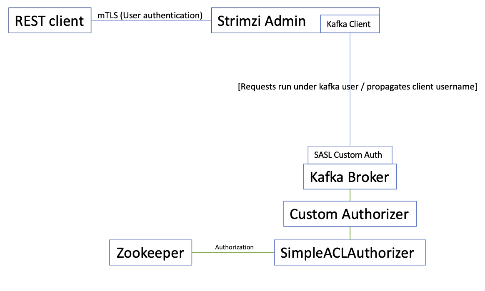

# Security Extension

This proposal is supplementary to the security documentation in the [Using Strimzi](https://strimzi.io/docs/operators/latest/using.html#security-str) guide.

## Problem description
Strimzi currently supports SCRAM-SHA-512, Oauth2 and Mutual TLS for authentication of clients connecting to the Kafka brokers.
The Strimzi cluster operator can be configured to support all 3 mechanisms for authentication for clients inside or outside the Kubernetes cluster.
The SCRAM-SHA and mTLS support uses the native support in Kafka for authentication and for Oauth2, authentication is delegated to [keyCloak](https://www.keycloak.org/).

Authorization is available through native Kafka ACL support with the use of the Kafka `simpleACLAuthorizer`.
Alternatives are available with Kafka authorizers being supplied for [keyCloak](https://www.keycloak.org/) and [Open Policy](https://www.openpolicyagent.org/docs/latest/).

This proposal discusses amendments to support security with the new Strimzi UI and Admin server and outlines how this can be done for SCRAM and OAuth2. Browser based UIs do not traditionally use mutual TLS for authentication and authorization but the Admin server API needs to be considered and this proposal suggests a mechanism that can be used to do that. 

The outlined proposal relies on Kafka to perform authentication or authorization and the Admin Server itself does not.
In a Kafka environment, this may be acceptable but it is plausible that a UI and Admin Server may wish to communicate with non-Kafka environments in the future like the Kube API.
In these environments authentication and authorization can again be delegated to the backend system.
A discussion and agreement is needed whether we wish to implement authentication and authorization on the Admin Server itself.
Proceeding with the delegated model, I have 3 sets of diagrams showing a SCRAM-SHA-512 solution, an OAuth2 solution and a mTLS solution with the last one only being relevant to the Admin Server.

## SCRAM-SHA-512

Strimzi supports SCRAM-SHA512 using native Kafka facilities so, the Kafka client is setup with credentials for the user and these credentials are passed to the broker where the broker authenticates against user credentials stored in Zookeeper.
When the request is authenticated, the Principal is passed to a Kafka Simple ACL Authorizer which determines whether the user is authorized to access the resource.
Access is defined through ACLs and are stored on Zookeeper.

This Kafka client model translates to a UI and Admin Server in a simple way.
A user logs into the UI with a userId and password and the UI authenticates with the credentials on Zookeeper.
This authentication mechanism is controlled by `passport.js`.
The credentials are then sent as an `Auth Header` to the Strimzi Admin Server and the Strimzi Admin Server sets the credentials in the client properties for the client that is accessing Kafka.
From thereon, the Kafka authentication and authorization mechanism works in an identical way to the description above for the Kafka Clients.

This mechanism should be straightforward to setup using a `Passport.js` strategy.
The Strimzi UI is served from an Express server and that Express server will be inside the Strimzi cluster allowing the Express Server to talk to the Zookeeper on the secure port 2181.
The login would not go through the Admin Server which hides the process from the external network but it may be desirable to add a `login` endpoint to the Admin Server which would allow session based applications to use the Admin Server in a natural way.

## OAuth 2

In the OAuth 2 scenario, Strimzi currently requires the user to configure the Kafka client with a clientId and secret.
The client will then obtain an access token from the identity provider which is KeyCloak and that token flows to the broker.
In the broker, calls to KeyCloak will be made based on the type of token that was requested by the client and passed to the broker.

The UI model logs the user in by calling KeyCloak through a `passport.js` strategy to authenticate the user and request an access token.
The access token is  flowed to the Strimzi Admin server and the token is passed through to the Kafka Broker where a custom SASL plugin sets up the Kafka principal.
The request then passes through the KeyCloak Authorizer for authorization.

## Mutual TLS

With Mutual TLS, authentication takes place in the TLS handshake between the external web client and the Admin Server.
The server side can only detect a userId for the client so credentials cannot be propagated to the Kafka Broker that woud allow the broker to authenticate and authorize the request.
This proposal recommends that the Kafka clients running under the Admin Server can use a valid Kafka User for the connection between the Kafka client and the broker and pass the external web client's userId to the broker login module.
The Kafka broker then uses a SASL plugin to create a custom authentication module which sets up the Kafka principal which flows through to authorizer.
This allows the authorizer to take advantage of the ACL authorizer mechanism that is native to Kafka.

